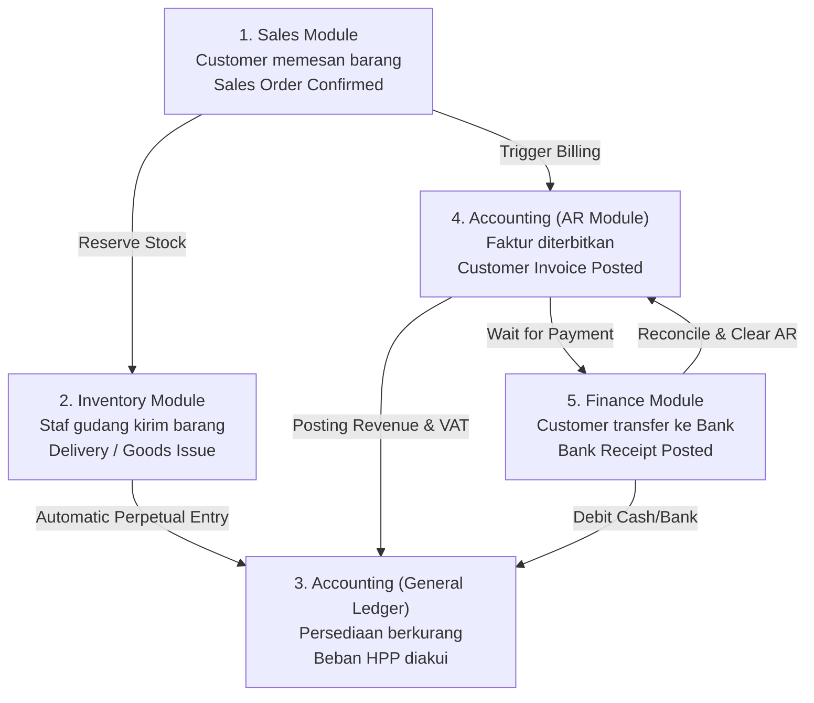
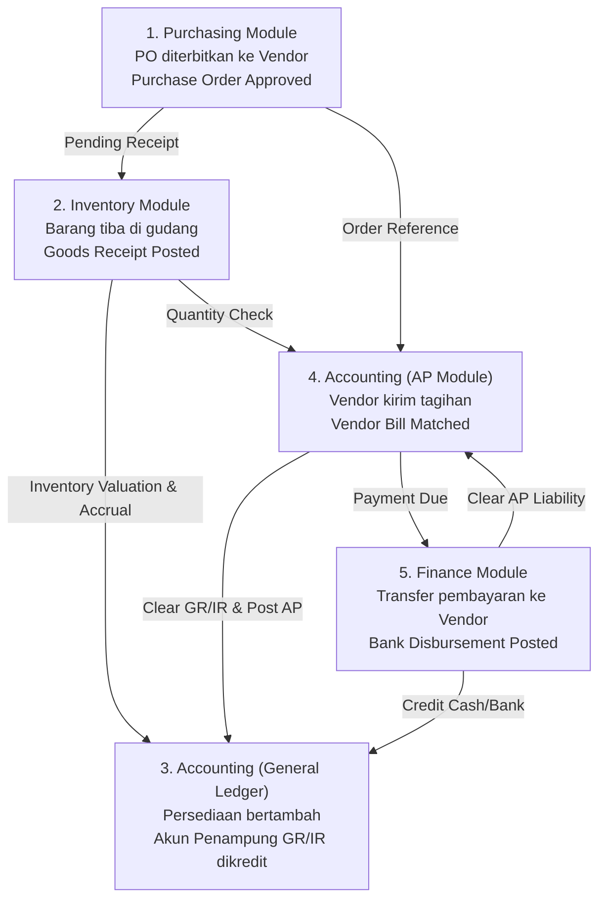

# Cross-Module Integration

## Definition

**Cross-Module Integration** adalah mekanisme di mana data, peristiwa transaksi, dan dampak finansial mengalir secara otomatis dan berkesinambungan melintasi batas-batas modul fungsional tanpa intervensi manual atau batch transfer.

ERP bukan sekadar kumpulan aplikasi terpisah yang disatukan dalam satu menu (*loose bundle of software*), melainkan **mesin proses bisnis tunggal** yang mengikat penjualan, pengadaan, persediaan, dan keuangan menjadi satu ekosistem yang utuh.

---

## The Two Core Value Streams

Sebagian besar aktivitas operasional perusahaan berputar di sekitar dua aliran integrasi utama:

1. **Order-to-Cash (O2C)**: Siklus hilir untuk menghasilkan pendapatan.
2. **Procure-to-Pay (P2P)**: Siklus hulu untuk pengadaan sumber daya dan pengeluaran beban.

---

## 1. The Sales-to-Cash Integration Flow

Integrasi aliran penjualan menghubungkan modul **Sales**, **Inventory**, **Accounting (AR)**, dan **Finance (Cash/Bank)**:



### Analisis Titik Integrasi (Integration Touchpoints):

* **Sales → Inventory**: Konfirmasi *Sales Order* otomatis memeriksa ketersediaan stok (*Available-to-Promise / ATP*) dan mengubah status stok dari *Available* menjadi *Reserved*.
* **Inventory → Accounting (Perpetual Inventory)**: Validasi surat jalan (*Delivery Note*) langsung menerbitkan jurnal pengurangan aset dan pengakuan biaya tanpa menunggu akhir bulan:
  * Debit: Beban Pokok Penjualan (COGS)
  * Kredit: Persediaan Barang Dagang
* **Sales → Accounting (Invoicing & Revenue)**: Menerbitkan faktur berdasarkan barang yang telah dikirim (*Delivery-based billing*), memicu pengakuan piutang, pendapatan, dan utang PPN:
  * Debit: Piutang Usaha (AR Subledger & GL Control)
  * Kredit: Pendapatan Penjualan
  * Kredit: Utang PPN Keluaran
* **Accounting → Finance (Collection & Clearing)**: Saat kas diterima melalui rekening bank, modul keuangan melakukan pencocokan (*matching/reconciliation*) ke faktur spesifik, menutup saldo piutang pelanggan di subledger.

---

## 2. The Purchase-to-Pay Integration Flow

Integrasi aliran pengadaan menghubungkan modul **Purchasing**, **Inventory**, **Accounting (AP)**, dan **Finance (Disbursement)**:



---

## Mekanisme Kunci Integrasi Lintas Modul

### 1. The 3-Way Matching Principle (Pencocokan 3 Dokumen)
Untuk mencegah pembayaran atas barang yang belum diterima atau tagihan yang melebihi kesepakatan harga, ERP menerapkan validasi otomatis antara tiga dokumen:

```text
Purchase Order (Harga & Jumlah disepakati)
       ↕ Match
Goods Receipt (Jumlah fisik yang benar-benar diterima gudang)
       ↕ Match
Vendor Bill (Jumlah uang yang ditagih oleh pemasok)
```

Jika terjadi perbedaan (*variance*) melampaui ambang batas toleransi (misalnya: gudang baru menerima 8 unit tetapi vendor menagih 10 unit), ERP otomatis menahan (*payment hold*) dokumen tagihan tersebut agar tidak dapat dibayar oleh bagian keuangan.

### 2. The GR/IR Clearing Account (Akun Penampung Penerimaan Barang)
Dalam dunia nyata, barang sering kali tiba lebih dulu daripada tagihan vendor (atau sebaliknya). Untuk menjaga neraca tetap seimbang dan mematuhi asas akrual (*accrual basis*), ERP menggunakan akun perantara bernama **Goods Receipt / Invoice Receipt (GR/IR)** atau *Accrued Purchases*:

#### A. Saat Barang Diterima di Gudang (Belum Ada Faktur Vendor):
Aset persediaan bertambah di neraca, diimbangi dengan pengakuan utang yang belum ditagih (*unbilled liability*).

| Akun | Debit (Rp) | Kredit (Rp) |
|---|---:|---:|
| Persediaan Barang Dagang | 10.000.000 | - |
| Utang Belum Difakturkan (*GR/IR Clearing*) | - | 10.000.000 |

#### B. Saat Tagihan Vendor Diterima Beberapa Hari Kemudian:
Akun penampung GR/IR dibalik (*cleared*), dan utang usaha resmi diakui di buku pembantu utang (AP).

| Akun | Debit (Rp) | Kredit (Rp) |
|---|---:|---:|
| Utang Belum Difakturkan (*GR/IR Clearing*) | 10.000.000 | - |
| PPN Masukan (*VAT Input*) | 1.100.000 | - |
| Utang Usaha (*Accounts Payable*) | - | 11.100.000 |

---

## Dampak Kegagalan Integrasi (The Cost of Siloed Systems)

Jika perusahaan mengoperasikan sistem yang tidak terintegrasi secara modular:
1. **Ghost Inventory**: Staf gudang mengeluarkan barang tanpa pencatatan akuntansi, menyebabkan laporan keuangan menggelembungkan nilai aset persediaan yang fisiknya sudah tidak ada.
2. **Uncollected Revenue**: Barang dikirim tetapi staf penagihan lupa membuat invoice karena tidak ada notifikasi otomatis dari sistem pengiriman.
3. **Double Payment**: Pembayaran tagihan vendor dilakukan ganda karena tidak ada sistem verifikasi penerimaan barang fisik yang terkunci.

---

## Software Implementation

### Microsoft Dynamics 365
Menggunakan konsep *Item Model Groups* dengan *Post Physical Inventory* dan *Post Financial Inventory*. Dokumen *Product Receipt* otomatis memposting ke akun *Accrued Purchases*, yang kemudian ditutup saat *Vendor Invoice* diposting.

### ERPNext
Secara otomatis menggunakan akun *Stock Received But Not Billed* pada saat *Purchase Receipt* disubmit. Saat *Purchase Invoice* dibuat dengan merujuk ke penerimaan tersebut, sistem otomatis mendebit *Stock Received But Not Billed* dan mengkredit *Creditors / Accounts Payable*.

### Odoo
Menggunakan akun perantara *Stock Interim (Received)* dan *Stock Interim (Delivered)* pada model kategori produk (`product.category`). Jurnal otomatis menyeimbangkan akun interim ini ketika tagihan vendor dan nota pengiriman divalidasi.

---

## Naventra Consideration

Dalam perancangan Naventra:
* **Posting Engine Atomik**: Pastikan setiap transaksi penyerahan/penerimaan barang (logistik) secara otomatis memicu pemanggilan *Posting Service* untuk membuat entri jurnal akuntansi dalam transaksi database yang sama (ACID).
* **GR/IR Auto-Clearing**: Sediakan modul rekonsiliasi akun kliring penerimaan barang untuk mendeteksi secara otomatis selisih harga pembelian (*Purchase Price Variance / PPV*) jika harga pada faktur vendor berbeda dari harga pesanan pembelian awal.
* **Toleransi 3-Way Matching**: Buat aturan konfigurasi toleransi persentase (misal: selisih harga maksimal 1% atau Rp10.000) agar transaksi minor tidak menghentikan alur operasional, namun deviasi besar otomatis masuk ke antrean persetujuan manajerial (*Approval Matrix*).

---

## References

1. **Wallace, T. F., & Kremzar, M. H.** (2001). *ERP: Making It Happen - The Implementers' Guide to Success with Enterprise Resource Planning*. John Wiley & Sons.
2. **IFRS Foundation**: *IAS 2 Inventories - Measurement and Recognition of Cost*. URL: https://www.ifrs.org/issued-standards/list-of-standards/ias-2-inventories/
3. **Microsoft Learn**: *Accounts payable invoice matching in Dynamics 365 Finance*. URL: https://learn.microsoft.com/en-us/dynamics365/finance/accounts-payable/accounts-payable-invoice-matching
4. **Frappe Documentation**: *Purchase Receipt and Stock Received But Not Billed Account*. URL: https://docs.frappe.io/erpnext/user/manual/en/stock/purchase-receipt
5. **Odoo Documentation**: *Automated Inventory Valuation and Interim Accounts*. URL: https://www.odoo.com/documentation/17.0/applications/inventory_and_mrp/inventory/warehouses_storage/inventory_valuation/using_inventory_valuation.html
