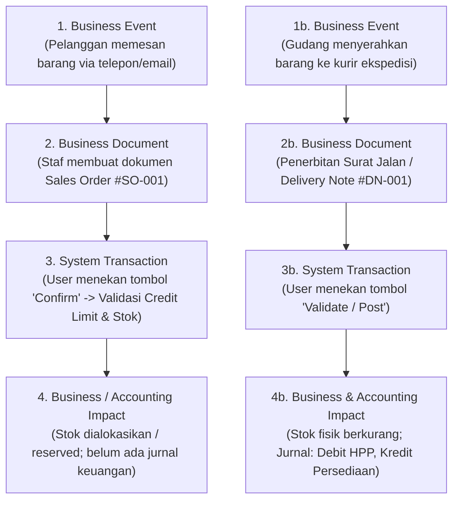
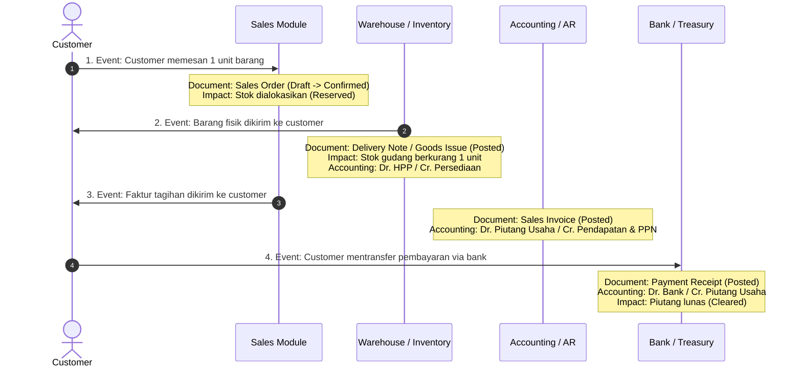

# Documents, Transactions, and Business Events

## Definition

Dalam perancangan dan operasional ERP, sering terjadi kerancuan antara istilah **Business Event**, **Business Document**, **Transaction**, dan **Impact**. Keempat istilah ini sebenarnya merepresentasikan lapisan (*layers*) yang berbeda dari suatu fenomena bisnis:

1. **Business Event (Peristiwa Bisnis)**: Kejadian nyata di dunia fisik atau kesepakatan komersial yang terjadi dalam aktivitas bisnis sehari-hari (contoh: pelanggan menyetujui penawaran, truk ekspedisi membawa barang keluar dari gudang).
2. **Business Document (Dokumen Bisnis)**: Representasi digital terstruktur dari peristiwa bisnis tersebut yang memuat identitas para pihak, tanggal, rincian barang/jasa, kuantitas, harga, dan otorisasi legal (contoh: *Sales Order, Delivery Note, Tax Invoice*).
3. **Transaction (Transaksi Sistem)**: Operasi komputasi atomik di dalam database ERP yang memproses dokumen bisnis, memvalidasi aturan (*business rules*), dan mengubah status data secara permanen.
4. **Business & Accounting Impact (Dampak Finansial & Operasional)**: Konsekuensi nyata pada saldo buku besar (*General Ledger*), saldo persediaan (*Stock Ledger*), atau hak/kewajiban hukum perusahaan (piutang, utang, pajak).

---

## Lapisan Alur Transaksi (Layered Architecture)



---

## Analisis Komparatif Setiap Lapisan

| Lapisan | Domain | Bentuk Nyata | Memengaruhi Buku Besar (GL)? | Dapat Dibatalkan Bebas? |
|---|---|---|:---:|:---:|
| **Business Event** | Dunia Nyata | Tindakan fisik / kesepakatan verbal / email | Tidak langsung | Tergantung kesepakatan |
| **Business Document** | Antarmuka Pengguna (UI) | Formulir elektronik di layar komputer | Belum (jika status *Draft*) | Ya (selama status *Draft*) |
| **System Transaction** | Database & Engine | Transaksi ACID database (*Commit / Rollback*) | Sesuai jenis dokumen | Tidak, harus melalui *Rollback* internal |
| **Accounting Impact** | Buku Besar Finansial | Baris Debit dan Kredit di tabel General Ledger | **Ya (Pasti)** | **Hanya melalui Jurnal Pembalik (*Reversal*)** |

---

## Siklus End-to-End: Dari Pesanan Hingga Pembayaran

Mari telusuri bagaimana satu siklus penjualan mengalir melintasi keempat lapisan ini:



### Rincian Tahapan dan Dampaknya

#### Tahap 1: Pemesanan (*Sales Order*)
* **Event**: Kesepakatan jual beli barang seharga Rp10.000.000.
* **Document**: *Sales Order* (SO).
* **Impact**: Tidak ada jurnal keuangan. Dampak operasional: sistem menandai 1 unit barang sebagai *Reserved* agar tidak dijual ke pelanggan lain.

#### Tahap 2: Pengiriman (*Delivery / Fulfillment*)
* **Event**: Penyerahan barang fisik kepada ekspedisi pengiriman.
* **Document**: *Delivery Note* / *Goods Issue*.
* **Impact**: Kuantitas fisik berkurang di kartu stok. Jurnal persediaan terbentuk:
  * Debit: Beban Pokok Penjualan (HPP) = Rp7.000.000
  * Kredit: Persediaan Barang Dagang = Rp7.000.000

#### Tahap 3: Penagihan (*Invoicing*)
* **Event**: Penyerahan tagihan hak pembayaran kepada pembeli.
* **Document**: *Customer Invoice* / Faktur Penjualan.
* **Impact**: Pengakuan hak tagih legal dan kewajiban pajak:
  * Debit: Piutang Usaha = Rp11.100.000
  * Kredit: Pendapatan Penjualan = Rp10.000.000
  * Kredit: Utang PPN Keluaran = Rp1.100.000

#### Tahap 4: Pelunasan (*Payment Settlement*)
* **Event**: Uang masuk ke rekening bank perusahaan.
* **Document**: *Payment Entry* / Bukti Penerimaan Kas-Bank.
* **Impact**: Rekonsiliasi piutang lunas (*matched/cleared*):
  * Debit: Kas/Bank = Rp11.100.000
  * Kredit: Piutang Usaha = Rp11.100.000

---

## Document Trail / Document Flow

Salah satu fungsi audit terpenting dalam ERP adalah **Document Flow** (Jejak Dokumen). Kemampuan sistem untuk menghubungkan setiap dokumen turunan (*child document*) kembali ke dokumen induknya (*parent document*).

```text
Quotation #QT-2026-0042
   └── Sales Order #SO-2026-0089
          ├── Delivery Note #DN-2026-0112 (Goods Issue)
          └── Sales Invoice #INV-2026-0095
                 └── Payment Receipt #PAY-2026-0078
```

Manfaat Document Flow:
1. **Pencegahan Fraud & Duplikasi**: Mencegah penagihan ganda atas pengiriman barang yang sama.
2. **Kemudahan Audit**: Auditor dapat mengklik faktur penjualan dan langsung membuka surat jalan fisik serta bukti tanda terima transfer bank.
3. **Otomatisasi Status**: Ketika seluruh barang pada SO telah memiliki dokumen DN yang berstatus *Posted*, status SO otomatis berganti menjadi *Completed*.

---

## Software Implementation

### ERPNext
* Menerapkan konsep *Linked Documents* dan alur referensi eksplisit (`against_sales_order`, `against_delivery_note`).
* Pengguna dapat melihat visual diagram rantai dokumen melalui tombol menu **Connections** di setiap dokumen.

### Odoo
* Menerapkan *Chatter* dan *Smart Buttons* di bagian atas form (misal: tombol "Delivery" dan "Invoices" pada form `sale.order`).
* Riwayat dokumen disimpan di tabel referensi pergerakan stok (`stock.move`) dan pergerakan akun (`account.move.line`).

### Microsoft Dynamics 365
* Menyediakan fitur **View Document History** dan **Line Details Trace**.
* Menerapkan pemisahan status dokumen antara *Document State* (Draft, Approved), *Inventory State* (On Order, Reserved, Deducted), dan *Accounting State* (Accrued, Invoiced).

---

## Naventra Consideration

Dalam perancangan Naventra:
* Setiap tabel dokumen transaksi harus memiliki field referensi polimorfik atau relasional: `source_document_type` dan `source_document_id`.
* Larang pembuatan dokumen tagihan (*Invoice*) yang berdiri sendiri tanpa dasar dokumen pesanan (*Sales Order*) atau penerimaan/pengiriman barang, kecuali untuk jenis faktur non-operasional tertentu (misal: jasa murni dengan otorisasi khusus).
* Sediakan komponen UI **Document Timeline / Flow Tree** pada setiap detail transaksi agar pengguna dapat melacak riwayat dokumen hulu dan hilirnya dalam satu klik.

---

## References

1. **Romney, M. B., & Steinbart, P. J.** (2018). *Accounting Information Systems* (14th ed.). Pearson (Chapter: The Sales and Cash Collections Cycle).
2. **Microsoft Learn**: *Sales order processing and document status in Dynamics 365*. URL: https://learn.microsoft.com/en-us/dynamics365/supply-chain/sales-marketing/sales-orders-overview
3. **Frappe Documentation**: *Document Connections and Linking Architecture*. URL: https://frappeframework.com/docs/user/en/basics/doctypes/document-flow
4. **Odoo Documentation**: *Invoicing Policy: On Ordered vs Delivered Quantities*. URL: https://www.odoo.com/documentation/17.0/applications/sales/sales/invoicing/invoicing_policy.html
