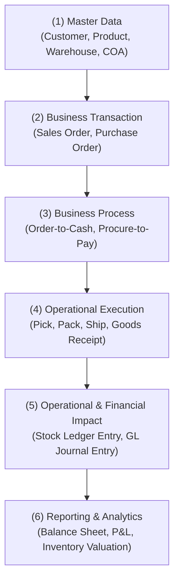
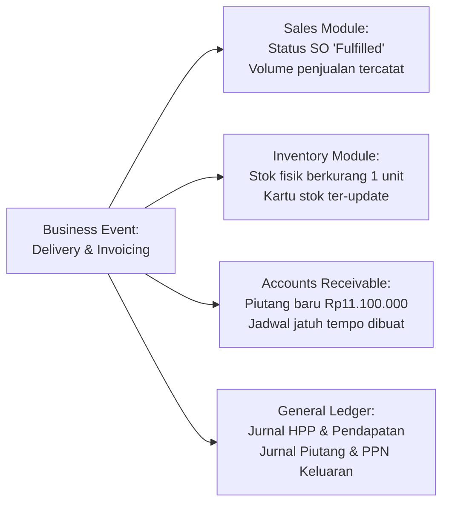
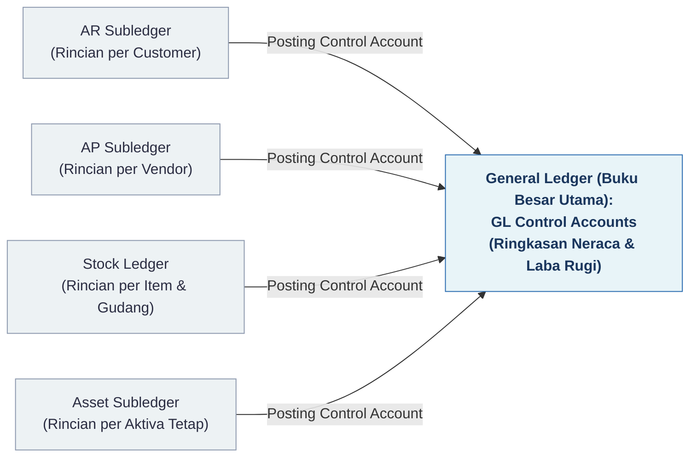

# ERP Architecture / Mental Model

## Definition

**ERP Mental Model** adalah kerangka berpikir konseptual untuk memahami bagaimana data, proses bisnis, dan peristiwa operasional mengalir di dalam sistem ERP. 

Alih-alih memandang ERP sebagai kumpulan form dan tabel yang terpisah, mental model ini menjelaskan bagaimana satu tindakan operasional tunggal (*single business event*) diproses menjadi beberapa dampak data (*multi-module impact*), khususnya pada buku besar persediaan (*inventory ledger*) dan buku besar keuangan (*general ledger*).

---

## The Core Mental Model

Aliran pemrosesan dalam sistem ERP mengikuti hierarki berjenjang:

### 1. Master Data (Pondasi Entitas)
Sebelum transaksi apa pun dapat dibuat, entitas acuan harus telah terdefinisi di sistem. Master data mendefinisikan *siapa* yang terlibat, *apa* yang ditransaksikan, dan *bagaimana* aturan akuntansinya.
* Contoh: Customer "PT Maju Bersama", Item "Laptop Pro 14", Gudang "Gudang Utama", Akun Piutang Usaha `112000`.

### 2. Business Transaction (Pencatatan Komitmen)
Mencatat perjanjian atau kesepakatan bisnis antara dua pihak. Pada tahap ini, umumnya **belum terjadi perpindahan fisik barang maupun mutasi nilai finansial buku besar**, melainkan pencatatan komitmen legal atau operasional.
* Contoh: *Sales Order* (SO) senilai Rp10.000.000 untuk 1 unit Laptop.

### 3. Business Process (Alur Kerja)
Transaksi bergerak melalui tahapan alur kerja yang telah divalidasi (*approval workflow*, *credit check*, *inventory availability check*).

### 4. Operational Execution (Eksekusi Fisik/Layanan)
Peristiwa fisik terjadi di lapangan: staf gudang mengambil barang, mengemas, dan menerbitkan dokumen pengiriman (*Delivery Order / Goods Issue*).

### 5. Operational & Financial Impact (Dampak Simultan)
Begitu dokumen operasional divalidasi (*posted/submitted*), sistem secara otomatis mengeksekusi dua dampak:
* **Dampak Persediaan**: Kuantitas fisik berkurang di gudang terkait.
* **Dampak Akuntansi (Subledger & GL)**: Nilai aset persediaan berkurang dan dibebankan ke akun Harga Pokok Penjualan (COGS).

### 6. Reporting & Analytics (Output Keputusan)
Laporan manajerial dan kepatuhan (Laba Rugi, Neraca, Aging Piutang, Kartu Stok) langsung mencerminkan kondisi bisnis terbaru secara *real-time* tanpa perlu menunggu tutup buku manual.

---

## Multi-Module Ripple Effect: Contoh Konkret

Kekuatan utama ERP terletak pada **efek riak lintas modul (*cross-module ripple effect*)** dari satu peristiwa bisnis tunggal.

### Skenario Transaksi
Perusahaan menjual 1 unit Laptop kepada pelanggan "PT Maju Bersama":
* Harga Jual: **Rp10.000.000** (belum termasuk PPN 11% = Rp1.100.000; Total Tagihan = Rp11.100.000)
* Nilai Buku / HPP Persediaan (*Cost of Goods Sold*): **Rp7.000.000**

Ketika pengiriman barang (*Delivery / Goods Issue*) dan penagihan (*Customer Invoice*) divalidasi, berikut adalah modul-modul yang terpengaruh secara simultan:

### Jurnal Akuntansi yang Dihasilkan

1. **Saat Pengiriman Barang (*Delivery / Goods Issue*)**:
Mencatat perpindahan hak atas barang dan pengakuan biaya.

| Akun | Kategori Akun | Debit (Rp) | Kredit (Rp) |
|---|---|---:|---:|
| Beban Pokok Penjualan (COGS) | Expense | 7.000.000 | - |
| Persediaan Barang Dagang | Asset | - | 7.000.000 |

2. **Saat Penerbitan Faktur Penjualan (*Sales Invoicing*)**:
Mencatat pengakuan piutang, pendapatan, dan kewajiban pajak.

| Akun | Kategori Akun | Debit (Rp) | Kredit (Rp) |
|---|---|---:|---:|
| Piutang Usaha (*Accounts Receivable*) | Asset | 11.100.000 | - |
| Pendapatan Penjualan (*Sales Revenue*) | Revenue | - | 10.000.000 |
| PPN Keluaran (*VAT Output*) | Liability | - | 1.100.000 |

Dalam sistem non-ERP, transaksi di atas memerlukan minimal 4 kali input terpisah di 4 software berbeda (sistem kasir, sistem gudang, sistem piutang, dan sistem akuntansi). Dalam ERP, seluruh jurnal dan mutasi stok di atas dihasilkan **secara otomatis dari satu alur transaksi**.

---

## Subledger vs General Ledger Architecture

Sistem ERP modern menggunakan pola arsitektur **Subledger** dan **General Ledger**:

* **Subledger**: Menyimpan rincian operasional harian yang sangat detail (nomor lot barang, nama pelanggan per transaksi, tanggal jatuh tempo faktur tertentu).
* **Control Account di GL**: General Ledger hanya menyimpan saldo agregat terakumulasi per akun kontrol (*reconciliation/control account*), menjaga ukuran dan performa buku besar keuangan agar tetap ringkas dan efisien.

---

## Software Implementation

### Microsoft Dynamics 365
Dynamics 365 Finance & Operations memisahkan *Posting Profiles* (aturan pemetaan akun GL untuk modul persediaan, vendor, dan pelanggan). Ketika dokumen seperti *Packing Slip* diposting, *Subledger Journal Entry* dibuat terlebih dahulu, lalu ditransfer ke *General Ledger* melalui *batch* atau *synchronous transfer rule*.

### ERPNext
ERPNext menerapkan pendekatan *document-driven ledgering*. Setiap transaksi dokumen bertipe *submittable* (misalnya `Delivery Note` atau `Sales Invoice`) mengeksekusi controller Python internal yang langsung meng-*insert* baris ke tabel `tabGL Entry` dan `tabStock Ledger Entry` dalam satu database transaction (atomik).

### Odoo
Odoo menyatukan seluruh transaksi finansial ke dalam model `account.move` dan baris detailnya `account.move.line`. Dokumen faktur (*Invoice*), pembayaran, dan jurnal persediaan otomatis (`stock.valuation.layer`) semuanya bermuara ke `account.move`.

---

## Naventra Consideration

Dalam merancang arsitektur Naventra:
1. **Pemisahan State Dokumen**: Bedakan secara tegas antara status dokumen:
   * `Draft`: Masih dapat diedit, tidak memengaruhi stok maupun akuntansi.
   * `Confirmed / Approved`: Komitmen operasional terbentuk (alokasi stok / *stock reserved*), belum ada jurnal finansial.
   * `Posted / Completed`: Tidak dapat diubah (*immutable*), mutasi stok ledger dan GL ledger terbentuk.
   * `Cancelled / Reversed`: Pembatalan harus dilakukan melalui dokumen pembalik (*reversal transaction*), bukan dengan menghapus baris database (*hard delete*), demi menjaga *audit trail*.
2. **Posting Engine Abstraction**: Pisahkan logika bisnis dokumen dari aturan jurnal akuntansi menggunakan *Posting Engine* yang dapat dikonfigurasi melalui aturan pemetaan akun (*Account Determination*).

---

## References

1. **Gartner Glossary**: *Enterprise Resource Planning (ERP)*. URL: https://www.gartner.com/en/information-technology/glossary/enterprise-resource-planning-erp
2. **Microsoft Learn**: *Subledger journal entries in Dynamics 365 Finance*. URL: https://learn.microsoft.com/en-us/dynamics365/finance/general-ledger/subledger-journal
3. **Frappe Framework Documentation**: *Document Lifecycle, Controllers, and Transactions*. URL: https://frappeframework.com/docs/user/en/basics/doctypes/controllers
4. **Odoo Technical Documentation**: *Accounting Architecture and Data Model*. URL: https://www.odoo.com/documentation/17.0/applications/finance/accounting/get_started.html
