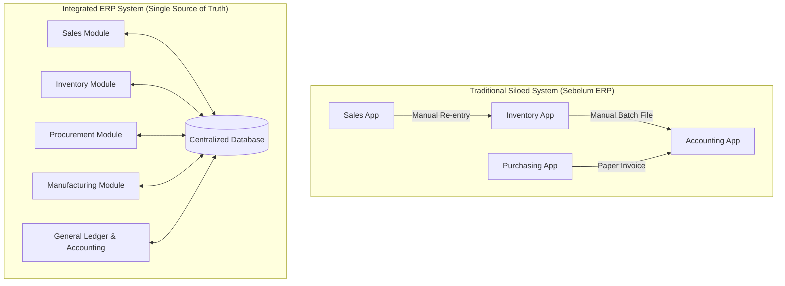

# ERP Fundamentals

## Definition

**Enterprise Resource Planning (ERP)** adalah sistem informasi terintegrasi yang dirancang untuk mengelola, mengotomatisasi, dan mengkoordinasikan seluruh proses bisnis inti suatu organisasi lintas fungsi—mulai dari pengadaan (*procurement*), persediaan (*inventory*), manufaktur (*manufacturing*), penjualan (*sales*), hingga akuntansi dan pelaporan keuangan (*accounting & financial reporting*)—dalam satu database terpusat (*single source of truth*).

ERP bukan sekadar perangkat lunak pencatat angka, melainkan sistem operasi operasional perusahaan (*enterprise operating system*) yang memastikan setiap transaksi operasional terekam secara langsung, terstandarisasi, dan memiliki jejak audit (*audit trail*).

---

## Purpose & Problems Solved

Sebelum adopsi ERP, organisasi biasanya mengoperasikan aplikasi terpisah (*standalone/siloed applications*) untuk setiap fungsi: aplikasi kasir di toko, software inventory di gudang, software payroll di HR, dan software pembukuan di departemen akuntansi.

Kondisi tersebut menimbulkan masalah mendasar:

1. **Data Silos & Fragmentasi Informasi**: Data yang sama (misal data pelanggan atau stok barang) tersimpan di banyak tempat tanpa sinkronisasi, menimbulkan inkonsistensi informasi antar-departemen.
2. **Duplikasi Kerja & Human Error**: Data transaksi harus di-input ulang secara manual dari satu sistem ke sistem lain (misalnya nota pengiriman barang dicatat ulang oleh tim akuntansi sebagai tagihan penjualan).
3. **Keterlambatan Pengambilan Keputusan (*Latency*)**: Manajemen tidak bisa melihat posisi keuangan atau status persediaan secara *real-time* karena harus menunggu proses konsolidasi dan rekonsiliasi manual akhir periode.
4. **Ketiadaan Jejak Audit (*Audit Trail*)**: Sulit menelusuri dari mana suatu angka di buku besar berasal jika transaksi operasional hulu tidak terhubung secara langsung dengan jurnal keuangan.

ERP menyelesaikan masalah ini dengan menyatukan aliran data dan proses bisnis ke dalam satu platform.



---

## Core Characteristics of an ERP

Sistem ERP modern memiliki karakteristik kunci:

1. **Centralized Data Repository**: Seluruh modul membaca dan menulis ke basis data yang sama, menjamin konsistensi data di seluruh organisasi.
2. **Integrated End-to-End Business Processes**: Suatu peristiwa bisnis (*business event*) di satu departemen langsung memicu proses berikutnya di departemen terkait tanpa intervensi manual (misal: pengiriman barang langsung mengupdate stok dan memicu pengakuan harga pokok penjualan).
3. **Real-time Transaction Processing**: Status operasional (stok, piutang, kapasitas mesin) ter-update seketika saat transaksi divalidasi.
4. **Master Data & Transaction Data Separation**: Memisahkan entitas bisnis statis/jangka panjang (*Master Data*) dengan catatan peristiwa finansial/operasional (*Transaction Data*).
5. **Role-Based Access & Auditability**: Hak akses dikontrol berdasarkan peran (*role*), dan seluruh perubahan data penting mencatat siapa pembuatnya (*created by*), kapan (*timestamp*), serta log perubahan (*change log*).

---

## Data Taxonomy in ERP

Dalam sistem ERP, data dikelompokkan secara ketat:

* **Master Data**: Entitas bisnis inti yang digunakan berulang kali dalam jangka panjang (contoh: *Customer, Supplier, Product/Item, Chart of Accounts, Warehouse*). Detail lengkap dibahas di [[00-fundamentals/master-data-vs-transaction-data|Master Data vs Transaction Data]].
* **Transaction Data**: Catatan peristiwa bisnis spesifik yang memiliki tanggal, kuantitas, nilai finansial, dan status alur kerja (contoh: *Sales Order, Goods Receipt, Vendor Bill, Journal Entry*).
* **Reference Data / Configuration**: Aturan dan parameter sistem yang menentukan bagaimana transaksi diproses (contoh: *Currency exchange rates, Payment terms, Tax rules, Unit of Measure*).

---

## ERP vs Standalone Applications vs Accounting Software

Sering terjadi kerancuan antara aplikasi standalone, software akuntansi, dan ERP. Perbedaannya terletak pada cakupan, integrasi, dan arah aliran data:

| Dimensi | Standalone Software (Point Solution) | Accounting Software | ERP System |
|---|---|---|---|
| **Fokus Utama** | Menyelesaikan satu fungsi spesifik (misal: POS, WMS gudang, HRIS) | Pencatatan transaksi keuangan, jurnal, dan laporan keuangan | Eksekusi proses bisnis operasional ujung-ke-ujung dan dampaknya |
| **Pencatatan Transaksi** | Terisolasi di modul masing-masing | Transaksi dicatat berdasarkan bukti keuangan (kuitansi/faktur) | Transaksi operasional (penerimaan barang, perpindahan stok) otomatis menghasilkan catatan akuntansi |
| **Manajemen Persediaan** | Sangat detail di gudang, tetapi terpisah dari akuntansi nilai stok | Terbatas pada pencatatan berkala atau periodik | Terintegrasi penuh (*perpetual valuation*): kuantitas dan nilai persediaan sinkron *real-time* |
| **Kebutuhan Rekonsiliasi** | Sangat tinggi (ekspor/impor CSV antar-sistem) | Membutuhkan input manual dari bukti operasional | Rendah hingga otomatis, karena transaksi hulu langsung menghasilkan jurnal hilir |
| **Skalabilitas & Kompleksitas** | Mudah dipasang, tetapi sulit dirawat saat bisnis membesar | Cocok untuk UMKM dengan operasi sederhana | Dirancang untuk kompleksitas bisnis, multi-perusahaan, dan multi-cabang |

---

## ERP Architecture & Mental Model

Pondasi berpikir dalam memahami ERP adalah memahami bahwa **setiap modul adalah representasi fungsional dari satu proses bisnis yang berkesinambungan**, bukan program independen.

```text
Master Data (Customer, Item, COA)
    ↓
Business Event (Customer memesan barang)
    ↓
Operational Transaction (Sales Order & Delivery)
    ↓
Inventory & Accounting Impact (Stok berkurang & Pengakuan HPP/Piutang)
    ↓
Reporting (Neraca, Laba Rugi, Aging Piutang)
```

Pembahasan mendalam mengenai model mental ini dijelaskan di [[00-fundamentals/erp-architecture|ERP Architecture / Mental Model]].

---

## ERP Implementation Across Platforms

Perilaku arsitektur dasar ini diterapkan secara konsisten pada berbagai ERP terkemuka:

* **Microsoft Dynamics 365 Finance & Supply Chain**: Menggunakan pendekatan modular berbasis enterprise service dengan pemisahan ketat antara *posting profiles*, subledger (*Accounts Receivable, Accounts Payable, Inventory*), dan *General Ledger*.
* **ERPNext**: Menggunakan arsitektur terpadu berbasis Frappe framework di mana transaksi (*DocType*) seperti *Delivery Note* atau *Purchase Receipt* langsung menghasilkan *GL Entry* dan *Stock Ledger Entry* saat dokumen di-*submit*.
* **Odoo**: Menggunakan arsitektur berbasis modul Python dengan ORM (`account.move` sebagai fondasi seluruh transaksi finansial, baik tagihan, faktur penjualan, maupun jurnal manual).
* **SAP S/4HANA**: Menggunakan konsep *Universal Journal* (`ACDOCA`) yang menggabungkan modul Financial Accounting (FI) dan Controlling (CO) dalam satu tabel fakta transaksi terpadu.

---

## Naventra Consideration

Dalam merancang custom ERP seperti Naventra:
* Jangan membangun modul sebagai aplikasi yang terisolasi dengan sinkronisasi periodik (batch).
* Terapkan arsitektur *event-driven* atau *service-driven* di mana transaksi operasional (seperti *Goods Receipt* atau *Stock Issue*) memicu pembuatan entitas jurnal (*Journal Entry*) melalui *Posting Engine* terpusat.
* Pertahankan integritas referensial antara dokumen transaksi operasional dan dokumen keuangan.

---

## References

1. **Monk, E., & Wagner, B.** (2012). *Concepts in Enterprise Resource Planning* (4th ed.). Cengage Learning.
2. **Wallace, T. F., & Kremzar, M. H.** (2001). *ERP: Making It Happen - The Implementers' Guide to Success with Enterprise Resource Planning*. John Wiley & Sons.
3. **Microsoft Learn**: *Dynamics 365 Supply Chain Management & Finance Documentation*. URL: https://learn.microsoft.com/en-us/dynamics365/
4. **Frappe / ERPNext Documentation**: *Introduction to ERPNext & Architecture*. URL: https://docs.frappe.io/erpnext/
5. **Odoo Documentation**: *Accounting and Invoicing Principles*. URL: https://www.odoo.com/documentation/17.0/applications/finance/accounting.html
