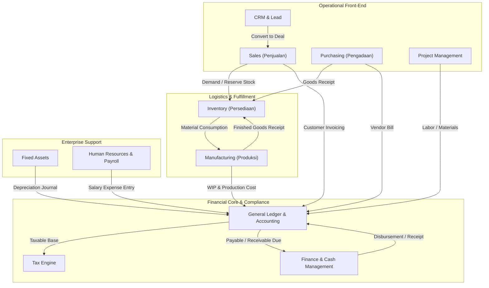

# ERP Modules & Functional Architecture

## Definition

**ERP Modules** adalah subsistem fungsional terintegrasi di dalam perangkat lunak ERP yang dirancang untuk mendukung domain proses bisnis tertentu. Setiap modul memiliki model data, antarmuka pengguna, aturan validasi, dan alur kerja (*workflow*) spesifik.

Meskipun secara visual terbagi ke dalam beberapa modul terpisah, secara arsitektur seluruh modul membaca dan menulis ke basis data bersama (*shared relational model*) sehingga perubahan status atau data di satu modul langsung berdampak pada modul lainnya.

---

## Module Interaction & Dependency Map

Hubungan antar-modul dalam ERP digerakkan oleh aliran rantai pasok (*Supply Chain*) dan aliran nilai finansial (*Financial Value Stream*):

---

## Functional Overview & Inter-Module Relationships

Berikut adalah peranan konseptual dari masing-masing modul ERP dan bagaimana modul tersebut berinteraksi:

### 1. Sales (Manajemen Penjualan)
* **Fungsi**: Mengelola interaksi komersial dengan pelanggan mulai dari penawaran harga (*Quotation*), pesanan penjualan (*Sales Order*), hingga instruksi pengiriman.
* **Hubungan Antar-Modul**:
  * Mengambil data ketersediaan stok dari **Inventory**.
  * Meneruskan pesanan yang disetujui ke **Inventory** untuk proses pemenuhan (*fulfillment*).
  * Memicu pembuatan faktur dan piutang di **Accounting (AR)**.

### 2. Purchasing / Procurement (Pengadaan Barang & Jasa)
* **Fungsi**: Mengelola pengadaan kebutuhan operasional, permohonan pembelian (*Purchase Requisition*), permintaan penawaran (*RFQ*), dan pesanan pembelian (*Purchase Order*).
* **Hubungan Antar-Modul**:
  * Menerima permintaan barang otomatis (*auto-reorder*) dari **Inventory** atau **Manufacturing**.
  * Meneruskan data PO ke **Inventory** untuk validasi penerimaan barang (*Goods Receipt*).
  * Meneruskan tagihan pemasok (*Vendor Bill*) ke **Accounting (AP)** untuk pencatatan utang.

### 3. Inventory (Persediaan & Pergudangan)
* **Fungsi**: Melacak kuantitas fisik dan nilai moneter persediaan, lokasi penyimpanan, mutasi antar-gudang, lot/serial number, dan penyesuaian stok (*Stock Adjustment*).
* **Hubungan Antar-Modul**:
  * Menyediakan bahan baku untuk **Manufacturing**.
  * Menerima barang jadi dari **Manufacturing**.
  * Mengirim barang pesanan ke **Sales**.
  * Mengirim jurnal mutasi nilai persediaan (*perpetual valuation*) dan HPP (*COGS*) ke **Accounting**.

### 4. Manufacturing / Production (Manufaktur & Produksi)
* **Fungsi**: Mengelola Bill of Materials (BOM), routing kerja, kapasitas mesin/staf, perintah kerja (*Work Order*), dan penghitungan biaya produksi (*Costing*).
* **Hubungan Antar-Modul**:
  * Mengonsumsi bahan baku dari **Inventory**.
  * Menyimpan barang jadi kembali ke **Inventory**.
  * Mencatat biaya tenaga kerja dari **HR**.
  * Mengirim jurnal barang dalam proses (*Work in Progress / WIP*) dan varians biaya ke **Accounting**.

### 5. Accounting (Akuntansi Buku Besar / GL)
* **Fungsi**: Sebagai *hub* pencatatan akuntansi terpusat (*General Ledger*, Subledger AR, Subledger AP, dan Chart of Accounts). Memastikan kepatuhan pembukuan berpasangan (*double-entry bookkeeping*).
* **Hubungan Antar-Modul**: Menerima jurnal otomatis dari seluruh aktivitas operasional (pengiriman, penerimaan, depresiasi aset, penggajian, dan faktur).

### 6. Finance (Manajemen Kas & Treasury)
* **Fungsi**: Mengelola kas dan bank (*Cash Management*), pencairan dana, penerimaan pembayaran, rekonsiliasi rekening koran bank (*Bank Reconciliation*), dan anggaran (*Budgeting*).
* **Hubungan Antar-Modul**: Menyelesaikan saldo piutang (AR) dan utang (AP) di **Accounting** ketika pembayaran riil diterima atau dicairkan melalui rekening bank.

### 7. Tax (Perpajakan)
* **Fungsi**: Menghitung kewajiban pajak transaksi (seperti PPN, PPh pasal 21/22/23/final), menerbitkan faktur pajak elektronik, dan menyusun laporan SPT masa.
* **Hubungan Antar-Modul**: Terpasang otomatis pada baris transaksi di modul **Sales**, **Purchasing**, dan **Accounting**.

### 8. Fixed Assets (Aset Tetap)
* **Fungsi**: Melacak masa manfaat aktiva tetap perusahaan, kapitalisasi perolehan aset, jadwal penyusutan periodik (*depreciation schedule*), dan pelepasan aset (*disposal*).
* **Hubungan Antar-Modul**:
  * Pengadaan aset berasal dari **Purchasing**.
  * Biaya penyusutan bulanan otomatis diposting ke **Accounting**.

### 9. Human Resources & Payroll (SDM & Penggajian)
* **Fungsi**: Mengelola data karyawan, kehadiran, cuti, klaim pengeluaran (*expense claims*), dan pemrosesan gaji (*payroll*).
* **Hubungan Antar-Modul**:
  * Menghasilkan jurnal beban gaji dan utang gaji ke **Accounting**.
  * Menyediakan alokasi jam kerja tenaga kerja langsung ke **Manufacturing** dan **Projects**.

### 10. Project Management (Manajemen Proyek)
* **Fungsi**: Mengelola Work Breakdown Structure (WBS), tugas, anggaran proyek, dan persentase penyelesaian (*percentage of completion*).
* **Hubungan Antar-Modul**:
  * Membeli barang/jasa khusus proyek melalui **Purchasing**.
  * Membebankan biaya material dan tenaga kerja ke **Accounting**.
  * Menerbitkan tagihan termin (*milestone billing*) melalui **Sales**.

### 11. Customer Relationship Management / CRM
* **Fungsi**: Mengelola prospek (*Leads*), peluang (*Opportunities*), komunikasi pelanggan, dan saluran penjualan (*Sales Pipeline*).
* **Hubungan Antar-Modul**: Mengonversi kesepakatan yang berhasil (*Won Opportunity*) langsung menjadi entitas *Customer* dan *Sales Order* di modul **Sales**.

---

## Software Modular Implementations

Struktur modularitas diatur secara berbeda di berbagai platform ERP:

* **ERPNext**: Terbagi menjadi *Domains* dan *Modules* (misal: *Selling, Buying, Stock, Manufacturing, Accounts, HR*). Seluruh modul berada dalam satu monolit terpadu yang dapat diaktifkan melalui *Role Permissions*.
* **Odoo**: Menggunakan arsitektur modular terdistribusi (*Apps*). Pengguna dapat memasang aplikasi secara terpisah (misal: pasang modul `sale` dan `stock`, lalu modul penghubung `sale_stock` otomatis aktif untuk menangani integrasi antar keduanya).
* **Microsoft Dynamics 365**: Menggunakan aplikasi bisnis terpisah yang saling terintegrasi melalui *Dataverse* dan *Dual-Write* (misal: *Dynamics 365 Finance*, *Dynamics 365 Supply Chain Management*, *Dynamics 365 Sales*).

---

## Naventra Consideration

Dalam perancangan Naventra:
* Jangan membangun modul sebagai aplikasi database terpisah (*microservices with database-per-service*), karena akan menyulitkan transaksi atomik ACID dan integritas laporan keuangan.
* Terapkan arsitektur **Modular Monolith**: kode diisolasi berdasarkan domain/modul, namun berbagi skema database terpadu untuk memastikan kecepatan agregasi data dan pelaporan.
* Sediakan mekanisme *Hook / Event Subscriber* terpusat (contoh: `on_delivery_confirmed`, `on_invoice_posted`) agar modul lain dapat merespons perubahan tanpa membuat kode yang saling mengunci secara erat (*loose coupling*).

---

## References

1. **APICS / ASCM**: *APICS Dictionary - The Standard for Supply Chain and Operations Management Terminology*.
2. **Microsoft Learn**: *Dynamics 365 Business Applications architecture overview*. URL: https://learn.microsoft.com/en-us/dynamics365/
3. **Frappe Documentation**: *ERPNext Module Directory and Workflows*. URL: https://docs.frappe.io/erpnext
4. **Odoo Documentation**: *Odoo Apps and Integration Ecosystem*. URL: https://www.odoo.com/documentation/17.0/applications.html
