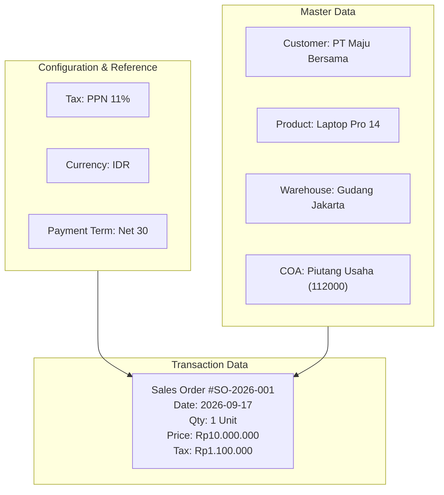
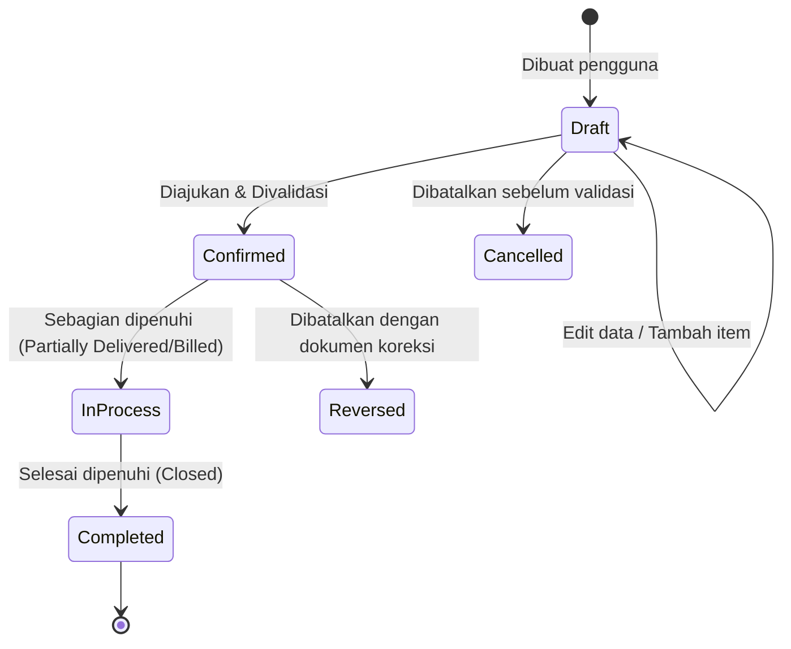

# Master Data vs Transaction Data

## Definition

Dalam sistem ERP, data dibagi menjadi beberapa strata berdasarkan siklus hidup, frekuensi perubahan, dan perannya dalam proses bisnis. Pemisahan paling fundamental adalah antara **Master Data** (entitas acuan) dan **Transaction Data** (catatan peristiwa), didukung oleh **Reference Data** dan **Configuration Data**.

* **Master Data**: Data inti yang mewakili entitas bisnis utama organisasi yang bersifat relatif statis dan digunakan secara berulang lintas modul dalam jangka panjang.
* **Transaction Data**: Catatan peristiwa operasional atau finansial yang terjadi pada titik waktu tertentu (*timestamped event*), selalu melibatkan satu atau lebih Master Data.
* **Reference Data**: Data klasifikasi atau nilai standar yang digunakan oleh Master Data dan Transaksi (misal: Satuan Ukuran / UOM, Mata Uang, Kode Pos, Negara).
* **Configuration Data**: Parameter sistem yang menentukan aturan kerja logika bisnis dan algoritma ERP (misal: metode valuasi persediaan, format penomoran dokumen, kebijakan toleransi harga).

---

## Data Taxonomy Comparison

| Karakteristik | Configuration Data | Reference Data | Master Data | Transaction Data |
|---|---|---|---|---|
| **Frekuensi Perubahan** | Sangat jarang (saat implementasi/perubahan kebijakan) | Jarang (sesuai regulasi/standar) | Rendah hingga Sedang (penambahan entitas baru) | Sangat tinggi (setiap menit/jam transaksi berjalan) |
| **Sifat Data** | Aturan (*Rules*) | Nilai Acuan (*Lookup/Codes*) | Objek Bisnis (*Business Entities*) | Peristiwa (*Business Events*) |
| **Volatilitas Nilai** | Sangat Rendah | Sangat Rendah | Sedang | Sangat Tinggi |
| **Penyimpanan State** | Parameter sistem | Tabel referensi statis | Profil entitas (bisa aktif/nonaktif) | Immutable setelah divalidasi (*Posted*) |
| **Contoh Entitas** | Default Valuation Method (FIFO), Fiscal Year | Currency (IDR, USD), UOM (Pcs, Kg, Box) | Customer, Product, Supplier, Warehouse, COA | Sales Order, Goods Receipt, Invoice, Payment |

---

## Relasi Antar-Data dalam Transaksi

Setiap transaksi dalam ERP tidak pernah berdiri sendiri. Transaksi adalah **pertemuan antara aturan konfigurasi, data referensi, dan beberapa entitas master data** untuk merekam suatu peristiwa bisnis.

### Prinsip Snapshot (Immutability of Historical Transactions)
Salah satu aturan bisnis paling krusial dalam ERP:
> **Ketika sebuah transaksi divalidasi, data harga, deskripsi, alamat penagihan, dan tarif pajak harus di-*snapshot* (disalin) ke dokumen transaksi, bukan sekadar merujuk secara dinamis ke Master Data.**

Jika master harga produk (*Price List*) diubah bulan depan dari Rp10.000.000 menjadi Rp12.000.000, dokumen *Sales Order* dan *Invoice* yang diterbitkan hari ini **tidak boleh berubah nilainya secara retrospektif**.

---

## Master Data Categories & Examples

Berikut adalah kelompok Master Data esensial dalam ERP:

### 1. Customer (Pelanggan)
* **Atribut**: ID, Nama, NPWP/Tax ID, Alamat Penagihan, Alamat Pengiriman, Mata Uang Default, *Credit Limit*, *Payment Terms*, Kelompok Pelanggan (*Customer Group*).
* **Modul Terkait**: Sales, CRM, Accounts Receivable.

### 2. Supplier / Vendor (Pemasok)
* **Atribut**: ID, Nama, Kontak, Syarat Pembayaran, Rekening Bank, Metode Pembayaran PPh Pasal 23/Withholding Tax.
* **Modul Terkait**: Purchasing, Accounts Payable, Quality Control.

### 3. Product / Item (Barang & Jasa)
* **Atribut**: Item Code, Barcode, Kategori Barang, Satuan Dasar (*Base UOM*), Satuan Pembelian, Satuan Penjualan, Tipe Item (*Stockable, Consumable, Service*), Akun Persediaan, Akun HPP, Akun Pendapatan.
* **Modul Terkait**: Inventory, Sales, Purchasing, Manufacturing, Accounting.

### 4. Warehouse & Location (Gudang & Lokasi Rak)
* **Atribut**: Warehouse Code, Alamat, Tipe Gudang (*Physical, Virtual, Transit*), Akun Valuasi Persediaan terkait.
* **Modul Terkait**: Inventory, Logistics, Manufacturing.

### 5. Chart of Accounts / COA (Bagan Akun)
* **Atribut**: Nomor Akun, Nama Akun, Tipe Akun (*Asset, Liability, Equity, Revenue, Expense*), Mata Uang, Parent Account.
* **Modul Terkait**: Accounting, Finance, dan seluruh modul operasional.

### 6. Price List & Discounts (Daftar Harga)
* **Atribut**: Kode Daftar Harga, Mata Uang, Tanggal Berlaku, Skema Diskon Kuantitas (*Tiered Pricing*).
* **Modul Terkait**: Sales, Purchasing.

---

## Transaction Data Lifecycle

Transaksi operasional memiliki siklus hidup terstandarisasi:

1. **Draft (Persiapan)**: Transaksi dapat diedit freely. Belum ada komitmen stok atau mutasi keuangan.
2. **Confirmed / Posted (Resmi)**: Transaksi disetujui. Dokumen menjadi tidak dapat diubah (*read-only/immutable*). Jika dokumen melibatkan pergerakan fisik atau nilai, mutasi subledger dan GL dieksekusi.
3. **Completed / Closed (Selesai)**: Seluruh tindak lanjut operasional dan finansial telah terpenuhi (barang sudah dikirim dan faktur sudah dibayar lunas).
4. **Reversal (Koreksi)**: Transaksi yang sudah di-*post* tidak boleh dihapus secara permanen dari database (*no hard delete*). Koreksi dilakukan dengan menerbitkan transaksi pembalik (contoh: *Credit Note* untuk membatalkan *Invoice*, atau *Goods Return* untuk membalikkan *Goods Receipt*).

---

## Software Implementation

### ERPNext
* Master data didefinisikan sebagai *DocType* non-submittable (misal: `Customer`, `Item`, `Account`).
* Transaction data didefinisikan sebagai *DocType* submittable dengan kolom `docstatus`: `0 = Draft`, `1 = Submitted`, `2 = Cancelled`.

### Odoo
* Master data dikelola melalui model ORM biasa (seperti `res.partner` untuk customer/vendor, `product.template` / `product.product` untuk barang).
* Transaction data dikelola model alur kerja dengan field `state` (seperti `draft`, `sent`, `sale`, `done`, `cancel` pada `sale.order`).

### Microsoft Dynamics 365
* Menggunakan entitas data terstruktur (*Data Entities*) dengan pemisahan tabel master (misal: `CustTable`, `InventTable`) dan tabel transaksi yang terbagi menjadi tabel header dan baris detail (misal: `SalesTable` dan `SalesLine`, `PurchTable` dan `PurchLine`).

---

## Naventra Consideration

Dalam implementasi Naventra:
* Pastikan struktur tabel transaksi selalu memisahkan **Header** (nomor dokumen, tanggal, pihak terkait) dan **Lines / Detail Items** (produk, kuantitas, harga satuan, diskon, akun beban).
* Jangan pernah mengizinkan pengubahan baris transaksi yang telah berstatus `Posted`.
* Wajibkan mekanisme *snapshot* pada saat transaksi dibuat agar perubahan harga atau alamat master data tidak merusak data historis faktur yang sudah dicetak atau dilaporkan ke pajak.

---

## References

1. **SAP Documentation**: *Master Data and Transaction Data in Enterprise Systems*. URL: https://help.sap.com/
2. **Microsoft Learn**: *Data entities and data packages in Dynamics 365 Finance and Operations*. URL: https://learn.microsoft.com/en-us/dynamics365/fin-ops-core/dev-itpro/data-entities/data-entities
3. **Frappe Documentation**: *DocType Anatomy and Document Lifecycle*. URL: https://frappeframework.com/docs/user/en/basics/doctypes
4. **DAMA International**: *DAMA-DMBOK: Data Management Body of Knowledge* (2nd ed.). Technics Publications (Master Data & Reference Data chapters).
