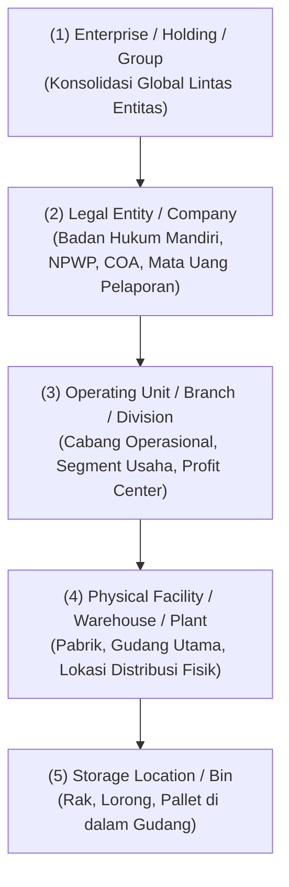
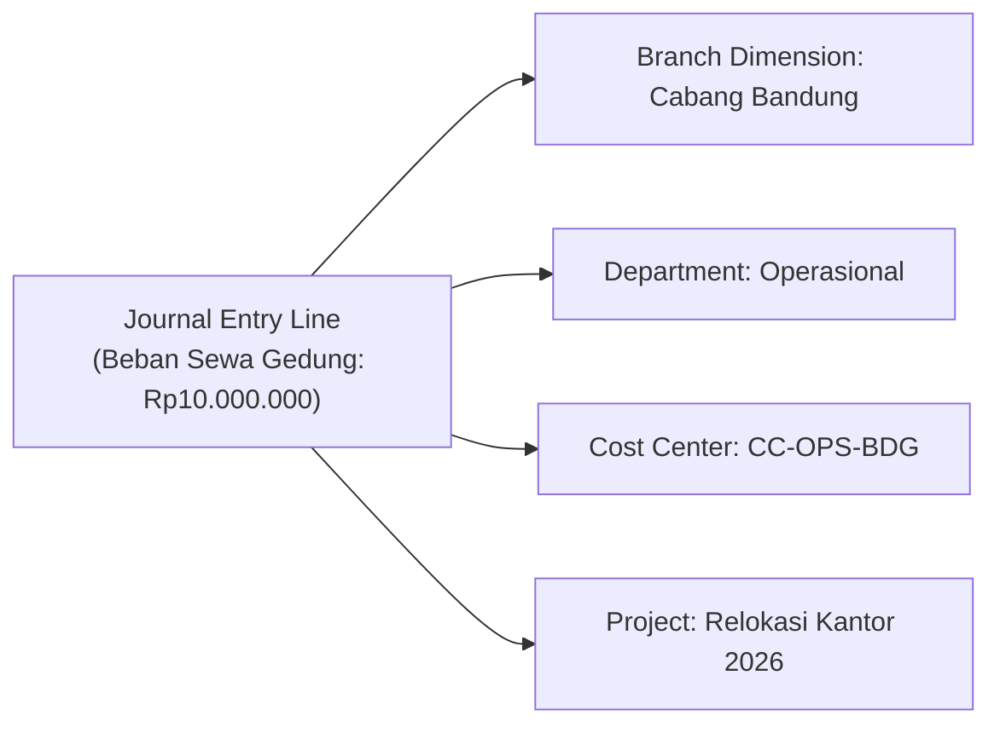

# Organizational Structure in ERP

## Definition

**Organizational Structure** (Struktur Organisasi) dalam ERP adalah representasi digital dari hierarki hukum, operasional, logistik, dan akuntansi suatu perusahaan. Struktur ini menentukan bagaimana transaksi dibatasi, bagaimana hak akses pengguna diberikan, bagaimana stok fisik dilacak, dan bagaimana laporan keuangan dikonsolidasi.

Struktur organisasi dalam ERP bukan sekadar bagan manajemen SDM (*organogram*), melainkan **fondasi partisi data dan pemetaan tanggung jawab finansial/operasional**.

---

## Hierarki Struktur Organisasi

Struktur organisasi ERP secara umum terbagi ke dalam empat lapisan utama:

### 1. Enterprise / Holding (Grup Perusahaan)
Tingkat teratas yang mencakup seluruh grup usaha. Pada level ini, dilakukan **konsolidasi laporan keuangan** lintas badan hukum dan eliminasi transaksi antar-perusahaan (*intercompany eliminations*).

### 2. Legal Entity / Company (Badan Hukum)
Badan usaha yang berbadan hukum sah secara perdata dan perpajakan (misal: PT, CV, Ltd, Corp).
* Memiliki satu set pembukuan lengkap (*balancing books*): Neraca (*Balance Sheet*) dan Laba Rugi (*P&L*).
* Memiliki mata uang fungsional (*functional currency*) dan tahun buku (*fiscal year*) tersendiri.
* Memiliki identitas perpajakan resmi (NPWP di Indonesia).

### 3. Business Unit / Branch (Unit Bisnis / Cabang)
Bagian operasional di bawah badan hukum, misalnya Cabang Surabaya, Cabang Medan, atau Divisi Retail.
* Berfungsi untuk mengukur kinerja profitabilitas segmen (sesuai IFRS 8 *Operating Segments*).
* Dapat menerbitkan dokumen transaksi operasional tersendiri dengan seri penomoran khusus.

### 4. Warehouse / Plant (Gudang & Pabrik)
Entitas logistik tempat persediaan barang disimpan atau diproduksi.
* Memiliki saldo kuantitas stok fisik dan nilai persediaan (*stock valuation*).
* Transaksi pengadaan dan pengiriman selalu menunjuk ke gudang tertentu.

### 5. Storage Location / Bin (Lokasi Rak Penyimpanan)
Detail mikro di dalam gudang untuk manajemen pergudangan lanjutan (WMS), menentukan di rak atau lorong mana barang ditempatkan.

---

## Dimensi Manajemen Keuangan: Cost Center vs Profit Center vs Accounting Dimension

Selain struktur legal dan fisik, ERP menyediakan pemisahan struktural untuk akuntansi manajerial:

1. **Department (Departemen)**: Unit fungsi organisasi (misal: HR, IT, Finance, Marketing).
2. **Cost Center (Pusat Biaya)**: Unit organisasi yang hanya menyerap biaya tanpa menghasilkan pendapatan langsung (contoh: Departemen IT, Departemen HR). Digunakan untuk pengendalian anggaran (*budget control*).
3. **Profit Center (Pusat Laba)**: Unit organisasi yang menghasilkan pendapatan dan biaya sekaligus (contoh: Lini Produk A, Divisi Retail). Digunakan untuk menghitung laporan laba rugi per divisi.
4. **Accounting Dimension (Dimensi Akuntansi)**: Tagging fleksibel pada baris jurnal transaksi (seperti Proyek, Wilayah Penjualan, Segmen Pasar) tanpa harus membuat ribuan akun baru di Chart of Accounts (*avoiding COA explosion*).

---

## Multi-Company & Intercompany Transactions

Dalam organisasi multinasional atau grup usaha dengan banyak anak perusahaan, sistem ERP mendukung:

1. **Intercompany Sales/Purchasing**: Pembelian barang oleh Anak Perusahaan A dari Anak Perusahaan B menghasilkan *Sales Order* otomatis di Perusahaan B dari *Purchase Order* di Perusahaan A.
2. **Financial Consolidation**: Menggabungkan laporan keuangan seluruh entitas dengan mengeliminasi piutang/utang internal dan pendapatan/beban intra-grup.

---

## Terminologi Antar-Platform ERP

Istilah struktur organisasi sering kali berbeda antar-sistem, namun memetakan konsep yang setara:

| Konsep Umum | SAP S/4HANA | Microsoft Dynamics 365 | ERPNext | Odoo |
|---|---|---|---|---|
| **Sistem Teratas** | Client | Tenant | Bench / Site | Database |
| **Badan Hukum** | Company Code | Legal Entity (`DAT`/Company) | Company | Company |
| **Cabang / Unit Bisnis** | Business Area / Profit Center | Operating Unit | Cost Center / Branch | Branch / Company child |
| **Pabrik / Fasilitas** | Plant (`Werk`) | Site / Operational Unit | (Terkumpul di Company) | Warehouse |
| **Gudang Fisik** | Storage Location | Warehouse | Warehouse | Warehouse |
| **Lokasi Rak / Bin** | Bin Location | Bin / Location | Warehouse (Tree Child) | Stock Location |
| **Pusat Biaya** | Cost Center (`Kostenstelle`) | Financial Dimension (Cost Center) | Cost Center | Analytic Account |

---

## Naventra Consideration

Dalam merancang struktur organisasi pada Naventra:
* Gunakan model hierarki bersarang (*nested set* atau *adjacency list*) untuk representasi Company dan Branch agar mendukung konsolidasi bertingkat (*holding -> subsidiary -> sub-subsidiary*).
* Wajibkan setiap baris transaksi operasional dan finansial memiliki referensi minimal ke `company_id` dan `branch_id`.
* Terapkan arsitektur **Analytic Dimensions** terpisah dari COA akun dasar, sehingga pengguna dapat memfilter laporan Laba Rugi berdasarkan Cabang, Divisi, atau Proyek tanpa merusak bagan akun utama.

---

## References

1. **IFRS Foundation**: *IFRS 8 Operating Segments*. URL: https://www.ifrs.org/issued-standards/list-of-standards/ifrs-8-operating-segments/
2. **SAP Help Portal**: *Organizational Structures in Financial Accounting and Logistics*. URL: https://help.sap.com/
3. **Microsoft Learn**: *Organizations and organizational hierarchies in Dynamics 365*. URL: https://learn.microsoft.com/en-us/dynamics365/fin-ops-core/fin-ops/organization-administration/organizations-organizational-hierarchies
4. **Frappe Documentation**: *Company and Cost Center Tree Structure*. URL: https://docs.frappe.io/erpnext/user/manual/en/setting-up/company-setup
5. **Odoo Documentation**: *Multi-company Guidelines*. URL: https://www.odoo.com/documentation/17.0/applications/general/companies.html
