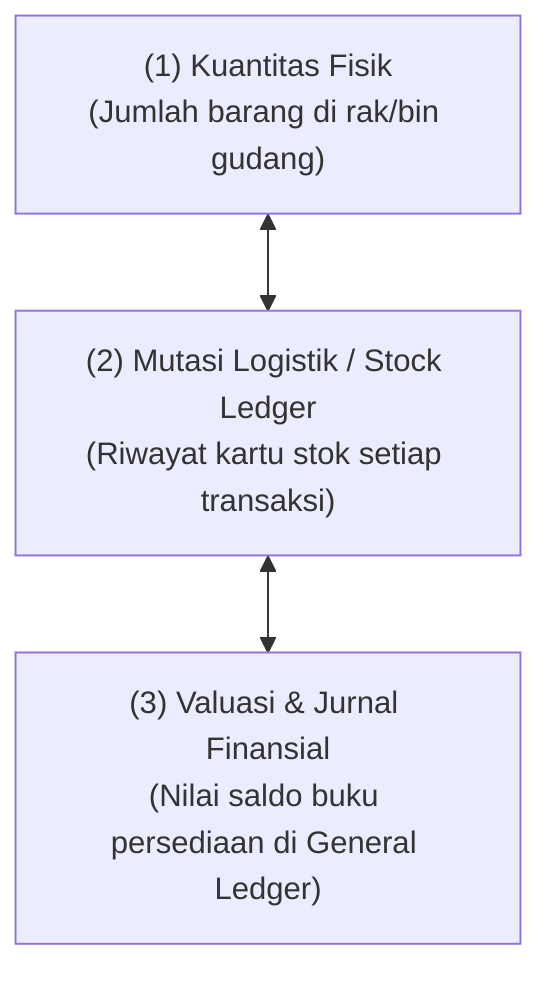
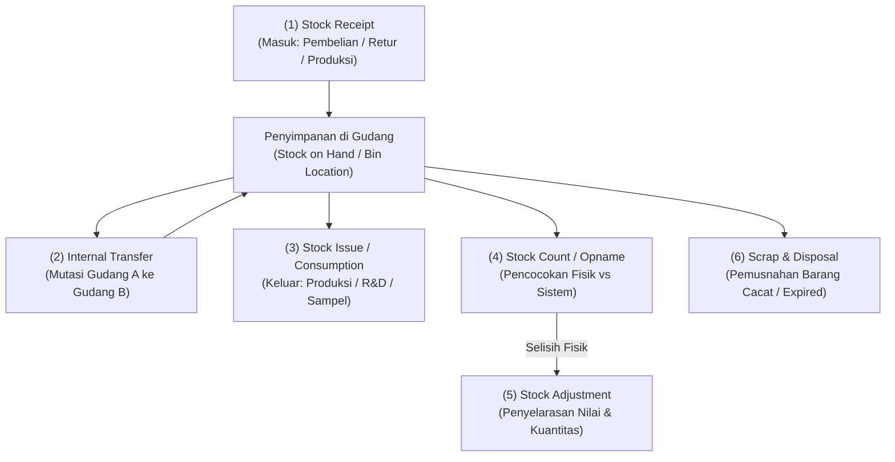

# Inventory Process

## Definition

**Inventory Process** (Proses Manajemen Persediaan) dalam ERP adalah serangkaian alur operasional dan akuntansi yang mengatur siklus hidup barang di dalam organisasi: mulai dari penerimaan barang (*goods receipt*), pergerakan internal antar-lokasi (*internal transfer*), pemakaian sendiri (*consumption/issue*), penghitungan fisik berkala (*cycle count / stock opname*), penyesuaian selisih (*stock adjustment*), hingga pemusnahan barang rusak (*scrap & disposal*).

Dalam sistem ERP modern, persediaan dikelola melalui hubungan segitiga yang tidak terpisahkan:

---

## High-Level Process Flow

---

## Detailed Step-by-Step Breakdown

### 1. Stock Receipt (Penerimaan Persediaan)

* **Trigger**: 
  * Pengiriman dari pemasok eksternal berdasarkan Pesanan Pembelian (lihat [[01-business-processes/procure-to-pay|Procure to Pay]]).
  * Penyerahan barang jadi dari lini perakitan pabrik (lihat [[01-business-processes/manufacturing-process|Manufacturing Process]]).
  * Pengembalian barang dari pelanggan (lihat [[01-business-processes/order-to-cash|Order to Cash]]).
* **Business Event**: Barang fisik dibongkar di area penerimaan (*receiving bay*), diinspeksi, dan dipindahkan ke lokasi penyimpanan.
* **Business Document**: *Goods Receipt Note* (GRN) / *Purchase Receipt* / *Stock Entry (Material Receipt)*.
* **Validation**:
  * Kuantitas sesuai dokumen jalan pengirim.
  * Pengecekan lot, batch, nomor seri, dan masa kedaluwarsa (*shelf life*).
* **Transaction (System)**: Dokumen penerimaan divalidasi (*Posted*).
* **Operational Impact**: Kuantitas fisik bertambah di gudang tujuan; status barang dapat diset menjadi *Available* atau *Quality Inspection Hold*.
* **Accounting Impact**: **Ya (Perpetual Inventory)**. Mengakui peningkatan nilai aset persediaan.
  * Debit: Persediaan Barang Dagang / Bahan Baku
  * Kredit: Utang Belum Difakturkan (*GR/IR Clearing*) atau Akun Kliring Produksi

---

### 2. Internal Stock Transfer (Mutasi Antar-Gudang & Lokasi)

* **Trigger**: Kebutuhan pemenuhan stok di cabang lain, penyeimbangan persediaan antargudang (*stock balancing*), atau perpindahan dari gudang transit ke gudang display.
* **Business Event**: Pemindahan fisik barang dari satu gudang/rak ke gudang/rak lainnya di dalam entitas perusahaan.
* **Business Document**: *Stock Transfer Order* / *Material Transfer Voucher*.
* **Metode Pemindahan**:
  1. **Direct Transfer (1-Langkah)**: Cocok untuk pemindahan instan di lokasi yang sama (antar-rak/bin di dalam satu gedung).
  2. **Transit Transfer (2-Langkah)**: Cocok untuk pemindahan antar-kota/cabang yang membutuhkan waktu pengiriman berhari-hari:
     * *Langkah A (Ship)*: Barang keluar dari Gudang Asal $\to$ Masuk ke Gudang Transit (*In-Transit Warehouse*).
     * *Langkah B (Receive)*: Barang tiba di Gudang Tujuan $\to$ Keluar dari Gudang Transit $\to$ Masuk ke Gudang Tujuan.
* **Validation**: Ketersediaan stok fisik di gudang pengirim.
* **Operational Impact**: Pengurangan stok di gudang asal dan penambahan stok di gudang tujuan; total kuantitas agregat perusahaan tetap tidak berubah.
* **Accounting Impact**:
  * **Antar-Gudang dalam Satu Badan Hukum (Nilai Sama)**: **Netral / Tidak Ada Dampak Laba Rugi**. Jika sistem mengonfigurasi akun persediaan terpisah per gudang:
    * Debit: Persediaan - Gudang Surabaya (Rp7.000.000)
    * Kredit: Persediaan - Gudang Jakarta (Rp7.000.000)
  * **Jika Melibatkan Biaya Angkut Transfer**: Biaya ekspedisi dapat dikapitalisasi ke nilai persediaan di gudang tujuan (*Transfer Surcharge/Landed Cost*).

---

### 3. Stock Issue / Internal Consumption (Pengeluaran Stok Non-Penjualan)

* **Trigger**: Kebutuhan pemakaian barang untuk keperluan internal perusahaan, seperti:
  * Pemakaian bahan baku untuk pesanan produksi (*raw material consumption*).
  * Pemakaian barang untuk demonstrasi promosi atau sampel pemasaran (*marketing sample*).
  * Pemakaian suku cadang untuk perbaikan mesin internal (*maintenance supply*).
* **Business Event**: Staf gudang mengeluarkan barang bukan untuk tujuan dijual kepada pelanggan komersial.
* **Business Document**: *Goods Issue Note* / *Material Consumption Slip*.
* **Validation**: Otorisasi persetujuan manajer departemen pengguna.
* **Transaction (System)**: Dokumen diposting; kuantitas stok berkurang.
* **Operational Impact**: Kuantitas fisik berkurang tanpa memicu dokumen penagihan (*Invoice*).
* **Accounting Impact**: **Ya**. Nilai aset persediaan berkurang dan dialokasikan ke akun beban departemen terkait atau ke akun Barang dalam Proses (*WIP*).

| Akun | Kategori Akun | Debit (Rp) | Kredit (Rp) |
|---|---|---:|---:|
| Beban Promosi & Sampel (*Marketing Expense*) | Expense | 1.400.000 | - |
| Persediaan Barang Dagang | Asset | - | 1.400.000 |

---

### 4. Stock Count & Stock Adjustment (Stock Opname & Penyesuaian Selisih)

* **Trigger**: Pelaksanaan inventarisasi fisik periodik (*Periodic Physical Count*) atau penghitungan acak bergilir (*Cycle Counting*).
* **Business Event**: Petugas menghitung jumlah fisik barang nyata di rak gudang dan membandingkannya dengan saldo buku di sistem ERP.
* **Business Document**: *Physical Inventory Sheet* & *Stock Reconciliation / Adjustment Voucher*.
* **Validation**:
  * Ambang batas toleransi selisih (*variance threshold*).
  * Validasi ganda (*dual sign-off*) oleh Kepala Gudang dan Auditor Internal.
* **Transaction (System)**: Sistem memperbarui saldo buku persediaan agar sesuai dengan hasil hitung fisik nyata.
* **Operational Impact**: Kartu stok diselaraskan menjadi persis sama dengan kondisi fisik di lapangan.
* **Accounting Impact**: **Ya**. Mengakui keuntungan atau kerugian selisih persediaan (*Inventory Shrinkage/Gain*).

#### Kasus A: Selisih Kurang (*Inventory Shrinkage / Loss*)
Hasil fisik menunjukkan 8 unit, sedangkan sistem mencatat 10 unit (hilang 2 unit @ Rp700.000 = Rp1.400.000):

| Akun | Kategori Akun | Debit (Rp) | Kredit (Rp) |
|---|---|---:|---:|
| Beban Selisih Kurang Persediaan (*Inventory Loss*) | Expense | 1.400.000 | - |
| Persediaan Barang Dagang | Asset | - | 1.400.000 |

#### Kasus B: Selisih Lebih (*Inventory Gain*)
Hasil fisik menunjukkan 12 unit, sedangkan sistem mencatat 10 unit (kelebihan 2 unit @ Rp700.000 = Rp1.400.000):

| Akun | Kategori Akun | Debit (Rp) | Kredit (Rp) |
|---|---|---:|---:|
| Persediaan Barang Dagang | Asset | 1.400.000 | - |
| Pendapatan Selisih Lebih Persediaan (*Inventory Gain*) | Revenue / Other Income | - | 1.400.000 |

---

### 5. Scrap & Disposal (Pemusnahan Barang Rusak / Usang)

* **Trigger**: Barang ditemukan pecah, kedaluwarsa (*expired*), atau mengalami penurunan mutu permanen sehingga tidak dapat dijual atau digunakan lagi.
* **Business Event**: Pemindahan barang ke area pembuangan (*Scrap Warehouse*) dan pemusnahan fisik dengan berita acara.
* **Business Document**: *Scrap Voucher* / *Waste Disposal Record*.
* **Validation**: Otorisasi penghapusan aset persediaan oleh pimpinan perusahaan.
* **Transaction (System)**: Kuantitas stok dihapus dari gudang operasional.
* **Accounting Impact**: **Ya**. Pengakuan kerugian penghapusan persediaan (*Inventory Write-off*).

| Akun | Kategori Akun | Debit (Rp) | Kredit (Rp) |
|---|---|---:|---:|
| Beban Penghapusan Barang Rusak (*Scrap Expense*) | Expense | 2.100.000 | - |
| Persediaan Barang Dagang (3 unit @ Rp700.000) | Asset | - | 2.100.000 |

---

### 6. Lower of Cost and Net Realizable Value / LCNRV (Penurunan Nilai Pasar - IAS 2)

* **Trigger**: Evaluasi akhir tahun menunjukkan estimasi harga jual bersih dikurangi estimasi biaya penyelesaian (*Net Realizable Value / NRV*) berada di bawah harga perolehan historis (*Cost*).
* **Business Event**: Penyesuaian nilai buku persediaan tanpa mengubah kuantitas fisik, sesuai kepatuhan asas kehati-hatian (*conservatism*) pada standar **IAS 2**.
* **Accounting Impact**: **Ya**.
  * Debit: Beban Penurunan Nilai Persediaan (*Inventory Write-Down Expense*)
  * Kredit: Cadangan Penurunan Nilai Persediaan (*Allowance for Inventory Write-Down* - Akun Kontra Aset)

---

## Ringkasan Jurnal Transaksi Persediaan

| Peristiwa Persediaan | Dampak Fisik | Dampak GL Finansial |
|---|:---:|---|
| **Penerimaan dari Pembelian** | Bertambah ($+$) | Dr. Persediaan / Cr. Utang Belum Difakturkan (GR/IR) |
| **Pengiriman ke Pembeli** | Berkurang ($-$) | Dr. Beban Pokok Penjualan (COGS) / Cr. Persediaan |
| **Mutasi Antar-Gudang** | Netral ($0$) | Dr. Persediaan Gudang Tujuan / Cr. Persediaan Gudang Asal |
| **Pemakaian Internal (Sampel)** | Berkurang ($-$) | Dr. Beban Promosi / Cr. Persediaan |
| **Konsumsi Bahan Baku Pabrik** | Berkurang ($-$) | Dr. Barang dalam Proses (WIP) / Cr. Persediaan Bahan Baku |
| **Selisih Kurang (Opname)** | Berkurang ($-$) | Dr. Beban Selisih Persediaan / Cr. Persediaan |
| **Pemusnahan (Scrap)** | Berkurang ($-$) | Dr. Beban Penghapusan Persediaan / Cr. Persediaan |

---

## References

1. **IFRS Foundation**: *IAS 2 Inventories - Measurement, Net Realizable Value, and Cost Formulas*. URL: https://www.ifrs.org/issued-standards/list-of-standards/ias-2-inventories/
2. **Microsoft Learn**: *Inventory management overview in Dynamics 365 Supply Chain Management*. URL: https://learn.microsoft.com/en-us/dynamics365/supply-chain/inventory/inventory-home-page
3. **Frappe / ERPNext Documentation**: *Stock Module: Stock Entry, Stock Reconciliation, and Valuation*. URL: https://docs.frappe.io/erpnext/user/manual/en/stock
4. **Odoo Documentation**: *Inventory Adjustments, Scrap, and Transfers*. URL: https://www.odoo.com/documentation/17.0/applications/inventory_and_mrp/inventory.html
