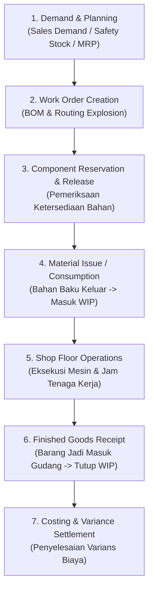

# Manufacturing Process

## Definition

**Manufacturing Process** (Proses Produksi / Manufaktur) dalam ERP adalah alur bisnis yang mengelola konversi bahan baku (*raw materials*) dan komponen perakitan menjadi barang setengah jadi (*semi-finished goods*) atau barang jadi (*finished goods*) dengan menambahkan nilai melalui tenaga kerja langsung (*direct labor*) dan pemakaian mesin serta biaya overhead pabrik (*manufacturing overhead*).

Proses manufaktur mengintegrasikan modul **Sales** (sumber permintaan pesanan), **Inventory** (sumber bahan dan penerima barang jadi), **Purchasing** (pengadaan kekurangan komponen), dan **Accounting** (pelacakan biaya produksi dan Barang dalam Proses / *WIP*).

---

## High-Level Process Flow



---

## Fondasi Manufaktur: Master Data Inti

Sebelum proses manufaktur berjalan, sistem membutuhkan dua pilar Master Data (lihat [[00-fundamentals/master-data-vs-transaction-data|Master Data vs Transaction Data]]):

1. **Bill of Materials (BOM)**: Struktur resep bahan yang merinci jenis, spesifikasi, dan kuantitas komponen baku yang dibutuhkan untuk menghasilkan satu unit produk jadi (termasuk faktor penyusutan bahan / *scrap factor*).
2. **Routing & Work Centers**: Urutan stasiun kerja (*Work Center*) dan tahapan operasi perakitan yang harus dilalui (misal: Operasi 10: Pemotongan $\to$ Operasi 20: Perakitan $\to$ Operasi 30: Pengecatan $\to$ Operasi 40: Pengujian QC), lengkap dengan estimasi waktu setup dan waktu kerja (*run time*).

---

## Detailed Step-by-Step Breakdown

### Step 1: Demand & Production Planning / MRP (Perencanaan Produksi)

* **Trigger**: 
  * Pesanan penjualan pelanggan (*Make-to-Order / MTO*).
  * Saldo persediaan barang jadi berada di bawah batas stok pengaman (*Make-to-Stock / MTS*).
  * Perhitungan formal jadwal induk produksi (*Master Production Schedule / MPS*).
* **Business Event**: Sistem menjalankan algoritma **Material Requirements Planning (MRP)** untuk menghitung kebutuhan kotor (*gross requirements*), memperhitungkan stok di tangan (*on hand*), dan menghasilkan rencana produksi serta rencana pembelian bahan baku yang kurang.
* **Business Document**: *Production Plan* / *Planned Order*.
* **Validation**:
  * Kapasitas stasiun kerja (*Capacity Requirements Planning / CRP*).
  * Waktu tenggang pengadaan (*Lead Time*) bahan baku.
* **Transaction (System)**: Pembuatan usulan pesanan (*Planned Orders*).
* **Operational Impact**: Memberikan visibilitas jadwal kerja pabrik dan memicu penerbitan *Purchase Requisition* untuk bahan baku yang kurang (lihat [[01-business-processes/procure-to-pay|Procure to Pay]]).
* **Accounting Impact**: **Tidak Ada**. Belum ada perpindahan fisik atau perikatan finansial.
* **Next Process**: Penerbitan Perintah Kerja resmi (*Work Order Release*).

---

### Step 2: Work Order Creation & Release (Penerbitan Perintah Kerja)

* **Trigger**: Persetujuan manajer produksi atas rencana manufaktur.
* **Business Event**: Otorisasi resmi kepada staf pabrik untuk memproduksi sejumlah unit produk jadi tertentu dalam rentang waktu yang ditetapkan.
* **Business Document**: *Work Order* (WO) / *Manufacturing Order* (MO).
* **Validation**:
  * Pengecekan versi aktif Bill of Materials (BOM Revision).
  * Ketersediaan komponen bahan baku di gudang.
* **Transaction (System)**: Status WO berubah dari `Draft` menjadi `Released / In Progress`.
* **Operational Impact**: Bahan baku yang tertera pada BOM dialokasikan (*Hard Reserved*) sehingga tidak dapat diambil oleh pesanan lain. Dokumen *Pick List* komponen diterbitkan ke staf gudang.
* **Accounting Impact**: **Tidak Ada**.
* **Next Process**: Pengeluaran bahan baku ke lantai pabrik (*Material Staging & Issue*).

---

### Step 3: Material Issue / Consumption (Pengeluaran Bahan Baku ke Produksi)

* **Trigger**: Staf lantai produksi siap memulai perakitan.
* **Business Event**: Pemindahan fisik bahan baku dari gudang penyimpanan (*Raw Material Warehouse*) ke lantai produksi (*Shop Floor*).
* **Business Document**: *Material Issue Slip* / *Component Consumption Voucher*.
* **Validation**: Pencocokan kuantitas aktual yang diambil terhadap kuantitas standar BOM, verifikasi nomor lot/batch bahan baku.
* **Transaction (System)**: Dokumen diposting; stok bahan baku dipotong dari kartu stok gudang.
* **Operational Impact**: Kuantitas fisik bahan baku di gudang berkurang; saldo bahan berada di lantai kerja.
* **Accounting Impact**: **Ya (Perpetual Inventory)**. Nilai bahan baku dipindahkan dari aset lancar persediaan ke akun penampung **Barang Dalam Proses (*Work in Progress / WIP*)**.

| Akun | Kategori Akun | Debit (Rp) | Kredit (Rp) |
|---|---|---:|---:|
| Persediaan Barang Dalam Proses (*WIP*) | Asset | 5.500.000 | - |
| Persediaan Bahan Baku (*Raw Materials*) | Asset | - | 5.500.000 |

* **Next Process**: Eksekusi perakitan dan pencatatan tenaga kerja/mesin.

---

### Step 4: Shop Floor Execution & Labor/Overhead Absorption (Operasi Kerja)

* **Trigger**: Operator menyelesaikan tahapan operasi kerja pada Work Center.
* **Business Event**: Operator mencatat waktu kerja aktual (*Direct Labor Hours*) dan jam operasi mesin (*Machine Hours*).
* **Business Document**: *Job Card* / *Operation Timesheet* / *Route Card Confirmation*.
* **Validation**: Kesesuaian urutan rute operasi (operasi 20 tidak boleh selesai sebelum operasi 10 tervalidasi).
* **Transaction (System)**: Konfirmasi jam kerja dimasukkan ke sistem.
* **Operational Impact**: Memperbarui status penyelesaian pesanan produksi (*percent completed*).
* **Accounting Impact**: **Ya**. Penyerapan biaya tenaga kerja langsung dan alokasi biaya *overhead* pabrik (listrik mesin, penyusutan alat pabrik) ke akun WIP (mengacu pada IAS 2 paragraf 12 mengenai biaya konversi):

| Akun | Kategori Akun | Debit (Rp) | Kredit (Rp) |
|---|---|---:|---:|
| Persediaan Barang Dalam Proses (*WIP - Labor*) | Asset | 1.000.000 | - |
| Biaya Tenaga Kerja Langsung Dialokasikan | Contra Expense | - | 1.000.000 |
| Persediaan Barang Dalam Proses (*WIP - Overhead*) | Asset | 500.000 | - |
| Biaya Overhead Pabrik Dialokasikan | Contra Expense | - | 500.000 |

* **Next Process**: Penyelesaian perakitan dan penerimaan barang jadi (*Finished Goods Receipt*).

---

### Step 5: Finished Goods Receipt (Penerimaan Barang Jadi)

* **Trigger**: Produk selesai dirakit secara fisik dan lolos uji kendali mutu (*Quality Control Inspection*).
* **Business Event**: Penyerahan produk jadi dari lantai produksi ke gudang penyimpanan produk siap jual (*Finished Goods Warehouse*).
* **Business Document**: *Finished Goods Receipt Note* / *Manufacturing Output Confirmation*.
* **Validation**:
  * Pemeriksaan hasil uji kualitas (lulus / *pass*, afkir / *reject*, atau perbaikan / *rework*).
  * Penempelan label serial number atau batch number produk jadi.
* **Transaction (System)**: Dokumen divalidasi; status Work Order diperbarui menjadi `Completed`.
* **Operational Impact**: Saldo fisik produk jadi (*Finished Goods*) bertambah di gudang dan siap dialokasikan untuk pengiriman pesanan penjualan (*O2C*).
* **Accounting Impact**: **Ya**. Nilai total biaya yang terakumulasi di akun WIP (Bahan Baku + Tenaga Kerja + Overhead = Rp7.000.000) ditransfer menjadi aset persediaan barang jadi.

| Akun | Kategori Akun | Debit (Rp) | Kredit (Rp) |
|---|---|---:|---:|
| Persediaan Barang Jadi (*Finished Goods*) | Asset | 7.000.000 | - |
| Persediaan Barang Dalam Proses (*WIP*) | Asset | - | 7.000.000 |

* **Next Process**: Penutupan perintah kerja dan analisis varians biaya.

---

### Step 6: Order Costing & Variance Settlement (Penyelesaian Varians Biaya)

* **Trigger**: Penutupan administratif perintah kerja (*Work Order Financial Close*).
* **Business Event**: Membandingkan total biaya aktual yang diserap oleh perintah kerja dengan biaya standar (*Standard Costing*) yang ditentukan di awal.
* **Business Document**: *Manufacturing Cost Variance Settlement Voucher*.
* **Validation**: Pemeriksaan apakah seluruh komponen yang terpakai dan jam kerja aktual telah dilaporkan secara lengkap.
* **Accounting Impact**: **Ya (Jika Menggunakan Standard Costing)**. Menutup sisa saldo selisih pada akun WIP ke akun beban varians:
  * **Varians Kuantitas Bahan (*Material Usage Variance*)**: Terjadi jika pemakaian bahan baku riil melebihi kuantitas standar di BOM (misal: akibat tumpah atau cacat).
  * **Varians Efisiensi Tenaga Kerja (*Labor Efficiency Variance*)**: Terjadi jika operator membutuhkan jam kerja lebih lama dari routing standar.
  * **Jurnal Penutupan Varians (Contoh jika terjadi pemborosan bahan Rp200.000)**:
    * Debit: Beban Varians Pemakaian Bahan (*Material Usage Variance*) = Rp200.000
    * Kredit: Persediaan Barang Dalam Proses (*WIP*) = Rp200.000

---

## Ilustrasi Komponen Biaya Manufaktur (Product Cost Structure)

Contoh struktur pembentukan harga pokok produksi untuk 1 unit Laptop:

```text
1. Biaya Bahan Baku Langsung (Direct Materials) :
   - Motherboard                    : Rp3.000.000
   - Layar Panel 14"                : Rp1.500.000
   - Casing, Baterai, & Aksesoris   : Rp1.000.000
   Subtotal Bahan Baku                                : Rp5.500.000

2. Biaya Tenaga Kerja Langsung (Direct Labor)        : Rp1.000.000
3. Biaya Overhead Pabrik Dialokasikan (Overhead)      : Rp  500.000
-------------------------------------------------------------------
Total Harga Pokok Produksi Barang Jadi (Capitalized)  : Rp7.000.000
```

Nilai Rp7.000.000 inilah yang menjadi nilai tercatat persediaan barang jadi di neraca, dan nantinya akan diakui sebagai Beban Pokok Penjualan (*COGS*) saat laptop tersebut dijual ke pelanggan dalam siklus [[01-business-processes/order-to-cash|Order to Cash]].

---

## Strategi Manufaktur dalam ERP

Sistem ERP mendukung beberapa model manufaktur sesuai karakteristik industri:

1. **Make-to-Stock (MTS)**: Produksi didasarkan pada perkiraan penjualan (*forecast*). Barang disimpan di gudang sebelum ada pesanan pelanggan.
2. **Make-to-Order (MTO)**: Perintah kerja baru dibuat setelah *Sales Order* dari pelanggan terkonfirmasi. Mencegah penumpukan barang jadi yang mahal.
3. **Assemble-to-Order (ATO) / Configure-to-Order (CTO)**: Komponen utama diproduksi terlebih dahulu (*MTS*), namun perakitan akhir disesuaikan dengan konfigurasi pilihan pelanggan (*MTO*).
4. **Discrete Manufacturing vs Process Manufacturing**:
   * *Discrete*: Menghasilkan barang yang dapat dihitung dan dibongkar kembali per unit (laptop, mobil, mesin). Menggunakan *Bill of Materials (BOM)*.
   * *Process*: Menghasilkan produk formula kimia/makanan yang bercampur permanen (minyak, obat, cat). Menggunakan *Formulation / Recipe* dengan produk sampingan (*Co-products & By-products*).

---

## References

1. **IFRS Foundation**: *IAS 2 Inventories - Costs of Conversion and Allocation of Overheads*. URL: https://www.ifrs.org/issued-standards/list-of-standards/ias-2-inventories/
2. **APICS / ASCM**: *Production and Inventory Management Principles*.
3. **Microsoft Learn**: *Discrete manufacturing overview in Dynamics 365 Supply Chain Management*. URL: https://learn.microsoft.com/en-us/dynamics365/supply-chain/production-control/discrete-manufacturing-overview
4. **Frappe / ERPNext Documentation**: *Manufacturing Module: Work Order, BOM, and Job Card*. URL: https://docs.frappe.io/erpnext/user/manual/en/manufacturing
5. **Odoo Documentation**: *Manufacturing Orders and Work Centers*. URL: https://www.odoo.com/documentation/17.0/applications/inventory_and_mrp/manufacturing.html
