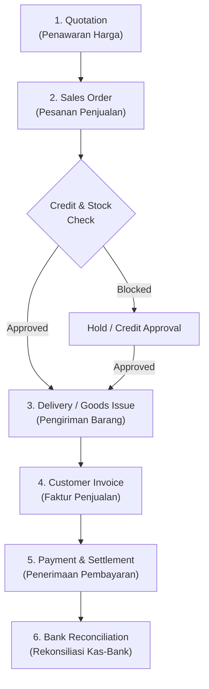

# Order to Cash (O2C)

## Definition

**Order to Cash (O2C)** adalah siklus proses bisnis ujung-ke-ujung (*end-to-end*) yang mencakup seluruh tahapan interaksi komersial dengan pelanggan: dimulai dari penerimaan pesanan penjualan (*sales order*), pemenuhan barang atau jasa (*fulfillment*), penagihan piutang (*invoicing*), hingga penerimaan pembayaran dan rekonsiliasi kas (*cash collection & reconciliation*).

Sebagai salah satu aliran nilai utama (*core value stream*), O2C menghubungkan fungsi komersial (Sales), operasional logistik (Inventory), dan akuntansi (Accounts Receivable & General Ledger). Konsep integrasi lintas modul ini dibangun di atas fondasi [[00-fundamentals/cross-module-integration|Cross-Module Integration]] dan [[00-fundamentals/documents-transactions-events|Documents, Transactions, and Business Events]].

---

## High-Level Process Flow

---

## Detailed Step-by-Step Breakdown

### Step 1: Customer Inquiry & Quotation (Penawaran Harga)

* **Trigger**: Calon pelanggan meminta informasi harga dan ketersediaan barang/jasa (*Request for Quotation / Inbound Inquiry*).
* **Business Event**: Departemen penjualan menyusun proposal harga dan spesifikasi barang sesuai syarat komersial.
* **Business Document**: *Quotation* / *Sales Quote*.
* **Validation**:
  * Validasi masa berlaku penawaran (*validity date*).
  * Validasi batas diskon wewenang staf penjualan (*discount matrix*).
  * Pemeriksaan estimasi ketersediaan barang (*Available-to-Promise / ATP*).
* **Transaction (System)**: Dokumen berstatus `Draft` berpindah ke `Submitted / Sent`.
* **Operational Impact**: Tidak ada mutasi fisik. Dokumen menjadi referensi saat pesanan disetujui.
* **Accounting Impact**: **Tidak Ada**. Tahap ini adalah komitmen non-mengikat (*pre-contractual*), sehingga tidak ada jurnal buku besar atau subledger.
* **Next Process**: Pelanggan menerbitkan pesanan resmi (*Customer PO*) atau menolak penawaran.

---

### Step 2: Sales Order Confirmation & Credit Check (Konfirmasi Pesanan)

* **Trigger**: Pelanggan menyetujui penawaran harga atau mengirimkan surat pesanan (*Purchase Order* dari pihak pelanggan).
* **Business Event**: Kesepakatan kontrak jual beli yang mengikat secara legal antara penjual dan pembeli.
* **Business Document**: *Sales Order* (SO).
* **Validation**:
  * **Credit Limit Check**: Memeriksa apakah total piutang berjalan ditambah nilai pesanan baru melebihi batas kredit pelanggan (*Credit Limit*).
  * **Overdue Invoice Check**: Memeriksa apakah pelanggan memiliki faktur yang sudah melewati masa jatuh tempo (*overdue*).
  * **Inventory Reservation**: Alokasi stok komitmen (*soft allocation/reservation*).
* **Transaction (System)**: Status SO berubah dari `Draft` menjadi `Confirmed / Approved`.
* **Operational Impact**: Kuantitas stok pada gudang terkait ditandai sebagai *Reserved Quantity*. Stok fisik belum berkurang, namun stok yang tersedia untuk dijual (*Available to Sell / ATS*) berkurang.
* **Accounting Impact**:
  * **Standar Transaksi Kredit**: **Tidak Ada Jurnal Akuntansi**. Penjual belum menyerahkan barang dan belum memiliki hak tagih legal.
  * **Variasi Kebijakan (Uang Muka / Down Payment)**: Jika pesanan mensyaratkan uang muka (*advance payment*), sistem menerbitkan *Down Payment Invoice*:
    * Debit: Kas/Bank
    * Kredit: Uang Muka Penjualan (*Customer Advance / Unearned Revenue* - Liability)
* **Next Process**: Penerbitan instruksi pengeluaran barang ke gudang (*Pick List / Fulfillment Request*).

---

### Step 3: Fulfillment & Goods Issue (Pengeluaran & Pengiriman Barang)

* **Trigger**: Dokumen *Sales Order* berstatus *Approved* siap dikirim sesuai jadwal tanggal pengiriman (*Delivery Date*).
* **Business Event**: Staf gudang mengambil (*picking*), mengemas (*packing*), dan menyerahkan barang fisik kepada pelanggan atau jasa ekspedisi.
* **Business Document**: *Delivery Note* / *Picking Slip* / *Goods Issue Document*.
* **Validation**:
  * Ketersediaan fisik barang di lokasi rak (*Bin location*).
  * Verifikasi nomor lot, batch, atau nomor seri (*Serial Number*) untuk barang terlacak.
  * Verifikasi kuantitas pengiriman tidak melebihi kuantitas pesanan pada SO (kecuali kebijakan mengizinkan *over-delivery* dengan toleransi).
* **Transaction (System)**: Dokumen pengiriman divalidasi (*Posted / Submitted*). Dokumen menjadi *immutable*.
* **Operational Impact**:
  * Saldo fisik (*Quantity on Hand*) berkurang di kartu stok gudang.
  * Status pemenuhan pada *Sales Order* ter-update (sebagian terpenuhi / *Partially Delivered*, atau terpenuhi penuh / *Fully Delivered*).
* **Accounting Impact**: **Ya (Perpetual Inventory)**. Berpindahnya kendali barang fisik mewajibkan pengakuan Beban Pokok Penjualan (*COGS*) dan pengurangan aset persediaan (mengacu pada IAS 2 *Inventories*).

| Akun | Kategori Akun | Debit (Rp) | Kredit (Rp) |
|---|---|---:|---:|
| Beban Pokok Penjualan (*COGS*) | Expense | 7.000.000 | - |
| Persediaan Barang Dagang | Asset | - | 7.000.000 |

> [!note] Variasi Kebijakan: FOB Shipping Point vs FOB Destination
> * **FOB Shipping Point**: Hak dan resiko barang berpindah di gerbang gudang penjual. Jurnal persediaan dan pendapatan langsung diakui saat barang keluar dari gudang.
> * **FOB Destination**: Hak dan resiko baru berpindah saat barang tiba di lokasi pembeli. Jika pengiriman memerlukan waktu berhari-hari, persediaan dipindahkan sementara ke akun *Goods in Transit* sebelum dibebankan ke COGS.

* **Next Process**: Penagihan faktur penjualan (*Invoicing / Billing*).

---

### Step 4: Customer Invoicing / Billing (Penagihan Faktur Penjualan)

* **Trigger**: Pengiriman barang telah selesai divalidasi (*delivery-based invoicing*), atau konfirmasi pesanan telah disetujui (*order-based invoicing* pada produk jasa).
* **Business Event**: Penjual menerbitkan klaim hak tagih resmi (*Invoice*) dan faktur pajak kepada pembeli.
* **Business Document**: *Sales Invoice* (Faktur Penjualan) dan Faktur Pajak Elektronik.
* **Validation**:
  * Pencocokan 2-arah / 3-arah: kuantitas pada faktur harus sesuai dengan kuantitas yang benar-benar dikirim pada *Delivery Note*.
  * Perhitungan pajak pertambahan nilai (PPN) dan penentuan syarat pembayaran (*payment terms*, misal: Net 30 hari).
* **Transaction (System)**: Status Faktur Penjualan berubah menjadi `Posted / Open`.
* **Operational Impact**: Jadwal jatuh tempo piutang (*due date*) terbentuk pada buku pembantu piutang (*AR Subledger*). Laporan umur piutang (*Aging AR*) ter-update.
* **Accounting Impact**: **Ya**. Pengakuan pendapatan (*Revenue*) sesuai standar IFRS 15 (*Revenue from Contracts with Customers*) dan kewajiban pajak keluaran.

| Akun | Kategori Akun | Debit (Rp) | Kredit (Rp) |
|---|---|---:|---:|
| Piutang Usaha (*Accounts Receivable*) | Asset | 11.100.000 | - |
| Pendapatan Penjualan (*Sales Revenue*) | Revenue | - | 10.000.000 |
| Utang PPN Keluaran (*VAT Output*) | Liability | - | 1.100.000 |

* **Next Process**: Pemantauan penagihan dan penerimaan pembayaran (*Collections & Cash Application*).

---

### Step 5: Customer Payment & Settlement (Penerimaan Pembayaran)

* **Trigger**: Pembeli mentransfer dana ke rekening bank perusahaan atau menyerahkan instrumen pembayaran.
* **Business Event**: Dana efektif masuk ke rekening perusahaan untuk melunasi kewajiban piutang.
* **Business Document**: *Payment Receipt* / *Bank Receipt Voucher*.
* **Validation**:
  * Pencocokan bukti transfer dengan nomor faktur yang dituju (*Invoice Allocation/Matching*).
  * Validasi potongan pajak penghasilan jika ada (misal: PPh Pasal 23 yang dipotong pembeli atas jasa).
  * Validasi selisih kurs (*Forex Gain/Loss*) jika transaksi menggunakan mata uang asing.
* **Transaction (System)**: Status *Payment Entry* disetujui, dan status Faktur Penjualan berubah menjadi `Paid`.
* **Operational Impact**: Plafon kredit pelanggan (*Credit Limit*) kembali pulih sebesar nominal pembayaran yang diterima.
* **Accounting Impact**: **Ya**. Rekonsiliasi saldo piutang ditutup dan saldo aset likuid kas/bank bertambah.

| Akun | Kategori Akun | Debit (Rp) | Kredit (Rp) |
|---|---|---:|---:|
| Bank Operasional | Asset | 11.100.000 | - |
| Piutang Usaha (*Accounts Receivable*) | Asset | - | 11.100.000 |

* **Next Process**: Rekonsiliasi buku bank dengan rekening koran bank (*Bank Reconciliation*).

---

### Step 6: Sales Return & Credit Memo (Alur Pengecualian / Retur)

* **Trigger**: Pelanggan mengembalikan barang akibat cacat (*defect*), salah kirim, atau ketidaksesuaian spesifikasi.
* **Business Event**: Penerimaan kembali barang fisik ke gudang dan pembatalan hak tagih piutang.
* **Business Document**: *Sales Return* (Retur Penjualan) & *Credit Note* / *Credit Memo*.
* **Accounting Impact**:
  1. **Pengembalian Persediaan Fisik**:
     * Debit: Persediaan Barang Dagang (Rp7.000.000)
     * Kredit: Beban Pokok Penjualan / COGS (Rp7.000.000)
  2. **Pembatalan Tagihan (Credit Note)**:
     * Debit: Retur Penjualan / Pengurang Pendapatan (Rp10.000.000)
     * Debit: Utang PPN Keluaran (Rp1.100.000)
     * Kredit: Piutang Usaha (Rp11.100.000)

---

## Ringkasan Transaksi Finansial O2C

Menggunakan skenario standar penjualan 10 unit barang dagang @ Rp1.000.000 (HPP @ Rp700.000/unit, PPN 11%):

| Tahapan O2C | Dokumen | Kuantitas Fisik | Nilai Transaksi | Jurnal Debit | Jurnal Kredit |
|---|---|:---:|:---:|---|---|
| **1. Penawaran** | Quotation | - | Rp10.000.000 | *Tidak ada jurnal* | *Tidak ada jurnal* |
| **2. Pesanan** | Sales Order | - | Rp10.000.000 | *Tidak ada jurnal* | *Tidak ada jurnal* |
| **3. Pengiriman** | Delivery Note | -10 unit | Rp7.000.000 | HPP (COGS): Rp7.000.000 | Persediaan: Rp7.000.000 |
| **4. Faktur** | Sales Invoice | - | Rp11.100.000 | Piutang Usaha: Rp11.100.000 | Pendapatan: Rp10.000.000 PPN Keluaran: Rp1.100.000 |
| **5. Pelunasan** | Payment Entry | - | Rp11.100.000 | Bank: Rp11.100.000 | Piutang Usaha: Rp11.100.000 |

---

## Variasi Model Bisnis dalam O2C

1. **B2B Wholesale / Manufacturing (Kredit Tradisional)**:
   * Alur: `Quotation -> SO -> Delivery -> Invoice -> Payment (Net 30/60)`.
   * Penyerahan barang mendahului pembayaran. Membutuhkan verifikasi batas kredit ketat.
2. **B2C Retail / Point of Sale (Cash & Carry)**:
   * Alur: `POS Order & Payment & Delivery terjadi secara simultan`.
   * Tidak ada tenggang waktu piutang. Pembayaran langsung diterima saat transaksi dicatat.
3. **Services / Konsultasi / Proyek**:
   * Tidak ada pengiriman persediaan fisik (*no physical goods issue*).
   * Penagihan didasarkan pada persentase penyelesaian proyek (*milestone billing*) atau jam kerja yang dilaporkan (*timesheet billing*).
4. **Dropshipping**:
   * Perusahaan menerima pesanan dari pelanggan, namun pengiriman barang fisik dilakukan langsung oleh pemasok ke pelanggan akhir.
   * Modul Sales langsung memicu pembuatan *Purchase Order* ke pihak ketiga tanpa melalui gudang internal.

---

## References

1. **IFRS Foundation**: *IFRS 15 Revenue from Contracts with Customers*. URL: https://www.ifrs.org/issued-standards/list-of-standards/ifrs-15-revenue-from-contracts-with-customers/
2. **IFRS Foundation**: *IAS 2 Inventories*. URL: https://www.ifrs.org/issued-standards/list-of-standards/ias-2-inventories/
3. **Microsoft Learn**: *Order-to-cash end-to-end business process in Dynamics 365*. URL: https://learn.microsoft.com/en-us/dynamics365/guidance/business-processes/order-to-cash-overview
4. **Frappe / ERPNext Documentation**: *Sales Workflow and Selling Module*. URL: https://docs.frappe.io/erpnext/user/manual/en/selling
5. **Odoo Documentation**: *Sales Flow: Quotation to Invoicing*. URL: https://www.odoo.com/documentation/17.0/applications/sales/sales.html
