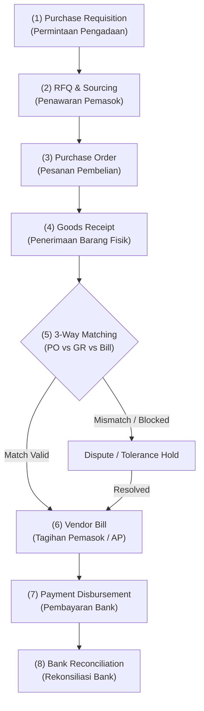

# Procure to Pay (P2P)

## Definition

**Procure to Pay (P2P)** adalah siklus proses bisnis hulu-ke-hilir yang mengatur seluruh pengadaan barang dan jasa dalam organisasi: dimulai dari identifikasi kebutuhan pengadaan (*purchase requisition*), pencarian dan evaluasi pemasok (*sourcing & RFQ*), penerbitan pesanan pembelian (*purchase order*), penerimaan fisik dan inspeksi kualitas (*goods receipt*), pencocokan tagihan (*3-way matching*), hingga pelunasan utang dan pengeluaran kas (*disbursement*).

Siklus P2P mengintegrasikan departemen pengguna (*requester*), tim pengadaan (*purchasing*), tim pergudangan (*inventory*), serta departemen akuntansi dan keuangan (*Accounts Payable & Treasury*). Proses ini sangat bergantung pada konsep [[00-fundamentals/cross-module-integration|Cross-Module Integration]] dan verifikasi akun kliring [[00-fundamentals/cross-module-integration#2-the-grir-clearing-account-akun-penampung-penerimaan-barang|GR/IR Clearing Account]].

---

## High-Level Process Flow



---

## Detailed Step-by-Step Breakdown

### Step 1: Purchase Requisition (Permintaan Pembelian)

* **Trigger**: 
  * Kebutuhan internal departemen pengguna (*internal request*).
  * Saldo stok mencapai titik pemesanan ulang (*Reorder Point / Min-Max*) pada modul Inventory.
  * Hasil perhitungan kebutuhan bahan baku oleh *Material Requirements Planning* (MRP) pada modul Manufaktur.
* **Business Event**: Permohonan formal dari unit kerja untuk mengadakan barang/jasa tertentu.
* **Business Document**: *Purchase Requisition* (PR).
* **Validation**:
  * Pemeriksaan pagu anggaran departemen (*budget availability check*).
  * Matriks otorisasi persetujuan manajerial (*approval hierarchy* berdasarkan nilai pengadaan).
* **Transaction (System)**: Status PR berubah dari `Draft` menjadi `Approved`.
* **Operational Impact**: PR yang disetujui masuk ke antrean kerja tim *Procurement* untuk dicarikan pemasok.
* **Accounting Impact**: **Tidak Ada**. Tahap ini adalah usulan operasional internal, belum ada perikatan hukum dengan pihak eksternal.
* **Next Process**: Evaluasi pemasok dan permintaan penawaran harga (*RFQ*).

---

### Step 2: Request for Quotation & Sourcing (Permintaan Penawaran Pemasok)

* **Trigger**: PR yang telah disetujui memerlukan pemilihan pemasok dan negosiasi harga.
* **Business Event**: Tim pengadaan mengirimkan spesifikasi kebutuhan ke beberapa calon pemasok dan menerima penawaran tandingan.
* **Business Document**: *Request for Quotation* (RFQ) dan *Supplier Quotation*.
* **Validation**:
  * Perbandingan harga satuan, syarat pembayaran (*payment terms*), waktu tunggu pengiriman (*lead time*), dan rekam jejak kualitas pemasok.
* **Transaction (System)**: Data penawaran dicatat; penawar terbaik dipilih (*Vendor Selection*).
* **Operational Impact**: Menetapkan pemasok terpilih untuk pemenuhan pesanan.
* **Accounting Impact**: **Tidak Ada**. Masih berada pada tahap negosiasi awal.
* **Next Process**: Penerbitan Pesanan Pembelian resmi (*Purchase Order*).

---

### Step 3: Purchase Order Confirmation (Pesanan Pembelian)

* **Trigger**: Penetapan pemasok pemenang pengadaan.
* **Business Event**: Penerbitan kontrak pemesanan resmi yang mengikat secara hukum kepada pemasok terpilih.
* **Business Document**: *Purchase Order* (PO).
* **Validation**:
  * Verifikasi status keaktifan vendor (*vendor compliance & tax registration*).
  * Validasi batas kredit pembelian dan tanggal kesanggupan kirim (*Promised Date*).
* **Transaction (System)**: Dokumen PO disetujui (*Approved*) dan dikirimkan ke pemasok (*Issued/Sent*).
* **Operational Impact**: Terbentuk komitmen pengadaan barang masuk (*Inbound Expected Stock*), yang dapat diperhitungkan dalam perencanaan persediaan (*ATP*).
* **Accounting Impact**:
  * **Standar Transaksi Kredit**: **Tidak Ada Jurnal Akuntansi**. Perusahaan belum menerima barang/jasa dan belum timbul kewajiban utang legal.
  * **Variasi Kebijakan (Uang Muka Pembelian / Vendor Advance)**: Jika pemasok mewajibkan uang muka sebelum memproduksi/mengirim barang:
    * Debit: Uang Muka Pembelian (*Vendor Advance / Prepaid Expense* - Asset)
    * Kredit: Kas/Bank

---

### Step 4: Goods Receipt & Quality Inspection (Penerimaan Barang Fisik)

* **Trigger**: Truk pemasok tiba di gudang perusahaan membawa barang fisik dan surat jalan pemasok (*Vendor Delivery Order*).
* **Business Event**: Staf gudang membongkar muatan, menghitung kuantitas fisik, dan bagian *Quality Control* (QC) melakukan inspeksi kesesuaian spesifikasi.
* **Business Document**: *Goods Receipt* (GR) / *Purchase Receipt* / *Material Inspection Report*.
* **Validation**:
  * Pencocokan nomor PO rujukan.
  * Pemeriksaan toleransi kuantitas (*under/over-delivery tolerance*).
  * Pemeriksaan barang rusak (*rejected items*) yang harus ditolak langsung di pintu gudang.
  * Pencatatan nomor lot, tanggal kedaluwarsa (*expiry date*), atau nomor seri barang.
* **Transaction (System)**: Dokumen penerimaan barang divalidasi (*Posted / Submitted*).
* **Operational Impact**:
  * Saldo fisik (*Quantity on Hand*) bertambah di gudang tujuan.
  * Sisa kuantitas terbuka (*Open PO Quantity*) pada Purchase Order berkurang.
* **Accounting Impact**: **Ya (Perpetual Inventory)**. Mengakui penambahan aset persediaan di neraca dan timbulnya kewajiban utang akrual atas barang yang telah diterima namun belum difakturkan (*Unbilled Liability*), mengacu pada IAS 2.

| Akun | Kategori Akun | Debit (Rp) | Kredit (Rp) |
|---|---|---:|---:|
| Persediaan Barang Dagang | Asset | 7.000.000 | - |
| Utang Belum Difakturkan (*GR/IR Clearing*) | Liability | - | 7.000.000 |

> [!tip] Landed Cost Capitalization
> Jika terdapat biaya angkut (*freight*), asuransi, atau bea masuk impor yang dibayarkan ke pihak ekspedisi ketiga, biaya tersebut dikapitalisasi ke nilai perolehan persediaan melalui mekanisme *Landed Cost Voucher*, sehingga nilai tercatat barang meningkat sebelum dijual.

* **Next Process**: Verifikasi tagihan pemasok (*Vendor Bill Processing*).

---

### Step 5: Vendor Bill & 3-Way Matching (Faktur Pemasok & Pencocokan 3 Dokumen)

* **Trigger**: Departemen Akuntansi menerima dokumen faktur asli (*invoice*) dan Faktur Pajak Masukan dari pemasok.
* **Business Event**: Pengakuan kewajiban utang resmi perusahaan yang memiliki kekuatan hukum penagihan.
* **Business Document**: *Vendor Bill* / *Purchase Invoice*.
* **Validation (The 3-Way Match)**:
  Sistem ERP melakukan validasi otomatis antara tiga dokumen:

```text
1. Purchase Order  : Harga satuan disepakati = Rp700.000 / unit
2. Goods Receipt   : Kuantitas fisik diterima = 10 unit
3. Vendor Bill     : Tagihan diajukan = 10 unit @ Rp700.000 = Rp7.000.000 + PPN 11%
```

Jika terdapat selisih (*variance*) di luar toleransi (misal: harga di faktur Rp750.000/unit), sistem memasang status *Invoice Blocked for Payment* hingga ada persetujuan manajerial atau revisi dari pemasok.

* **Transaction (System)**: Tagihan disetujui dan berstatus `Posted / Open`.
* **Operational Impact**: Saldo utang tercatat di *AP Subledger* dengan tanggal jatuh tempo sesuai syarat pembayaran (misal: Net 30 hari).
* **Accounting Impact**: **Ya**. Menutup akun kliring penampung *GR/IR* dan mencatat utang usaha resmi beserta pajak masukan yang dapat dikreditkan.

| Akun | Kategori Akun | Debit (Rp) | Kredit (Rp) |
|---|---|---:|---:|
| Utang Belum Difakturkan (*GR/IR Clearing*) | Liability | 7.000.000 | - |
| PPN Masukan (*VAT Input*) | Asset / Tax Receiv. | 770.000 | - |
| Utang Usaha (*Accounts Payable*) | Liability | - | 7.770.000 |

* **Next Process**: Penjadwalan pembayaran utang (*Payment Proposal & Disbursement*).

---

### Step 6: Vendor Payment Disbursement (Pembayaran Pemasok)

* **Trigger**: Tagihan pemasok telah memasuki jatuh tempo pembayaran (*Due Date*), atau memanfaatkan diskon pelunasan dini (*Early Payment Discount*, misal: 2/10, Net 30).
* **Business Event**: Departemen keuangan mentransfer dana dari rekening bank perusahaan ke rekening pemasok.
* **Business Document**: *Payment Order* / *Bank Disbursement Voucher*.
* **Validation**:
  * Otorisasi tandatangan perbankan (*Maker-Checker approval*).
  * Kecukupan saldo pada rekening bank operasional.
  * Validasi pemotongan pajak PPh Pasal 23 jika pengadaan berupa jasa.
* **Transaction (System)**: Pembayaran divalidasi dan dihubungkan (*allocated/matched*) ke nomor faktur vendor terkait.
* **Operational Impact**: Tagihan vendor berstatus `Paid`. Rekam jejak kepatuhan pembayaran perusahaan (*vendor rating*) terjaga.
* **Accounting Impact**: **Ya**. Saldo utang usaha lunas dan kas bank berkurang.

| Akun | Kategori Akun | Debit (Rp) | Kredit (Rp) |
|---|---|---:|---:|
| Utang Usaha (*Accounts Payable*) | Liability | 7.770.000 | - |
| Bank Operasional | Asset | - | 7.770.000 |

* **Next Process**: Rekonsiliasi mutasi rekening koran bank (*Bank Reconciliation*).

---

### Step 7: Purchase Return & Debit Memo (Alur Pengecualian / Retur Pembelian)

* **Trigger**: Ditemukan barang cacat saat hendak digunakan, atau pengembalian klaim garansi ke pemasok.
* **Business Event**: Pengiriman barang kembali ke pemasok dan penerbitan nota pengurangan utang.
* **Business Document**: *Purchase Return* & *Debit Note* / *Debit Memo*.
* **Accounting Impact**:
  1. **Pengembalian Barang Fisik (Belum Difakturkan)**:
     * Debit: Utang Belum Difakturkan (*GR/IR Clearing*)
     * Kredit: Persediaan Barang Dagang
  2. **Pengurangan Utang yang Sudah Difakturkan (Debit Note)**:
     * Debit: Utang Usaha (AP)
     * Kredit: Persediaan Barang Dagang (atau Biaya)
     * Kredit: PPN Masukan (Koreksi Faktur Pajak Masukan)

---

## Ringkasan Transaksi Finansial P2P

Skenario standar pengadaan 10 unit barang dagang @ Rp700.000 (PPN Masukan 11%):

| Tahapan P2P | Dokumen | Kuantitas Fisik | Nilai Transaksi | Jurnal Debit | Jurnal Kredit |
|---|---|:---:|:---:|---|---|
| **1. Permintaan** | Purchase Req. | - | Rp7.000.000 | *Tidak ada jurnal* | *Tidak ada jurnal* |
| **2. Pesanan** | Purchase Order | - | Rp7.000.000 | *Tidak ada jurnal* | *Tidak ada jurnal* |
| **3. Penerimaan** | Goods Receipt | +10 unit | Rp7.000.000 | Persediaan: Rp7.000.000 | GR/IR Clearing: Rp7.000.000 |
| **4. Tagihan** | Vendor Bill | - | Rp7.770.000 | GR/IR Clearing: Rp7.000.000<br/>PPN Masukan: Rp770.000 | Utang Usaha (AP): Rp7.770.000 |
| **5. Pelunasan** | Payment Entry | - | Rp7.770.000 | Utang Usaha (AP): Rp7.770.000 | Bank: Rp7.770.000 |

---

## Variasi Kebijakan & Model Pengadaan

1. **Direct Material vs Indirect / Consumable Procurement**:
   * *Direct Materials*: Masuk ke akun aset persediaan di gudang untuk dijual atau diolah di pabrik.
   * *Indirect / Expense Items* (misal: alat tulis kantor, jasa pembersihan): Langsung dibebankan ke akun biaya (*Operating Expense*) pada saat barang/jasa diterima, tanpa melalui kartu stok persediaan.
2. **Blanket Purchase Order / Kontrak Jangka Panjang**:
   * Perusahaan mengikat perjanjian harga dan kuantitas tahunan dengan pemasok, lalu menerbitkan surat perintah pengiriman berkala (*Release Orders*) sesuai kebutuhan bulanan.
3. **Penyimpangan Harga Pembelian (*Purchase Price Variance / PPV*)**:
   * Terjadi jika harga pada PO adalah Rp700.000, namun faktur vendor yang disetujui adalah Rp720.000. Selisih Rp20.000 dibukukan ke akun varians harga (*PPV Expense*) jika metode valuasi menggunakan Biaya Standar (*Standard Costing*).

---

## References

1. **IFRS Foundation**: *IAS 2 Inventories - Acquisition Costs and Capitalization*. URL: https://www.ifrs.org/issued-standards/list-of-standards/ias-2-inventories/
2. **Microsoft Learn**: *Procure-to-pay business process in Dynamics 365 Supply Chain Management*. URL: https://learn.microsoft.com/en-us/dynamics365/guidance/business-processes/procure-to-pay-overview
3. **Frappe / ERPNext Documentation**: *Procurement and Buying Workflows*. URL: https://docs.frappe.io/erpnext/user/manual/en/buying
4. **Odoo Documentation**: *Purchase to Vendor Bill and 3-Way Matching*. URL: https://www.odoo.com/documentation/17.0/applications/inventory_and_mrp/purchase.html
