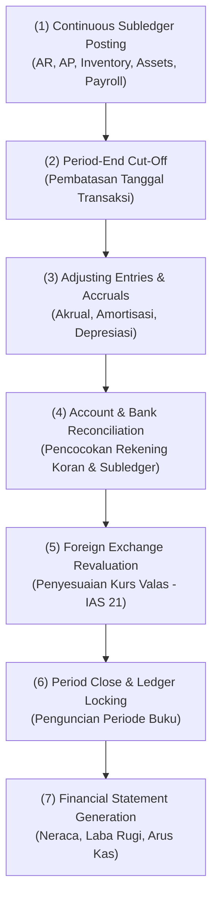

# Record to Report (R2R)

## Definition

**Record to Report (R2R)** adalah siklus proses akuntansi dan keuangan yang mengelola pengumpulan data transaksi dari seluruh subledger operasional, pencatatan jurnal penyesuaian (*adjusting entries*), penutupan periode buku (*period close*), rekonsiliasi akun, hingga penyusunan dan penyajian laporan keuangan resmi (*statutory and managerial financial reporting*).

Jika O2C dan P2P berfokus pada aliran fisik dan logistik harian, maka R2R berfokus pada **integritas akuntansi, kepatuhan pelaporan keuangan (IFRS/SAK), dan pengukuran kinerja finansial entitas**.

---

## High-Level Process Flow

---

## Detailed Step-by-Step Breakdown

### Step 1: Continuous Subledger-to-GL Posting (Posting Buku Pembantu)

* **Trigger**: Transaksi operasional harian disetujui pada modul hulu (penjualan, pengadaan, pergerakan stok, depresiasi aset, atau penggajian).
* **Business Event**: Sistem mencatat jurnal otomatis dari setiap transaksi ke akun kontrol (*control accounts*) di General Ledger (GL).
* **Business Document**: Dokumen sumber transaksi (*Sales Invoice, Goods Receipt, Asset Depreciation Entry*).
* **Validation**:
  * Keseimbangan matematis total Debit sama dengan total Kredit ($Debit = Credit$).
  * Pemeriksaan periode fiskal terbuka (*open fiscal period*).
* **Transaction (System)**: Transaksi subledger memicu pembentukan entri GL secara *real-time* atau *synchronous batch*.
* **Operational Impact**: Buku pembantu piutang, utang, dan persediaan selalu memiliki data pendukung per pelanggan, pemasok, atau per item barang.
* **Accounting Impact**: Saldo akun kontrol GL bergerak sinkron dengan akumulasi transaksi subledger.
* **Next Process**: Pelaksanaan cut-off akhir periode.

---

### Step 2: Period-End Accruals, Prepayments, & Adjusting Entries (Jurnal Penyesuaian)

* **Trigger**: Tibanya tanggal akhir bulan atau akhir tahun buku (*cut-off date*).
* **Business Event**: Departemen Akuntansi mencatat hak dan kewajiban yang telah terjadi secara ekonomis namun belum memiliki dokumen tagihan resmi, sesuai asas akrual (*accrual basis* - IAS 1).
* **Business Document**: *Journal Voucher* / *General Journal Entry*.
* **Validation**:
  * Verifikasi bukti pendukung internal (perhitungan konsumsi listrik, jadwal sewa, tabel amortisasi).
  * Otorisasi *Maker-Checker* oleh Manajer Akuntansi.
* **Transaction (System)**: Jurnal penyesuaian diposting ke GL.
* **Accounting Impact**: **Ya**.
  1. **Beban Akrual (*Accrued Expense*)**: Beban telah dinikmati bulan ini, namun tagihan vendor baru akan tiba bulan depan (misal: beban listrik & utilitas Rp5.000.000):
     * Debit: Beban Utilitas (*Utility Expense*) = Rp5.000.000
     * Kredit: Utang Beban Akrual (*Accrued Liabilities*) = Rp5.000.000
  2. **Amortisasi Beban Dibayar di Muka (*Prepaid Expense*)**: Pengakuan porsi beban atas sewa kantor yang telah dibayar di muka (misal: amortisasi 1 bulan sewa Rp10.000.000):
     * Debit: Beban Sewa Gedung (*Rent Expense*) = Rp10.000.000
     * Kredit: Sewa Dibayar di Muka (*Prepaid Rent*) = Rp10.000.000
  3. **Penyusutan Aset Tetap (*Depreciation*)**: Pembebanan nilai manfaat aset tetap bulan berjalan (misal: penyusutan mesin pabrik Rp8.000.000):
     * Debit: Beban Penyusutan (*Depreciation Expense*) = Rp8.000.000
     * Kredit: Akumulasi Penyusutan (*Accumulated Depreciation*) = Rp8.000.000
* **Next Process**: Rekonsiliasi akun neraca dan kas bank.

---

### Step 3: Account & Bank Reconciliations (Rekonsiliasi Akun & Kas Bank)

* **Trigger**: Penerimaan rekening koran (*Bank Statement*) dari bank pada akhir periode.
* **Business Event**: Memverifikasi bahwa catatan saldo kas/bank internal perusahaan cocok dengan catatan mutasi riil di pihak perbankan, serta memastikan saldo subledger sama dengan saldo akun kontrol GL.
* **Business Document**: *Bank Reconciliation Statement* & *Subledger Reconciliation Report*.
* **Validation**:
  * Identifikasi transaksi gantung (*uncleared checks*, *deposits in transit*).
  * Deteksi beban administrasi bank atau pendapatan bunga yang belum dibukukan.
* **Transaction (System)**: Pencatatan entri penyesuaian bank dan penguncian status rekonsiliasi (*cleared status*).
* **Accounting Impact**: **Ya** (hanya untuk pos penyesuaian bank riil):
  * Debit: Beban Administrasi Bank = Rp150.000
  * Kredit: Pendapatan Bunga Bank = Rp500.000
  * Debit/Kredit: Rekening Kas Bank = Rp350.000 (selisih bersih)
* **Next Process**: Penyesuaian selisih kurs mata uang asing.

---

### Step 4: Foreign Exchange Revaluation (Revaluasi Valuta Asing)

* **Trigger**: Adanya aset moneter (kas valas, piutang valas) atau kewajiban moneter (utang valas) dalam mata uang asing pada tanggal penutupan buku.
* **Business Event**: Menyesuaikan saldo pos-pos moneter valas menggunakan kurs tengah penutupan (*closing spot rate*) sesuai standar **IAS 21** (*The Effects of Changes in Foreign Exchange Rates*).
* **Business Document**: *Forex Revaluation Journal*.
* **Validation**:
  * Kurs penutupan resmi (misal: Kurs Tengah Bank Indonesia per tanggal neraca).
* **Transaction (System)**: Sistem ERP menghitung revaluasi otomatis atas seluruh faktur valas yang belum lunas.
* **Accounting Impact**: **Ya**. Mengakui keuntungan atau kerugian selisih kurs yang belum terealisasi (*Unrealized Foreign Exchange Gain/Loss*).

| Akun | Kategori Akun | Debit (Rp) | Kredit (Rp) |
|---|---|---:|---:|
| Piutang Usaha Valas (*USD AR*) | Asset | 2.500.000 | - |
| Keuntungan Selisih Kurs Belum Terealisasi | Revenue / Other Income | - | 2.500.000 |

* **Next Process**: Penutupan periode buku resmi (*Period Closing*).

---

### Step 5: Period Close & Ledger Locking (Penguncian Periode Buku)

* **Trigger**: Seluruh verifikasi neraca lajur (*Trial Balance*) telah seimbang dan seluruh jurnal penyesuaian telah diposting.
* **Business Event**: Penguncian sistem untuk mencegah pengguna menambah, mengedit, atau menghapus transaksi pada tanggal yang sudah ditutup (*prevent backdating*).
* **Business Document**: *Period Close Checklist* & *Fiscal Year Closing Entry*.
* **Validation**:
  * Neraca Saldo seimbang ($Total Debit = Total Credit$).
  * Tidak ada transaksi operasional yang berstatus *Pending / Unposted* pada periode terkait.
* **Transaction (System)**: Status periode akuntansi diubah menjadi `Closed / Locked`.
* **Accounting Impact**:
  * **Tutup Buku Bulanan**: Tidak menutup saldo nominal; hanya mengunci akses edit tanggal lampau.
  * **Tutup Buku Tahunan (*Year-End Closing*)**: Akun nominal (Pendapatan dan Beban) di-*clearing* ke saldo nol, dan laba/rugi bersih ditransfer ke akun **Laba Ditahan (*Retained Earnings*)** di kelompok Ekuitas.
* **Next Process**: Penerbitan laporan keuangan formal.

---

### Step 6: Financial Statement Generation (Penyusunan Laporan Keuangan)

* **Trigger**: Periode buku terkunci secara permanen.
* **Business Event**: Kompilasi dan penyajian laporan keuangan resmi untuk manajemen, pemegang saham, dan otoritas perpajakan.
* **Business Document**: Satu set laporan keuangan lengkap sesuai standar **IAS 1**:
  1. **Laporan Posisi Keuangan / Neraca (*Statement of Financial Position*)**: Posisi aset, liabilitas, dan ekuitas.
  2. **Laporan Laba Rugi dan Penghasilan Komprehensif Lain (*Statement of Profit or Loss and Other Comprehensive Income*)**: Rincian pendapatan, HPP, beban operasional, dan laba bersih.
  3. **Laporan Arus Kas (*Statement of Cash Flows*)**: Aliran kas dari aktivitas Operasi, Investasi, dan Pendanaan.
  4. **Laporan Perubahan Ekuitas (*Statement of Changes in Equity*)**.
  5. **Catatan atas Laporan Keuangan (*Notes to the Financial Statements*)**.
* **Accounting Impact**: **Tidak Ada**. Tahap ini adalah pembacaan dan agregasi data (*reporting*), bukan transaksi mutasi.
* **Next Process**: Analisis rasio keuangan manajerial, perencanaan anggaran periode berikutnya, dan audit eksternal.

---

## Ringkasan Transaksi Finansial R2R Akhir Periode

Contoh pos-pos jurnal penyesuaian bulanan tipikal dalam R2R:

| No | Peristiwa Penyesuaian | Nilai | Jurnal Debit | Jurnal Kredit |
|:---:|---|:---:|---|---|
| 1 | Beban Utilitas Akrual | Rp5.000.000 | Beban Utilitas: Rp5.000.000 | Utang Beban Akrual: Rp5.000.000 |
| 2 | Amortisasi Asuransi Dibayar di Muka | Rp2.000.000 | Beban Asuransi: Rp2.000.000 | Asuransi Dibayar di Muka: Rp2.000.000 |
| 3 | Penyusutan Peralatan Kantor | Rp3.500.000 | Beban Penyusutan: Rp3.500.000 | Akumulasi Penyusutan: Rp3.500.000 |
| 4 | Revaluasi Kurs Piutang Valas | Rp2.500.000 | Piutang Usaha: Rp2.500.000 | Pendapatan Selisih Kurs: Rp2.500.000 |
| 5 | Tutup Buku Tahunan (Laba Bersih) | Rp50.000.000 | Ikhtisar Laba Rugi: Rp50.000.000 | Laba Ditahan: Rp50.000.000 |

---

## Multi-Company Financial Consolidation

Dalam struktur korporasi dengan banyak anak perusahaan (lihat [[00-fundamentals/organizational-structure|Organizational Structure]]):
1. **Translasi Mata Uang Asing (IAS 21)**: Mengonversi laporan keuangan anak perusahaan berdenominasi mata uang lokal ke mata uang pelaporan induk (*Reporting Currency*).
2. **Eliminasi Transaksi Intra-Grup (*Intercompany Elimination*)**:
   * Menghapus piutang anak perusahaan yang berpasangan dengan utang entitas induk.
   * Mengeliminasi pendapatan penjualan antar-anak perusahaan agar omzet grup tidak dilaporkan ganda.
   * Menghilangkan laba yang belum terealisasi (*unrealized profit*) pada persediaan antar-entitas.

---

## References

1. **IFRS Foundation**: *IAS 1 Presentation of Financial Statements*. URL: https://www.ifrs.org/issued-standards/list-of-standards/ias-1-presentation-of-financial-statements/
2. **IFRS Foundation**: *IAS 21 The Effects of Changes in Foreign Exchange Rates*. URL: https://www.ifrs.org/issued-standards/list-of-standards/ias-21-the-effects-of-changes-in-foreign-exchange-rates/
3. **Microsoft Learn**: *Financial close process in Dynamics 365 Finance*. URL: https://learn.microsoft.com/en-us/dynamics365/finance/general-ledger/financial-period-close-workspace
4. **Frappe / ERPNext Documentation**: *Accounts Closing, Period Closing Voucher, and Financial Reports*. URL: https://docs.frappe.io/erpnext/user/manual/en/accounts
5. **Odoo Documentation**: *Fiscal Year and Accounting Closing Guidelines*. URL: https://www.odoo.com/documentation/17.0/applications/finance/accounting/reporting/year_end.html
