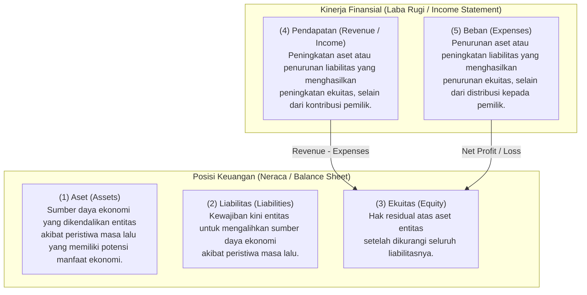
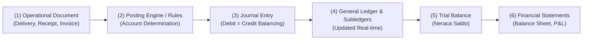

# Accounting Fundamentals

## Definition

**Akuntansi (Accounting)** adalah sistem informasi yang mengidentifikasi, mengukur, mencatat, dan mengomunikasikan peristiwa ekonomi (*economic events*) suatu organisasi kepada para pemangku kepentingan (*stakeholders*) untuk pengambilan keputusan bisnis dan pertanggungjawaban hukum.

Dalam sistem ERP, akuntansi berfungsi sebagai **lapisan agregasi dan validasi finansial terpusat** (*financial ledger hub*) yang menerima data dari seluruh transaksi operasional hulu—seperti pengadaan, persediaan, manufaktur, dan penjualan—lalu menerjemahkannya ke dalam bahasa moneter terstandarisasi.

---

## Purpose in Business & ERP

1. **Pengukuran Kinerja & Posisi Keuangan**: Mengetahui apakah operasional menghasilkan laba atau rugi serta memantau kekayaan bersih dan likuiditas entitas.
2. **Akuntabilitas & Kepatuhan Legal**: Memenuhi standar pelaporan keuangan resmi (IFRS / SAK) dan kewajiban perpajakan negara.
3. **Penyatuan Bahasa Bisnis (*Common Denominator*)**: Operasional mengukur dalam unit fisik (kg, meter, pcs, jam kerja), sementara akuntansi mengonversinya menjadi nilai moneter seragam (IDR, USD) sehingga dapat dikonsolidasi dan dibandingkan.

---

## The Core Accounting Equation (Persamaan Dasar Akuntansi)

Seluruh pencatatan akuntansi di dunia—dan seluruh algoritma buku besar ERP—berdiri di atas persamaan dasar:

$$\text{Assets (Aset)} = \text{Liabilities (Liabilitas)} + \text{Equity (Ekuitas)}$$

Jika diperluas dengan memasukkan aktivitas operasional periode berjalan:

$$\text{Assets} = \text{Liabilities} + \text{Equity}_{\text{awal}} + (\text{Revenue} - \text{Expenses})$$

Di mana:
$$\text{Net Profit (Laba Bersih)} = \text{Revenue (Pendapatan)} - \text{Expenses (Beban)}$$

Laba bersih pada akhir periode buku akan ditutup dan menambah **Laba Ditahan (*Retained Earnings*)** yang merupakan komponen Ekuitas di Neraca.

---

## Elemen Laporan Keuangan (Financial Elements)

Berdasarkan *IASB Conceptual Framework for Financial Reporting*, terdapat lima elemen dasar akuntansi:

---

## Recognition vs Measurement (Pengakuan vs Pengukuran)

Dalam ERP, dua konsep ini membedakan kapan suatu transaksi dicatat dan berapa angka yang dimasukkan:

1. **Recognition (Pengakuan)**: Proses menangkap suatu pos yang memenuhi definisi elemen akuntansi ke dalam neraca atau laporan laba rugi.
   * *Kriteria*: Pos tersebut memiliki probabilitas manfaat ekonomi masa depan yang mengalir ke/dari entitas, dan memiliki nilai atau biaya yang dapat diukur secara andal.
   * *Dalam ERP*: Ditentukan oleh *Posting Event* (misal: pengakuan piutang saat *Sales Invoice* diposting, bukan saat *Sales Order* dibuat).
2. **Measurement (Pengukuran)**: Penentuan jumlah moneter yang dicatat pada pos tersebut:
   * **Historical Cost (Biaya Historis)**: Nilai kas atau setara kas yang diserahkan saat perolehan (standar umum transaksi harian ERP).
   * **Fair Value (Nilai Wajar)**: Harga yang akan diterima untuk menjual suatu aset atau dibayarkan untuk mengalihkan liabilitas dalam transaksi teratur.
   * **Net Realizable Value (NRV)**: Estimasi harga jual dalam kegiatan usaha normal dikurangi estimasi biaya penyelesaian dan penjualan (digunakan pada pengujian persediaan - IAS 2).

---

## Accrual Basis vs Cash Basis

Prinsip paling fundamental yang harus dipahami dalam akuntansi ERP adalah **Asas Akrual (*Accrual Basis*)**:

| Dimensi | Asas Akrual (*Accrual Basis*) | Asas Kas (*Cash Basis*) |
|---|---|---|
| **Prinsip Utama** | Transaksi diakui saat peristiwa ekonomi terjadi dan penyerahan kendali terpenuhi, **tanpa memandang kapan uang kas diterima/dibayar**. | Transaksi baru diakui hanya saat uang kas secara fisik berpindah tangan (diterima atau keluar). |
| **Standar Akuntansi** | Wajib menurut IFRS / SAK (IAS 1). Menjadi standar seluruh ERP enterprise. | Hanya digunakan oleh usaha mikro atau pelaporan pajak sederhana tertentu. |
| **Pengakuan Pendapatan** | Diakui saat barang diserahkan atau jasa selesai dilakukan (*earned*). | Diakui saat uang diterima dari pelanggan. |
| **Pengakuan Beban** | Diakui saat manfaat telah dinikmati atau barang dikonsumsi (*incurred*). | Diakui saat tagihan dibayar via kas/bank. |
| **Akurasi Kinerja** | Memberikan gambaran profitabilitas dan liabilitas riil periode berjalan. | Rentan distorsi (laba terlihat besar hanya karena belum membayar tagihan vendor). |

> [!important]
> **Uang Masuk $\neq$ Pendapatan; Uang Keluar $\neq$ Beban.**
> * Menerima uang muka dari pelanggan sebesar Rp10.000.000 **bukanlah pendapatan**, melainkan Liabilitas (*Customer Advance / Unearned Revenue*) karena kewajiban menyerahkan barang belum ditunaikan.
> * Membeli mesin pabrik seharga Rp100.000.000 **bukanlah beban**, melainkan pertukaran aset (Kas berkurang, Aset Tetap bertambah). Biaya baru diakui bertahap melalui beban penyusutan (*depreciation*).

---

## ERP Accounting Automation Cycle

Sistem ERP mengotomatisasi siklus akuntansi melalui alur data yang saling mengunci:

1. **Operational Document**: Dokumen bisnis diterbitkan pada modul operasional (lihat [[00-fundamentals/documents-transactions-events|Documents, Transactions, and Events]]).
2. **Posting Engine**: ERP memetakan transaksi ke kode akun GL berdasarkan aturan konfigurasi kategori produk, grup vendor, atau grup pelanggan.
3. **Journal Entry**: Sistem menciptakan entitas debit dan kredit yang seimbang secara atomik (lihat [[02-accounting/journal-entry|Journal Entry]]).
4. **General Ledger & Subledgers**: Saldo akun buku besar dan rincian transaksi pembantu ter-update seketika (lihat [[02-accounting/general-ledger-and-subledger|General Ledger and Subledger]]).
5. **Trial Balance & Financial Statements**: Neraca saldo terkompilasi otomatis, siap untuk penyesuaian akhir periode dan penyajian laporan keuangan resmi (lihat [[02-accounting/financial-statements|Financial Statements]]).

---

## Related Concepts

* [[00-fundamentals/erp-fundamentals|ERP Fundamentals]] — Definisi centralized database dan modular integration.
* [[00-fundamentals/erp-architecture|ERP Architecture / Mental Model]] — Arsitektur data dari Master Data hingga pelaporan.
* [[02-accounting/debit-credit-and-double-entry|Debit, Credit, and Double-Entry]] — Mekanisme pencatatan berpasangan.
* [[02-accounting/chart-of-accounts|Chart of Accounts]] — Struktur bagan akun akuntansi.

---

## References

1. **IFRS Foundation**: *Conceptual Framework for Financial Reporting* (2018). URL: https://www.ifrs.org/issued-standards/list-of-standards/conceptual-framework/
2. **IFRS Foundation**: *IAS 1 Presentation of Financial Statements* (Accrual basis and financial elements). URL: https://www.ifrs.org/issued-standards/list-of-standards/ias-1-presentation-of-financial-statements/
3. **Weygandt, J. J., Kimmel, P. D., & Kieso, D. E.** (2019). *Financial Accounting* (IFRS edition). John Wiley & Sons.
4. **Microsoft Learn**: *Core accounting concepts and ledger setup in Dynamics 365 Finance*. URL: https://learn.microsoft.com/en-us/dynamics365/finance/general-ledger/
