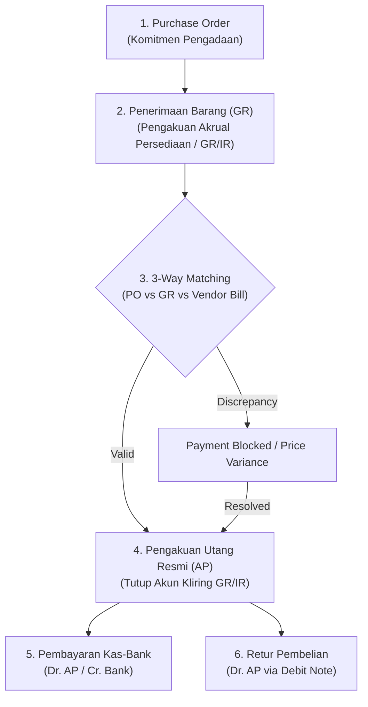

# Accounts Payable (AP) Accounting

## Definition

**Accounts Payable (Utang Usaha / AP)** adalah kewajiban kontraktual jangka pendek suatu entitas untuk menyerahkan kas atau aset keuangan lainnya kepada pemasok (*vendor/supplier*) yang timbul dari penerimaan barang atau jasa secara kredit dalam aktivitas operasional normal.

Menurut standar **IFRS 9 (*Financial Instruments*)**, utang usaha diklasifikasikan sebagai **Liabilitas Keuangan yang Diukur pada Biaya Perolehan Diamortisasi (*Financial Liability at Amortised Cost*)**.

Proses operasional utang usaha terintegrasi erat dengan siklus [[01-business-processes/procure-to-pay|Procure to Pay (P2P)]] dan dikelola secara rinci melalui [[02-accounting/general-ledger-and-subledger|AP Subledger]].

---

## The Accounts Payable Lifecycle

---

## Accounting Process & Journal Entries

### 1. Receiving Accrual: Penerimaan Barang Sebelum Faktur Tiba
Dalam sistem persediaan perpetual (*perpetual inventory*), ketika barang fisik tiba di gudang sebelum tagihan pemasok diterima, entitas wajib mencatat penambahan aset persediaan diimbangi dengan kewajiban akrual penerimaan barang (*Unbilled Receipt Liability* / IAS 37).

* **Jurnal (Contoh: Penerimaan 10 unit barang @ Rp700.000)**:

| Akun | Kategori | Debit (Rp) | Kredit (Rp) |
|---|---|---:|---:|
| Persediaan Barang Dagang | Asset | 7.000.000 | - |
| Utang Belum Difakturkan (*GR/IR Clearing*) | Liability | - | 7.000.000 |

> [!note] Pola Mekanisme Akun Kliring
> Istilah akun perantara ini bervariasi antar-ERP (*GR/IR Clearing* di SAP dan Dynamics 365, *Stock Received But Not Billed* di ERPNext, *Stock Interim Account* di Odoo). Esensi fungsinya sama: akun penyeimbang neraca agar aset persediaan tercatat tanpa mendahului pengakuan utang resmi pemasok di buku pembantu AP.

---

### 2. Vendor Bill Verification & AP Recognition (Pengakuan Utang Usaha)
Ketika tagihan resmi (*invoice*) dan faktur pajak masukan dari pemasok tiba, departemen akuntansi memvalidasi kecocokan 3-arah (*3-way matching*) antara PO, Goods Receipt, dan Vendor Bill.

* **Jurnal (Pengakuan Utang Resmi + PPN Masukan 11% = Rp770.000)**:

| Akun | Kategori | Debit (Rp) | Kredit (Rp) |
|---|---|---:|---:|
| Utang Belum Difakturkan (*GR/IR Clearing*) | Liability (Clear) | 7.000.000 | - |
| PPN Masukan (*VAT Input*) | Asset / Tax Receiv. | 770.000 | - |
| Utang Usaha (*Accounts Payable*) | Liability | - | 7.770.000 |

* **Dampak Buku Besar & Subledger**:
  * Akun penampung sementara *GR/IR Clearing* menjadi bersaldo **Nol**.
  * Saldo utang pemasok "PT Sumber Komponen" di **AP Subledger** bertambah sebesar Rp7.770.000 dengan jatuh tempo sesuai termin kredit (misal: Net 30 hari).

---

### 3. Price Variance Handling (Varians Harga Pembelian)
Jika pemasok menagih dengan harga yang berbeda dari kesepakatan awal pada PO (misal: harga PO Rp700.000/unit, namun harga faktur disetujui naik menjadi Rp720.000/unit untuk 10 unit = selisih Rp200.000):

* **Pada Sistem Biaya Standar (*Standard Costing*)**: Selisih harga dibebankan langsung ke akun varians laba rugi (*Purchase Price Variance / PPV*):

| Akun | Kategori | Debit (Rp) | Kredit (Rp) |
|---|---|---:|---:|
| Utang Belum Difakturkan (*GR/IR Clearing*) | Liability | 7.000.000 | - |
| Varians Harga Pembelian (*PPV Expense*) | Expense (P&L) | 200.000 | - |
| PPN Masukan (*VAT Input*) | Asset | 792.000 | - |
| Utang Usaha (*Accounts Payable*) | Liability | - | 7.992.000 |

* **Pada Sistem Biaya Rata-Rata Bergerak (*Moving Average / FIFO*)**: ERP dapat mengalokasikan selisih Rp200.000 langsung untuk menambah nilai tercatat persediaan di neraca (*inventory revaluation*).

---

### 4. Vendor Payment Disbursement (Pelunasan Pembayaran Utang)
Saat tagihan jatuh tempo dan pembayaran dieksekusi via transfer perbankan:

* **Jurnal (Pelunasan Penuh)**:

| Akun | Kategori | Debit (Rp) | Kredit (Rp) |
|---|---|---:|---:|
| Utang Usaha (*Accounts Payable*) | Liability | 7.770.000 | - |
| Bank Operasional | Asset | - | 7.770.000 |

* **Dampak Subledger**: Faktur pemasok ditutup statusnya menjadi *Paid*.

---

### 5. Purchase Discounts (Diskon Pelunasan Lebih Cepat)
Jika perusahaan memanfaatkan diskon pembayaran dini dari pemasok (misal: termin *2/10, Net 30*):
* Nilai Utang Dihapus: Rp7.770.000
* Diskon 2% atas DPP barang (2% $\times$ Rp7.000.000 = Rp140.000)
* Kas Dibayarkan: Rp7.630.000

| Akun | Kategori | Debit (Rp) | Kredit (Rp) |
|---|---|---:|---:|
| Utang Usaha (*Accounts Payable*) | Liability | 7.770.000 | - |
| Bank Operasional | Asset | - | 7.630.000 |
| Diskon Pembelian / Pengurang Biaya | Income / Contra Expense | - | 140.000 |

---

### 6. Purchase Return & Debit Note (Koreksi / Retur Pembelian)
Jika barang yang telah difakturkan dikembalikan ke pemasok:
* Debit: Utang Usaha (*Accounts Payable*) $\implies$ mengurangi utang di subledger pemasok.
* Kredit: Persediaan Barang Dagang $\implies$ mengeluarkan aset barang dari gudang.
* Kredit: PPN Masukan $\implies$ membatalkan klaim pajak masukan yang telah dicatat.

---

## AP Aging Analysis & Cash Flow Planning

Buku pembantu utang menyajikan laporan penuaan kewajiban (*AP Aging Report*) yang vital untuk manajemen likuiditas kas:

| Pemasok | Belum Jatuh Tempo | 1 - 30 Hari Lewat | 31 - 60 Hari Lewat | Total Utang |
|---|---:|---:|---:|---:|
| PT Sumber Komponen | Rp7.770.000 | - | - | Rp7.770.000 |
| CV Logistik Mandiri | Rp2.220.000 | - | - | Rp2.220.000 |
| PT Prima Kimia | - | Rp1.500.000 | - | Rp1.500.000 |
| **Total** | **Rp9.990.000** | **Rp1.500.000** | **-** | **Rp11.490.000** |

Data ini menjadi input langsung modul Treasury untuk membuat proposal pembayaran mingguan (*Payment Proposal*) agar perusahaan tidak terkena penalti denda keterlambatan atau pemutusan fasilitas kredit pasokan.

---

## Related Concepts

* [[01-business-processes/procure-to-pay|Procure to Pay (P2P)]] — Siklus pengadaan hulu-ke-hilir.
* [[00-fundamentals/cross-module-integration|Cross-Module Integration]] — Prinsip 3-way match dan akun perantara GR/IR.
* [[02-accounting/general-ledger-and-subledger|General Ledger and Subledger]] — Akun kontrol utang dan buku pembantu pemasok.

---

## References

1. **IFRS Foundation**: *IFRS 9 Financial Instruments - Financial Liabilities at Amortised Cost*. URL: https://www.ifrs.org/issued-standards/list-of-standards/ifrs-9-financial-instruments/
2. **IFRS Foundation**: *IAS 37 Provisions, Contingent Liabilities and Contingent Assets*. URL: https://www.ifrs.org/issued-standards/list-of-standards/ias-37-provisions-contingent-liabilities-and-contingent-assets/
3. **Microsoft Learn**: *Accounts payable overview and invoice matching in Dynamics 365 Finance*. URL: https://learn.microsoft.com/en-us/dynamics365/finance/accounts-payable/
4. **Frappe / ERPNext Documentation**: *Accounts Payable, Purchase Invoice, and Payment Entry*. URL: https://docs.frappe.io/erpnext/user/manual/en/accounts/accounts-payable
