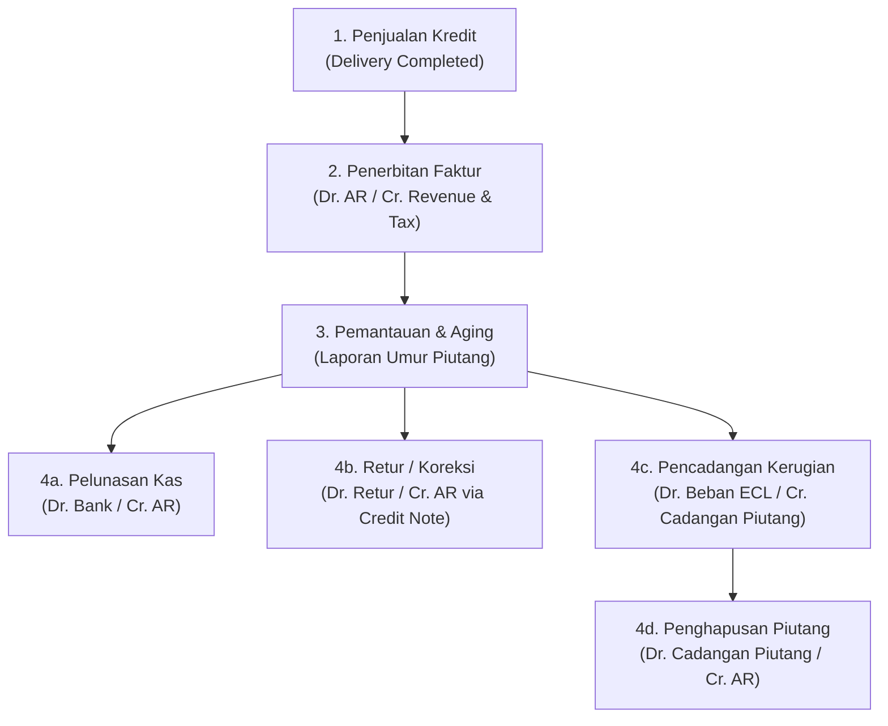

# Accounts Receivable (AR) Accounting

## Definition

**Accounts Receivable (Piutang Usaha / AR)** adalah hak klaim kontraktual suatu entitas atas penerimaan kas atau aset keuangan lainnya dari pelanggan yang timbul akibat penyerahan barang atau penyelesaian jasa secara kredit dalam kegiatan usaha normal.

Menurut standar **IFRS 9 (*Financial Instruments*)**, piutang usaha diklasifikasikan sebagai **Aset Keuangan yang Diukur pada Biaya Perolehan Diamortisasi (*Financial Asset at Amortised Cost*)** karena memenuhi uji arus kas kontraktual semata dari pokok dan bunga (*SPPI test*) serta dikelola dalam model bisnis untuk mengumpulkan arus kas kontraktual.

Siklus operasional penagihan piutang merupakan bagian integral dari alur [[01-business-processes/order-to-cash|Order to Cash (O2C)]] dan dikelola secara rinci pada [[02-accounting/general-ledger-and-subledger|AR Subledger]].

---

## The Accounts Receivable Lifecycle

---

## Accounting Process & Journal Entries

### 1. Invoicing & Recognition (Pengakuan Piutang Usaha)
* **Aturan Pengakuan**: Piutang diakui ketika entitas telah memenuhi kewajiban pelaksanaan (*performance obligation*) sesuai **IFRS 15** dan memiliki hak tanpa syarat atas imbalan dari pelanggan.
* **Jurnal (Contoh: Penjualan 10 unit barang @ Rp1.000.000, PPN 11% = Rp1.100.000)**:

| Akun | Kategori | Debit (Rp) | Kredit (Rp) |
|---|---|---:|---:|
| Piutang Usaha (*Accounts Receivable*) | Asset | 11.100.000 | - |
| Pendapatan Penjualan (*Sales Revenue*) | Revenue | - | 10.000.000 |
| Utang PPN Keluaran (*VAT Output*) | Liability | - | 1.100.000 |

* **Dampak Subledger**: Saldo piutang pelanggan "PT Maju Bersama" bertambah sebesar Rp11.100.000 dengan jatuh tempo 30 hari.

---

### 2. Cash Receipt & Settlement (Penerimaan Pembayaran & Rekonsiliasi)
* **Aturan Pengakuan**: Saat dana efektif diterima di rekening bank, hak tagih hapus.
* **Jurnal (Pelunasan Penuh)**:

| Akun | Kategori | Debit (Rp) | Kredit (Rp) |
|---|---|---:|---:|
| Bank Operasional | Asset | 11.100.000 | - |
| Piutang Usaha (*Accounts Receivable*) | Asset | - | 11.100.000 |

* **Dampak Subledger**: Faktur `#INV-001` ditandai sebagai *Paid/Cleared*. Plafon kredit pelanggan kembali pulih.

---

### 3. Sales Discounts (Potongan Pelunasan Dini)
Jika pelanggan membayar lebih cepat dan memanfaatkan syarat pembayaran (misal: termin *2/10, Net 30* di mana pelanggan berhak atas diskon 2% jika melunasi dalam 10 hari):
* Nilai Piutang: Rp11.100.000 (Dasar pengenaan diskon atas nilai barang Rp10.000.000 = diskon Rp200.000).
* Kas Diterima: Rp10.900.000.

| Akun | Kategori | Debit (Rp) | Kredit (Rp) |
|---|---|---:|---:|
| Bank Operasional | Asset | 10.900.000 | - |
| Potongan Penjualan (*Sales Cash Discount*) | Contra Revenue | 200.000 | - |
| Piutang Usaha (*Accounts Receivable*) | Asset | - | 11.100.000 |

---

### 4. Impairment & Expected Credit Loss / ECL (Pencadangan Kerugian Piutang)
Standar **IFRS 9** mewajibkan model kerugian kredit ekspektasian (*Expected Credit Loss / ECL*), bukan model kerugian yang telah terjadi (*incurred loss model*). Entitas harus mencadangkan potensi gagal bayar sejak piutang timbul berdasarkan matriks provisi umur piutang (*provision matrix*):

* **Jurnal Pembentukan Cadangan (Misal dicadangkan Rp500.000 pada akhir tahun)**:

| Akun | Kategori | Debit (Rp) | Kredit (Rp) |
|---|---|---:|---:|
| Beban Kerugian Penurunan Nilai Piutang (*ECL Expense*) | Expense (P&L) | 500.000 | - |
| Cadangan Penurunan Nilai Piutang (*Allowance for ECL*) | Contra Asset (Neraca) | - | 500.000 |

*Di Neraca, piutang dilaporkan sebesar nilai realisasi bersih (*Net Realizable Value*): Rp11.100.000 - Rp500.000 = Rp10.600.000.*

---

### 5. Bad Debt Write-Off (Penghapusan Piutang Tak Tertagih)
Jika pelanggan dinyatakan bangkrut secara hukum dan piutang dipastikan tidak tertagih:

| Akun | Kategori | Debit (Rp) | Kredit (Rp) |
|---|---|---:|---:|
| Cadangan Penurunan Nilai Piutang (*Allowance for ECL*) | Contra Asset | 500.000 | - |
| Piutang Usaha (*Accounts Receivable*) | Asset | - | 500.000 |

*Penghapusan fisik ini tidak memengaruhi Laporan Laba Rugi pada saat eksekusi karena beban sudah diakui sebelumnya pada saat pencadangan.*

---

## Aging Analysis (Analisis Umur Piutang)

ERP secara otomatis mengelompokkan saldo piutang yang belum terbayar ke dalam rentang waktu (*aging buckets*):

| Pelanggan | Saldo Belum Jatuh Tempo | 1 - 30 Hari Lewat | 31 - 60 Hari Lewat | > 90 Hari Lewat | Total Piutang |
|---|---:|---:|---:|---:|---:|
| PT Maju Bersama | Rp11.100.000 | - | - | - | Rp11.100.000 |
| CV Sejahtera | - | Rp5.000.000 | - | - | Rp5.000.000 |
| Toko Abadi Jaya | - | - | Rp2.000.000 | Rp3.000.000 | Rp5.000.000 |
| **Total** | **Rp11.100.000** | **Rp5.000.000** | **Rp2.000.000** | **Rp3.000.000** | **Rp21.100.000** |

Laporan ini digunakan oleh bagian penagihan (*Collection Team*) untuk memprioritaskan tindakan penagihan dan oleh auditor untuk menguji kecukupan nilai cadangan kerugian piutang (*allowance balance*).

---

## Variasi Kebijakan Pengakuan & Waktu Transaksi

Timing timbulnya piutang di ERP sangat bergantung pada kebijakan bisnis (*Policy-Dependent*):
1. **Invoice on Delivery (Standar Manufaktur & Distribusi)**: Piutang baru diakui saat barang diserahkan ke kurir / pelanggan (*Delivery Order Posted*).
2. **Prepayment / Advance (Uang Muka)**: Pembayaran diminta sebelum pesanan diproses. Kas masuk dicatat sebagai kewajiban (*Customer Advance / Unearned Revenue*), dan belum diakui sebagai piutang maupun pendapatan.
3. **Proforma Invoice**: Bukan dokumen akuntansi; hanya faktur estimasi untuk tujuan bea cukai atau permintaan transfer, **tidak menghasilkan jurnal piutang**.

---

## Related Concepts

* [[01-business-processes/order-to-cash|Order to Cash (O2C)]] — Alur bisnis penjualan hulu-ke-hilir.
* [[02-accounting/general-ledger-and-subledger|General Ledger and Subledger]] — Akun kontrol piutang dan buku pembantu pelanggan.
* [[02-accounting/revenue-and-expense|Revenue and Expense Accounting]] — Standar pengakuan pendapatan IFRS 15.

---

## References

1. **IFRS Foundation**: *IFRS 9 Financial Instruments - Classification and Measurement of Financial Assets, Impairment (ECL)*. URL: https://www.ifrs.org/issued-standards/list-of-standards/ifrs-9-financial-instruments/
2. **IFRS Foundation**: *IFRS 15 Revenue from Contracts with Customers*. URL: https://www.ifrs.org/issued-standards/list-of-standards/ifrs-15-revenue-from-contracts-with-customers/
3. **Microsoft Learn**: *Credit and collections overview in Dynamics 365 Finance*. URL: https://learn.microsoft.com/en-us/dynamics365/finance/accounts-receivable/
4. **Frappe / ERPNext Documentation**: *Accounts Receivable and Payment Reconciliation*. URL: https://docs.frappe.io/erpnext/user/manual/en/accounts/accounts-receivable
