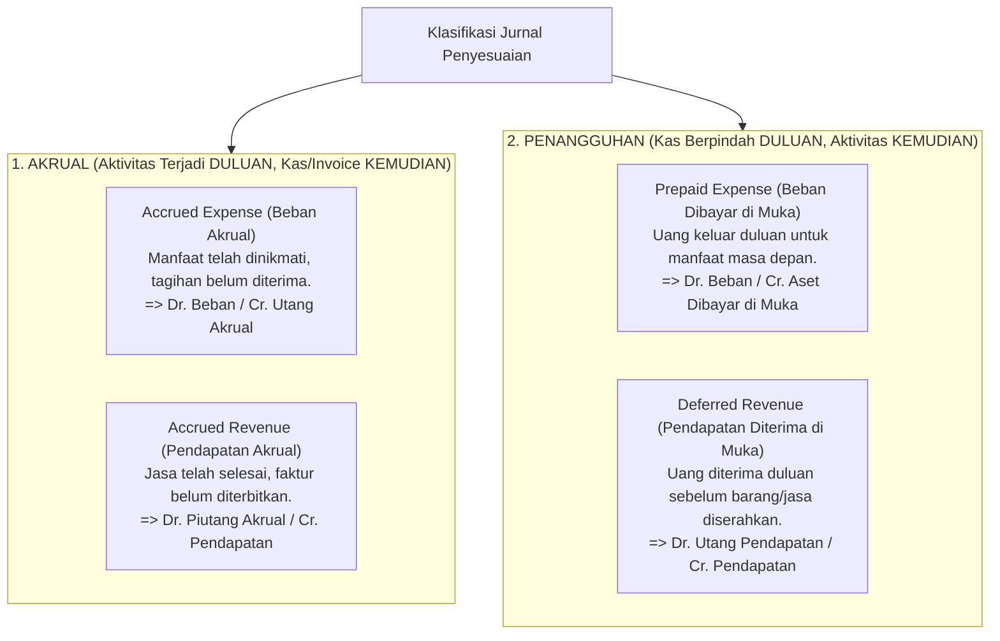
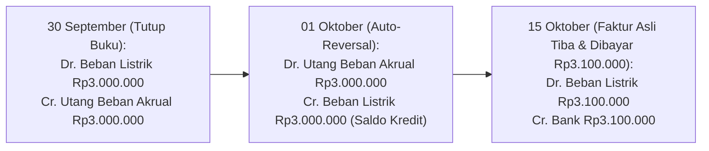

# Accrual and Adjusting Entries

## Definition

**Adjusting Entries (Ayat Jurnal Penyesuaian)** adalah jurnal akuntansi yang dibuat pada akhir periode akuntansi (bulanan atau tahunan) untuk memutakhirkan saldo akun-akun di dalam buku besar (*General Ledger*) agar mencerminkan pendapatan yang telah benar-benar diperoleh (*earned*) dan beban yang telah benar-benar terjadi (*incurred*) sesuai dengan **Asas Akrual (*Accrual Basis*)** dan **Prinsip Penandingan (*Matching Principle*)**.

Jurnal penyesuaian menjembatani perbedaan waktu yang tak terhindarkan antara terjadinya peristiwa bisnis riil, penerbitan dokumen tagihan (*invoice*), pengakuan akuntansi, dan penyelesaian pembayaran kas (*cash settlement*).

---

## Empat Kategori Pokok Jurnal Penyesuaian

Seluruh jurnal penyesuaian dapat dikelompokkan ke dalam dua kelompok besar: **Akrual (*Accruals*)** dan **Penangguhan (*Deferrals*)**:

---

## Analisis 4 Lapisan Waktu Transaksi

Salah satu sumber kesalahan fatal pemula adalah menganggap tanggal invoice selalu sama dengan tanggal pengakuan akuntansi. ERP memisahkan empat tahapan waktu:

$$\text{1. Business Event} \neq \text{2. Invoice Issue} \neq \text{3. Accounting Recognition} \neq \text{4. Cash Settlement}$$

* **Contoh Kasus**:
  1. *Business Event (25 September)*: Teknisi AC memperbaiki server kantor hingga selesai berfungsi.
  2. *Accounting Recognition (30 September - Akhir Bulan)*: Karena jasa telah selesai dinikmati, beban wajib diakui bulan September melalui **Jurnal Beban Akrual**.
  3. *Invoice Issue (10 Oktober)*: Vendor AC baru mengirimkan lembar tagihan fisik.
  4. *Cash Settlement (25 Oktober)*: Perusahaan mentransfer pembayaran via bank.

---

## Jurnal Akuntansi Rinci per Kategori

### 1. Accrued Expense (Beban Akrual / Utang Beban)
* **Kasus**: Beban bunga pinjaman bank bulan September sebesar Rp4.000.000 baru akan didebit oleh bank pada tanggal 10 Oktober.
* **Jurnal Penyesuaian (30 September)**:

| Akun | Kategori | Debit (Rp) | Kredit (Rp) |
|---|---|---:|---:|
| Beban Bunga Pinjaman (*Interest Expense*) | Expense (P&L) | 4.000.000 | - |
| Utang Bunga Akrual (*Interest Payable*) | Liability (Neraca) | - | 4.000.000 |

---

### 2. Accrued Revenue (Pendapatan Akrual / Piutang Pendapatan)
* **Kasus**: Perusahaan konsultan telah menyelesaikan audit sistem senilai Rp15.000.000 pada tanggal 28 September, namun faktur tagihan resmi baru dijadwalkan terbit minggu pertama Oktober.
* **Jurnal Penyesuaian (30 September)**:

| Akun | Kategori | Debit (Rp) | Kredit (Rp) |
|---|---|---:|---:|
| Piutang Pendapatan Akrual (*Unbilled Receivables*) | Asset (Neraca) | 15.000.000 | - |
| Pendapatan Jasa Konsultasi (*Service Revenue*) | Revenue (P&L) | - | 15.000.000 |

---

### 3. Prepaid Expense Amortization (Amortisasi Beban Dibayar di Muka)
* **Kasus**: Membayar premi asuransi kebakaran gedung untuk 1 tahun sebesar Rp12.000.000 pada awal bulan (dicatat di aset `Asuransi Dibayar di Muka`). Pada akhir bulan pertama, porsi 1 bulan (Rp1.000.000) telah kedaluwarsa menjadi beban.
* **Jurnal Penyesuaian Akhir Bulan**:

| Akun | Kategori | Debit (Rp) | Kredit (Rp) |
|---|---|---:|---:|
| Beban Asuransi (*Insurance Expense*) | Expense (P&L) | 1.000.000 | - |
| Asuransi Dibayar di Muka (*Prepaid Insurance*) | Asset (Neraca) | - | 1.000.000 |

---

### 4. Deferred Revenue Recognition (Realisasi Pendapatan Diterima di Muka)
* **Kasus**: Perusahaan menerima uang muka pemeliharaan mesin sebesar Rp6.000.000 untuk durasi 6 bulan (dicatat di liabilitas `Pendapatan Diterima di Muka`). Pada akhir bulan pertama, jasa pemeliharaan 1 bulan telah selesai dikerjakan (Rp1.000.000).
* **Jurnal Penyesuaian Akhir Bulan**:

| Akun | Kategori | Debit (Rp) | Kredit (Rp) |
|---|---|---:|---:|
| Pendapatan Diterima di Muka (*Deferred Revenue*) | Liability (Neraca) | 1.000.000 | - |
| Pendapatan Jasa Pemeliharaan (*Maintenance Revenue*) | Revenue (P&L) | - | 1.000.000 |

---

## Reversing Entries (Jurnal Pembalik Otomatis Awal Periode Baru)

Dalam sistem ERP, beberapa jenis jurnal akrual dilengkapi fitur **Auto-Reversal (Pembalik Otomatis)** pada hari pertama periode berikutnya (tanggal 1 bulan baru):

### Mengapa Reversing Entry Sangat Berguna?
Tanpa pembalik otomatis, staf bagian pembukuan harian yang menerima tagihan listrik pada tanggal 15 Oktober harus mengingat-ingat apakah tagihan ini sudah diakrualkan di akhir September atau belum, dan harus memecah jurnalnya menjadi debit utang akrual.

Dengan *Auto-Reversal*:
* Beban listrik di Oktober otomatis bersaldo kredit Rp3.000.000 pada tanggal 1 Oktober.
* Saat faktur riil tiba tanggal 15 Oktober sebesar Rp3.100.000, staf cukup menjurnal normal (*Debit Beban Listrik Rp3.100.000, Kredit Bank*).
* Saldo bersih beban listrik di bulan Oktober otomatis menjadi Rp100.000 (selisih lebih dari estimasi akrual), **tanpa perlu intervensi manual yang rumit**.

---

## Related Concepts

* [[02-accounting/accounting-fundamentals|Accounting Fundamentals]] — Asas akrual dan pengukuran laba rugi.
* [[02-accounting/revenue-and-expense|Revenue and Expense Accounting]] — Model pengakuan pendapatan IFRS 15.
* [[01-business-processes/record-to-report|Record to Report (R2R)]] — Posisi jurnal penyesuaian dalam siklus penutupan buku.

---

## References

1. **IFRS Foundation**: *IAS 1 Presentation of Financial Statements (Accrual Basis of Accounting)*. URL: https://www.ifrs.org/issued-standards/list-of-standards/ias-1-presentation-of-financial-statements/
2. **Kieso, D. E., Weygandt, J. J., & Warfield, T. D.** (2020). *Intermediate Accounting* (Chapter: Accrual Accounting Concepts and Adjusting Process). Wiley.
3. **Microsoft Learn**: *Auto-reversing journal entries in Dynamics 365 Finance*. URL: https://learn.microsoft.com/en-us/dynamics365/finance/general-ledger/general-journal-processing
4. **Frappe / ERPNext Documentation**: *Period Closing Voucher and Auto-Repeating Journal Entries*. URL: https://docs.frappe.io/erpnext/user/manual/en/accounts/period-closing-voucher
