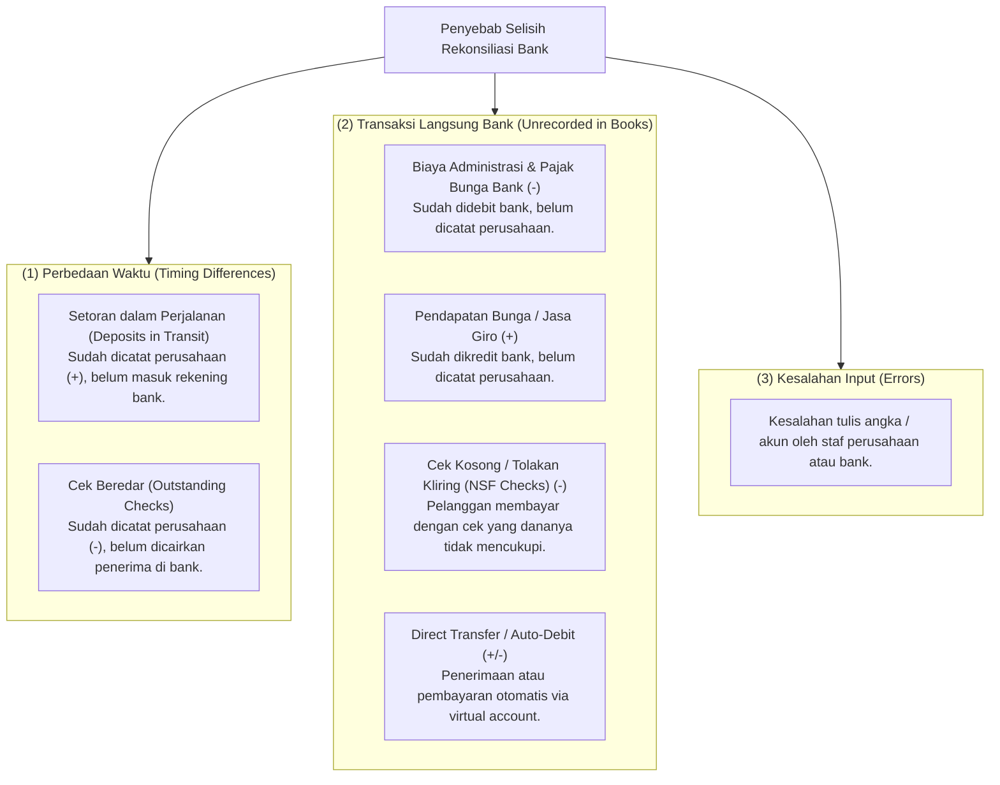
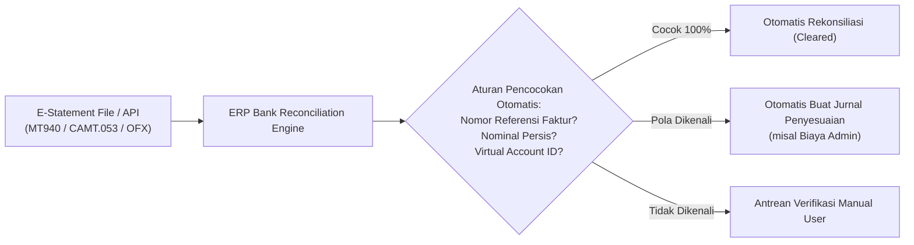

# Bank Reconciliation

## Definition

**Bank Reconciliation (Rekonsiliasi Bank)** adalah proses verifikasi dan pencocokan matematis antara saldo kas/bank yang tercatat di dalam buku besar akuntansi perusahaan (*Book Balance / Cash Book*) dengan saldo rekening koran resmi yang diterbitkan oleh pihak perbankan (*Bank Statement Balance*) pada titik tanggal penutupan yang sama.

Tujuan utama rekonsiliasi adalah mendeteksi selisih waktu (*timing differences*), membukukan transaksi perbankan yang belum tercatat di sistem (*unrecorded transactions*), mencegah transaksi fiktif (*fraud prevention*), serta memastikan bahwa saldo kas yang disajikan pada Neraca mencerminkan nilai kas riil yang dapat digunakan entitas.

Proses ini merupakan tahapan kendali krusial dalam siklus [[01-business-processes/record-to-report|Record to Report (R2R)]].

---

## Causes of Discrepancies (Penyebab Selisih Bank vs Buku)

Perbedaan saldo antara catatan buku perusahaan dan rekening koran bank hampir selalu terjadi secara alami akibat:

---

## The Reconciliation Model & Formulation

Untuk mencapai saldo yang benar (*Adjusted True Balance*), kedua belah pihak diselaraskan menggunakan format standar:

$$\mathbf{Adjusted\ Bank\ Balance \equiv Adjusted\ Book\ Balance}$$

### 1. Sisi Rekening Koran Bank:
$$\begin{aligned}
&\text{Saldo Akhir menurut Rekening Koran Bank} \\
&+ \text{Setoran dalam Perjalanan (Deposits in Transit)} \\
&- \text{Cek Beredar (Outstanding Checks)} \\
&\pm \text{Koreksi Kesalahan Bank} \\
&= \mathbf{Saldo\ Kas\ Bank\ yang\ Benar\ (True\ Balance)}
\end{aligned}$$

### 2. Sisi Buku Besar Perusahaan:
$$\begin{aligned}
&\text{Saldo Akhir menurut Buku Besar GL Perusahaan} \\
&+ \text{Pendapatan Bunga Bank / Jasa Giro} \\
&+ \text{Penerimaan Transfer Langsung yang Belum Dicatat} \\
&- \text{Biaya Administrasi Bank} \\
&- \text{Cek Kosong Pelanggan (NSF Checks)} \\
&\pm \text{Koreksi Kesalahan Buku Internal} \\
&= \mathbf{Saldo\ Kas\ Buku\ yang\ Benar\ (True\ Balance)}
\end{aligned}$$

---

## Jurnal Penyesuaian Hasil Rekonsiliasi Bank

> [!important] Aturan Jurnal Rekonsiliasi:
> **Hanya pos-pos pada SISI BUKU BESAR PERUSAHAAN yang membutuhkan jurnal penyesuaian di ERP.**
> Pos di sisi rekening koran bank (*Deposits in Transit* dan *Outstanding Checks*) **TIDAK memerlukan jurnal**, karena transaksi tersebut sudah pernah dicatat di buku perusahaan dan hanya tinggal menunggu waktu kliring oleh pihak perbankan.

### Contoh Kasus Rekonsiliasi
Pada tanggal 30 September, buku besar mencatat saldo bank sebesar Rp100.000.000. Rekening koran bank menunjukkan saldo Rp105.000.000. Ditemukan:
1. Bank mengkredit pendapatan bunga giro sebesar Rp500.000.
2. Bank mendebit biaya administrasi bulanan sebesar Rp150.000.
3. Cek dari pelanggan PT ABC sebesar Rp2.000.000 ternyata ditolak bank karena saldo tidak cukup (*NSF Check*).

* **Jurnal Penyesuaian di ERP**:

| No | Keterangan Transaksi | Jurnal Debit | Jurnal Kredit |
|:---:|---|---|---|
| 1 | Pengakuan Pendapatan Bunga | Bank: Rp500.000 | Pendapatan Bunga: Rp500.000 |
| 2 | Pembebanan Biaya Bank | Beban Administrasi Bank: Rp150.000 | Bank: Rp150.000 |
| 3 | Pengaktifan Kembali Piutang (Cek Kosong) | Piutang Usaha (PT ABC): Rp2.000.000 | Bank: Rp2.000.000 |

*Setelah ketiga jurnal di atas diposting, saldo buku kas bank perusahaan berubah menjadi Rp98.350.000, yang akan sama persis dengan saldo rekening koran bank setelah memperhitungkan cek beredar.*

---

## Automated Bank Feeds & Rule-Based Matching in Modern ERP

Sistem ERP enterprise modern telah menggantikan pencocokan manual menggunakan lembar kertas dengan otomatisasi elektronik:

---

## Related Concepts

* [[01-business-processes/record-to-report|Record to Report (R2R)]] — Posisi rekonsiliasi bank dalam alur tutup buku periodik.
* [[02-accounting/general-ledger-and-subledger|General Ledger and Subledger]] — Akun kas bank di GL.
* [[02-accounting/accounts-receivable|Accounts Receivable]] — Pembatalan pelunasan piutang akibat cek kosong (*NSF*).

---

## References

1. **Weygandt, J. J., Kimmel, P. D., & Kieso, D. E.** (2019). *Financial Accounting* (Chapter: Fraud, Internal Control, and Cash). John Wiley & Sons.
2. **Microsoft Learn**: *Bank reconciliation overview and advanced bank reconciliation in Dynamics 365 Finance*. URL: https://learn.microsoft.com/en-us/dynamics365/finance/cash-bank-management/bank-reconciliation-overview
3. **Frappe / ERPNext Documentation**: *Bank Reconciliation Tool and Automated Bank Clearance*. URL: https://docs.frappe.io/erpnext/user/manual/en/accounts/bank-reconciliation
4. **Odoo Documentation**: *Bank Reconciliation Process and Models*. URL: https://www.odoo.com/documentation/17.0/applications/finance/accounting/bank/reconciliation.html
