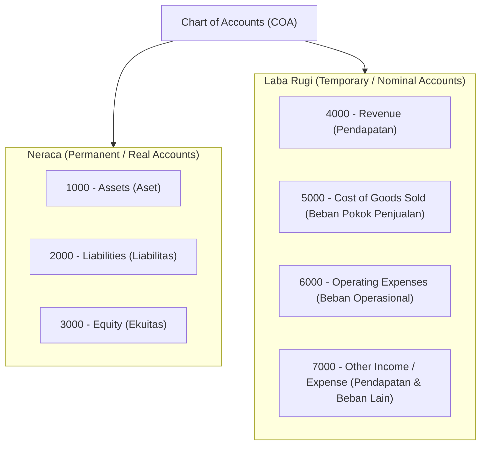
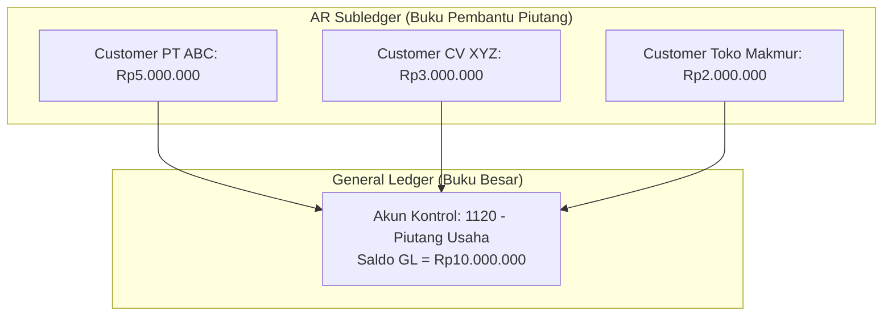
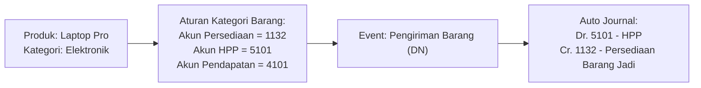

# Chart of Accounts (COA)

## Definition

**Chart of Accounts (Bagan Akun / COA)** adalah daftar terstruktur dari seluruh akun pembukuan yang digunakan oleh suatu organisasi untuk mengidentifikasi, mengelompokkan, mencatat, dan melaporkan transaksi keuangan di dalam buku besar umum (*General Ledger*).

Dalam arsitektur ERP, COA bukan sekadar daftar kode statis, melainkan **fondasi penentu arah (*routing map*) dari mesin akuntansi otomatis**. Setiap kali transaksi bisnis disahkan pada modul operasional, sistem merujuk pada konfigurasi pemetaan akun (*Account Determination*) untuk memutuskan akun COA mana yang harus didebit dan dikredit.

---

## Account Classification & Standard Numbering Architecture

Untuk memudahkan pembacaan dan penyusunan laporan keuangan otomatis, akun-akun di dalam COA dikelompokkan ke dalam kategori standar menggunakan hierarki penomoran desimal:



### Konvensi Penomoran Akun

| Blok Nomor | Kelompok Akun | Sifat Akun | Saldo Normal | Penjelasan |
|:---:|---|---|:---:|---|
| **1000 - 1999** | **Assets** | Permanen (Neraca) | **Debit** | Kas, piutang usaha, persediaan, aset tetap. |
| **2000 - 2999** | **Liabilities** | Permanen (Neraca) | **Kredit** | Utang usaha, utang pajak, utang bank, beban akrual. |
| **3000 - 3999** | **Equity** | Permanen (Neraca) | **Kredit** | Modal saham, tambahan modal disetor, laba ditahan. |
| **4000 - 4999** | **Revenue** | Nominal (Laba Rugi) | **Kredit** | Pendapatan penjualan barang, pendapatan jasa. |
| **5000 - 5999** | **COGS** | Nominal (Laba Rugi) | **Debit** | Beban pokok produksi, HPP barang dagang. |
| **6000 - 6999** | **Expenses** | Nominal (Laba Rugi) | **Debit** | Beban gaji, sewa, listrik, utilitas, penyusutan. |
| **7000 - 7999** | **Other Items** | Nominal (Laba Rugi) | Bervariasi | Laba/rugi selisih kurs valas, bunga bank. |

---

## Struktur Pohon: Parent Accounts vs Posting Accounts

ERP modern mengorganisasi COA dalam bentuk pohon hierarki (*hierarchical tree structure*):

```text
1000 - Aset (Group / Parent Account)
  ├── 1100 - Aset Lancar (Group / Parent Account)
  │     ├── 1110 - Kas dan Bank (Group / Parent Account)
  │     │     ├── 1111 - Kas Kecil Operasional (Posting Account - Child)
  │     │     └── 1112 - Rekening Bank Utama (Posting Account - Child)
  │     ├── 1120 - Piutang Usaha (Control Account - Child)
  │     └── 1130 - Persediaan (Group / Parent Account)
  │           ├── 1131 - Persediaan Bahan Baku (Posting Account - Child)
  │           └── 1132 - Persediaan Barang Jadi (Posting Account - Child)
  └── 1200 - Aset Tidak Lancar (Group / Parent Account)
        ├── 1210 - Peralatan Kantor (Posting Account - Child)
        └── 1219 - Akumulasi Penyusutan Peralatan (Posting Account - Child / Contra)
```

1. **Group / Parent Account (Akun Header)**:
   * Hanya berfungsi sebagai pengelompok data untuk meringkas laporan (*aggregation header*).
   * **Tidak dapat menerima jurnal transaksi langsung (*Non-Posting Account*)**.
2. **Posting / Child Account (Akun Transaksi)**:
   * Akun tingkat terbawah (*leaf node*) yang menampung catatan jurnal debit dan kredit riil.

---

## Control Accounts (Akun Kontrol / Rekonsiliasi)

Salah satu kesalahan paling fatal dalam merancang COA di sistem komputer non-ERP adalah membuat akun GL terpisah untuk setiap pelanggan atau pemasok (misal: membuat akun *1121 - Piutang Toko A*, *1122 - Piutang Toko B*). Hal ini menyebabkan **ledakan jumlah akun (*COA explosion*)** yang merusak efisiensi pelaporan.

Sistem ERP mengatasi hal ini dengan menggunakan **Control Account (Akun Kontrol)**:



* Di dalam COA, perusahaan hanya memiliki **satu akun buku besar** bernama `1120 - Piutang Usaha`.
* Rincian piutang per pelanggan dikelola di dalam **Buku Pembantu (*AR Subledger*)**.
* Akun kontrol ini dikonfigurasi agar **hanya menerima transaksi otomatis dari modul operasional (*locked for manual direct entry*)** demi mencegah terjadinya ketidaksesuaian saldo antara GL dan buku pembantu.

Konsep serupa berlaku untuk `2110 - Utang Usaha` (menghubungkan seluruh pemasok) dan `1130 - Persediaan` (menghubungkan seluruh stok barang). Pembahasan detail terdapat di [[02-accounting/general-ledger-and-subledger|General Ledger and Subledger]].

---

## Temporary vs Permanent Accounts & Retained Earnings

COA memisahkan akun berdasarkan dampaknya saat tutup buku tahunan (*Year-End Closing*):

1. **Permanent Accounts (Akun Riil / Neraca)**:
   * Meliputi: Aset, Liabilitas, dan Ekuitas.
   * Saldo akhir akun permanen pada tanggal 31 Desember akan otomatis menjadi saldo awal pada tanggal 1 Januari tahun berikutnya.
2. **Temporary Accounts (Akun Nominal / Laba Rugi)**:
   * Meliputi: Pendapatan dan Beban.
   * Akun nominal hanya mengukur kinerja selama satu periode fiskal berjalan.
   * Saat proses tutup buku tahunan, saldo seluruh akun nominal dikosongkan (di-reset ke nol), dan selisih bersihnya (*Net Income*) dipindahkan ke akun **Laba Ditahan (*Retained Earnings*)** di kelompok Ekuitas Neraca (lihat [[02-accounting/period-end-closing|Period-End Closing]]).

---

## Account Determination: Menghubungkan Operasional ke COA

ERP menggunakan aturan pemetaan akun (*Account Mapping / Determination Rules*) sehingga pengguna di gudang atau kasir tidak perlu menghafal kode akun akuntansi:



---

## Prinsip Desain COA yang Baik untuk ERP

1. **Gunakan Digit Standar dan Terstruktur**: Gunakan 4 hingga 6 digit penomoran (misal: 4 digit untuk entitas menengah, 6 digit untuk grup usaha besar) agar menyisakan ruang untuk penambahan akun di masa depan.
2. **Jangan Masukkan Dimensi Organisasi ke dalam COA**:
   * *Buruk*: Membuat akun `6101 - Beban Gaji Cabang Jakarta`, `6102 - Beban Gaji Cabang Surabaya`.
   * *Benar*: Buat satu akun `6100 - Beban Gaji`, lalu gunakan **Accounting Dimensions** (lihat [[00-fundamentals/organizational-structure|Organizational Structure]]) untuk memfilter beban per Cabang atau Departemen.
3. **Standarisasi Lintas Entitas**: Dalam grup multi-perusahaan, gunakan struktur bagan akun standar (*Global Template COA*) untuk mempermudah konsolidasi laporan keuangan.

---

## Related Concepts

* [[00-fundamentals/master-data-vs-transaction-data|Master Data vs Transaction Data]] — COA sebagai master data inti finansial.
* [[00-fundamentals/organizational-structure|Organizational Structure]] — Dimensi akuntansi dan pemisahan badan hukum.
* [[02-accounting/general-ledger-and-subledger|General Ledger and Subledger]] — Akun kontrol dan buku pembantu.
* [[02-accounting/period-end-closing|Period-End Closing]] — Penutupan akun nominal ke Retained Earnings.

---

## References

1. **IFRS Foundation**: *IAS 1 Presentation of Financial Statements - Structure and Content of Financial Statements*. URL: https://www.ifrs.org/issued-standards/list-of-standards/ias-1-presentation-of-financial-statements/
2. **AICPA**: *Audit and Accounting Guide: General Ledger and Chart of Accounts Structure*.
3. **Microsoft Learn**: *Plan your chart of accounts in Dynamics 365 Finance*. URL: https://learn.microsoft.com/en-us/dynamics365/finance/general-ledger/plan-chart-of-accounts
4. **Frappe / ERPNext Documentation**: *Chart of Accounts Management and Standard Templates*. URL: https://docs.frappe.io/erpnext/user/manual/en/accounts/chart-of-accounts
