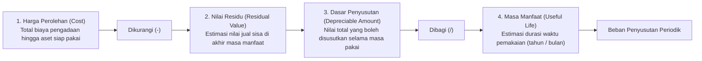

# Depreciation and Amortization

## Definition

Dalam akuntansi keuangan, alokasi biaya aset jangka panjang dibagi berdasarkan wujud fisiknya:

1. **Depreciation (Penyusutan / Depresiasi)**: Alokasi sistematis jumlah tersusutkan dari **Aset Tetap Berwujud (*Property, Plant, and Equipment / PPE*)** selama masa manfaatnya, diatur di bawah standar **IAS 16**. Contoh: gedung, mesin pabrik, kendaraan operasional, komputer kantor.
2. **Amortization (Amortisasi)**: Alokasi sistematis jumlah tersusutkan dari **Aset Tidak Berwujud (*Intangible Assets*)** yang memiliki masa manfaat terbatas, diatur di bawah standar **IAS 38**. Contoh: hak paten, lisensi perangkat lunak, hak cipta, merek dagang terdaftar.

Depresiasi dan amortisasi **bukanlah proses penilaian kembali (*valuation*) pasar**, melainkan proses **alokasi biaya perolehan (*cost allocation*)** agar pendapatan yang dihasilkan aset tersebut ditandingkan (*matched*) secara adil dengan beban pemakaian aset di setiap periode akuntansi.

---

## Core Variables & Mathematical Formulation

Perhitungan penyusutan didasarkan pada empat variabel kunci:

$$\mathbf{Depreciable\ Amount = Cost - Residual\ Value}$$

$$\mathbf{Carrying\ Amount\ (Net\ Book\ Value) = Cost - Accumulated\ Depreciation}$$

---

## Depreciation Methods (Metode Penyusutan di Bawah IFRS)

Standar **IAS 16 Paragraf 60** menetapkan bahwa:
> *Metode penyusutan yang digunakan harus mencerminkan pola konsumsi entitas atas manfaat ekonomi masa depan yang diharapkan dari aset tersebut.*

Tiga metode utama yang didukung oleh sistem ERP:

### 1. Straight-Line Method (Metode Garis Lurus)
Metode paling umum yang menghasilkan beban penyusutan konstan setiap periode selama masa manfaat aset:

$$\text{Penyusutan Tahunan} = \frac{\text{Cost} - \text{Residual Value}}{\text{Useful Life (Tahun)}}$$

* **Karakteristik**: Sangat cocok untuk aset yang depresiasinya dipicu oleh berjalannya waktu kalender (misal: gedung kantor, furniture, peralatan IT).

---

### 2. Diminishing / Reducing Balance Method (Metode Saldo Menurun)
Menghasilkan beban penyusutan yang lebih tinggi pada tahun-tahun awal masa pakai aset, dan secara bertahap menurun pada tahun-tahun berikutnya:

$$\text{Penyusutan} = \text{Carrying Amount (Nilai Buku Awal Tahun)} \times \text{Tarif Penyusutan (\%age)}$$

* **Karakteristik**: Sangat cocok untuk aset yang mengalami keausan teknis atau penurunan efisiensi tajam di tahun-tahun awal operasinya (misal: kendaraan berat, mesin manufaktur berkecepatan tinggi).

---

### 3. Units of Production Method (Metode Satuan Hasil Produksi)
Penyusutan dihitung berdasarkan pemakaian atau output fisik riil yang dihasilkan aset pada periode tersebut:

$$\text{Tarif per Unit} = \frac{\text{Cost} - \text{Residual Value}}{\text{Estimasi Total Kapasitas Produksi Sepanjang Masa Pakai}}$$

$$\text{Penyusutan Periode} = \text{Tarif per Unit} \times \text{Jumlah Unit Fisik Diproduksi Periode Berjalan}$$

* **Karakteristik**: Sangat cocok untuk mesin pencetak atau armada pesawat (berdasarkan jam terbang), di mana keausan aset berkorelasi langsung dengan volume output operasional, bukan waktu kalender.

---

## Perbandingan Numerik: Garis Lurus vs Saldo Menurun

Contoh: Membeli mesin operasional seharga **Rp100.000.000** dengan nilai residu **Rp10.000.000**, masa manfaat **5 tahun**.
* Dasar Penyusutan Garis Lurus = Rp90.000.000 $\implies$ Rp18.000.000 per tahun.
* Saldo Menurun (Asumsi tarif 40% dari saldo menurun ganda):

| Tahun | Beban Penyusutan: Garis Lurus (Rp) | Beban Penyusutan: Saldo Menurun (Rp) |
|:---:|---:|---:|
| **Tahun 1** | 18.000.000 | 40.000.000 |
| **Tahun 2** | 18.000.000 | 24.000.000 |
| **Tahun 3** | 18.000.000 | 14.400.000 |
| **Tahun 4** | 18.000.000 | 8.640.000 |
| **Tahun 5** | 18.000.000 | 2.960.000 |
| **Total Penyusutan** | **Rp90.000.000** | **Rp90.000.000** |

*Kedua metode menyusutkan total nilai yang sama persis (Rp90.000.000), namun distribusi beban antar-tahunnya berbeda.*

---

## Jurnal Akuntansi & Peran Akun Kontra (Contra Asset)

Penyusutan tidak pernah langsung mengkredit atau mengurangi akun aset tetap historis. Pengurangan dicatat ke akun kontra bernama **Akumulasi Penyusutan (*Accumulated Depreciation*)**:

* **Jurnal Penyusutan Bulanan (Metode Garis Lurus: Rp18.000.000 / 12 = Rp1.500.000/bulan)**:

| Akun | Kategori | Debit (Rp) | Kredit (Rp) |
|---|---|---:|---:|
| Beban Penyusutan Mesin Pabrik | Expense (P&L) | 1.500.000 | - |
| Akumulasi Penyusutan Mesin | **Contra Asset (Neraca)** | - | **1.500.000** |

* **Penyajian di Neraca (Laporan Posisi Keuangan)**:
  * Aset Tetap - Mesin (Biaya Historis): Rp100.000.000
  * *Dikurangi: Akumulasi Penyusutan*: (Rp18.000.000)
  * **Nilai Tercatat Bersih (*Carrying Amount*)**: **Rp82.000.000**

### Mengapa Harus Menggunakan Akun Kontra?
1. **Mempertahankan Nilai Historis**: Manajemen dan auditor tetap dapat melihat berapa modal awal yang dikeluarkan perusahaan untuk membeli aset tersebut.
2. **Kepatuhan Pengungkapan IFRS (IAS 16)**: Catatan atas Laporan Keuangan wajib menyajikan rekonsiliasi antara nilai perolehan bruto dan akumulasi penyusutan.

---

## ERP Automated Depreciation Run

Dalam sistem ERP:
1. Saat aset dikapitalisasi di modul [[02-accounting/fixed-asset-accounting|Fixed Asset Accounting]], sistem membuat jadwal amortisasi 60 bulan di subledger aset.
2. Pada akhir setiap bulan, modul penutupan buku (lihat [[01-business-processes/record-to-report|Record to Report]]) mengeksekusi *Depreciation Run* otomatis yang menghasilkan satu entri jurnal gabungan untuk seluruh aset di perusahaan tanpa intervensi manual.

---

## Related Concepts

* [[02-accounting/fixed-asset-accounting|Fixed Asset Accounting]] — Siklus hidup perolehan hingga pelepasan aset tetap.
* [[02-accounting/chart-of-accounts|Chart of Accounts]] — Penempatan akun beban depresiasi dan akun kontra akumulasi penyusutan.
* [[01-business-processes/record-to-report|Record to Report (R2R)]] — Eksekusi posting depresiasi saat tutup buku bulanan.

---

## References

1. **IFRS Foundation**: *IAS 16 Property, Plant and Equipment - Depreciation methods and useful lives*. URL: https://www.ifrs.org/issued-standards/list-of-standards/ias-16-property-plant-and-equipment/
2. **IFRS Foundation**: *IAS 38 Intangible Assets - Amortization of intangible assets with finite useful lives*. URL: https://www.ifrs.org/issued-standards/list-of-standards/ias-38-intangible-assets/
3. **Microsoft Learn**: *Fixed asset depreciation methods and conventions in Dynamics 365 Finance*. URL: https://learn.microsoft.com/en-us/dynamics365/finance/fixed-assets/depreciation-methods-conventions
4. **Frappe / ERPNext Documentation**: *Asset Depreciation Schedules and Auto-posting*. URL: https://docs.frappe.io/erpnext/user/manual/en/assets/depreciation
