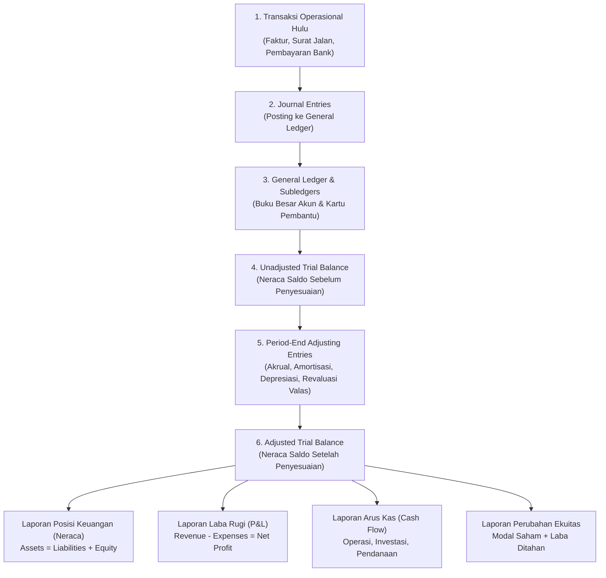

# Financial Statements & Reporting Architecture

## Definition

**Financial Statements (Laporan Keuangan)** adalah laporan terstruktur mengenai posisi keuangan dan kinerja finansial suatu entitas pada suatu titik waktu tertentu atau selama suatu periode akuntansi.

Menurut standar internasional **IAS 1 (*Presentation of Financial Statements*)**, laporan keuangan bertujuan untuk menyediakan informasi mengenai posisi keuangan (*financial position*), kinerja keuangan (*financial performance*), dan arus kas (*cash flows*) entitas yang bermanfaat bagi sebagian besar pengguna laporan (manajemen, pemegang saham, kreditur, regulator, dan fiskus) dalam membuat keputusan ekonomi.

Dalam arsitektur ERP, laporan keuangan bukanlah dokumen yang dibuat secara manual dengan mengetik angka di spreadsheet, melainkan **hasil kompilasi dan agregasi matematis otomatis dari jutaan baris jurnal transaksi harian**.

---

## Dari Transaksi Menjadi Laporan Keuangan: The Data Pipeline

Aliran data dalam sistem ERP bergerak dari transaksi mikro menuju laporan keuangan makro melalui pipa data (*data pipeline*) yang saling mengunci:



---

## 4 Laporan Keuangan Pokok (IAS 1)

Satu set laporan keuangan lengkap yang dihasilkan oleh sistem ERP terdiri dari empat komponen utama:

### 1. Statement of Financial Position / Balance Sheet (Laporan Posisi Keuangan / Neraca)
Menyajikan aset, liabilitas, dan ekuitas perusahaan pada tanggal tertentu (*snapshot at a point in time*).
* **Format Wajib (IAS 1)**: Memisahkan secara tegas antara:
  * **Aset Lancar (*Current Assets*)** vs **Aset Tidak Lancar (*Non-Current Assets*)**.
  * **Liabilitas Jangka Pendek (*Current Liabilities*)** vs **Liabilitas Jangka Panjang (*Non-Current Liabilities*)**.
* **Prinsip Keseimbangan**:
  $$\mathbf{Total\ Assets \equiv Total\ Liabilities + Total\ Equity}$$

---

### 2. Statement of Profit or Loss (Laporan Laba Rugi)
Menyajikan kinerja operasional entitas selama rentang periode waktu tertentu (*over a period of time*).
* **Struktur Standar**:
  $$\begin{aligned}
  &\text{Pendapatan Penjualan Bersih (Net Revenue)} \\
  &- \text{Beban Pokok Penjualan (COGS)} \\
  &= \mathbf{Laba\ Kotor\ (Gross\ Profit)} \\
  &- \text{Beban Operasional (Beban Penjualan, Umum, Administrasi)} \\
  &= \mathbf{Laba\ Operasi\ (Operating\ Profit\ /\ EBIT)} \\
  &\pm \text{Pendapatan / Beban Lain-lain (Bunga, Selisih Kurs)} \\
  &= \mathbf{Laba\ Sebelum\ Pajak\ (EBT)} \\
  &- \text{Beban Pajak Penghasilan Badan} \\
  &= \mathbf{Laba\ Bersih\ Tahun\ Berjalan\ (Net\ Profit)}
  \end{aligned}$$

---

### 3. Statement of Cash Flows (Laporan Arus Kas - IAS 7)
Melaporkan pergerakan arus kas masuk dan kas keluar riil selama periode berjalan, diklasifikasikan ke dalam tiga aktivitas:
1. **Operating Activities (Aktivitas Operasi)**: Arus kas dari aktivitas utama penghasil pendapatan (penerimaan dari pelanggan, pembayaran ke pemasok, pembayaran beban gaji dan pajak).
2. **Investing Activities (Aktivitas Investasi)**: Arus kas dari perolehan dan pelepasan aset jangka panjang (pembelian mesin baru, penjualan tanah).
3. **Financing Activities (Aktivitas Pendanaan)**: Arus kas yang mengakibatkan perubahan ukuran dan komposisi modal dan pinjaman entitas (penerbitan saham baru, pembayaran dividen, penarikan pinjaman bank jangka panjang).

> [!note] Metode Penyusunan Arus Kas di ERP
> * **Direct Method (Metode Langsung)**: Melaporkan kelompok utama penerimaan kas bruto dan pengeluaran kas bruto.
> * **Indirect Method (Metode Tidak Langsung)**: Menyesuaikan laba bersih akrual dengan pos-pos non-kas (seperti beban depresiasi) dan perubahan modal kerja (kenaikan/penurunan piutang, persediaan, dan utang).

---

### 4. Statement of Changes in Equity (Laporan Perubahan Ekuitas)
Menunjukkan rekonsiliasi antara saldo awal dan saldo akhir dari seluruh komponen ekuitas pemilik:
* Modal Disetor (*Share Capital*).
* Tambahan Modal Disetor (*Additional Paid-in Capital*).
* Saldo Awal Laba Ditahan (*Retained Earnings*).
* *Ditambah*: Laba Bersih Tahun Berjalan.
* *Dikurangi*: Dividen yang Dibagikan kepada Pemegang Saham.
* Saldo Akhir Laba Ditahan.

---

## Contoh Model Laporan Keuangan Terpadu

Berikut adalah contoh laporan keuangan terintegrasi yang dihasilkan dari transaksi realistis yang telah kita bahas di seluruh siklus:

### A. Laporan Laba Rugi (Periode Berjalan)
```text
PT MAJU SEJAHTERA BERSAMA
LAPORAN LABA RUGI (STATEMENT OF PROFIT OR LOSS)
Untuk Periode yang Berakhir 31 Desember 2026

Pendapatan Penjualan Bersih                  Rp 100.000.000
Beban Pokok Penjualan (COGS)                (Rp  70.000.000)
------------------------------------------------------------
LABA KOTOR (GROSS PROFIT)                    Rp  30.000.000

Beban Operasional:
  Beban Gaji & Tunjangan                    (Rp  10.000.000)
  Beban Sewa Gedung Kantor                  (Rp   2.000.000)
  Beban Penyusutan Mesin & Peralatan        (Rp   1.500.000)
  Beban Listrik, Air, & Utilitas            (Rp   1.000.000)
  Beban Penurunan Nilai Piutang (ECL)       (Rp     500.000)
------------------------------------------------------------
Total Beban Operasional                     (Rp  15.000.000)
------------------------------------------------------------
LABA OPERASI (OPERATING PROFIT)              Rp  15.000.000

Pendapatan / (Beban) Lain-lain:
  Keuntungan Selisih Kurs Valas (Net)        Rp     500.000
  Beban Administrasi Bank                   (Rp     150.000)
------------------------------------------------------------
Total Pendapatan / (Beban) Lain Bersih       Rp     350.000
------------------------------------------------------------
Laba Sebelum Pajak                           Rp  15.350.000
Beban Pajak Penghasilan Badan (Taksiran)    (Rp   2.987.000)
------------------------------------------------------------
LABA BERSIH PERIODE BERJALAN (NET PROFIT)    Rp  12.363.000
============================================================
```

---

### B. Laporan Posisi Keuangan / Neraca (Per 31 Desember 2026)
```text
PT MAJU SEJAHTERA BERSAMA
LAPORAN POSISI KEUANGAN (STATEMENT OF FINANCIAL POSITION)
Per 31 Desember 2026

ASET (ASSETS)
Aset Lancar:
  Kas dan Setara Kas (Bank Operasional)      Rp  45.000.000
  Piutang Usaha (Net of ECL Rp500.000)       Rp  20.600.000
  Persediaan Barang Dagang                   Rp  35.000.000
  Pajak Masukan (PPN Masukan)                Rp   2.500.000
  Biaya Dibayar di Muka (Prepaid Expense)    Rp   5.000.000
------------------------------------------------------------
Total Aset Lancar                            Rp 108.100.000

Aset Tidak Lancar:
  Aset Tetap - Mesin & Peralatan             Rp 105.000.000
  Akumulasi Penyusutan                      (Rp  18.000.000)
------------------------------------------------------------
Total Aset Tidak Lancar                      Rp  87.000.000
------------------------------------------------------------
TOTAL ASET                                   Rp 195.100.000
============================================================

LIABILITAS DAN EKUITAS (LIABILITIES & EQUITY)
Liabilitas Jangka Pendek:
  Utang Usaha (Accounts Payable)             Rp  25.000.000
  Utang Belum Difakturkan (GR/IR Clearing)   Rp   5.000.000
  Utang Beban Akrual                         Rp   4.000.000
  Utang PPN Keluaran                         Rp   3.750.000
  Utang Pajak Penghasilan Badan              Rp   2.987.000
------------------------------------------------------------
Total Liabilitas Jangka Pendek               Rp  40.737.000

Ekuitas:
  Modal Saham Disetor                        Rp 100.000.000
  Laba Ditahan Awal Periode                  Rp  42.000.000
  Laba Bersih Periode Berjalan               Rp  12.363.000
------------------------------------------------------------
Total Ekuitas                                Rp 154.363.000
------------------------------------------------------------
TOTAL LIABILITAS DAN EKUITAS                 Rp 195.100.000
============================================================
```

> **Verifikasi Keseimbangan Neraca**:
> $$\text{Total Aset (Rp195.100.000)} \equiv \text{Total Liabilitas (Rp40.737.000)} + \text{Total Ekuitas (Rp154.363.000)}$$
> Neraca seimbang sempurna (*balanced to the penny*).

---

## Financial Reporting Architecture in Modern ERP

Sistem ERP enterprise menghasilkan laporan keuangan melalui mesin pelaporan dinamis:
1. **Financial Report Builder (Financial Statement Generator)**: Pengguna dapat mendefinisikan baris dan kolom laporan berdasarkan rentang akun COA, kelompok akun, atau rumus kalkulasi tanpa perlu membuat kueri SQL manual.
2. **Dimension Slicing & Dicing**: Satu laporan laba rugi dapat difilter seketika berdasarkan dimensi manajerial (misal: Laba Rugi Cabang Surabaya, Laba Rugi Divisi Elektronik, atau Laba Rugi Proyek X) sesuai prinsip IFRS 8 (lihat [[00-fundamentals/organizational-structure|Organizational Structure]]).
3. **Drill-Down Capability**: Pembaca laporan keuangan dapat mengklik salah satu angka di neraca (misal: angka Piutang Usaha Rp20.600.000) untuk langsung membuka rincian kartu piutang pelanggan di subledger, dan mengklik baris transaksi untuk melihat dokumen faktur aslinya.

---

## Related Concepts

* [[02-accounting/accounting-fundamentals|Accounting Fundamentals]] — Persamaan akuntansi dan elemen laporan keuangan.
* [[02-accounting/chart-of-accounts|Chart of Accounts]] — Struktur bagan akun penopang laporan keuangan.
* [[02-accounting/period-end-closing|Period-End Closing]] — Prosedur penutupan buku sebelum penerbitan laporan keuangan.
* [[01-business-processes/record-to-report|Record to Report (R2R)]] — Siklus pelaporan finansial hulu-ke-hilir.

---

## References

1. **IFRS Foundation**: *IAS 1 Presentation of Financial Statements - Complete Set of Financial Statements*. URL: https://www.ifrs.org/issued-standards/list-of-standards/ias-1-presentation-of-financial-statements/
2. **IFRS Foundation**: *IAS 7 Statement of Cash Flows*. URL: https://www.ifrs.org/issued-standards/list-of-standards/ias-7-statement-of-cash-flows/
3. **Microsoft Learn**: *Financial reporting overview in Dynamics 365 Finance*. URL: https://learn.microsoft.com/en-us/dynamics365/finance/general-ledger/financial-reporting-overview
4. **Frappe / ERPNext Documentation**: *Financial Statements: Balance Sheet, Profit and Loss, and Cash Flow*. URL: https://docs.frappe.io/erpnext/user/manual/en/accounts/financial-statements
