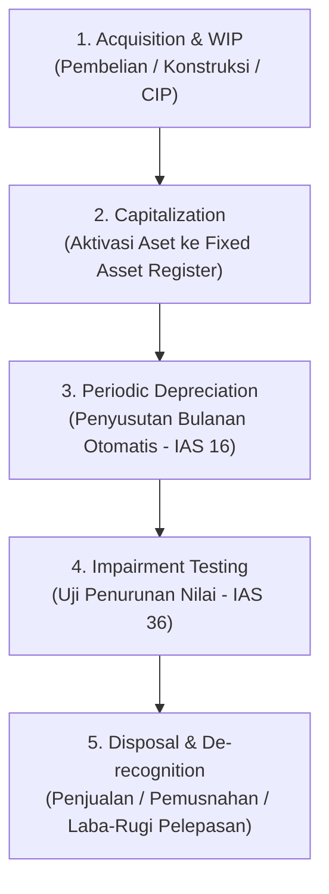

# Fixed Asset Accounting (IAS 16)

## Definition

**Fixed Assets (Aset Tetap / Aktiva Tetap)**—yang dalam standar akuntansi internasional didefinisikan sebagai **Aset Tetap (*Property, Plant, and Equipment / PPE*)** di bawah **IAS 16**—adalah aset berwujud yang dimiliki oleh entitas untuk digunakan dalam produksi atau penyediaan barang atau jasa, untuk disewakan kepada pihak lain, atau untuk tujuan administratif, dan diharapkan untuk digunakan selama **lebih dari satu periode akuntansi**.

Sistem ERP mengelola aset tetap melalui kombinasi antara modul pengadaan (*Procurement*), buku besar aktiva (*Fixed Asset Register / Subledger*), dan mesin depresiasi otomatis di dalam buku besar keuangan (*General Ledger*).

---

## Capital Expenditure (CapEx) vs Operating Expense (OpEx)

Salah satu keputusan akuntansi paling krusial adalah menentukan apakah suatu pengeluaran kas harus diakui sebagai aset di neraca atau langsung dibebankan ke laporan laba rugi:

| Kriteria | Capital Expenditure (CapEx) | Operating Expense (OpEx) |
|---|---|---|
| **Definisi** | Pengeluaran untuk memperoleh, membangun, atau meningkatkan masa manfaat aset tetap secara signifikan. | Pengeluaran untuk memelihara dan menjalankan operasional harian aset dalam kondisi kerja normal. |
| **Kriteria Kapitalisasi** | Memenuhi ambang batas materialitas (*capitalization threshold*), masa manfaat $> 1$ tahun, meningkatkan kapasitas/efisiensi. | Biaya perbaikan rutin, penggantian suku cadang kecil, servis berkala. |
| **Dampak Finansial** | Dicatat sebagai **Aset di Neraca**; biayanya dialokasikan bertahap melalui penyusutan (*depreciation*). | Langsung diakui sebagai **Beban di Laporan Laba Rugi** pada periode terjadinya. |
| **Contoh** | Membeli truk ekspedisi baru, membangun gedung pabrik, penggantian mesin utama. | Mengganti oli truk, servis AC kantor berkala, tagihan bensin operasional. |

---

## The Fixed Asset Lifecycle in ERP

---

## Accounting Process & Journal Entries

### 1. Acquisition & Capitalization (Perolehan Aset)
* **Kasus A: Pembelian Langsung Siap Pakai**:
  Membeli mesin produksi seharga Rp100.000.000 (belum termasuk PPN 11% = Rp11.000.000) dan membayar ongkos instalasi mesin sebesar Rp5.000.000.
  * *Sesuai IAS 16, seluruh biaya persiapan hingga aset siap digunakan wajib dikapitalisasi ke nilai perolehan.*
  * Total Biaya Kapitalisasi: Rp100.000.000 + Rp5.000.000 = **Rp105.000.000**.

| Akun | Kategori | Debit (Rp) | Kredit (Rp) |
|---|---|---:|---:|
| Aset Tetap - Mesin Pabrik | Asset | 105.000.000 | - |
| PPN Masukan (*VAT Input*) | Asset | 11.000.000 | - |
| Utang Usaha / Kas Bank | Liability / Asset | - | 116.000.000 |

* **Kasus B: Aset dalam Penyelesaian (*Capital Work in Progress / CWIP*)**:
  Jika aset dibangun bertahap (misal pembangunan pabrik selama 6 bulan), pengeluaran ditampung di akun aset perantara `Aset dalam Pengerjaan (CWIP)`. Saat pabrik selesai dibangun dan siap beroperasi, sistem melakukan reklasifikasi (*capitalization run*):
  * Debit: Aset Tetap - Bangunan Pabrik
  * Kredit: Aset dalam Pengerjaan (*CWIP*)

---

### 2. Periodic Depreciation (Penyusutan Bulanan)
Berdasarkan estimasi masa manfaat 5 tahun (60 bulan) dengan nilai sisa (*residual value*) Rp5.000.000:
$$\text{Dasar Penyusutan} = \text{Harga Perolehan} - \text{Nilai Sisa} = 105.000.000 - 5.000.000 = 100.000.000$$
$$\text{Penyusutan per Bulan} = \frac{100.000.000}{60 \text{ bulan}} = \text{Rp1.666.667}$$

ERP secara otomatis memposting jurnal depresiasi bulanan (lihat [[02-accounting/depreciation-and-amortization|Depreciation and Amortization]]):

| Akun | Kategori | Debit (Rp) | Kredit (Rp) |
|---|---|---:|---:|
| Beban Penyusutan Mesin Pabrik | Expense (P&L) | 1.666.667 | - |
| Akumulasi Penyusutan Mesin | Contra Asset (Neraca) | - | 1.666.667 |

---

### 3. Disposal & De-recognition (Pelepasan & Penjualan Aset)
Ketika aset dijual atau dihentikan penggunaannya:
* **Kasus**: Setelah 3 tahun (36 bulan), mesin dijual tunai seharga Rp50.000.000.
  * Harga Perolehan: Rp105.000.000.
  * Akumulasi Penyusutan (36 bulan $\times$ Rp1.666.667): **Rp60.000.000**.
  * Nilai Buku Bersih (*Net Book Value / Carrying Amount*): Rp105.000.000 - Rp60.000.000 = **Rp45.000.000**.
  * Harga Jual Kas: Rp50.000.000 $\implies$ **Keuntungan Pelepasan Aset = Rp5.000.000**.

* **Jurnal Pelepasan Aset (Disposal Entry)**:

| Akun | Kategori | Debit (Rp) | Kredit (Rp) |
|---|---|---:|---:|
| Bank Operasional (Kas Diterima) | Asset | 50.000.000 | - |
| Akumulasi Penyusutan Mesin (Menutup Akun) | Contra Asset | 60.000.000 | - |
| Aset Tetap - Mesin Pabrik (Menghapus Aset) | Asset | - | 105.000.000 |
| Keuntungan Penjualan Aset Tetap (*Gain on Disposal*) | Other Income (P&L) | - | 5.000.000 |

*Jika aset dijual seharga Rp40.000.000 (di bawah nilai buku Rp45.000.000), selisih Rp5.000.000 didebit ke akun `Kerugian Pelepasan Aset (Loss on Disposal)`.*

---

## Fixed Asset Register (Subledger Aset Tetap)

Setiap unit aset tetap dicatat dalam kartu aset tersendiri di dalam [[02-accounting/general-ledger-and-subledger|Fixed Asset Subledger]]:
* **Tag Aset & Serial Number**: Barcode fisik yang ditempel pada mesin/laptop.
* **Custodian & Location**: Karyawan penanggung jawab dan lokasi fisik gedung/ruangan.
* **Depreciation Schedule**: Tabel proyeksi penyusutan masa depan hingga nilai residu.
* **Insurance & Warranty**: Nilai pertanggungan asuransi dan masa garansi vendor.

---

## Related Concepts

* [[02-accounting/depreciation-and-amortization|Depreciation and Amortization]] — Metode perhitungan penyusutan (Straight-Line, Diminishing Balance).
* [[02-accounting/general-ledger-and-subledger|General Ledger and Subledger]] — Akun kontrol aset dan register aset tetap.
* [[01-business-processes/procure-to-pay|Procure to Pay]] — Pengadaan aset melalui siklus pembelian.

---

## References

1. **IFRS Foundation**: *IAS 16 Property, Plant and Equipment - Recognition, Measurement, and Derecognition*. URL: https://www.ifrs.org/issued-standards/list-of-standards/ias-16-property-plant-and-equipment/
2. **IFRS Foundation**: *IAS 36 Impairment of Assets*. URL: https://www.ifrs.org/issued-standards/list-of-standards/ias-36-impairment-of-assets/
3. **Microsoft Learn**: *Fixed assets overview and depreciation books in Dynamics 365 Finance*. URL: https://learn.microsoft.com/en-us/dynamics365/finance/fixed-assets/
4. **Frappe / ERPNext Documentation**: *Asset Lifecycle Management, Maintenance, and Depreciation*. URL: https://docs.frappe.io/erpnext/user/manual/en/assets
