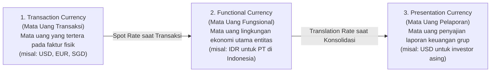

# Foreign Currency Accounting (IAS 21)

## Definition

**Foreign Currency Accounting (Akuntansi Valuta Asing)** dalam sistem ERP adalah cabang akuntansi yang mengatur konversi, pencatatan transaksi, penilaian kembali (*revaluation*), dan pelaporan keuangan ketika transaksi bisnis dilakukan dalam mata uang selain mata uang fungsional entitas.

Standar akuntansi internasional **IAS 21 (*The Effects of Changes in Foreign Exchange Rates*)** menjadi rujukan baku yang mengatur bagaimana fluktuasi kurs mata uang asing harus diperlakukan dalam pembukuan dan penyusunan laporan keuangan.

---

## Taksonomi Tiga Mata Uang (Currency Framework)

Untuk memahami akuntansi valas di ERP, pengguna harus membedakan tiga peran mata uang:

1. **Transaction Currency (Mata Uang Transaksi)**: Mata uang yang disepakati dengan pihak ketiga dalam kontrak jual beli (misal: faktur penjualan diterbitkan sebesar USD 1,000).
2. **Functional Currency (Mata Uang Fungsional)**: Mata uang dari lingkungan ekonomi utama tempat entitas beroperasi (misal: Rupiah/IDR, tempat entitas membayar gaji, membeli bahan lokal, dan menetapkan harga jual). Seluruh buku besar entitas disimpan dalam mata uang ini.
3. **Presentation / Reporting Currency (Mata Uang Pelaporan)**: Mata uang yang digunakan saat laporan keuangan disajikan kepada pemegang saham atau entitas induk global.

---

## Pos Moneter vs Pos Non-Moneter (Monetary vs Non-Monetary Items)

Pada setiap akhir periode buku, standar **IAS 21 Paragraf 23** mewajibkan pemisahan perlakuan akun neraca:

| Kategori Akun | Definisi & Pos Neraca | Perlakuan Kurs Akhir Periode | Dampak Selisih Kurs |
|---|---|---|---|
| **Monetary Items (Pos Moneter)** | Hak untuk menerima, atau kewajiban untuk menyerahkan, sejumlah unit mata uang yang tetap/dapat ditentukan. *Contoh*: Kas/Bank Valas, Piutang Valas, Utang Valas. | **Wajib ditranslasikan ulang** menggunakan kurs penutupan (*Closing Spot Rate*) per tanggal neraca. | Diakui seketika di Laporan Laba Rugi sebagai **Unrealized Forex Gain/Loss**. |
| **Non-Monetary Items (Pos Non-Moneter)** | Pos yang tidak memiliki hak/kewajiban kas tetap. *Contoh*: Persediaan, Aset Tetap, Uang Muka, Modal Saham. | **TIDAK Boleh Ditranslasikan Ulang**. Tetap dilaporkan menggunakan **kurs historis** saat transaksi pertama kali terjadi (*Historical Rate*). | Tidak ada selisih kurs yang diakui. |

---

## Realized vs Unrealized Foreign Exchange Gain/Loss

1. **Unrealized Gain/Loss (Laba/Rugi Selisih Kurs Belum Terealisasi)**:
   * Terjadi pada akhir periode pembukuan atas pos-pos moneter valas yang **masih berstatus terbuka / belum dilunasi**.
   * Merupakan penyesuaian nilai buku di neraca agar mencerminkan nilai wajar terkini.
2. **Realized Gain/Loss (Laba/Rugi Selisih Kurs Terealisasi)**:
   * Terjadi pada saat pelunasan fisik kas/bank dilakukan, di mana kurs transfer bank riil berbeda dari kurs saat piutang/utang tersebut dicatat.

---

## Siklus Transaksi Valas End-to-End & Jurnal Akuntansi

Mari telusuri transaksi penjualan ekspor senilai **USD 1,000** kepada pembeli luar negeri dengan mata uang fungsional perusahaan adalah **IDR**:

### 1. Pengakuan Awal (*Initial Recognition* - 10 September)
* Kurs Spot saat Faktur Terbit: **USD 1 = Rp15.000**.
* Nilai Transaksi: USD 1,000 $\times$ Rp15.000 = **Rp15.000.000**.

| Akun | Kategori | Debit (Rp) | Kredit (Rp) |
|---|---|---:|---:|
| Piutang Usaha Ekspor (*USD 1,000*) | Asset (AR Subledger) | 15.000.000 | - |
| Pendapatan Ekspor | Revenue | - | 15.000.000 |

---

### 2. Penyesuaian Tutup Buku Akhir Bulan (*Forex Revaluation* - 30 September)
Pada tanggal 30 September, piutang belum dibayar oleh pelanggan.
* Kurs Penutupan (*Closing Rate* 30 September): **USD 1 = Rp15.500** (Rupiah melemah / USD menguat).
* Nilai Piutang Baru: USD 1,000 $\times$ Rp15.500 = **Rp15.500.000**.
* Selisih Kurs Belum Terealisasi: Rp15.500.000 - Rp15.000.000 = **Laba Rp500.000**.

| Akun | Kategori | Debit (Rp) | Kredit (Rp) |
|---|---|---:|---:|
| Piutang Usaha Ekspor (*USD 1,000*) | Asset | 500.000 | - |
| Keuntungan Selisih Kurs Belum Terealisasi (*Unrealized Forex Gain*) | Other Income (P&L) | - | 500.000 |

*Nilai buku piutang di Neraca 30 September disajikan sebesar Rp15.500.000.*

---

### 3. Pelunasan Kas Riil (*Settlement* - 15 Oktober)
Pelanggan mentransfer USD 1,000 ke rekening bank valas perusahaan pada tanggal 15 Oktober.
* Kurs Spot saat Pelunasan: **USD 1 = Rp15.800**.
* Kas Masuk ke Bank: USD 1,000 $\times$ Rp15.800 = **Rp15.800.000**.
* Nilai Piutang Terakhir yang Dihapus dari Buku: **Rp15.500.000**.
* Laba Selisih Kurs Terealisasi Tambahan: Rp15.800.000 - Rp15.500.000 = **Laba Rp300.000**.

| Akun | Kategori | Debit (Rp) | Kredit (Rp) |
|---|---|---:|---:|
| Bank Valas USD (Rp15.800 $\times$ 1.000) | Asset | 15.800.000 | - |
| Piutang Usaha Ekspor (Menutup Saldo AR) | Asset | - | 15.500.000 |
| Keuntungan Selisih Kurs Terealisasi (*Realized Forex Gain*) | Other Income (P&L) | - | 300.000 |

---

## Multi-Currency Architecture in ERP

Untuk mendukung operasi multi-mata uang, basis data ERP menyimpan nilai nominal dalam dua kolom ganda pada setiap baris jurnal:
1. **Transaction Currency Amount**: Nominal asli dalam valuta asing (misal: $1,000.00$).
2. **Base Currency Amount**: Nominal hasil konversi ke mata uang fungsional entitas (misal: Rp15.000.000).

Modul perbankan dan buku besar ERP menyediakan **Tabel Nilai Tukar (*Exchange Rate Table*)** yang dapat disinkronkan secara otomatis melalui API perbankan sentral untuk mengambil kurs spot harian dan kurs penutupan akhir periode.

---

## Related Concepts

* [[01-business-processes/record-to-report|Record to Report (R2R)]] — Revaluasi kurs pada saat tutup buku periodik.
* [[02-accounting/accounts-receivable|Accounts Receivable]] — Piutang valas pelanggan luar negeri.
* [[02-accounting/accounts-payable|Accounts Payable]] — Utang valas pengadaan barang impor.

---

## References

1. **IFRS Foundation**: *IAS 21 The Effects of Changes in Foreign Exchange Rates*. URL: https://www.ifrs.org/issued-standards/list-of-standards/ias-21-the-effects-of-changes-in-foreign-exchange-rates/
2. **Kieso, D. E., Weygandt, J. J., & Warfield, T. D.** (2020). *Intermediate Accounting* (Foreign Currency Transactions chapter). Wiley.
3. **Microsoft Learn**: *Foreign currency revaluation for General Ledger in Dynamics 365 Finance*. URL: https://learn.microsoft.com/en-us/dynamics365/finance/general-ledger/foreign-currency-revaluation-general-ledger
4. **Frappe / ERPNext Documentation**: *Multi-Currency Accounting and Exchange Rate Revaluation*. URL: https://docs.frappe.io/erpnext/user/manual/en/accounts/multi-currency-accounting
