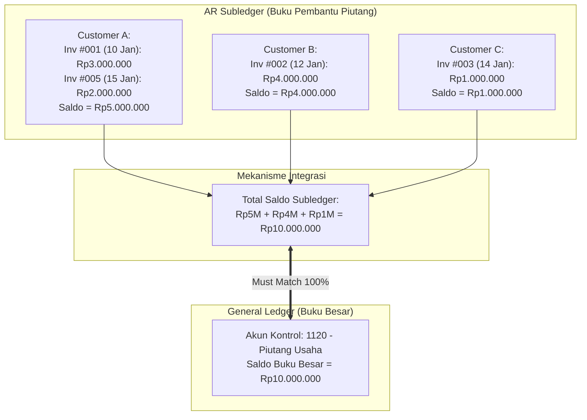

# General Ledger and Subledger

## Definition

Dalam sistem ERP, buku besar dibagi ke dalam dua tingkatan fungsional:

1. **General Ledger (Buku Besar Umum / GL)**: Buku catatan akuntansi utama yang mengakumulasi seluruh transaksi keuangan entitas dan menyajikan ringkasan saldo per akun sesuai Chart of Accounts (COA) sebagai bahan penyusunan Neraca Saldo (*Trial Balance*) dan Laporan Keuangan.
2. **Subledger (Buku Pembantu / Subsidiary Ledger)**: Buku pencatatan sekunder terperinci yang melacak rincian transaksi individu per pihak ketiga atau per entitas fisik (misalnya: rincian piutang per pelanggan, rincian utang per pemasok, atau rincian kartu stok per item barang).

Keduanya dihubungkan secara real-time oleh **Control Account (Akun Kontrol / Akun Rekonsiliasi)**.

---

## Mengapa ERP Membutuhkan Pemisahan GL dan Subledger?

Jika sebuah perusahaan memiliki 50.000 pelanggan dan memproses 10.000 transaksi per hari, apa yang terjadi jika seluruh detail dimasukkan langsung ke akun buku besar umum?
1. **Ledakan Bagan Akun (*COA Explosion*)**: Perusahaan harus membuat 50.000 akun piutang berbeda di dalam COA, membuat neraca saldo menjadi ribuan halaman dan tidak dapat dibaca oleh manajemen atau auditor.
2. **Kebutuhan Informasi yang Berbeda**:
   * *Manajer Keuangan (GL)* hanya butuh mengetahui: *"Berapa total piutang perusahaan saat ini?"* (cukup 1 angka: Rp50.000.000.000).
   * *Kolektor Penagihan (Subledger)* butuh mengetahui: *"Faktur nomor berapa saja yang belum dibayar oleh PT Maju Bersama, berapa nilai per faktur, dan berapa hari lagi jatuh tempo?"*

Subledger menyediakan rincian operasional tanpa membebani Buku Besar Umum.

---

## Arsitektur Aliran Data: Subledger ke Control Account

---

## 4 Subledger Utama dalam ERP

Sistem ERP modern memiliki empat subledger inti yang beroperasi secara independen namun terhubung ke akun kontrol GL masing-masing:

### 1. Accounts Receivable (AR) Subledger
* **Entitas yang Dilacak**: Pelanggan (*Customer*).
* **Rincian Data**: Nomor faktur, tanggal terbit, tanggal jatuh tempo, nominal piutang, pelunasan parsial, memo kredit, dan kategori umur piutang (*Aging brackets*: 0-30 hari, 31-60 hari, dst.).
* **Akun Kontrol di GL**: `1120 - Piutang Usaha (Accounts Receivable)`.

### 2. Accounts Payable (AP) Subledger
* **Entitas yang Dilacak**: Pemasok / Vendor (*Supplier*).
* **Rincian Data**: Nomor tagihan vendor, nomor PO rujukan, tanggal jatuh tempo, jadwal pembayaran, dan riwayat retur pembelian.
* **Akun Kontrol di GL**: `2110 - Utang Usaha (Accounts Payable)`.

### 3. Inventory / Stock Ledger
* **Entitas yang Dilacak**: Barang / Produk (*Item Code*) dan Gudang (*Warehouse*).
* **Rincian Data**: Kuantitas masuk, kuantitas keluar, saldo kuantitas akhir, biaya satuan (*unit cost*), dan nilai total persediaan per lot atau per nomor seri.
* **Akun Kontrol di GL**: `1130 - Persediaan Barang (Inventory Asset)`.

### 4. Fixed Asset Register / Subledger
* **Entitas yang Dilacak**: Aktiva Tetap individu (mesin, kendaraan, laptop, bangunan).
* **Rincian Data**: Tanggal perolehan, harga perolehan, masa manfaat, metode depresiasi, akumulasi penyusutan hingga saat ini, dan nilai buku bersih (*Net Book Value / Carrying Amount*).
* **Akun Kontrol di GL**: `1210 - Aset Tetap` dan `1219 - Akumulasi Penyusutan`.

---

## Prinsip Rekonsiliasi Subledger & Penguncian Sistem

Aturan mutlak dalam integritas akuntansi ERP:

$$\sum \text{Saldo Seluruh Rekening Subledger} \equiv \text{Saldo Akun Kontrol GL}$$

### Mengapa Bisa Terjadi Selisih (*Reconciliation Gap*)?
Pada software akuntansi konvensional, ketidakcocokan sering terjadi jika pengguna diizinkan membuat **Jurnal Manual (*Direct Journal Voucher*)** langsung ke akun `Piutang Usaha` atau `Utang Usaha` tanpa menentukan nama pelanggan/pemasok dan nomor faktur. Akibatnya, saldo GL bertambah/berkurang, namun saldo di buku pembantu pelanggan tidak berubah.

### Bagaimana ERP Modern Mencegahnya?
1. **Locked for Direct Manual Posting**: Akun kontrol di GL ditandai dengan konfigurasi *Control Account / Do Not Allow Manual Entry*. Sistem menolak pengguna yang mencoba membuat jurnal penyesuaian manual langsung ke akun ini.
2. **Subledger-Driven Posting**: Setiap transaksi yang ingin menyentuh akun kontrol wajib melalui dokumen subledger (misal: penyesuaian piutang harus melalui dokumen *Credit Note* atau *Debit Note* yang mewajibkan input nama pelanggan).

---

## Peran Subledger dalam Audit dan Penutupan Periode

Pada setiap akhir bulan (lihat [[01-business-processes/record-to-report|Record to Report]]), auditor dan tim akuntansi menjalankan laporan rekonsiliasi:
* **AR Aging Summary vs GL AR Balance**: Total piutang pada laporan umur piutang dicocokkan dengan saldo akun 1120 di neraca lajur.
* **AP Aging Summary vs GL AP Balance**: Total utang pada daftar tagihan pemasok dicocokkan dengan saldo akun 2110.
* **Stock Valuation Report vs GL Inventory Balance**: Nilai total persediaan pada laporan gudang dicocokkan dengan saldo akun 1130.

Jika ketiga perbandingan di atas cocok 100%, periode pembukuan dapat dikunci (*locked*) dengan aman.

---

## Related Concepts

* [[02-accounting/chart-of-accounts|Chart of Accounts]] — Penentuan dan hierarki akun kontrol.
* [[02-accounting/accounts-receivable|Accounts Receivable]] — Pengelolaan rinci buku pembantu piutang.
* [[02-accounting/accounts-payable|Accounts Payable]] — Pengelolaan rinci buku pembantu utang.
* [[02-accounting/inventory-accounting|Inventory Accounting]] — Sinkronisasi kartu stok dengan GL persediaan.

---

## References

1. **IFRS Foundation**: *IAS 1 Presentation of Financial Statements - Aggregation and Materiality*. URL: https://www.ifrs.org/issued-standards/list-of-standards/ias-1-presentation-of-financial-statements/
2. **Microsoft Learn**: *Subledgers, posting profiles, and General Ledger integration in Dynamics 365 Finance*. URL: https://learn.microsoft.com/en-us/dynamics365/finance/general-ledger/subledger-journal
3. **Frappe / ERPNext Documentation**: *General Ledger, Accounts Receivable, and Stock Ledger Reports*. URL: https://docs.frappe.io/erpnext/user/manual/en/accounts/general-ledger
4. **Odoo Documentation**: *Partner Balances, General Ledger, and Aged Partner Balances*. URL: https://www.odoo.com/documentation/17.0/applications/finance/accounting/reporting/declarations/aged_partner_balances.html
