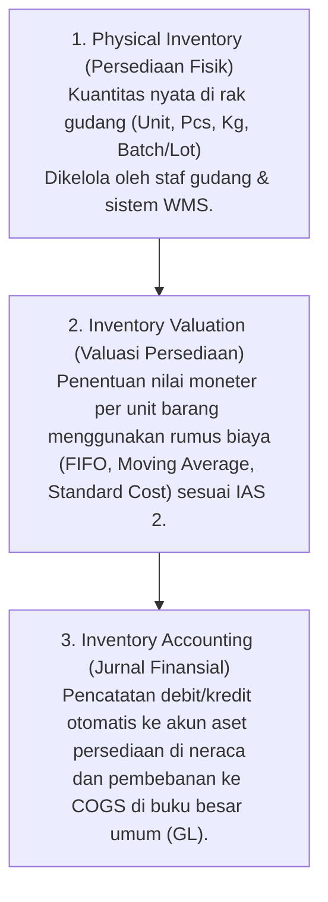

# Inventory Accounting & Valuation

## Definition

**Inventory Accounting (Akuntansi Persediaan)** adalah cabang akuntansi keuangan yang mengatur pencatatan, penilaian, dan pelaporan aset persediaan barang dagang, bahan baku, barang dalam proses, dan barang jadi di neraca serta penentuan Beban Pokok Penjualan (*Cost of Goods Sold / COGS*) di laporan laba rugi.

Dalam arsitektur ERP, pengelolaan persediaan harus dibedakan secara tegas ke dalam tiga dimensi yang saling melengkapi:

Siklus fisik operasionalnya telah dibahas mendalam pada [[01-business-processes/inventory-process|Inventory Process]], [[01-business-processes/procure-to-pay|Procure to Pay]], dan [[01-business-processes/manufacturing-process|Manufacturing Process]].

---

## Cost of Inventory under IAS 2

Standar akuntansi internasional **IAS 2 (*Inventories*)** menetapkan bahwa persediaan harus diukur pada nilai terendah antara **Biaya Perolehan (*Cost*)** dan **Nilai Realisasi Bersih (*Net Realizable Value / NRV*)**.

### 1. Komponen yang Boleh Masuk Biaya Perolehan:
* **Harga Beli Faktur**: Nilai faktur dari pemasok dikurangi diskon dagang atau rabat.
* **Biaya yang Dapat Diatribusikan Langsung (*Directly Attributable Costs*)**:
  * Bea masuk impor dan pajak yang tidak dapat dikreditkan.
  * Ongkos angkut masuk (*freight-in*).
  * Biaya asuransi pengiriman dan biaya penanganan (*handling/landing cost*).
* **Biaya Konversi Manufaktur**: Biaya tenaga kerja langsung dan alokasi overhead pabrik tetap serta variabel yang terjadi dalam mengubah bahan baku menjadi barang jadi.

### 2. Biaya yang DILARANG Dikapitalisasi (Wajib Langsung Dibebankan ke P&L):
* Pemborosan bahan baku atau tenaga kerja yang tidak normal (*abnormal waste*).
* Biaya penyimpanan barang jadi di gudang (*storage costs*), kecuali diperlukan dalam proses produksi lanjutan (misal: proses fermentasi atau penuaan keju/anggur).
* Beban administrasi umum yang tidak berkontribusi membawa persediaan ke lokasi dan kondisi saat ini.
* Biaya penjualan dan pemasaran.

---

## Cost Formulas (Metode Valuasi Persediaan)

Standar IAS 2 memperbolehkan dua rumus biaya utama untuk barang yang saling dapat menggantikan (*interchangeable items*):

| Metode Valuasi | Logika Perhitungan | Dampak saat Inflasi Harga | Catatan Kepatuhan IFRS |
|---|---|---|---|
| **FIFO (First-In, First-Out)** | Barang yang masuk lebih awal diasumsikan keluar/dijual lebih awal. Nilai persediaan akhir mencerminkan harga pembelian terkini. | Laba kotor cenderung lebih tinggi; nilai aset persediaan di neraca lebih mendekati harga pasar terkini. | **Diizinkan penuh** oleh IFRS dan PSAK. |
| **Weighted Average Cost (Moving Average)** | Biaya setiap unit ditentukan dari rata-rata tertimbang biaya barang serupa yang tersedia pada saat transaksi terjadi. | Menghaluskan fluktuasi harga ekstrem (*smoothing effect*). | **Diizinkan penuh** oleh IFRS dan PSAK. |
| **LIFO (Last-In, First-Out)** | Barang yang terakhir masuk diasumsikan keluar lebih dulu. | Menghasilkan laba lebih rendah dan nilai neraca usang. | **DILARANG KERAS** oleh IFRS (IAS 2 Paragraf 25) karena tidak mencerminkan aliran fisik barang yang wajar. |
| **Standard Costing** | Nilai barang ditetapkan di awal berdasarkan estimasi biaya standar; selisih dengan harga riil dialokasikan ke akun varians. | Mengharuskan penyesuaian berkala (*variance analysis*). | Diizinkan sebagai metode pendekatan jika hasilnya mendekati biaya historis. |

---

## Perpetual vs Periodic Inventory System dalam ERP

Hampir seluruh sistem ERP kelas enterprise mengadopsi sistem **Perpetual Inventory (Persediaan Terus-Menerus)**:

* **Periodic System (Metode Fisik)**:
  * Pembelian barang didebit ke akun sementara `Beban Pembelian`.
  * HPP tidak dihitung setiap kali barang dijual, melainkan dihitung secara manual pada akhir bulan melalui stock opname fisik menggunakan rumus:
    $$\text{COGS} = \text{Stok Awal} + \text{Pembelian} - \text{Stok Akhir}$$
* **Perpetual System (Metode ERP Terintegrasi)**:
  * Setiap penerimaan barang langsung menambah nilai akun `Persediaan`.
  * Setiap pengiriman barang langsung mendebit akun `COGS` dan mengkredit akun `Persediaan` secara *real-time*.
  * Nilai buku persediaan dan kuantitas fisik di sistem selalu mutakhir setiap detik.

---

## Siklus Jurnal Akuntansi Persediaan (Perpetual Flow)

Berikut adalah ringkasan jurnal akuntansi persediaan terintegrasi:

### 1. Penerimaan Barang dari Pembelian (*Goods Receipt*)
Mencatat penerimaan fisik 10 unit barang @ Rp700.000 (lihat [[01-business-processes/procure-to-pay|Procure to Pay]]):

| Akun | Kategori | Debit (Rp) | Kredit (Rp) |
|---|---|---:|---:|
| Persediaan Barang Dagang | Asset | 7.000.000 | - |
| Utang Belum Difakturkan (*GR/IR Clearing*) | Liability | - | 7.000.000 |

---

### 2. Kapitalisasi Biaya Tambahan (*Landed Cost*)
Membayar ongkos ekspedisi pengiriman Rp500.000 atas barang yang baru tiba untuk dikapitalisasi ke nilai persediaan:

| Akun | Kategori | Debit (Rp) | Kredit (Rp) |
|---|---|---:|---:|
| Persediaan Barang Dagang (Kapitalisasi Ongkir) | Asset | 500.000 | - |
| Utang Biaya Ekspedisi / Kas Bank | Liability / Asset | - | 500.000 |

*Nilai perolehan persediaan kini naik menjadi Rp7.500.000 (atau Rp750.000/unit).*

---

### 3. Pengiriman Barang ke Pembeli (*Sales Delivery*)
Menyerahkan 10 unit barang ke pelanggan dalam siklus [[01-business-processes/order-to-cash|Order to Cash]]:

| Akun | Kategori | Debit (Rp) | Kredit (Rp) |
|---|---|---:|---:|
| Beban Pokok Penjualan (*COGS*) | Expense | 7.500.000 | - |
| Persediaan Barang Dagang | Asset | - | 7.500.000 |

> [!note] Catatan Kesinambungan Angka:
> Pada transaksi standar tanpa tambahan ongkos angkut masuk (*freight-in/landed cost*), seperti pada skenario acuan di [[02-accounting/debit-credit-and-double-entry|Debit & Credit]] dan [[02-accounting/financial-statements|Financial Statements]], nilai COGS dasar atas 10 unit barang tersebut adalah **Rp7.000.000** (@ Rp700.000). Contoh di atas mengilustrasikan penerapan IAS 2 ketika terdapat biaya tambahan yang sah dikapitalisasi (+Rp500.000), sehingga HPP naik menjadi Rp7.500.000 (@ Rp750.000).

---

### 4. Penyesuaian Penurunan Nilai Pasar (Lower of Cost and NRV - IAS 2)
Jika pada akhir tahun harga pasar produk tersebut anjlok dan estimasi nilai realisasi bersihnya (*NRV*) hanya Rp6.000.000 (terjadi penurunan nilai sebesar Rp1.500.000):

| Akun | Kategori | Debit (Rp) | Kredit (Rp) |
|---|---|---:|---:|
| Beban Penurunan Nilai Persediaan (*NRV Loss*) | Expense (P&L) | 1.500.000 | - |
| Penyisihan Penurunan Nilai Persediaan (*Allowance*) | Contra Asset (Neraca) | - | 1.500.000 |

---

## Related Concepts

* [[01-business-processes/inventory-process|Inventory Process]] — Alur operasional gudang, mutasi, dan stock opname.
* [[01-business-processes/procure-to-pay|Procure to Pay]] — Pengadaan barang dan akun perantara GR/IR.
* [[01-business-processes/manufacturing-process|Manufacturing Process]] — Konversi bahan baku ke barang jadi melalui WIP.
* [[02-accounting/general-ledger-and-subledger|General Ledger and Subledger]] — Sinkronisasi kartu stok dengan GL persediaan.

---

## References

1. **IFRS Foundation**: *IAS 2 Inventories - Measurement, Cost Formulas, and Disclosures*. URL: https://www.ifrs.org/issued-standards/list-of-standards/ias-2-inventories/
2. **Kieso, D. E., Weygandt, J. J., & Warfield, T. D.** (2020). *Intermediate Accounting* (IFRS Edition, Chapter: Inventories: Additional Valuation Issues). Wiley.
3. **Microsoft Learn**: *Cost management and inventory costing in Dynamics 365 Supply Chain Management*. URL: https://learn.microsoft.com/en-us/dynamics365/supply-chain/cost-management/costing-sheets
4. **Frappe / ERPNext Documentation**: *Item Valuation Methods (FIFO vs Moving Average)*. URL: https://docs.frappe.io/erpnext/user/manual/en/stock/item-valuation
