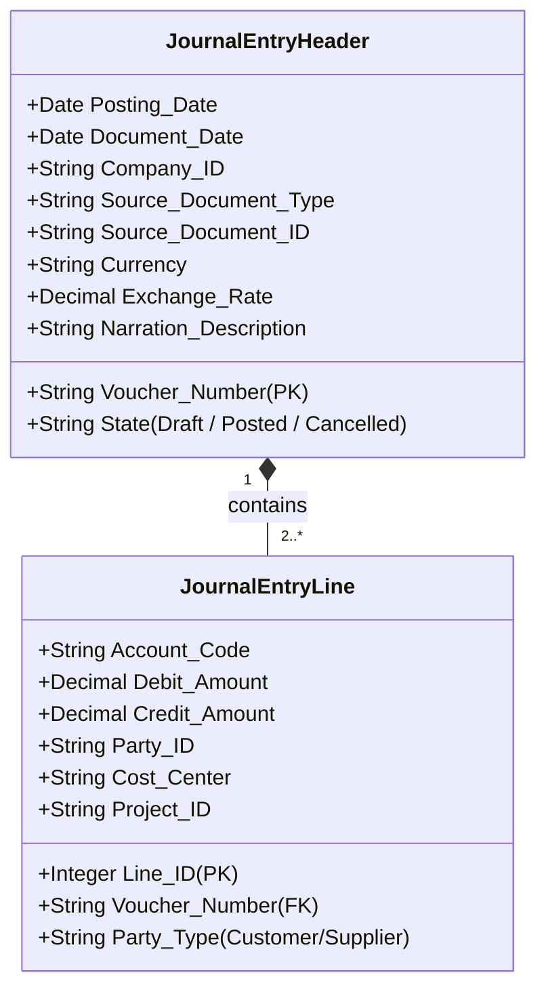
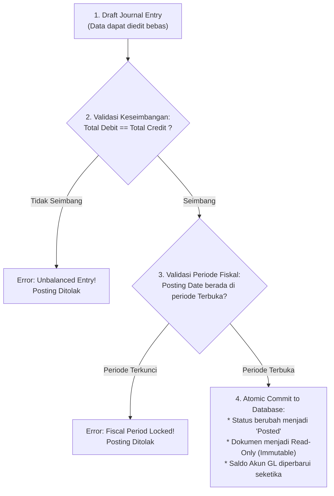

# Journal Entry & The Posting Process

## Definition

**Journal (Buku Jurnal)** adalah buku catatan akuntansi pertama (*book of original entry*) tempat seluruh transaksi keuangan direkam secara kronologis sebelum dialokasikan ke masing-masing akun di dalam buku besar (*General Ledger*).

Sebuah **Journal Entry (Ayat Jurnal)** adalah satuan rekaman transaksi terpadu yang memuat minimal dua baris pembukuan berpasangan (sisi Debit dan sisi Kredit) yang nilainya seimbang. Di dalam ERP, Journal Entry dihasilkan melalui dua mekanisme:
1. **Otomatis (*System-Generated*)**: Diterbitkan oleh modul operasional (seperti *Goods Receipt*, *Sales Invoice*, atau *Payment Disbursement*).
2. **Manual (*Manual Journal Voucher*)**: Diinput langsung oleh staf akuntansi untuk penyesuaian akhir periode, amortisasi, atau koreksi pembukuan.

---

## Anatomi Journal Entry di ERP

Struktur data Journal Entry dalam ERP dibagi menjadi dua lapisan tabel relasional: **Header** (informasi global transaksi) dan **Lines** (detail pembukuan debit/kredit):

### Elemen Kunci Header
* **Voucher / Document Number**: Nomor identifikasi unik dengan format seri berurutan (misal: `JV-2026-09-0012`).
* **Posting Date vs Document Date**:
  * **Document Date**: Tanggal fisik saat dokumen diterbitkan (misal: tanggal yang tertera pada faktur fisik pemasok, 28 Agustus).
  * **Posting Date**: Tanggal efektif transaksi memengaruhi buku besar dan laporan keuangan (misal: faktur baru diterima tanggal 5 September, maka posting date dicatat 5 September agar masuk ke periode pembukuan September).
* **Source Document Reference**: Referensi balik ke dokumen hulu operasional (misal: *Sales Invoice #INV-2026-0042*), menjaga keutuhan jejak audit (lihat [[00-fundamentals/documents-transactions-events|Documents, Transactions, and Business Events]]).
* **Narration / Description**: Penjelasan deskriptif mengenai latar belakang transaksi bisnis.

### Elemen Kunci Lines (Detail Baris)
* **Account Code**: Kode akun COA tujuan.
* **Debit / Credit Amount**: Nominal angka dalam mata uang transaksi dan mata uang pembukuan (*Base Currency*).
* **Party / Dimension**: Entitas pembantu (nama pelanggan, pemasok) dan dimensi manajerial (Pusat Biaya, Proyek, Cabang).

---

## The Posting Process (Proses Pembukuan ke GL)

Proses pemindahan data dari status rancangan (*Draft*) ke buku besar (*General Ledger*) dinamakan **Posting**:

---

## Prinsip Immutability & Mekanisme Koreksi Jurnal

Dalam akuntansi modern dan standar audit kepatuhan (seperti SOX dan standar IFRS):
> **Ayat jurnal yang telah berstatus `Posted` tidak boleh diubah angkanya atau dihapus dari basis data (*no hard delete, no silent edit*).**

Jika staf akuntansi melakukan kesalahan input (misalnya salah memilih akun atau salah mengetik angka), koreksi harus dilakukan melalui salah satu dari dua metode transparan:

### 1. Reversal Entry (Jurnal Pembalik Penuh)
Sistem membuat jurnal baru yang membalik posisi debit dan kredit dari transaksi lama, mengembalikan saldo akun ke posisi sebelum kesalahan terjadi.

#### Transaksi Asal yang Salah:
Membayar beban utilitas Rp5.000.000, tetapi salah didebit ke Beban Sewa.

| Akun | Debit (Rp) | Kredit (Rp) |
|---|---:|---:|
| Beban Sewa Gedung | 5.000.000 | - |
| Bank Operasional | - | 5.000.000 |

#### Jurnal Pembalik (*Reversal Voucher*):
Membalik seluruh posisi jurnal asal secara utuh.

| Akun | Debit (Rp) | Kredit (Rp) |
|---|---:|---:|
| Bank Operasional | 5.000.000 | - |
| Beban Sewa Gedung | - | 5.000.000 |

Setelah dibalik, staf akuntansi membuat jurnal baru yang benar (Debit Beban Utilitas, Kredit Bank).

### 2. Reclassifying / Correcting Entry (Jurnal Reklasifikasi)
Alih-alih membalik seluruh transaksi, dibuat jurnal penyesuaian untuk memindahkan saldo dari akun yang salah ke akun yang benar tanpa memengaruhi akun kas/bank:

| Akun | Debit (Rp) | Kredit (Rp) |
|---|---:|---:|
| Beban Listrik & Utilitas (Akun Benar) | 5.000.000 | - |
| Beban Sewa Gedung (Menghilangkan Akun Salah) | - | 5.000.000 |

---

## Audit Trail & Compliance

Jejak audit (*Audit Trail*) menjamin bahwa setiap angka di laporan keuangan dapat ditelusuri riwayat perubahannya:
1. **System Timestamp**: Waktu pencatatan tercatat hingga satuan detik oleh server database, terpisah dari tanggal bisnis (*Posting Date*).
2. **User Footprint**: Mencatat ID pengguna yang membuat (*created by*), menyetujui (*approved by*), dan memposting (*posted by*).
3. **Immutability Log**: Setiap upaya pembatalan atau revisi menghasilkan nomor dokumen baru yang saling mereferensikan (*bi-directional link*).

---

## Related Concepts

* [[02-accounting/debit-credit-and-double-entry|Debit, Credit, and Double-Entry]] — Validasi keseimbangan matematika jurnal.
* [[02-accounting/chart-of-accounts|Chart of Accounts]] — Penentuan kode akun baris jurnal.
* [[02-accounting/general-ledger-and-subledger|General Ledger and Subledger]] — Tempat akumulasi baris jurnal.
* [[02-accounting/accrual-and-adjusting-entries|Accrual and Adjusting Entries]] — Jurnal penyesuaian khusus akhir periode.

---

## References

1. **IFRS Foundation**: *IAS 1 Presentation of Financial Statements*. URL: https://www.ifrs.org/issued-standards/list-of-standards/ias-1-presentation-of-financial-statements/
2. **Information Systems Audit and Control Association (ISACA)**: *Audit Trail Controls and Data Integrity in ERP Systems*.
3. **Microsoft Learn**: *General journal processing and reversing entries in Dynamics 365 Finance*. URL: https://learn.microsoft.com/en-us/dynamics365/finance/general-ledger/general-journal-processing
4. **Frappe / ERPNext Documentation**: *Journal Entry Types and Reversal Mechanics*. URL: https://docs.frappe.io/erpnext/user/manual/en/accounts/journal-entry
