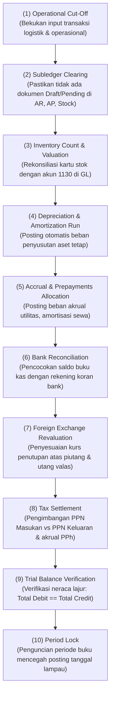

# Period-End Closing

## Definition

**Period-End Closing (Penutupan Periode Buku / Tutup Buku)** adalah serangkaian prosedur akuntansi terstruktur dan terjadwal yang dijalankan oleh entitas pada akhir setiap periode akuntansi (bulanan, kuartalan, atau tahunan) untuk memotong transaksi operasional (*cut-off*), memposting jurnal penyesuaian, merekonsiliasi seluruh buku pembantu (*subledgers*), mengunci buku besar (*GL locking*), dan menyusun laporan keuangan resmi.

Proses penutupan buku memastikan bahwa prinsip keterpisahan periode (*periodicity assumption*) dan asas akrual terpenuhi, sehingga laporan keuangan menyajikan informasi yang bebas dari bias transaksi susulan atau transaksi lampau (*backdated entries*).

Alur operasional R2R telah diperkenalkan pada [[01-business-processes/record-to-report|Record to Report (R2R)]].

---

## Monthly Closing vs Year-End Closing

Terdapat perbedaan mendasar antara penutupan buku bulanan dan penutupan buku akhir tahun fiskal:

| Aspek | Tutup Buku Bulanan (*Interim Close*) | Tutup Buku Tahunan (*Fiscal Year-End Close*) |
|---|---|---|
| **Frekuensi** | Setiap akhir bulan kalender. | Sekali setahun pada akhir tahun fiskal (misal: 31 Desember). |
| **Status Akun Nominal** | **Tetap Membawa Saldo Berjalan**. Akun Pendapatan dan Beban terus diakumulasi dari bulan ke bulan. | **Dibersihkan / Direset ke Nol**. Seluruh saldo pendapatan dan beban ditutup dan ditransfer ke Ekuitas. |
| **Tujuan Utama** | Pengendalian anggaran manajerial, rekonsiliasi kas/bank, dan pelaporan SPT Masa pajak. | Pelaporan keuangan audit eksternal, SPT Tahunan badan, dan penetapan dividen pemegang saham. |
| **Mekanisme Jurnal** | Hanya jurnal penyesuaian akrual, amortisasi, depresiasi, dan revaluasi valas. | Melibatkan **Jurnal Penutup (*Closing Journal Entry*)** yang memindahkan laba bersih ke *Retained Earnings*. |

---

## The Standard ERP Period-End Closing Checklist

Proses penutupan buku di sistem ERP dijalankan melalui 10 tahapan berurutan (*sequential steps*):

---

## Jurnal Penutupan Akhir Tahun (Year-End Closing Entries)

Pada akhir tahun buku, sistem ERP mengeksekusi jurnal penutup untuk menutup seluruh akun nominal ke akun **Laba Ditahan (*Retained Earnings*)** di neraca:

### Skenario Penutupan:
* Total Pendapatan Penjualan: **Rp100.000.000** (Saldo normal Kredit)
* Pendapatan Lain (Keuntungan Selisih Kurs Valas): **Rp500.000** (Saldo normal Kredit)
* Total Beban Pokok Penjualan (COGS): **Rp70.000.000** (Saldo normal Debit)
* Total Beban Operasional: **Rp15.000.000** (Saldo normal Debit)
* Beban Lain (Beban Administrasi Bank): **Rp150.000** (Saldo normal Debit)
* Beban Pajak Penghasilan Badan: **Rp2.987.000** (Saldo normal Debit)
* **Laba Bersih Tahun Berjalan (*Net Profit*)**: $(\text{Rp100.000.000} + \text{Rp500.000}) - (\text{Rp70.000.000} + \text{Rp15.000.000} + \text{Rp150.000} + \text{Rp2.987.000}) = \mathbf{Rp12.363.000}$.

### Jurnal Penutup Otomatis (*Closing Voucher* per 31 Desember):

| Akun | Kategori | Debit (Rp) | Kredit (Rp) |
|---|---|---:|---:|
| Pendapatan Penjualan (Menutup Saldo Kredit) | Revenue | 100.000.000 | - |
| Keuntungan Selisih Kurs Valas (Menutup Saldo Kredit) | Other Income | 500.000 | - |
| Beban Pokok Penjualan (Menutup Saldo Debit) | Expense | - | 70.000.000 |
| Beban Operasional (Menutup Saldo Debit) | Expense | - | 15.000.000 |
| Beban Administrasi Bank (Menutup Saldo Debit) | Other Expense | - | 150.000 |
| Beban Pajak Penghasilan Badan (Menutup Saldo Debit) | Expense | - | 2.987.000 |
| Laba Ditahan (*Retained Earnings*) | **Equity (Neraca)** | - | **12.363.000** |

*Setelah jurnal di atas diposting:*
* Seluruh akun pendapatan dan beban di Laba Rugi menjadi **Nol** pada tanggal 1 Januari tahun berikutnya.
* Modal ekuitas perusahaan di Neraca bertambah sebesar **Rp12.363.000** (lihat [[02-accounting/financial-statements|Financial Statements]]).

---

## Period Lock & Governance (Tata Kelola Penguncian Periode)

Setelah periode ditutup, ERP menerapkan mekanisme kontrol keamanan:
1. **Soft Lock (Kunci Lunak)**: Pengguna operasional biasa tidak dapat membuat transaksi pada periode tersebut, namun Manajer Akuntansi senior masih dapat membuat jurnal penyesuaian khusus.
2. **Hard Lock (Kunci Permanen)**: Tidak ada pengguna mana pun yang dapat menambah, mengedit, atau menghapus transaksi pada periode tersebut. Seluruh upaya posting pada tanggal di masa lampau akan ditolak otomatis oleh sistem (*blocked backdating*).

### Bagaimana Jika Ditemukan Kesalahan Material Setelah Buku Ditutup?
Sesuai standar **IAS 8 (*Accounting Policies, Changes in Accounting Estimates and Errors*)**:
* Entitas **tidak boleh membuka kembali periode lama secara sembarangan** jika laporan keuangan telah diaudit dan dipublikasikan.
* Koreksi kesalahan masa lalu dicatat pada periode berjalan dengan melakukan penyesuaian saldo awal akun Laba Ditahan (*Retrospective Restatement*), bukan dengan mengedit transaksi historis.

---

## Related Concepts

* [[01-business-processes/record-to-report|Record to Report (R2R)]] — Alur bisnis penutupan buku terintegrasi.
* [[02-accounting/accrual-and-adjusting-entries|Accrual and Adjusting Entries]] — Jurnal penyesuaian yang diproses saat tutup buku.
* [[02-accounting/financial-statements|Financial Statements]] — Output akhir dari penutupan periode akuntansi.

---

## References

1. **IFRS Foundation**: *IAS 1 Presentation of Financial Statements - Frequency of Reporting*. URL: https://www.ifrs.org/issued-standards/list-of-standards/ias-1-presentation-of-financial-statements/
2. **IFRS Foundation**: *IAS 8 Accounting Policies, Changes in Accounting Estimates and Errors*. URL: https://www.ifrs.org/issued-standards/list-of-standards/ias-8-accounting-policies-changes-in-accounting-estimates-and-errors/
3. **Microsoft Learn**: *Perform financial period close in Dynamics 365 Finance*. URL: https://learn.microsoft.com/en-us/dynamics365/finance/general-ledger/financial-period-close-workspace
4. **Frappe / ERPNext Documentation**: *Fiscal Year Closing and Period Closing Voucher*. URL: https://docs.frappe.io/erpnext/user/manual/en/accounts/period-closing-voucher
