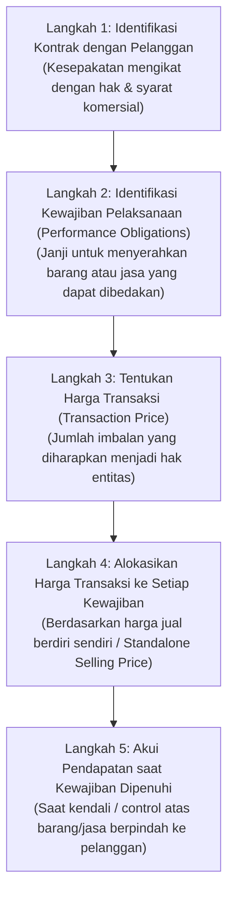
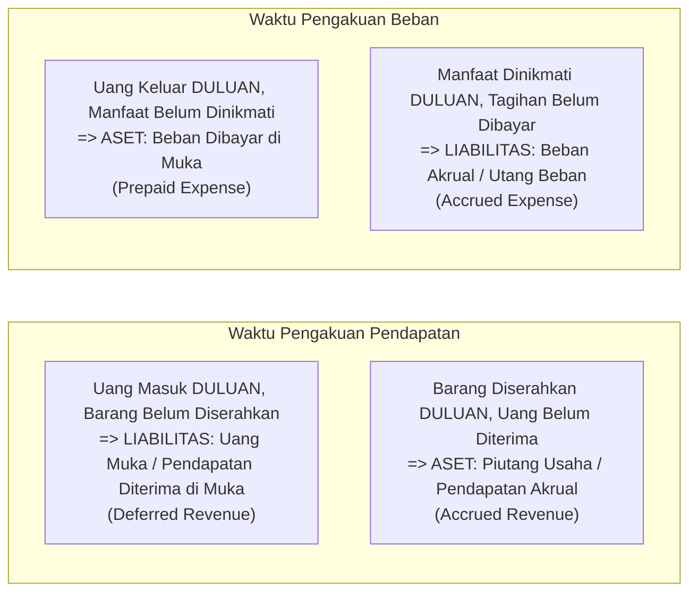

# Revenue and Expense Accounting

## Definition

Dalam akuntansi keuangan, pendapatan (*Revenue*) dan beban (*Expense*) adalah elemen-elemen yang mengukur kinerja finansial suatu entitas selama periode waktu tertentu:

* **Revenue (Pendapatan)**: Peningkatan manfaat ekonomi selama periode akuntansi dalam bentuk arus masuk atau peningkatan aset, atau penurunan liabilitas, yang mengakibatkan kenaikan ekuitas selain dari kontribusi pemilik.
* **Expense (Beban)**: Penurunan manfaat ekonomi selama periode akuntansi dalam bentuk arus keluar atau deplesi aset, atau timbulnya liabilitas, yang mengakibatkan penurunan ekuitas selain dari distribusi kepada pemilik.

Selisih antara pendapatan dan beban menghasilkan **Laba atau Rugi Bersih (*Net Profit or Loss*)**.

---

## The 5-Step Revenue Recognition Model (IFRS 15)

Standar akuntansi internasional **IFRS 15 (*Revenue from Contracts with Customers*)** mewajibkan kerangka kerja lima langkah (*5-Step Model*) untuk menentukan kapan dan berapa banyak pendapatan yang boleh diakui:

### Metode Pengakuan: Point in Time vs Over Time
1. **At a Point in Time (Titik Waktu Tertentu)**: Standar produk fisik (manufaktur dan retail). Pendapatan diakui seketika saat hak kepemilikan dan kendali fisik berpindah ke pembeli (misal: saat barang diserahkan ke kurir atau diterima di lokasi pembeli).
2. **Over Time (Sepanjang Waktu)**: Standar jasa, langganan (*SaaS / subscription*), atau proyek konstruksi. Pendapatan diakui bertahap seiring dengan berjalannya waktu atau persentase penyelesaian pekerjaan (*percentage of completion*).

---

## Expense Recognition Principles & The Matching Concept

Beban tidak diakui semata-mata karena ada uang keluar dari kas perusahaan. Pengakuan beban diatur oleh tiga prinsip:

1. **Direct Association / Cause-and-Effect Matching (Prinsip Penandingan Langsung)**:
   * Beban diakui pada periode yang sama dengan pengakuan pendapatan yang dihasilkannya.
   * *Contoh*: Beban Pokok Penjualan (**COGS**) sebesar Rp7.000.000 hanya boleh diakui pada saat Pendapatan Penjualan barang tersebut sebesar Rp10.000.000 diakui.
2. **Systematic and Rational Allocation (Alokasi Sistematis & Rasional)**:
   * Jika aset memberikan manfaat ekonomi selama beberapa periode akuntansi masa depan, biayanya dialokasikan bertahap.
   * *Contoh*: Penyusutan mesin pabrik (*Depreciation*) atau amortisasi perangkat lunak.
3. **Immediate Recognition (Pengakuan Seketika)**:
   * Biaya yang tidak memberikan manfaat ekonomi masa depan yang terukur langsung dibebankan pada periode terjadinya.
   * *Contoh*: Beban gaji staf administrasi, beban riset & pengembangan awal, atau beban iklan pemasaran.

---

## Cash Movement vs Accounting Recognition

Tabel berikut menunjukkan perbedaan tajam antara pergerakan uang tunai fisik dan pengakuan akuntansi sesuai asas akrual:

---

## Jurnal Akuntansi Transaksi Pendapatan & Beban

### 1. Pendapatan Diterima di Muka (*Deferred Revenue / Customer Advance*)
* **Kasus**: Pelanggan membayar uang muka langganan perangkat lunak cloud selama 1 tahun sebesar Rp12.000.000 pada tanggal 1 Januari.
* **Jurnal Saat Kas Diterima (1 Januari)**:

| Akun | Kategori | Debit (Rp) | Kredit (Rp) |
|---|---|---:|---:|
| Bank Operasional | Asset | 12.000.000 | - |
| Pendapatan Diterima di Muka (*Deferred Revenue*) | Liability | - | 12.000.000 |

* **Jurnal Pengakuan Bulanan (Tiap Akhir Bulan, Rp1.000.000 per bulan)**:

| Akun | Kategori | Debit (Rp) | Kredit (Rp) |
|---|---|---:|---:|
| Pendapatan Diterima di Muka (*Deferred Revenue*) | Liability | 1.000.000 | - |
| Pendapatan Jasa Langganan (*Subscription Revenue*) | Revenue | - | 1.000.000 |

---

### 2. Beban Dibayar di Muka (*Prepaid Expense*)
* **Kasus**: Perusahaan membayar sewa kantor untuk 12 bulan ke depan sebesar Rp24.000.000 pada tanggal 1 Januari.
* **Jurnal Saat Kas Keluar (1 Januari)**:

| Akun | Kategori | Debit (Rp) | Kredit (Rp) |
|---|---|---:|---:|
| Sewa Dibayar di Muka (*Prepaid Rent*) | Asset | 24.000.000 | - |
| Bank Operasional | Asset | - | 24.000.000 |

* **Jurnal Amortisasi Beban Bulanan (Tiap Akhir Bulan, Rp2.000.000 per bulan)**:

| Akun | Kategori | Debit (Rp) | Kredit (Rp) |
|---|---|---:|---:|
| Beban Sewa Gedung (*Rent Expense*) | Expense | 2.000.000 | - |
| Sewa Dibayar di Muka (*Prepaid Rent*) | Asset | - | 2.000.000 |

---

### 3. Beban Akrual (*Accrued Expense*)
* **Kasus**: Karyawan telah bekerja selama bulan September, namun gaji sebesar Rp50.000.000 baru akan ditransfer pada tanggal 5 Oktober.
* **Jurnal Penyesuaian Tutup Buku (30 September)**:

| Akun | Kategori | Debit (Rp) | Kredit (Rp) |
|---|---|---:|---:|
| Beban Gaji Karyawan (*Salaries Expense*) | Expense | 50.000.000 | - |
| Utang Gaji (*Salaries Payable*) | Liability | - | 50.000.000 |

* **Jurnal Saat Pembayaran Gaji Ditransfer (5 Oktober)**:

| Akun | Kategori | Debit (Rp) | Kredit (Rp) |
|---|---|---:|---:|
| Utang Gaji (*Salaries Payable*) | Liability | 50.000.000 | - |
| Bank Operasional | Asset | - | 50.000.000 |

---

## ERP Automation: Deferred Revenue & Expense Schedules

ERP enterprise menyediakan modul otomatisasi jadwal penangguhan (*Revenue & Expense Deferral Schedules*):
1. Pengguna membuat tagihan pembelian sewa 1 tahun dengan menandai tanggal mulai dan berakhir (*service start & end date*).
2. Sistem otomatis membuat jadwal 12 jurnal penyesuaian periodik di masa depan (*recurring amortization schedule*).
3. Setiap tanggal tutup buku bulanan, ERP otomatis memposting jurnal pengakuan beban tanpa perlu kalkulasi manual di spreadsheet.

---

## Related Concepts

* [[02-accounting/accounting-fundamentals|Accounting Fundamentals]] — Asas akrual dan elemen laporan laba rugi.
* [[02-accounting/accrual-and-adjusting-entries|Accrual and Adjusting Entries]] — Mekanisme teknis penyesuaian akhir periode.
* [[01-business-processes/order-to-cash|Order to Cash (O2C)]] — Alur operasional penagihan dan pengakuan pendapatan.

---

## References

1. **IFRS Foundation**: *IFRS 15 Revenue from Contracts with Customers*. URL: https://www.ifrs.org/issued-standards/list-of-standards/ifrs-15-revenue-from-contracts-with-customers/
2. **IFRS Foundation**: *Conceptual Framework for Financial Reporting (Elements and Recognition Chapters)*.
3. **Microsoft Learn**: *Subscription billing and revenue recognition in Dynamics 365 Finance*. URL: https://learn.microsoft.com/en-us/dynamics365/finance/accounts-receivable/revenue-recognition-overview
4. **Frappe / ERPNext Documentation**: *Deferred Accounting (Deferred Revenue and Deferred Expense)*. URL: https://docs.frappe.io/erpnext/user/manual/en/accounts/deferred-revenue
