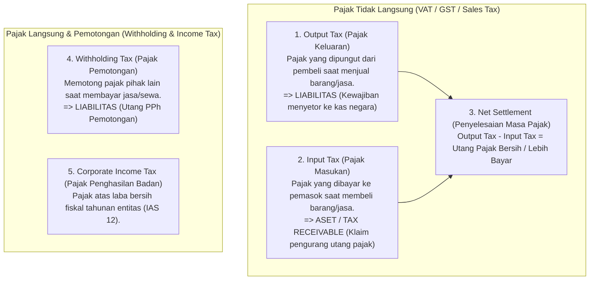

# Tax Accounting in ERP

## Definition

**Tax Accounting (Akuntansi Perpajakan)** dalam sistem ERP adalah cabang akuntansi yang mengatur pengakuan, perhitungan, pencatatan jurnal, dan rekonsiliasi kewajiban pajak perusahaan kepada otoritas perpajakan negara, serta memastikan kepatuhan pelaporan berkala (*statutory tax compliance*).

Dalam konteks ERP, akuntansi pajak beroperasi sebagai mesin pemungutan otomatis (*tax calculation engine*) yang disematkan langsung pada modul Penjualan, Pembelian, Penggajian, dan Pembukuan Buku Besar.

---

## Universal Tax Accounting Principles

Secara konseptual di seluruh dunia, pajak dalam transaksi bisnis dibagi menjadi beberapa kelompok akuntansi utama:

---

## The Value Added Tax (VAT) Settlement Cycle

Pajak Pertambahan Nilai (PPN) atau *Goods and Services Tax (GST)* menggunakan mekanisme pengkreditan (*credit invoice method*):

### 1. Saat Penjualan: Pencatatan Pajak Keluaran (*Output Tax*)
Perusahaan memungut pajak dari pembeli atas penjualan barang Rp10.000.000 (PPN 11% = Rp1.100.000). Perusahaan tidak berhak atas uang Rp1.100.000 tersebut, melainkan hanya bertindak sebagai pemungut titipan pemerintah:

| Akun | Kategori | Debit (Rp) | Kredit (Rp) |
|---|---|---:|---:|
| Piutang Usaha (*AR*) | Asset | 11.100.000 | - |
| Pendapatan Penjualan | Revenue | - | 10.000.000 |
| Utang PPN Keluaran (*VAT Output Payable*) | **Liability** | - | **1.100.000** |

---

### 2. Saat Pembelian: Pencatatan Pajak Masukan (*Input Tax*)
Perusahaan membayar pajak kepada pemasok atas pembelian bahan baku Rp7.000.000 (PPN 11% = Rp770.000). Nilai ini diakui sebagai hak tagih/aset pajak:

| Akun | Kategori | Debit (Rp) | Kredit (Rp) |
|---|---|---:|---:|
| Persediaan Bahan Baku | Asset | 7.000.000 | - |
| PPN Masukan (*VAT Input Receivable*) | **Asset** | **770.000** | - |
| Utang Usaha (*AP*) | Liability | - | 7.770.000 |

---

### 3. Akhir Masa Pajak: Pengimbangan & Penyetoran (*Tax Settlement*)
Pada akhir bulan pajak, sistem ERP mengoffset akun Pajak Keluaran dengan Pajak Masukan:
$$\text{PPN Kurang Bayar} = \text{PPN Keluaran} (\text{Rp1.100.000}) - \text{PPN Masukan} (\text{Rp770.000}) = \mathbf{Rp330.000}$$

* **Jurnal Rekonsiliasi & Penutupan Masa Pajak**:

| Akun | Kategori | Debit (Rp) | Kredit (Rp) |
|---|---|---:|---:|
| Utang PPN Keluaran (Menutup Akun) | Liability | 1.100.000 | - |
| PPN Masukan (Menutup Akun) | Asset | - | 770.000 |
| Utang PPN Bersih Kurang Bayar (*Net VAT Payable*) | Liability | - | 330.000 |

* **Jurnal Saat Menyetor ke Kas Negara via Bank**:

| Akun | Kategori | Debit (Rp) | Kredit (Rp) |
|---|---|---:|---:|
| Utang PPN Bersih Kurang Bayar | Liability | 330.000 | - |
| Bank Operasional | Asset | - | 330.000 |

---

## Withholding Tax (Pajak Pemotongan Pihak Ketiga)

Ketika entitas membeli jasa profesional (misal: jasa konsultan hukum Rp10.000.000), regulasi pajak sering kali mewajibkan pembeli untuk **memotong sebagian pembayaran** dan menyetorkannya langsung ke kas negara atas nama pihak yang dipotong:

> **Contoh Konteks Indonesia (PPh Pasal 23 - Tarif 2%)**:
> * Nilai Jasa Konsultan: Rp10.000.000
> * Pemotongan PPh 23 (2%): Rp200.000
> * Kas Bersih Ditransfer ke Konsultan: Rp9.800.000

| Akun | Kategori | Debit (Rp) | Kredit (Rp) |
|---|---|---:|---:|
| Beban Jasa Profesional / Konsultan | Expense | 10.000.000 | - |
| Utang PPh Pasal 23 Pemotongan | Liability | - | 200.000 |
| Bank Operasional / Utang Usaha | Asset / Liab. | - | 9.800.000 |

*Perusahaan kemudian menerbitkan Bukti Potong Pajak resmi kepada konsultan dan menyetorkan Rp200.000 tersebut ke kas negara.*

---

## Corporate Income Tax (Pajak Penghasilan Badan - IAS 12)

Pada akhir tahun buku, perusahaan menghitung taksiran pajak penghasilan atas laba fiskal:

| Akun | Kategori | Debit (Rp) | Kredit (Rp) |
|---|---|---:|---:|
| Beban Pajak Penghasilan Badan (*Current Tax Expense*) | Expense (P&L) | 25.000.000 | - |
| Utang PPh Badan (*Income Tax Payable*) | Liability | - | 25.000.000 |

Jika terdapat pembayaran angsuran pajak selama tahun berjalan (misal: PPh Pasal 25 di Indonesia), saldo uang muka pajak tersebut didebit sebagai aset (*Prepaid Income Tax*) dan dikreditkan saat perhitungan akhir tahun.

---

## Rekonsiliasi Pajak di ERP: Subledger Pajak vs Buku Besar

Dalam implementasi ERP, selisih sering terjadi antara angka pembukuan akuntansi dan angka pada pelaporan SPT pajak akibat:
1. **Perbedaan Waktu (*Timing Differences*)**: Faktur komersial terbit bulan ini, namun faktur pajak baru disetujui bulan berikutnya.
2. **Faktur Pajak Cacat / Batal**: Transaksi dibatalkan di aplikasi pajak (*e-Faktur*) namun jurnal pembatalan belum diposting di GL.
3. **Pajak Tidak Dapat Dikreditkan**: Biaya konsumsi pribadi atau pengeluaran tanpa bukti potong resmi yang wajib dikoreksi fiskal positif.

Modul perpajakan ERP menyediakan laporan **VAT Reconciliation Report** untuk memastikan bahwa setiap baris faktur di GL memiliki nomor seri faktur pajak resmi yang tervalidasi.

---

## Related Concepts

* [[01-business-processes/order-to-cash|Order to Cash (O2C)]] — Pemungutan PPN Keluaran pada faktur penjualan.
* [[01-business-processes/procure-to-pay|Procure to Pay (P2P)]] — Pencatatan PPN Masukan pada tagihan pemasok.
* [[02-accounting/financial-statements|Financial Statements]] — Penyajian kewajiban pajak lancar di neraca.

---

## References

1. **IFRS Foundation**: *IAS 12 Income Taxes*. URL: https://www.ifrs.org/issued-standards/list-of-standards/ias-12-income-taxes/
2. **Direktorat Jenderal Pajak (DJP) RI**: *Undang-Undang Harmonisasi Peraturan Perpajakan (UU HPP No. 7 Tahun 2021) mengenai PPN dan PPh*. URL: https://pajak.go.id/
3. **OECD**: *Consumption Tax Trends - VAT/GST and Excise Rates, Trends and Policy Issues*.
4. **Microsoft Learn**: *Tax calculation and sales tax settlement in Dynamics 365 Finance*. URL: https://learn.microsoft.com/en-us/dynamics365/finance/general-ledger/sales-tax-calculation-methods
