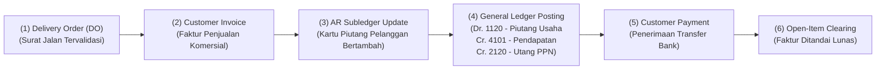
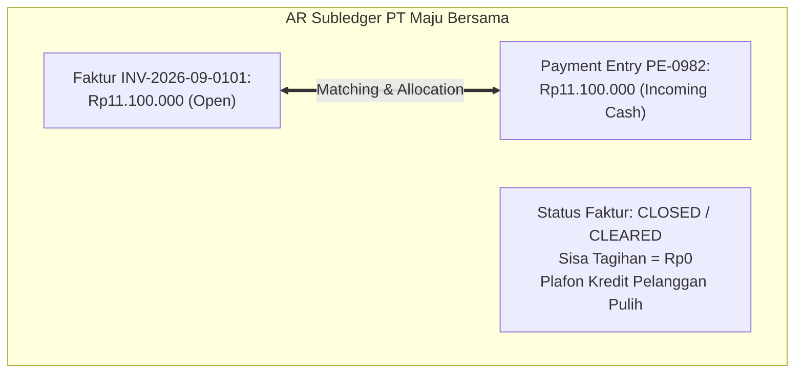

# Accounts Receivable Integration

## Definition

**Accounts Receivable Integration (Integrasi Piutang Usaha)** dalam sistem ERP adalah mekanisme penyerahan data otomatis dari modul operasional Penjualan (*Sales*) ke modul Keuangan (*Finance & Accounts Receivable / AR*) pada saat diterbitkannya dokumen **Faktur Penjualan (*Customer Invoice / Sales Invoice*)**.

Integrasi ini menandai transisi dari **kegiatan operasional penyerahan barang** menjadi **timbulnya hak klaim finansial legal (*legal claim for payment*)** atas kas atau aset keuangan lainnya dari pelanggan.

Rincian perlakuan akuntansi buku pembantu piutang dan standar IFRS 9 telah dibahas mendalam pada [[02-accounting/accounts-receivable|Accounts Receivable Accounting]] serta [[02-accounting/general-ledger-and-subledger|General Ledger and Subledger]].

---

## Business Purpose

Integrasi otomatis antara Sales dan AR bertujuan untuk:
1. **Meniadakan Penundaan Penagihan (*Billing Latency Reduction*)**: Mengeliminasi keterlambatan pencatatan faktur yang sering terjadi jika bagian penagihan menunggu laporan fisik surat jalan dari gudang.
2. **Manajemen Saldo Terbuka (*Open-Item Tracking*)**: Memastikan setiap rupiah pembayaran yang diterima dari pelanggan dapat dialokasikan (*matched & cleared*) secara presisi ke nomor faktur tertentu.
3. **Pemantauan Otomatis Umur Piutang (*Automated Aging Schedule*)**: Menghitung tanggal jatuh tempo (*Due Date*) berdasarkan termin pembayaran secara instan untuk mendeteksi piutang macet sejak dini.
4. **Pemulihan Plafon Kredit Real-Time**: Memulihkan batas kredit pelanggan seketika setelah pembayaran bank dikonfirmasi masuk (*cleared*).

---

## The Sales-to-AR Data Pipeline

Aliran data dari modul penjualan bermuara ke subledger piutang melalui alur berikut:

---

## Anatomi Faktur Penjualan (Customer Invoice)

Dokumen Faktur Penjualan memadukan data komersial dari *Sales Order* dan data fisik dari *Delivery Order*:

* **Nomor Seri Faktur & Tanggal**:
  * *Invoice Number*: Nomor identifikasi penagihan (misal: `INV-2026-09-0101`).
  * *Posting Date*: Tanggal efektif transaksi memengaruhi laporan laba rugi dan buku besar.
  * *Document Date*: Tanggal fisik diterbitkannya lembar faktur komersial.
* **Kalkulasi Tanggal Jatuh Tempo (*Due Date Calculation*)**:
  Dihitung otomatis dari tanggal faktur ditambah termin pembayaran (*Payment Terms*):
  $$\mathbf{Due\ Date = Invoice\ Posting\ Date + Payment\ Term\ Days}$$
  *Contoh*: Faktur diposting 20 September 2026 dengan termin *Net 30* $\implies$ Jatuh tempo: **20 Oktober 2026**.
* **Identitas Pajak Resmi**: Nomor Seri Faktur Pajak (NSFP) untuk validasi SPT Masa PPN (lihat [[03-sales/sales-tax|Sales Tax]]).
* **Detail Baris Tagihan**: Kuantitas yang dikirim, harga satuan terkunci, diskon yang disepakati, dan tarif PPN per item.

---

## Jurnal Akuntansi Penjualan dan Piutang (Accounting Impact)

Melanjutkan skenario acuan pesanan 10 unit *Laptop Pro* dari PT Maju Bersama:
* Nilai Penjualan Bersih: Rp10.000.000
* PPN Keluaran 11%: Rp1.100.000
* Total Tagihan Piutang: **Rp11.100.000**

### 1. Jurnal Saat Penerbitan Faktur Penjualan (Billing Event):

| Akun | Kategori | Debit (Rp) | Kredit (Rp) |
|---|---|---:|---:|
| Piutang Usaha (*Accounts Receivable*) | Asset (AR Subledger) | 11.100.000 | - |
| Pendapatan Penjualan (*Sales Revenue*) | Revenue (P&L) | - | 10.000.000 |
| Utang PPN Keluaran (*VAT Output*) | Liability (Neraca) | - | 1.100.000 |

* **Dampak Sistem**:
  * Akun kontrol `1120 - Piutang Usaha` di GL bertambah Rp11.100.000.
  * Di **AR Subledger**, kartu piutang PT Maju Bersama mencatat tagihan terbuka (*Open Item*) sebesar Rp11.100.000 dengan jatuh tempo 20 Oktober 2026.
  * *Plafon kredit pelanggan berkurang sebesar Rp11.100.000.*

---

## Penerimaan Pembayaran & Rekonsiliasi Terbuka (Settlement & Clearing)

Saat pelanggan melunasi tagihan melalui transfer rekening bank perusahaan pada tanggal 10 Oktober 2026:

### 2. Jurnal Pelunasan Piutang (Payment Receipt):

| Akun | Kategori | Debit (Rp) | Kredit (Rp) |
|---|---|---:|---:|
| Bank Operasional | Asset | 11.100.000 | - |
| Piutang Usaha (*Accounts Receivable*) | Asset (AR Subledger) | - | 11.100.000 |

### Metode Alokasi Pembayaran (*Payment Allocation Modes*):
1. **Specific Invoice Matching (Pencocokan per Faktur)**: Pembeli mencantumkan nomor referensi faktur `INV-2026-09-0101` pada berita transfer bank. Sistem mencocokkan dana masuk secara spesifik ke faktur tersebut.
2. **FIFO Allocation (First-In, First-Out)**: Jika pembeli mentransfer pembayaran bulat tanpa menyebut nomor faktur, sistem mengalokasikan pembayaran untuk melunasi faktur-faktur tertua yang paling mendekati jatuh tempo.

---

## Variasi Penagihan Finansial

1. **Partial Payment (Pembayaran Sebagian)**:
   * Pelanggan membayar Rp5.000.000 dari total tagihan Rp11.100.000.
   * Status faktur berubah menjadi `Partially Paid` dengan sisa saldo terbuka (*Remaining Open Balance*) sebesar Rp6.100.000.
2. **Cash Discounts (Potongan Pelunasan Dini)**:
   * Jika termin pembayaran adalah *2/10, Net 30* dan pelanggan membayar dalam 10 hari, pelanggan berhak memotong diskon 2% atas DPP barang (2% $\times$ Rp10.000.000 = Rp200.000).
   * Kas diterima: Rp10.900.000; selisih Rp200.000 didebit ke akun `Potongan Penjualan (Sales Cash Discount)` (lihat [[02-accounting/accounts-receivable|Accounts Receivable Accounting]]).
3. **Customer Overpayment (Kelebihan Bayar)**:
   * Kelebihan dana yang ditransfer pelanggan dicatat sebagai uang muka/kredit pelanggan (*Unallocated Customer Credit*) dan dapat dialokasikan untuk memotong faktur penjualan berikutnya.

---

## Related Concepts

* [[02-accounting/accounts-receivable|Accounts Receivable Accounting]] — Manajemen subledger piutang dan cadangan ECL IFRS 9.
* [[02-accounting/general-ledger-and-subledger|General Ledger and Subledger]] — Sinkronisasi akun kontrol GL dan buku pembantu pelanggan.
* [[03-sales/customer-credit-management|Customer Credit Management]] — Dampak penagihan terhadap plafon kredit.
* [[03-sales/revenue-recognition|Revenue Recognition]] — Pemisahan waktu penagihan dan pengakuan pendapatan.

---

## References

1. **IFRS Foundation**: *IFRS 9 Financial Instruments - Financial Assets at Amortised Cost (Trade Receivables)*. URL: https://www.ifrs.org/issued-standards/list-of-standards/ifrs-9-financial-instruments/
2. **Microsoft Learn**: *Customer invoicing, payment journals, and settlement in Dynamics 365 Finance*. URL: https://learn.microsoft.com/en-us/dynamics365/finance/accounts-receivable/customer-invoices-overview
3. **Frappe / ERPNext Documentation**: *Sales Invoice, Payment Reconciliation Tool, and Match Entries*. URL: https://docs.frappe.io/erpnext/user/manual/en/accounts/sales-invoice
4. **Odoo Documentation**: *Customer Invoices, Payment Matching, and Aged Receivables*. URL: https://www.odoo.com/documentation/17.0/applications/finance/accounting/customer_invoices.html
