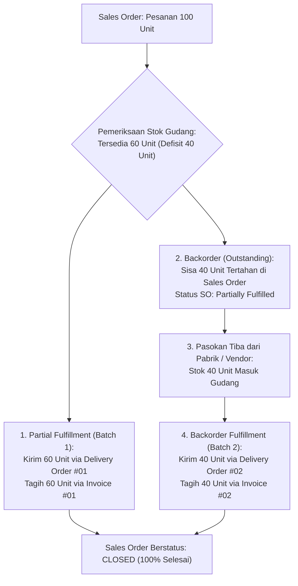

# Backorder and Partial Fulfillment

## Definition

Dalam sistem ERP, ketidaksesuaian antara volume pesanan pelanggan dan kapasitas persediaan gudang ditangani melalui dua mekanisme operasional:

1. **Partial Fulfillment (Pemenuhan Parsial)**: Pengiriman sebagian kuantitas barang yang telah siap di gudang untuk memenuhi pesanan pelanggan secepat mungkin, tanpa menunggu seluruh pesanan lengkap.
2. **Backorder (Pesanan Tertunda)**: Sisa kuantitas barang yang belum dapat dipenuhi karena kekurangan stok (*stock shortage*), yang tetap dipertahankan dalam status komitmen terbuka (*open commitment*) pada baris *Sales Order* hingga pasokan baru tiba.

Mekanisme ini memastikan perusahaan tidak kehilangan transaksi penjualan (*lost sales*) saat terjadi lonjakan permintaan mendadak atau keterlambatan pasokan dari pabrik.

---

## Business Purpose

Implementasi penanganan *backorder* dan pemenuhan parsial bertujuan untuk:
1. **Memaksimalkan Kepuasan Pelanggan (*Customer Service Level*)**: Memberikan fleksibilitas bagi pelanggan yang membutuhkan pasokan mendesak agar menerima barang yang tersedia terlebih dahulu.
2. **Optimalisasi Arus Kas Melalui Penagihan Bertahap (*Incremental Invoicing*)**: Memungkinkan perusahaan menagih dan mengakui pendapatan atas barang yang telah berhasil dikirim tanpa harus menunggu seluruh proyek pesanan rampung.
3. **Pemicu Otomatis Rantai Pasok Masuk (*Demand Propagation*)**: Meneruskan kuantitas kekurangan (*shortage quantity*) secara otomatis ke modul [[01-business-processes/manufacturing-process|Manufacturing (MRP)]] atau [[01-business-processes/procure-to-pay|Procurement (Purchase Order)]].

---

## Relasi Matematis Kuantitas Pemenuhan Parsial

Setiap baris dokumen *Sales Order* di ERP melacak status kuantitas pemenuhan dengan persamaan matematis yang saling mengunci:

$$\mathbf{Ordered\ Quantity = Delivered\ Quantity + Backorder\ (Outstanding)\ Quantity}$$

$$\mathbf{Delivered\ Quantity = \sum_{k=1}^{n} Delivery\ Order\ Quantity_k}$$

$$\mathbf{Invoiced\ Quantity = \sum_{k=1}^{n} Customer\ Invoice\ Quantity_k}$$

---

## Kebijakan Pemenuhan Pelanggan (*Delivery Policy Options*)

Tidak semua pelanggan bersedia menerima pengiriman secara parsial. Pada master data pelanggan atau header *Sales Order*, ERP menyediakan pengaturan kebijakan pengiriman (*Delivery Policy*):

1. **Partial Delivery Allowed (Boleh Kirim Sebagian)**:
   * Pengaturan default untuk sebagian besar distribusi B2B. Gudang akan mengirimkan barang berapapun kuantitas yang tersedia saat ini, dan membuat *backorder* untuk sisanya.
2. **Complete Delivery Required / Ship Complete (Wajib Kirim Lengkap Sekaligus)**:
   * Gudang dilarang menerbitkan *Pick List* atau *Delivery Order* hingga seluruh baris barang dan seluruh kuantitas pesanan tersedia lengkap di gudang. Biasa digunakan untuk pesanan proyek instalasi mesin yang tidak dapat dirakit jika salah satu suku cadangnya hilang.

---

## Skenario Numerik: Variasi Pengiriman Parsial dari Baseline Acuan

Mari kita simulasikan pesanan acuan **10 unit Laptop Pro** dari PT Maju Bersama ketika terjadi kendala persediaan gudang:
* **Nilai Kontrak Total**: 10 unit @ Rp1.000.000 = Rp10.000.000 (+ PPN 11% Rp1.100.000 = **Rp11.100.000**).
* **Estimasi COGS Total**: 10 unit @ Rp700.000 = **Rp7.000.000**.
* **Kondisi Stok Gudang**: Hanya tersedia **6 unit** di gudang. Defisit **4 unit** dijadikan *backorder*.

### Tahap 1: Pengiriman & Penagihan Batch Pertama (6 Unit - 20 September)
Gudang mengirimkan 6 unit barang yang tersedia:
* Nilai Pengiriman: 6 unit @ Rp1.000.000 = Rp6.000.000 (PPN 11% = Rp660.000). Total Tagihan = **Rp6.660.000**.
* Nilai COGS Pengiriman: 6 unit @ Rp700.000 = **Rp4.200.000**.

#### Jurnal Pengiriman Fisik Batch 1 (Surat Jalan `DO-001`):
* **Debit**: Beban Pokok Penjualan (*COGS*) = Rp4.200.000
* **Kredit**: Persediaan Barang Dagang = Rp4.200.000

#### Jurnal Penagihan Batch 1 (Faktur `INV-001`):
* **Debit**: Piutang Usaha (*AR*) = Rp6.660.000
* **Kredit**: Pendapatan Penjualan = Rp6.000.000
* **Kredit**: Utang PPN Keluaran = Rp660.000

*Status Sales Order di sistem: `Partially Fulfilled` (Ordered = 10, Delivered = 6, Backorder = 4).*

---

### Tahap 2: Pengiriman & Penagihan Batch Kedua / Backorder (4 Unit - 28 September)
Pabrik menyelesaikan perakitan 4 unit laptop tambahan dan menyerahkannya ke gudang. Sistem otomatis mendeteksi komitmen *backorder* dan menerbitkan surat jalan kedua:
* Nilai Pengiriman: 4 unit @ Rp1.000.000 = Rp4.000.000 (PPN 11% = Rp440.000). Total Tagihan = **Rp4.440.000**.
* Nilai COGS Pengiriman: 4 unit @ Rp700.000 = **Rp2.800.000**.

#### Jurnal Pengiriman Fisik Batch 2 (Surat Jalan `DO-002`):
* **Debit**: Beban Pokok Penjualan (*COGS*) = Rp2.800.000
* **Kredit**: Persediaan Barang Dagang = Rp2.800.000

#### Jurnal Penagihan Batch 2 (Faktur `INV-002`):
* **Debit**: Piutang Usaha (*AR*) = Rp4.440.000
* **Kredit**: Pendapatan Penjualan = Rp4.000.000
* **Kredit**: Utang PPN Keluaran = Rp440.000

---

### Rekonsiliasi Akhir Akumulatif:
* **Total Kuantitas Terkirim**: $6 + 4 = \mathbf{10\ unit}$ (Backorder tersisa = 0).
* **Total Piutang Usaha**: $\text{Rp6.660.000} + \text{Rp4.440.000} = \mathbf{Rp11.100.000}$.
* **Total Pendapatan Bersih**: $\text{Rp6.000.000} + \text{Rp4.000.000} = \mathbf{Rp10.000.000}$.
* **Total Beban Pokok Penjualan (COGS)**: $\text{Rp4.200.000} + \text{Rp2.800.000} = \mathbf{Rp7.000.000}$.
* *Status Sales Order*: Otomatis berubah menjadi **`Closed / Completed`**.

Angka akumulatif di atas **sama persis 100% dengan skenario acuan transaksi baseline**, membuktikan integritas matematis sistem penagihan bertahap ERP.

---

## Opsi Pembatalan Sisa Backorder (*Backorder Cancellation*)

Jika pelanggan tidak bersedia menunggu pasokan batch kedua dan memutuskan untuk membeli 4 unit sisanya dari kompetitor:
1. Pelanggan meminta penutupan pesanan lebih awal (*Close Short*).
2. Staf penjualan mengeksekusi aksi pembatalan sisa (*Cancel Outstanding Quantity*):
   * Kuantitas yang dibatalkan: 4 unit.
   * Kuantitas komitmen reservasi dihapus dari sistem.
   * Status pesanan berubah menjadi `Closed (Partially Fulfilled)`.
   * Tidak ada faktur kedua yang diterbitkan.

---

## Related Concepts

* [[03-sales/sales-order|Sales Order]] — Pelacakan status kuantitas pemesanan dan komitmen.
* [[03-sales/order-fulfillment|Order Fulfillment]] — Logika pemeriksaan ketersediaan stok fisik gudang.
* [[03-sales/delivery-and-shipping|Delivery and Shipping]] — Penerbitan surat jalan multi-tahap.
* [[03-sales/sales-cancellation-and-amendment|Sales Cancellation and Amendment]] — Prosedur pembatalan sisa kuantitas pesanan.

---

## References

1. **Association for Supply Chain Management (ASCM)**: *APICS Dictionary - Backorder Processing, Order Splitting, and Fill Rate*.
2. **Microsoft Learn**: *Partial shipments, backorders, and delivery schedules in Dynamics 365 Supply Chain Management*. URL: https://learn.microsoft.com/en-us/dynamics365/supply-chain/sales-marketing/delivery-schedules
3. **Frappe / ERPNext Documentation**: *Partial Invoicing and Partial Delivery from Sales Order*. URL: https://docs.frappe.io/erpnext/user/manual/en/selling/sales-order#partial-delivery
4. **Odoo Documentation**: *Managing Backorders and Multi-Step Deliveries*. URL: https://www.odoo.com/documentation/17.0/applications/inventory_and_mrp/inventory/shipping/setup/delivery_two_steps.html
