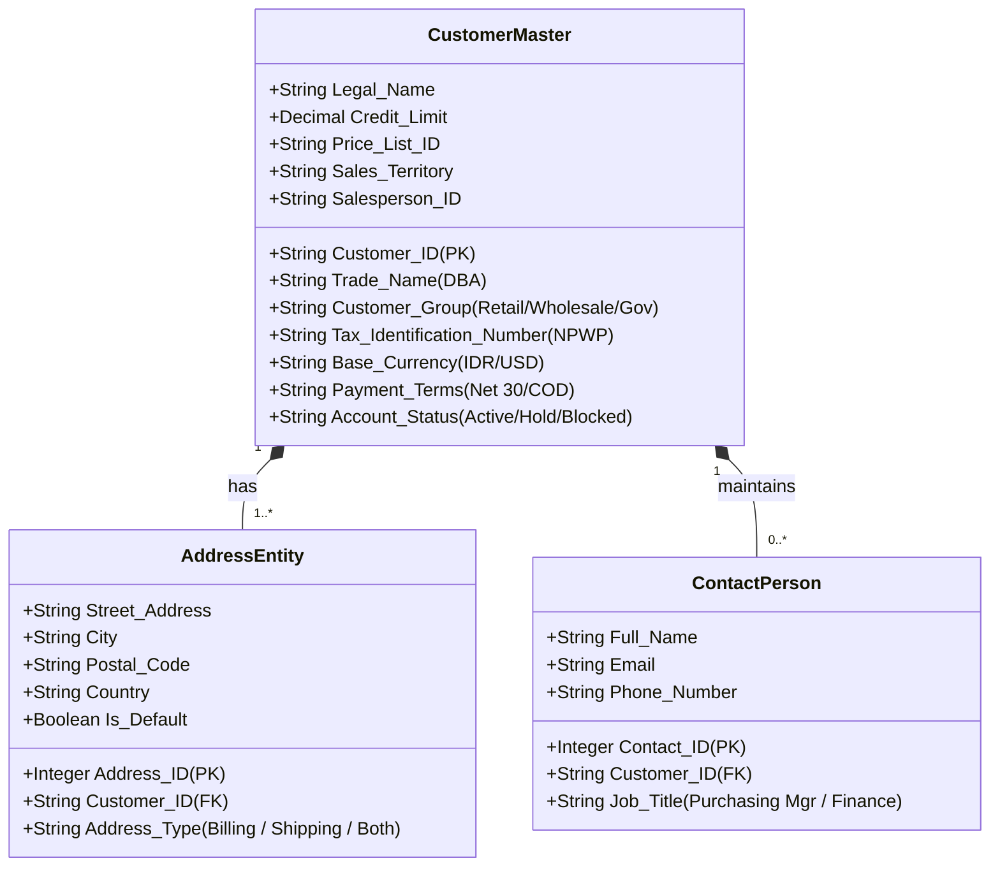
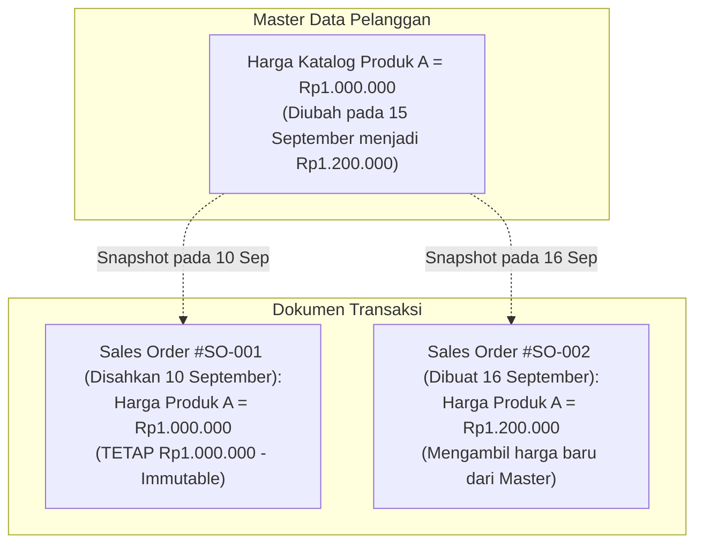

# Customer and Sales Master Data

## Definition

**Sales Master Data (Data Induk Penjualan)** adalah kumpulan entitas data inti yang bersifat jangka panjang, relatif statis, dan menjadi fondasi utama bagi seluruh transaksi penjualan dalam sistem ERP. Dua pilar master data paling esensial dalam siklus penjualan adalah:

1. **Customer Master Data (Data Induk Pelanggan)**: Catatan terpusat mengenai identitas hukum, komersial, logistik, dan finansial dari entitas luar yang membeli barang atau jasa perusahaan.
2. **Product / Service Master Data (Data Induk Produk dan Jasa)**: Catatan terpusat mengenai barang fisik maupun layanan non-fisik yang ditawarkan ke pasar beserta aturan penetapan harga, pajak, dan penanganan logistiknya.

Perbedaan fundamental antara data statis dan data dinamis ini dibangun di atas prinsip [[00-fundamentals/master-data-vs-transaction-data|Master Data vs Transaction Data]].

---

## Business Purpose

Pengelolaan Master Data Penjualan yang terstandarisasi bertujuan untuk:
1. **Otomatisasi Input Dokumen (*Zero Redundancy*)**: Saat staf memilih nama pelanggan pada *Sales Order*, sistem otomatis mengisi alamat penagihan, alamat pengiriman, termin pembayaran, daftar harga, dan mata uang tanpa perlu mengetik ulang.
2. **Penegakan Tata Kelola dan Kepatuhan (*Governance & Compliance*)**: Memastikan transaksi hanya dapat dilakukan kepada pelanggan yang telah disahkan legalitas dan batas kreditnya, serta menggunakan nomor identitas pajak resmi.
3. **Pemisahan Perlakuan Logistik vs Finansial**: Membedakan entitas fisik yang menerima barang (*Ship-to Party*) dari entitas legal yang bertanggung jawab melunasi tagihan (*Bill-to Party / Payer*).

---

## Anatomi Customer Master Data

Dalam arsitektur ERP enterprise, data induk pelanggan dikelompokkan ke dalam beberapa dimensi fungsional:

### Elemen Kunci Customer Master:

1. **Identitas Hukum & Kategori**:
   * *Customer ID & Legal Name*: Nama badan hukum resmi (misal: "PT Maju Bersama") untuk keperluan legalitas faktur komersial.
   * *Customer Group / Segment*: Pengelompokan untuk analisis (misal: Korporat, Distributor, Ritel, BUMN).
2. **Struktur Multi-Alamat (Billing vs Shipping)**:
   * **Billing Address (Alamat Penagihan)**: Lokasi kantor pusat atau bagian akuntansi pelanggan tempat faktur pajak dan komersial dikirimkan.
   * **Shipping Address (Alamat Pengiriman / Site)**: Satu pelanggan dapat memiliki banyak gudang atau lokasi proyek cabang untuk pengiriman fisik barang (*Ship-to locations*).
3. **Profil Pajak & Legalitas**:
   * *Tax Identification Number (NPWP/TIN)*: Nomor identitas pajak untuk validasi faktur pajak elektronik (lihat [[02-accounting/tax-accounting|Tax Accounting]]).
   * *Tax Exemption Flag*: Penanda apakah pelanggan bebas PPN (misal: kawasan berikat, perwakilan diplomatik).
4. **Parameter Finansial & Pembayaran**:
   * *Default Currency*: Mata uang dasar transaksi (misal: IDR atau USD).
   * *Payment Terms*: Syarat pembayaran baku (misal: *Net 30*, *Cash on Delivery (COD)*, atau *2/10 Net 30*).
   * *Credit Limit & Status*: Pagu kredit maksimal dan status operasional (*Active*, *Credit Hold*, *Blacklisted*).
5. **Konfigurasi Penjualan & Manajerial**:
   * *Default Price List*: Skema daftar harga yang berlaku untuk pelanggan ini (misal: *Harga Grosir Wilayah Barat*).
   * *Sales Territory & Salesperson*: Wilayah penjualan dan staf *Account Executive* penanggung jawab untuk perhitungan komisi.

---

## Anatomi Product & Service Master Data (Sisi Penjualan)

Master produk dari sudut pandang penjualan (*Sales View*) memiliki konfigurasi yang menentukan bagaimana sistem menangani barang tersebut saat transaksi berlangsung:

| Atribut Master Produk | Penjelasan & Fungsi Bisnis | Implikasi Logistik / Finansial |
|---|---|---|
| **Item Code / SKU** | Nomor identifikasi unik barang (misal: `LAP-PRO-01`). | Kunci pelacakan pesanan dan riwayat penjualan. |
| **Item Type** | *Stockable* (Barang Fisik), *Service* (Jasa Non-Fisik), atau *Consumable*. | Barang *Service* **tidak memerlukan Surat Jalan (Delivery Order)** dan tidak mengurangi stok gudang. |
| **Sales Unit of Measure (UOM)** | Satuan penjualan ke pelanggan (misal: *Box, Pcs, Pallet*). | Sistem mengonversi otomatis ke *Base UOM* gudang via *UOM Conversion Factor* (1 Box = 12 Pcs). |
| **Sales Status** | Status komersial: *Active*, *Discontinued*, atau *Blocked for Sale*. | Produk berstatus *Blocked* ditolak otomatis saat pembuatan *Sales Order*. |
| **Standard / List Price** | Harga patokan dasar sebelum diskon. | Menjadi baseline bagi *Pricing Engine*. |
| **Sales Tax Category** | Kategori pajak (misal: *PPN Standar 11%*, *Bebas PPN*, atau *Pajak Mewah*). | Menentukan akun liabilitas pajak keluaran yang dituju. |
| **Income Account Mapping** | Akun Buku Besar GL Pendapatan (*Account Determination*). | Menentukan akun pendapatan mana yang dikredit saat faktur diposting (misal: `4101 - Penjualan Elektronik`). |

---

## Snapshotting: Mengapa Transaksi Menyimpan Salinan Master Data?

Prinsip paling penting dalam integritas data penjualan ERP adalah **Prinsip Pengambilan Salinan Permanen (*Snapshotting Principle*)**:

> **Data transaksi (Sales Order, Invoice) harus membekukan (*snapshot*) nilai master data pada saat transaksi disahkan, dan TIDAK BOLEH berubah otomatis jika master data di kemudian hari diperbarui.**

Jika nama legal pelanggan, alamat kantor, atau harga produk pada master data diubah hari ini, seluruh dokumen *Sales Order* dan *Invoice* masa lalu **tetap mempertahankan nama, alamat, dan harga yang berlaku saat dokumen tersebut dibuat**. Hal ini esensial untuk menjaga keabsahan kontrak hukum dan keutuhan jejak audit (*audit trail*).

---

## Related Concepts

* [[00-fundamentals/master-data-vs-transaction-data|Master Data vs Transaction Data]] — Konsep dasar pemisahan entitas statis dan dinamis.
* [[00-fundamentals/organizational-structure|Organizational Structure]] — Penugasan pelanggan ke wilayah penjualan (*Sales Organization / Territory*).
* [[03-sales/pricing-and-discount|Pricing and Discount]] — Logika pemetaan daftar harga pelanggan.
* [[03-sales/customer-credit-management|Customer Credit Management]] — Tata kelola batas kredit operasional.

---

## References

1. **Association for Supply Chain Management (ASCM)**: *APICS Dictionary - Master Data Management in Manufacturing and Distribution*.
2. **Microsoft Learn**: *Customer and product master data management in Dynamics 365 Supply Chain Management*. URL: https://learn.microsoft.com/en-us/dynamics365/supply-chain/master-data/
3. **Frappe / ERPNext Documentation**: *Customer Master and Item Master Configuration*. URL: https://docs.frappe.io/erpnext/user/manual/en/CRM/customer
4. **Odoo Documentation**: *Managing Customers, Contact Addresses, and Pricelists*. URL: https://www.odoo.com/documentation/17.0/applications/sales/sales/send_quotations.html
