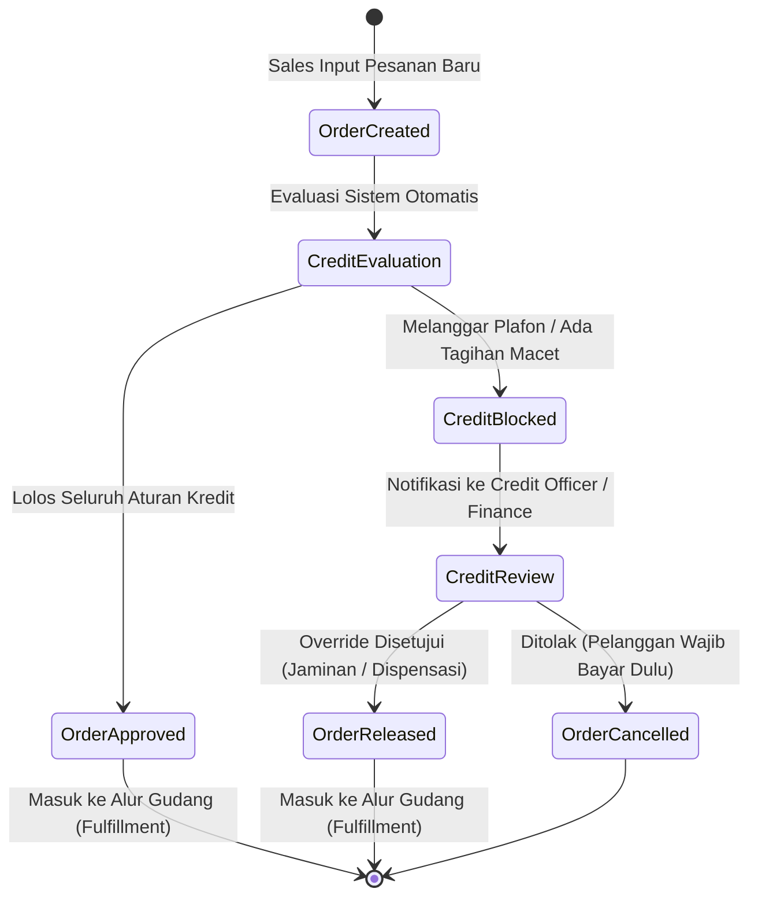

# Customer Credit Management

## Definition

**Customer Credit Management (Manajemen Batas Kredit Pelanggan)** dalam sistem ERP adalah modul pengendalian risiko operasional yang bertugas memantau, membatasi, dan mengendalikan pemberian fasilitas kredit komersial kepada pelanggan guna mencegah terjadinya gagal bayar (*default*) dan penumpukan piutang tak tertagih (*bad debt*).

Dalam arsitektur ERP enterprise, manajemen kredit beroperasi sebagai **gerbang penjaga (*risk gatekeeper*)** otomatis yang mengevaluasi kelayakan finansial pelanggan secara *real-time* setiap kali *Sales Order* dibuat atau barang hendak dikeluarkan dari gudang.

---

## Business Purpose

Implementasi manajemen kredit pelanggan bertujuan untuk:
1. **Pencegahan Risiko Piutang Macet Secara Preventif**: Mencegah staf penjualan terus meloloskan pesanan baru kepada pelanggan yang sudah bermasalah atau menunggak pembayaran.
2. **Keseimbangan Penjualan dan Keamanan Kas (*Growth vs Risk*)**: Mengakomodasi target pertumbuhan omzet penjualan tanpa mengorbankan arus kas (*cash flow*) dan solvabilitas perusahaan.
3. **Pemberlakuan Disiplin Syarat Pembayaran**: Mendorong pelanggan untuk melunasi tagihan tepat waktu agar fasilitas kredit mereka tetap aktif.
4. **Otomatisasi Penahanan & Persetujuan Khusus (*Credit Hold & Release*)**: Menghilangkan persetujuan manual harian, dan hanya melibatkan Manajer Keuangan jika pesanan melanggar aturan kredit yang telah ditetapkan.

---

## Kontrol Kredit Operasional vs Pencadangan Kerugian IFRS 9 (ECL)

Sangat penting untuk membedakan antara pengendalian kredit di modul Sales dengan pencadangan kerugian piutang di modul Accounting:

| Dimensi | Kontrol Kredit Operasional (*Credit Management*) | Pencadangan Kerugian Akuntansi (*IFRS 9 ECL*) |
|---|---|---|
| **Sifat Tindakan** | **Preventif (Pencegahan)** di gerbang awal transaksi. | **Restrospektif & Prospektif Finansial** di pelaporan berkala. |
| **Titik Eksekusi** | Saat pembuatan *Sales Order* atau *Delivery Order*. | Saat penutupan periode buku (*Period-End Closing*). |
| **Dampak Sistem** | Memblokir (*hold*) pesanan agar barang tidak dikirim. | Mencatat jurnal beban kerugian piutang (*ECL Expense*) di GL. |
| **Fokus Penilaian** | Total paparan kredit saat ini (*Credit Exposure*). | Matriks probabilitas gagal bayar historis dan makroekonomi. |
| **Modul ERP** | Modul Penjualan (*Sales*) & Logistik (*Warehouse*). | Modul Buku Besar (*General Ledger / AR Subledger*). |

Rincian perhitungan pencadangan kerugian piutang di bawah IFRS 9 dibahas pada [[02-accounting/accounts-receivable|Accounts Receivable Accounting]].

---

## Formula Perhitungan Paparan Kredit (Credit Exposure)

Kesalahan umum dalam sistem sederhana adalah hanya membandingkan batas kredit dengan piutang yang sudah jatuh tempo. ERP kelas enterprise menghitung **Total Paparan Risiko Kredit (*Total Credit Exposure*)** yang mencakup komitmen di seluruh siklus hidup transaksi:

$$\mathbf{Credit\ Exposure = Open\ AR + Unbilled\ Deliveries + Confirmed\ Sales\ Orders}$$

```mermaid
flowchart TD
    subgraph ExposureElements["Komponen Paparan Risiko Kredit"]
        AR["1. Open Accounts Receivable<br/>Faktur yang telah terbit dan belum dibayar."]
        UB["2. Unbilled Deliveries<br/>Barang sudah dikirim keluar gudang, faktur belum terbit."]
        SO["3. Confirmed Sales Orders<br/>Pesanan telah disetujui, barang masih disiapkan di gudang."]
    end

    AR --> Sum["Total Credit Exposure (Beban Risiko Aktif)"]
    UB --> Sum
    SO --> Sum

    Sum --> Check{"Apakah Total Exposure > Credit Limit?"}
    Check -->|Tidak (Aman)| Pass["Pesanan Lolos (Approved)"]
    Check -->|Ya (Melanggar)| Block["Pesanan Tertahan (Credit Hold)"]
```

* Jika batas kredit pelanggan adalah Rp20.000.000, maka gabungan dari faktur yang belum lunas, barang yang sedang di jalan, dan pesanan yang baru disetujui **tidak boleh melampaui Rp20.000.000**.

---

## Jenis Aturan Pemeriksaan Kredit (Credit Check Rules)

Sistem ERP mengevaluasi kelayakan kredit melalui beberapa aturan otomatis:

1. **Pemeriksaan Batas Kredit (*Credit Limit Check*)**:
   Memvalidasi apakah penambahan pesanan baru menyebabkan total paparan kredit melampaui plafon yang ditetapkan pada master data pelanggan.
2. **Pemeriksaan Faktur Kedaluwarsa (*Overdue Invoices Check*)**:
   Meskipun total batas kredit masih mencukupi, sistem akan memblokir pesanan baru jika pelanggan memiliki **faktur tertunggak yang telah melewati toleransi jatuh tempo (*Grace Period*)** (misal: ada faktur tertunggak > 15 hari).
3. **Pemeriksaan Nilai Maksimal per Pesanan (*Max Order Value*)**:
   Membatasi batas nominal tertinggi untuk satu kali transaksi pesanan tunggal.

---

## Alur Kerja Penahanan dan Pelepasan Pesanan (Credit Hold & Release)



### Opsi Tindakan Manajer Kredit (*Credit Manager Options*):
1. **Permintaan Pelunasan Segera**: Menginstruksikan staf penagihan untuk meminta pelanggan melunasi sebagian faktur lama agar plafon kredit kembali terbuka (*cleared*).
2. **Pelepasan dengan Dispensasi Khusus (*Temporary Credit Override*)**: Manajer keuangan menyetujui pelepasan pesanan secara manual dengan memasukkan alasan bisnis resmi (misal: jaminan direksi atau adanya pembayaran via cek mundur yang sedang kliring).
3. **Pengalihan ke Pembayaran Tunai (COD / Advance)**: Mengubah syarat pembayaran pesanan tersebut menjadi pembayaran di muka sebelum barang boleh dikirim.

---

## Skenario Acuan Transaksi: Simulasi Penahanan Kredit

Melanjutkan data acuan PT Maju Bersama:
* **Plafon Batas Kredit (*Credit Limit*)**: **Rp20.000.000**
* **Toleransi Keterlambatan (*Grace Period*)**: 7 Hari

### Kronologi Transaksi:
1. **Kondisi Berjalan (15 September 2026)**:
   * Saldo Faktur Terbuka (*Open AR* dari transaksi bulan lalu): **Rp11.100.000** (belum jatuh tempo).
   * Barang dalam Pengiriman: Rp0.
   * Total Paparan Saat Ini: Rp11.100.000 (Sisa plafon kredit = Rp8.900.000).
2. **Staf Penjualan Menginput Pesanan Baru (`SO-2026-09-0101`)**:
   * Nilai Pesanan Baru (10 unit Laptop Pro + PPN): **Rp11.100.000**.
3. **Evaluasi Sistem ERP**:
   $$\text{Proyeksi Total Exposure} = \text{Rp11.100.000} + \text{Rp11.100.000} = \mathbf{Rp22.200.000}$$
   $$\mathbf{Rp22.200.000 > Plafon\ Rp20.000.000 \implies Kelebihan\ Rp2.200.000}$$
4. **Hasil Keputusan Sistem**:
   * Sistem otomatis mengubah status pesanan `SO-2026-09-0101` menjadi **`On Hold (Credit Limit Exceeded)`**.
   * Sistem memblokir penerbitan *Pick List* pergudangan, sehingga barang di gudang aman dan tidak dapat dikirimkan sebelum bagian keuangan memberikan persetujuan atau pelanggan melunasi tagihan lamanya.

---

## Related Concepts

* [[02-accounting/accounts-receivable|Accounts Receivable Accounting]] — Manajemen umur piutang dan cadangan ECL.
* [[03-sales/sales-order|Sales Order]] — Dampak penahanan kredit terhadap status pesanan.
* [[03-sales/accounts-receivable-integration|Accounts Receivable Integration]] — Pemulihan plafon kredit saat pembayaran lunas.

---

## References

1. **Credit Research Foundation (CRF)**: *Best Practices in Credit and Accounts Receivable Management*.
2. **Microsoft Learn**: *Credit management and credit hold processing in Dynamics 365 Finance*. URL: https://learn.microsoft.com/en-us/dynamics365/finance/accounts-receivable/credit-management-overview
3. **Frappe / ERPNext Documentation**: *Credit Limit and Customer Outstanding Management*. URL: https://docs.frappe.io/erpnext/user/manual/en/selling/customer-credit-limit
4. **Odoo Documentation**: *Credit Limits and Warning Messages in Sales*. URL: https://www.odoo.com/documentation/17.0/applications/sales/sales/send_quotations/credit_limit.html
