# Delivery and Shipping

## Definition

**Delivery and Shipping (Pengiriman dan Surat Jalan)** dalam sistem ERP adalah proses penyerahan fisik barang dari fasilitas gudang penjual ke pihak logistik/kurir pengangkut (*freight carrier*) atau langsung ke tangan pembeli, yang disahkan melalui dokumen resmi bernama **Surat Jalan (*Delivery Note / Delivery Order / Goods Issue Document*)**.

Dalam arsitektur ERP, pengesahan dokumen pengiriman menandai titik perubahan operasional dan finansial yang paling fundamental: **pengurangan saldo fisik persediaan di gudang (*physical inventory deduction*)** dan **pengakuan Beban Pokok Penjualan (*COGS recognition*)** pada buku besar umum.

---

## Business Purpose

Proses pengiriman dan penerbitan surat jalan dalam ERP berfungsi untuk:
1. **Bukti Hukum Penyerahan Barang (*Proof of Delivery / POD*)**: Memberikan dokumen bertandatangan basah atau bukti digital yang membuktikan bahwa kuantitas barang yang dipesan telah diserahterimakan dalam kondisi baik.
2. **Pengurangan Nilai Buku Persediaan (*Inventory Derecognition*)**: Menghentikan pencatatan aset persediaan di neraca secara *real-time* saat kendali fisik barang keluar dari gudang (lihat [[01-business-processes/inventory-process|Inventory Process]]).
3. **Pemicu Penagihan Faktur (*Billing Trigger*)**: Menjadi dasar bagi departemen akuntansi untuk menerbitkan faktur komersial dan faktur pajak kepada pelanggan (*Billing on Delivery*).
4. **Pelacakan Ekspedisi dan Biaya Angkut (*Freight Tracking*)**: Menghubungkan nomor resi kurir luar dengan pesanan penjualan untuk pemantauan posisi pengiriman (*shipment tracking*).

---

## Sequencing Variations: Delivery vs Invoicing Flow

Tidak semua industri atau perusahaan mengikuti urutan proses yang sama. Sistem ERP modern harus mampu mengonfigurasi beberapa variasi alur pemenuhan dan penagihan:

```mermaid
flowchart TD
    subgraph FlowA["Pola A: Delivery Before Invoice (Standar Distribusi & B2B)"]
        SO1["Sales Order"] --> DO1["1. Delivery Order (Surat Jalan)"] --> INV1["2. Customer Invoice"] --> PAY1["3. Customer Payment"]
    end

    subgraph FlowB["Pola B: Invoice Before Delivery (Ritel / E-Commerce / DP)"]
        SO2["Sales Order"] --> INV2["1. Customer Invoice"] --> PAY2["2. Customer Payment"] --> DO2["3. Delivery Order (Pengiriman)"]
    end

    subgraph FlowC["Pola C: Service Sales (Tanpa Pengiriman Fisik)"]
        SO3["Sales Order"] --> ACT["1. Berita Acara / Milestone Selesai"] --> INV3["2. Customer Invoice"] --> PAY3["3. Customer Payment"]
    end
```

### 1. Delivery Before Invoice (Kirim Dulu, Tagih Kemudian)
* **Karakteristik**: Standar umum pada industri manufaktur, distribusi grosir (*B2B*), dan pasokan proyek.
* **Logika Bisnis**: Pelanggan menolak ditagih sebelum barang tiba dan diperiksa fisiknya. Faktur diterbitkan setelah bukti tanda terima pengiriman (*Proof of Delivery / POD*) ditandatangani oleh bagian gudang pembeli.
* **Risiko Pengendalian**: Risiko adanya barang yang sudah terkirim namun lupa difakturkan oleh tim penagihan (*unbilled deliveries*). ERP mengatasi hal ini melalui laporan pemantauan *Delivery Notes to be Billed*.

### 2. Invoice Before Delivery (Tagih Dulu, Kirim Kemudian)
* **Karakteristik**: Standar umum pada perdagangan ritel, *cash and carry*, penjualan e-commerce, atau penjualan barang kustom (*Make-to-Order*).
* **Logika Bisnis**: Barang baru boleh dimuat ke truk dan dikirimkan setelah pelanggan melunasi tagihan penuh atau menyerahkan bukti transfer bank yang tervalidasi.
* **Risiko Pengendalian**: Pendapatan tidak boleh diakui sembarangan sebelum barang diserahkan jika belum memenuhi syarat perpindahan kendali IFRS 15.

### 3. Service & Subscription Sales (Penjualan Jasa)
* **Karakteristik**: Konsultasi IT, jasa pemeliharaan gedung, atau langganan software.
* **Logika Bisnis**: Tidak ada pergerakan barang fisik atau dokumen Surat Jalan pergudangan. Faktur diterbitkan berdasarkan persentase penyelesaian pekerjaan (*Project Milestone / Berita Acara*) atau jadwal periode berulang (*Recurring Billing*).

---

## Anatomi Dokumen Surat Jalan (Delivery Order)

Dokumen *Delivery Order* (DO) di dalam ERP menyimpan atribut:
* **Nomor Unik DO**: Nomor seri berurutan (misal: `DO-2026-09-0071`).
* **Referensi Sales Order**: Menghubungkan langsung ke pesanan asal (`SO-2026-09-0101`).
* **Informasi Pengangkut (*Carrier & Shipping Tracking*)**: Nama perusahaan ekspedisi (misal: PT Ekspedisi Cepat), nomor polisi truk, dan nomor resi (*Air Waybill / Tracking No*).
* **Alamat Penerima (*Ship-to Address*)**: Alamat fisik gudang tujuan penurunan barang.
* **Ketentuan Penyerahan (*Incoterms*)**:
  * *FOB Shipping Point (Origin)*: Kendali dan risiko berpindah saat barang dinaikkan ke truk di gudang penjual.
  * *FOB Destination*: Kendali dan risiko baru berpindah saat barang diturunkan dan diterima di gudang pembeli.
* **Rincian Barang & Nomor Seri**: Kuantitas yang dikirim, nomor lot/batch produksi, dan nomor seri unik per unit barang untuk keperluan klaim garansi di masa depan.

---

## Dampak Akuntansi: Pengakuan COGS & Pengurangan Persediaan

Dalam sistem persediaan perpetual (*Perpetual Inventory System*) yang menjadi standar ERP enterprise (lihat [[02-accounting/inventory-accounting|Inventory Accounting]]):

> **Pengesahan dokumen Delivery Order (Goods Issue) OTOMATIS MEMPOSTING JURNAL PENGELUARAN PERSEDIAAN ke General Ledger.**

### Skenario Transaksi Acuan:
Pengiriman 10 unit *Laptop Pro* (harga perolehan / HPP = Rp700.000/unit):
* Nilai Total Pengeluaran Persediaan: $10 \times \text{Rp700.000} = \mathbf{Rp7.000.000}$.

### Jurnal Akuntansi Pengiriman Barang:

| Akun | Kategori | Debit (Rp) | Kredit (Rp) |
|---|---|---:|---:|
| Beban Pokok Penjualan (*Cost of Goods Sold / COGS*) | Expense (Laba Rugi) | 7.000.000 | - |
| Persediaan Barang Dagang (*Inventory Asset*) | Asset (Neraca) | - | 7.000.000 |

* **Dampak Buku Besar & Gudang**:
  * Nilai aset persediaan di neraca berkurang seketika sebesar Rp7.000.000.
  * Beban pokok penjualan diakui di laporan laba rugi sebesar Rp7.000.000.
  * Kartu stok fisik (*Stock Ledger*) di gudang berkurang 10 unit secara permanen.

> [!note] Variasi Akun Antara (Goods in Transit / Interim COGS)
> Jika menggunakan syarat *FOB Destination* dengan waktu perjalanan laut/darat berminggu-minggu, beberapa ERP mengonfigurasi jurnal pengiriman ke akun perantara neraca:
> * *Debit*: Persediaan Dalam Perjalanan (*Goods in Transit*)
> * *Kredit*: Persediaan Gudang
> Jurnal COGS baru diposting ketika bukti tanda terima (*Proof of Delivery*) dikonfirmasi tiba di tujuan.

---

## Proof of Delivery (POD) & Shipping Confirmation

Proses pengiriman belum dianggap selesai sempurna (*Closed*) sebelum adanya konfirmasi tanda terima:
1. **Physical POD**: Lembar ketiga surat jalan yang ditandatangani dan distempel oleh petugas penerima di gudang pelanggan dibawa kembali oleh kurir dan diarsipkan ke sistem.
2. **Electronic POD (e-POD)**: Tanda tangan digital dan foto barang di aplikasi seluler kurir yang langsung meng-update status pengiriman di ERP secara *real-time*.

---

## Related Concepts

* [[01-business-processes/order-to-cash|Order to Cash (O2C)]] — Alur pengiriman dalam siklus bisnis komersial.
* [[03-sales/order-fulfillment|Order Fulfillment]] — Tahap persiapan pengambilan dan pengemasan sebelum barang dikirim.
* [[02-accounting/inventory-accounting|Inventory Accounting]] — Standar penilaian persediaan IAS 2 dan pembebanan COGS.
* [[03-sales/revenue-recognition|Revenue Recognition]] — Pengakuan pendapatan berdasarkan perpindahan kendali barang.

---

## References

1. **International Chamber of Commerce (ICC)**: *Incoterms 2020 Rules for the Interpretation of Trade Terms*.
2. **IFRS Foundation**: *IAS 2 Inventories - Recognition as an Expense (COGS)*. URL: https://www.ifrs.org/issued-standards/list-of-standards/ias-2-inventories/
3. **Microsoft Learn**: *Outbound logistics, packing slips, and delivery processing in Dynamics 365 Supply Chain Management*. URL: https://learn.microsoft.com/en-us/dynamics365/supply-chain/warehousing/packing-and-shipping
4. **Frappe / ERPNext Documentation**: *Delivery Note, Packing Slip, and Stock Ledger Transactions*. URL: https://docs.frappe.io/erpnext/user/manual/en/stock/delivery-note
