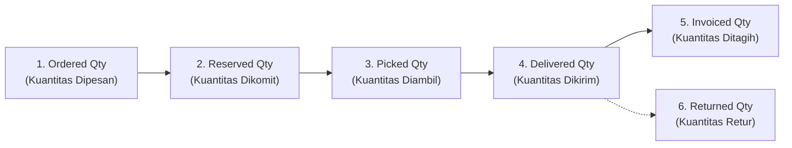
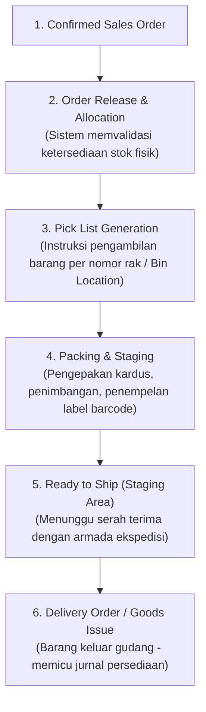

# Order Fulfillment

## Definition

**Order Fulfillment (Pemenuhan Pesanan)** dalam sistem ERP adalah rangkaian proses operasional dan logistik pergudangan yang bertugas mengubah komitmen pesanan penjualan (*Sales Order*) menjadi barang fisik yang siap diserahkan kepada pelanggan—mencakup verifikasi ketersediaan stok (*ATP check*), reservasi persediaan, penerbitan daftar ambil (*pick list*), pengambilan fisik di rak (*picking*), pengemasan (*packing*), hingga persiapan di area muat (*staging*).

Fulfillment bertindak sebagai **jembatan operasional antara fungsi komersial (Sales) dan manajemen pergudangan (Warehouse / WMS)**.

---

## Business Purpose

Implementasi modul pemenuhan pesanan dalam ERP bertujuan untuk:
1. **Mencegah Penjualan Melebihi Kapasitas (*Overselling Prevention*)**: Memastikan pesanan hanya dikonfirmasi jika barang benar-benar tersedia atau memiliki jadwal pasokan masuk yang dapat diandalkan.
2. **Efisiensi Rute Pergudangan (*Warehouse Picking Efficiency*)**: Mengelompokkan pengambilan barang berdasarkan zona gudang (*zone picking*) atau gelombang pesanan (*wave picking*) untuk meminimalkan waktu tempuh staf gudang.
3. **Penyelarasan Kuantitas Multi-Tahap**: Melacak setiap tahapan kuantitas secara presisi agar tidak terjadi selisih antara apa yang dipesan, diambil, dikirim, dan difakturkan.

---

## The 6 Critical Quantities in ERP

Salah satu pembeda utama arsitektur ERP enterprise dibanding aplikasi pencatatan sederhana adalah kemampuannya melacak **enam status kuantitas yang berbeda secara simultan** untuk setiap baris produk:

| Status Kuantitas | Definisi & Titik Pencatatan | Lokasi Fisik Barang | Status Dokumen Terkait |
|---|---|---|---|
| **1. Ordered Quantity** | Jumlah unit yang disepakati dalam kontrak pesanan penjualan. | Di katalog komersial. | *Sales Order Confirmed* |
| **2. Reserved Quantity** | Jumlah unit yang dikunci secara logis oleh sistem agar tidak diambil pesanan lain. | Masih berada di rak penyimpanan gudang. | *Sales Order Approved* |
| **3. Picked Quantity** | Jumlah unit fisik yang telah diambil oleh staf gudang dari lokasi rak (*bin*). | Berada di kereta dorong / area transit pengepakan. | *Pick List Validated* |
| **4. Delivered Quantity** | Jumlah unit fisik yang telah diserahkan keluar dari pintu gudang ke pihak kurir/pelanggan. | Berada di dalam armada ekspedisi atau di tangan pembeli. | *Delivery Note / Goods Issue Posted* |
| **5. Invoiced Quantity** | Jumlah unit yang telah diterbitkan tagihan piutangnya secara resmi. | Posisi hak tagih finansial. | *Customer Invoice Posted* |
| **6. Returned Quantity** | Jumlah unit yang dikembalikan oleh pelanggan karena rusak atau salah kirim. | Berada di area karantina inspeksi gudang. | *Sales Return / RMA Posted* |

---

## Logika Ketersediaan Persediaan: On-Hand vs Available-to-Promise (ATP)

Bagaimana sistem ERP menentukan apakah pesanan penjualan dapat dipenuhi? Sistem menghitung dua formula ketersediaan:

### 1. Kuantitas Tersedia untuk Dijual (*Available to Sell / ATS*)
Menghitung ketersediaan instan dari stok fisik yang saat ini ada di dalam gudang:
$$\mathbf{Available\ to\ Sell\ (ATS) = On\text{-}Hand\ Physical\ Stock - Reserved\ Quantity}$$

### 2. Available-to-Promise (ATP)
Menghitung ketersediaan dinamis di masa depan dengan memperhitungkan jadwal pasokan pengadaan yang sedang berjalan:
$$\mathbf{ATP = (On\text{-}Hand + Scheduled\ Receipts) - (Committed\ Customer\ Orders)}$$
* *Scheduled Receipts*: Barang dari pemasok yang dijadwalkan tiba via *Purchase Order* atau jadwal penyelesaian dari lantai pabrik via *Work Order*.
* *Committed Orders*: Seluruh pesanan penjualan berstatus *Approved* yang belum dikirimkan.

---

## Tahapan Pemenuhan Pesanan di Pergudangan (Fulfillment Stages)

### Metode Pengambilan Barang (*Picking Methods*):
1. **Discrete Picking (Pengambilan per Pesanan)**: Satu staf mengambil seluruh barang untuk satu dokumen *Sales Order* hingga selesai. Cocok untuk pesanan bernilai tinggi atau jumlah sedikit.
2. **Batch / Wave Picking (Pengambilan Massal)**: Menggabungkan kebutuhan barang serupa dari puluhan *Sales Order* ke dalam satu daftar ambil, lalu memilahnya kembali di meja pengepakan. Sangat efisien untuk distribusi ritel dan e-commerce.
3. **Zone Picking**: Gudang dibagi menjadi zona-zona (misal zona barang dingin vs barang kering); staf di setiap zona hanya mengambil barang di wilayahnya.

---

## Penanganan Kekurangan Stok (*Shortage & Backorder Trigger*)

Jika pelanggan memesan kuantitas yang melebihi kuantitas tersedia di gudang (misal: pesanan 100 unit, stok tersedia hanya 60 unit):
* Sistem ERP mengeksekusi **pemenuhan parsial (*Partial Fulfillment*)**:
  * 60 unit diproses untuk pengambilan dan pengiriman segera.
  * 40 unit sisanya otomatis ditandai sebagai **Backorder** (lihat [[03-sales/backorder-and-partial-fulfillment|Backorder and Partial Fulfillment]]).
* Dokumen pesanan tetap berstatus terbuka (*Partially Fulfilled*) hingga sisa 40 unit berhasil diproduksi atau didatangkan dari pemasok.

---

## Dampak Finansial & Akuntansi (Accounting Impact)

> [!important] Aturan Jurnal Tahap Fulfillment
> **Selama proses internal gudang (alokasi stok, picking, packing, dan staging), TIDAK ADA JURNAL AKUNTANSI yang diposting.**
> Barang secara hukum masih berada di dalam area kepemilikan entitas dan kendali fisik belum berpindah. Pembebanan akun Beban Pokok Penjualan (COGS) dan pengurangan aset persediaan di General Ledger baru terjadi ketika dokumen pengiriman resmi [[03-sales/delivery-and-shipping|Delivery and Shipping (Goods Issue)]] disahkan (*Posted*).

---

## Skenario Acuan Transaksi (Baseline Fulfillment)

Melanjutkan skenario acuan pesanan 10 unit *Laptop Pro* dari PT Maju Bersama:
1. **Kondisi Awal Gudang**:
   * Stok Fisik (*On-Hand*): 50 unit.
   * Total Reservasi Lama: 15 unit.
   * Stok Tersedia (*ATS*): 35 unit.
2. **Saat SO-2026-09-0101 Disahkan (10 Unit)**:
   * Kuantitas Dipesan (*Ordered Qty*): 10 unit.
   * Kuantitas Direservasi (*Reserved Qty*): naik menjadi 25 unit.
   * Kuantitas Tersedia (*ATS*): turun menjadi 25 unit.
3. **Proses Pengambilan Gudang (*Pick List*)**:
   * Sistem menerbitkan Pick List `#PL-0941` yang mengarahkan staf gudang ke Rak `A-03-B`.
   * Staf mengambil 10 unit laptop, memindai barcode nomor seri (*Serial Number*), dan memindahkannya ke meja pengepakan.
   * Kuantitas Diambil (*Picked Qty*): 10 unit.
   * Status pesanan berpindah menjadi: `Ready for Shipping`.

---

## Related Concepts

* [[01-business-processes/inventory-process|Inventory Process]] — Prosedur pergudangan, kartu stok, dan mutasi barang.
* [[03-sales/sales-order|Sales Order]] — Dokumen hulu pemicu proses pemenuhan.
* [[03-sales/delivery-and-shipping|Delivery and Shipping]] — Tahap penyerahan fisik barang ke logistik.
* [[03-sales/backorder-and-partial-fulfillment|Backorder and Partial Fulfillment]] — Penanganan pesanan saat stok tidak mencukupi.

---

## References

1. **Association for Supply Chain Management (ASCM)**: *APICS Dictionary - Order Fulfillment, Wave Picking, and Available-to-Promise*.
2. **Microsoft Learn**: *Warehouse management overview, outbound processing, and picking work in Dynamics 365 Supply Chain Management*. URL: https://learn.microsoft.com/en-us/dynamics365/supply-chain/warehousing/outbound-process-overview
3. **Frappe / ERPNext Documentation**: *Pick List and Delivery Note Generation*. URL: https://docs.frappe.io/erpnext/user/manual/en/stock/pick-list
4. **Odoo Documentation**: *Two-Step and Three-Step Delivery Orders (Pick, Pack, Ship)*. URL: https://www.odoo.com/documentation/17.0/applications/inventory_and_mrp/inventory/shipping/setup/delivery_two_steps.html
