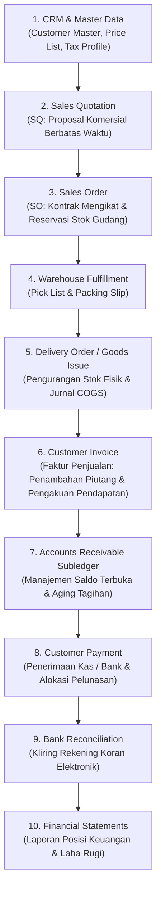

# Order to Cash Integration Architecture

## Definition

**Order to Cash (O2C) Integration Architecture** adalah sintesis arsitektur terpadu dalam sistem ERP yang menyatukan seluruh aliran informasi, dokumen bisnis, kendali logistik fisik, dan pencatatan akuntansi keuangan sejak interaksi komersial awal dengan pelanggan hingga penyelesaian kas di rekening bank dan penyajian laporan keuangan resmi.

Integrasi O2C mewujudkan prinsip utama ERP: **satu peristiwa bisnis dicatat satu kali pada sumbernya (*single point of entry*) dan secara otomatis mengalir ke seluruh buku pembantu dan buku besar yang relevan**.

Fondasi proses bisnis tingkat tingginya telah diperkenalkan pada [[01-business-processes/order-to-cash|Order to Cash Process]]. Modul ini merangkum dan mensintesis seluruh dimensi domain *Sales* yang telah kita bahas di Phase 4.

---

## The Master Data & Document Pipeline

Bagan berikut memetakan perjalanan data hulu-ke-hilir dalam sistem ERP:



---

## Matriks Aliran Data Antar-Domain (Cross-Domain Data Matrix)

Tabel berikut menunjukkan bagaimana data bertransformasi saat berpindah melintasi batas fungsional dalam arsitektur ERP:

| Domain Fungsional | Dokumen Input | Dokumen / Objek Output | Peristiwa Bisnis (*System Event*) | Dampak Finansial & Buku Besar |
|---|---|---|---|---|
| **Master Data** | Data Legal & Katalog | Master Pelanggan & Produk | Registrasi Master Data | Tidak ada jurnal (*Reference Data*). |
| **Pre-Sales** | Permintaan Penawaran | *Sales Quotation* | Pengiriman Proposal Harga | Tidak ada jurnal (*Pre-contractual*). |
| **Order Mgmt** | Persetujuan Pelanggan | *Sales Order (SO)* | Konfirmasi Pesanan & Reservasi | Tidak ada jurnal; reservasi kuantitas. |
| **Warehousing** | Sales Order Approved | *Pick List & Packing Slip* | Pengambilan & Pengepakan | Tidak ada jurnal (*Internal Custody*). |
| **Shipping** | Paket Siap Kirim | *Delivery Order (DO)* | Pengeluaran Barang (*Goods Issue*) | **Dr. COGS / Cr. Persediaan** (Perpetual). |
| **Billing** | Delivery Order Posted | *Customer Invoice* | Penagihan Hak Tagih Komersial | **Dr. Piutang Usaha / Cr. Pendapatan / Cr. PPN**. |
| **Credit & AR** | Faktur Diposting | Kartu Piutang Terbuka | Pemutakhiran *Open-Item Subledger* | Akun Kontrol GL 1120 tersinkronisasi. |
| **Treasury** | Rekening Koran / Kas | *Payment Receipt* | Pencocokan Kas (*Open-Item Clearing*) | **Dr. Kas-Bank / Cr. Piutang Usaha**. |
| **Reconciliation** | Electronic Bank Feed | *Reconciled Bank Statement* | Kliring Mutasi Kas Bank | Rekonsiliasi perbedaan waktu bank. |
| **Reporting** | Transaksi Terposting | Laporan Keuangan (P&L, BS) | Penutupan Periode (*Period Closing*) | Kompilasi Neraca dan Laba Rugi akhir. |

---

## 5 Model Bisnis Pemenuhan O2C (Fulfillment Variations)

Arsitektur ERP harus cukup fleksibel untuk mengakomodasi model bisnis yang berbeda:

```mermaid
flowchart TD
    subgraph MTS["1. Make-to-Stock (MTS)"]
        M1["Sales Order"] --> M2["Pengiriman dari Stok Gudang Jadi"] --> M3["Faktur Penjualan"]
    end

    subgraph MTO["2. Make-to-Order (MTO)"]
        T1["Sales Order"] --> T2["Penerbitan Work Order Manufaktur"] --> T3["Produksi Barang Jadi"] --> T4["Pengiriman & Faktur"]
    end

    subgraph DS["3. Drop-Shipping"]
        D1["Sales Order"] --> D2["Auto-PO ke Vendor Pihak Ketiga"] --> D3["Vendor Kirim Langsung ke Pelanggan"] --> D4["Faktur Penjualan"]
    end

    subgraph SVC["4. Service / Subscription"]
        S1["Sales Order / Kontrak"] --> S2["Penyelesaian Milestone Jasa"] --> S3["Faktur Berkala (Over Time)"]
    end

    subgraph POS["5. Retail POS (Cash & Carry)"]
        P1["Kasir Ritel:<br/>Pesanan + Serah Barang + Faktur + Bayar Kas<br/>(Terjadi Simultan dalam 1 Detik)"]
    end
```



1. **Make-to-Stock (MTS)**: Pola standar barang ritel dan distributor; pesanan dipenuhi langsung dari barang yang sudah ada di rak gudang.
2. **Make-to-Order (MTO)**: Pola manufaktur kustom; konfirmasi *Sales Order* otomatis memicu penerbitan *Work Order* di modul pabrikasi (lihat [[01-business-processes/manufacturing-process|Manufacturing Process]]).
3. **Drop-Shipping**: Penjual tidak memiliki fasilitas gudang; konfirmasi *Sales Order* otomatis menerbitkan *Purchase Order* ke prinsipal pabrikan untuk mengirimkan barang langsung ke pembeli.
4. **Service / Subscription**: Penjualan jasa profesional atau langganan software; tidak ada dokumen logistik pengiriman fisik, melainkan menggunakan pengakuan pendapatan bertahap *Over Time* sesuai IFRS 15.
5. **Point of Sale (Cash & Carry)**: Transaksi ritel langsung di mana seluruh tahapan pesanan, pengeluaran stok, penagihan faktur, dan penerimaan kas tunai/kartu dieksekusi secara atomik dalam satu detik di kasir toko.

---

## Rekapitulasi Skenario Transaksi Acuan (Canonical Baseline Flow)

Berikut adalah rekam jejak terpadu transaksi acuan PT Maju Bersama melintasi seluruh modul:

```text
1. Quotation: SQ-2026-09-0042 (10 Unit Laptop Pro @ Rp1.000.000 + PPN 11%)
   => Status: Won. Jurnal Akuntansi = Rp0. Mutasi Stok = 0.
   
2. Sales Order: SO-2026-09-0101 (Disahkan 15 September)
   => Status: Confirmed. Jurnal Akuntansi = Rp0.
   => Dampak Stok: 10 Unit Direservasi (ATS turun dari 35 ke 25 unit).
   => Dampak Kredit: Paparan kredit bertambah Rp11.100.000.
   
3. Delivery Order: DO-2026-09-0071 (Dikirim 20 September via PT Ekspedisi Cepat)
   => Status: Shipped / Goods Issue Posted. Stok fisik gudang berkurang 10 unit.
   => Jurnal Akuntansi:
      Dr. Beban Pokok Penjualan (COGS)           Rp 7.000.000
          Cr. Persediaan Barang Dagang                         Rp 7.000.000
          
4. Customer Invoice: INV-2026-09-0101 (Diposting 20 September, Jatuh Tempo 20 Oktober)
   => Status: Open / Unpaid. Subledger AR PT Maju Bersama bertambah Rp11.100.000.
   => Jurnal Akuntansi:
      Dr. Piutang Usaha (Accounts Receivable)    Rp 11.100.000
          Cr. Pendapatan Penjualan (Sales Revenue)             Rp 10.000.000
          Cr. Utang PPN Keluaran (VAT Output)                  Rp  1.100.000
          
5. Customer Payment: PE-2026-10-0082 (Diterima 10 Oktober via Transfer Bank)
   => Status Faktur: CLOSED / CLEARED (Sisa Saldo = Rp0). Plafon kredit pulih Rp11.100.000.
   => Jurnal Akuntansi:
      Dr. Bank Operasional                       Rp 11.100.000
          Cr. Piutang Usaha (Accounts Receivable)              Rp 11.100.000
          
6. Bank Reconciliation (Tutup Buku Oktober)
   => Kliring mutasi rekening koran bank dengan Payment Entry #PE-0082 (Matched 100%).
   
7. Financial Statements (Laporan Keuangan Tahunan per 31 Desember 2026)
   => Penjualan Bersih: Rp100.000.000 (Termasuk transaksi ini)
   => Beban Pokok Penjualan (COGS): (Rp70.000.000) (Termasuk transaksi ini)
   => Laba Bersih Tahun Berjalan: Rp12.363.000
   => Neraca Seimbang: Total Aset = Total Liabilitas + Ekuitas = Rp195.100.000.
```

Seluruh rantai transaksi di atas membuktikan **konsistensi logika dan angka 100%** antara modul penjualan Phase 4 dengan standar akuntansi Phase 3 dan proses bisnis Phase 1–2.

---

## Related Concepts

* [[00-fundamentals/cross-module-integration|Cross-Module Integration]] — Prinsip integrasi data lintas fungsi.
* [[01-business-processes/order-to-cash|Order to Cash Process]] — Alur operasional komersial.
* [[02-accounting/financial-statements|Financial Statements]] — Kompilasi akhir dari seluruh aktivitas O2C.
* [[03-sales/sales-fundamentals|Sales Fundamentals]] — Konsep dasar domain penjualan dalam ERP.

---

## References

1. **Association for Supply Chain Management (ASCM)**: *Supply Chain Operations Reference (SCOR) Model - Order-to-Cash Workflow*.
2. **IFRS Foundation**: *IFRS 15 Revenue from Contracts with Customers*. URL: https://www.ifrs.org/issued-standards/list-of-standards/ifrs-15-revenue-from-contracts-with-customers/
3. **Microsoft Learn**: *End-to-end Order-to-Cash business process flow in Dynamics 365*. URL: https://learn.microsoft.com/en-us/dynamics365/guidance/business-processes/order-to-cash-overview
4. **Frappe / ERPNext Documentation**: *Selling and Accounts Receivable Architecture*. URL: https://docs.frappe.io/erpnext/user/manual/en/selling
