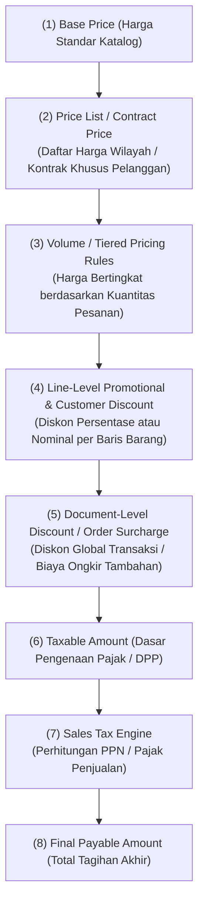

# Pricing and Discount Architecture

## Definition

**Pricing and Discount Architecture (Arsitektur Penetapan Harga dan Diskon)** dalam sistem ERP adalah mesin aturan komersial (*pricing engine*) yang secara dinamis menghitung harga jual akhir suatu barang atau jasa berdasarkan kombinasi atribut pelanggan, kuantitas pesanan, kontrak penjualan, kampanye promosi, dan mata uang transaksi.

Di dalam ERP modern, harga jual bukanlah nilai statis yang diketik manual oleh staf kasir atau staf penjualan. Harga dihasilkan melalui **pipa kalkulasi bertingkat (*hierarchical pricing pipeline*)** yang menjamin akurasi marjin laba dan mencegah kecurangan harga (*price manipulation*).

---

## The Hierarchical Pricing Pipeline

Alur penentuan harga akhir di dalam sistem ERP bergerak melalui tahapan berurutan:



---

## Skema Penetapan Harga (Pricing Schemes)

Sistem ERP enterprise mendukung berbagai skema penetapan harga untuk mengakomodasi model bisnis B2B maupun B2C:

### 1. Base / List Price (Harga Patokan Katalog)
Harga standar yang melekat pada master produk (lihat [[03-sales/customer-and-sales-master-data|Customer and Sales Master Data]]). Digunakan sebagai harga cadangan (*fallback price*) jika tidak ada skema harga khusus yang cocok.

### 2. Price Lists (Daftar Harga Bersegmentasi)
Tabel harga alternatif yang dibedakan berdasarkan:
* **Mata Uang**: Daftar harga USD untuk ekspor vs daftar harga IDR untuk domestik.
* **Segmen Pelanggan**: *Distributor Price List* (harga terendah), *Wholesale Price List*, dan *Retail Price List*.
* **Wilayah Penjualan**: Harga Zona 1 (Jawa-Bali) vs Harga Zona 2 (Indonesia Timur dengan komponen biaya logistik lebih tinggi).

### 3. Contract / Special Agreed Price (Harga Kontrak Pelanggan)
Kesepakatan harga tetap yang mengikat secara hukum untuk satu pelanggan spesifik selama periode tertentu (misal: kontrak pasokan 1 tahun dengan BUMN atau korporasi multinasional). Dalam hierarki pencarian sistem, **harga kontrak memiliki prioritas tertinggi**.

### 4. Tiered / Volume Pricing (Harga Bertingkat Berdasarkan Volume)
Penyesuaian harga satuan secara otomatis jika pelanggan membeli dalam jumlah besar:
* Pembelian $1 - 10$ unit: Rp1.000.000 / unit.
* Pembelian $11 - 50$ unit: Rp950.000 / unit.
* Pembelian $> 50$ unit: Rp900.000 / unit.

---

## Taksonomi Diskon Komersial (Discount Taxonomy)

Diskon dalam ERP dibagi berdasarkan titik penagihan dan metode perhitungannya:

| Dimensi Diskon | Karakteristik & Mekanisme ERP | Dampak Akuntansi & Faktur |
|---|---|---|
| **Trade Discount (Diskon Dagang / Katalog)** | Potongan langsung pada harga jual di dokumen *Sales Order* (persentase atau nominal). | **Mengurangi Dasar Pengenaan Pajak (DPP)** secara langsung pada faktur penjualan. Pendapatan dicatat sebesar nilai bersih. |
| **Line Discount (Diskon per Baris)** | Berlaku spesifik hanya untuk satu produk tertentu pada baris pesanan (misal: diskon 5% untuk Laptop Pro). | Tertera transparan per item pada Surat Jalan dan Faktur. |
| **Document / Header Discount (Diskon Faktur Global)** | Potongan sekaligus atas total nilai pesanan (misal: diskon Rp500.000 jika total belanja > Rp10.000.000). | Sistem ERP membagi (*allocate*) diskon global ini secara proporsional ke masing-masing baris barang untuk keperluan pelaporan profitabilitas produk. |
| **Cash / Settlement Discount (Potongan Pelunasan Dini)** | Syarat pembayaran bersyarat (misal: termin *2/10, Net 30*). | **Tidak mengurangi nilai faktur awal**. Potongan baru diakui di modul keuangan saat kas diterima lebih cepat (lihat [[02-accounting/accounts-receivable|Accounts Receivable]]). |
| **Volume Rebates (Rabat Retrospektif)** | Bonus pengembalian dana kepada distributor jika mencapai target kuota tahunan. | Diakui melalui provisi akrual liabilitas di akhir periode dan diselesaikan via *Credit Note*. |

---

## Precedence Rules: Menangani Konflik Aturan Harga

Apa yang terjadi jika seorang pelanggan grosir membeli produk yang sedang diskon promosi nasional, sementara pelanggan tersebut juga memiliki kontrak harga khusus?

Dalam desain ERP, logika penyelesaian konflik harga (*Conflict Resolution / Precedence*) dikonfigurasi melalui salah satu kebijakan bisnis:

```mermaid
flowchart TD
    Rule{"Deteksi Konflik Aturan Harga:<br/>Kontrak Khusus vs Daftar Harga Grosir vs Promo"}
    Rule -->|Policy A: Specificity Wins (Paling Umum)| P1["(1) Prioritas Tertinggi:<br/>Customer Contract > Customer Group > General Price List"]
    Rule -->|Policy B: Best Deal Wins| P2["(2) Harga Terendah Menang:<br/>Sistem memilih harga paling murah untuk kepuasan pelanggan"]
    Rule -->|Policy C: Cumulative Discount| P3["(3) Diskon Bertingkat:<br/>Diskon Promo ditumpuk di atas Diskon Pelanggan<br/>(Contoh: 10% + 5% tambahan)"]
```

> [!note] Variasi Vendor ERP
> Standar penentuan prioritas (*pricing condition technique*) bervariasi antar-software:
> * Di SAP (*Condition Technique*), urutan dievaluasi dari tabel kondisi paling spesifik ke tabel paling umum menggunakan nomor urut prioritas (*access sequence*).
> * Di ERPNext dan Odoo, prioritas ditentukan oleh hierarki dokumen (*Pricing Rule priority flag* atau urutan daftar harga aktif).
> **Prinsip universalnya**: ERP harus memiliki urutan deterministik yang konsisten agar dua transaksi yang sama tidak menghasilkan harga yang berbeda.

---

## Skenario Numerik: Variasi Diskon dari Baseline Acuan

Mari telaah skenario penjualan dengan penerapan diskon komersial:
* **Baseline Pesanan**: 10 unit *Laptop Pro* (Harga Katalog = Rp1.000.000/unit).
* **Kebijakan Diskon**: Pelanggan "PT Maju Bersama" berhak atas diskon mitra korporat sebesar **5%**.

### Perhitungan Nilai Transaksi:
1. Nilai Bruto (*Gross Amount*): 10 unit $\times$ Rp1.000.000 = Rp10.000.000
2. Diskon Komersial (5%): $5\% \times \text{Rp10.000.000} = \mathbf{Rp500.000}$
3. Nilai Bersih Kena Pajak (DPP): Rp10.000.000 - Rp500.000 = **Rp9.500.000**
4. PPN (11% dari DPP): $11\% \times \text{Rp9.500.000} = \mathbf{Rp1.045.000}$
5. **Total Piutang Tagihan (*Net Invoice Total*)**: Rp9.500.000 + Rp1.045.000 = **Rp10.545.000**

### Dampak Jurnal Penjualan Bersih:
Saat faktur diterbitkan (lihat [[02-accounting/revenue-and-expense|Revenue and Expense Accounting]]):
* **Debit**: Piutang Usaha (*AR*) = Rp10.545.000
* **Kredit**: Pendapatan Penjualan Bersih (*Net Revenue*) = Rp9.500.000
* **Kredit**: Utang PPN Keluaran (*VAT Output*) = Rp1.045.000

---

## Related Concepts

* [[03-sales/customer-and-sales-master-data|Customer and Sales Master Data]] — Penugasan daftar harga pada master pelanggan.
* [[03-sales/sales-tax|Sales Tax]] — Penentuan Dasar Pengenaan Pajak (DPP) setelah diskon.
* [[02-accounting/accounts-receivable|Accounts Receivable]] — Potongan pelunasan dini (*sales cash discount*).

---

## References

1. **Association for Supply Chain Management (ASCM)**: *APICS Dictionary - Dynamic Pricing and Trade Promotion Management*.
2. **Microsoft Learn**: *Price and discount management architecture in Dynamics 365 Supply Chain Management*. URL: https://learn.microsoft.com/en-us/dynamics365/supply-chain/sales-marketing/pricing-engine
3. **Frappe / ERPNext Documentation**: *Pricing Rule, Item Price, and Margin Management*. URL: https://docs.frappe.io/erpnext/user/manual/en/accounts/pricing-rule
4. **Odoo Documentation**: *Pricelists, Discounts, and Special Formulas*. URL: https://www.odoo.com/documentation/17.0/applications/sales/sales/products_prices/prices/pricing.html
