# Revenue Recognition in Sales (IFRS 15)

## Definition

**Revenue Recognition (Pengakuan Pendapatan)** dalam konteks penjualan ERP adalah proses akuntansi formal untuk mencatat hak atas imbalan ekonomi dari kontrak penjualan ke dalam pos Pendapatan (*Revenue*) di Laporan Laba Rugi pada saat entitas telah memenuhi kewajiban pelaksanaannya kepada pelanggan.

Berdasarkan standar internasional **IFRS 15 (*Revenue from Contracts with Customers*)**, prinsip fundamental yang harus ditegakkan adalah:

> **Pendapatan diakui saat KENDALI (*Control*) atas barang atau jasa berpindah ke tangan pelanggan, BUKAN semata-mata saat faktur dicetak atau uang kas diterima.**

Perlakuan akuntansi mendalam dan penjurnalan penyesuaian telah dibangun pada [[02-accounting/revenue-and-expense|Revenue and Expense Accounting]]. Modul ini berfokus pada **bagaimana sistem penjualan ERP mengeksekusi dan mengotomatisasi aturan IFRS 15**.

---

## The Critical Disconnection: Invoice vs Revenue Timing

Salah satu kesalahan desain paling berbahaya dalam sistem informasi bisnis adalah menganggap bahwa **penerbitan faktur (*Customer Invoice*) selalu identik dengan pengakuan pendapatan (*Revenue*)**.

Dalam dunia usaha riil, waktu penagihan dan waktu pengakuan pendapatan sering kali terpisah (*time-lag*):

```mermaid
flowchart TD
    subgraph Case1["Kasus 1: Invoiced BEFORE Delivery (Uang Muka / Langganan)"]
        Inv1["1. Cetak Faktur / Terima Kas Duluan"]
        --> Liab1["=> LIABILITAS KONTRAK:\nPendapatan Diterima di Muka (Deferred Revenue)"]
        --> Del1["2. Barang Diserahkan / Layanan Berjalan"]
        --> Rev1["=> PENDAPATAN DIAKUI BERTAHAP (Earned)"]
    end

    subgraph Case2["Kasus 2: Invoiced EQUALS Delivery (Penjualan Standar)"]
        Del2["Barang Diserahkan & Faktur Diterbitkan Simultan"]
        --> Rev2["=> PIUTANG USAHA (AR) & PENDAPATAN LANGSUNG DIAKUI"]
    end

    subgraph Case3["Kasus 3: Delivered BEFORE Invoiced (Proyek / Jasa Audit)"]
        Del3["1. Jasa Selesai / Kendali Berpindah Duluan"]
        --> Asset3["=> ASET KONTRAK:\nPiutang Belum Difakturkan (Unbilled Receivables)"]
        --> Inv3["2. Faktur Resmi Diterbitkan Bulan Berikutnya"]
        --> AR3["=> REKLASIFIKASI KE PIUTANG USAHA (AR)"]
    end
```

---

## The 5-Step Model dalam Transaksi Penjualan ERP

Sistem ERP modern menerapkan kerangka lima langkah IFRS 15 secara otomatis pada setiap transaksi komersial:

### 1. Identifikasi Kontrak dengan Pelanggan (*Identify the Contract*)
* **Implementasi ERP**: Dokumen [[03-sales/sales-order|Sales Order]] yang telah disahkan (*Approved*) atau Kontrak Penjualan jangka panjang yang disepakati kedua belah pihak.
* *Validasi Sistem*: Memeriksa apakah hak komersial dan syarat pembayaran telah disetujui serta pelanggan memiliki kemampuan membayar (*collectibility assessment*).

### 2. Identifikasi Kewajiban Pelaksanaan (*Identify Performance Obligations*)
* **Implementasi ERP**: Sistem memilah baris-baris pesanan menjadi unit-unit penyerahan yang terpisah secara komersial (*distinct goods or services*).
* *Contoh*: Membeli 10 unit komputer sekaligus paket langganan antivirus 1 tahun. Terdapat dua kewajiban pelaksanaan terpisah:
  1. Penyerahan fisik perangkat keras (*Hardware*).
  2. Penyediaan layanan keamanan perangkat lunak (*Software Service*).

### 3. Tentukan Harga Transaksi (*Determine Transaction Price*)
* **Implementasi ERP**: Mengambil nilai total pesanan setelah memperhitungkan diskon dagang, rabat volume, dan komponen imbalan variabel (lihat [[03-sales/pricing-and-discount|Pricing and Discount]]). Nilai pajak pertambahan nilai (PPN) **dikeluarkan dari harga transaksi** karena merupakan titipan negara.

### 4. Alokasi Harga Transaksi ke Setiap Kewajiban (*Allocate Transaction Price*)
* **Implementasi ERP**: Jika pesanan dijual secara paket gabungan (*bundled package*) dengan diskon khusus, sistem mengalokasikan harga transaksi ke masing-masing komponen berdasarkan **Harga Jual Berdiri Sendiri (*Standalone Selling Price / SSP*)**.

### 5. Akui Pendapatan saat Kewajiban Dipenuhi (*Recognize Revenue*)
* **Implementasi ERP**: Memicu jurnal pendapatan di General Ledger saat peristiwa perpindahan kendali terverifikasi:
  * **Point in Time**: Diakui seketika saat dokumen [[03-sales/delivery-and-shipping|Delivery Order]] ditandatangani pelanggan.
  * **Over Time**: Diakui berkala setiap akhir bulan melalui jadwal amortisasi otomatis (*Revenue Deferral Schedule*).

---

## Point in Time vs Over Time: Karakteristik & Jurnal

| Dimensi | Point in Time (Titik Waktu Tertentu) | Over Time (Sepanjang Waktu) |
|---|---|---|
| **Karakteristik Bisnis** | Penjualan barang dagang fisik, komoditas ritel, atau peralatan jadi. | Penjualan jasa pemeliharaan, lisensi software *SaaS*, atau proyek konstruksi. |
| **Pemicu Pengakuan di ERP** | Dokumen Surat Jalan (*Proof of Delivery*) disahkan. | Waktu kalender berjalan (*time-elapsed*) atau persentase progres fisik (*milestone*). |
| **Akun Neraca Terkait** | Piutang Usaha (*AR*) langsung menandingi Pendapatan. | Pendapatan Diterima di Muka (*Deferred Revenue / Contract Liability*). |

---

## Skenario Numerik: Penjualan Paket Bundling Komoditas & Jasa

Mari kita uji skenario nyata yang sering dihadapi sistem ERP:
* **Transaksi Paket Komersial**: Perusahaan menjual paket 10 unit *Laptop Pro* ditambah *Layanan Backup Cloud selama 12 Bulan* kepada PT Maju Bersama dengan harga paket promosi total **Rp11.000.000** (belum termasuk PPN).

### 1. Analisis Standalone Selling Price (SSP):
* Harga Jual Normal Laptop Pro (10 unit): Rp10.000.000 (Bobot: $\frac{10}{12} = 83.33\%$)
* Harga Jual Normal Layanan Cloud (1 tahun): Rp2.000.000 (Bobot: $\frac{2}{12} = 16.67\%$)
* Total Harga Berdiri Sendiri Normal: **Rp12.000.000**

### 2. Alokasi Harga Transaksi Paket (Rp11.000.000):
* **Alokasi Laptop (Point in Time)**: $\frac{10}{12} \times \text{Rp11.000.000} = \mathbf{Rp9.166.667}$
* **Alokasi Cloud (Over Time 12 Bulan)**: $\frac{2}{12} \times \text{Rp11.000.000} = \mathbf{Rp1.833.333}$ (atau Rp152.778 per bulan).

### 3. Jurnal Saat Pengiriman Laptop & Penerbitan Faktur (Bulan ke-1):
Pelanggan menerima 10 unit laptop dan menerima faktur total Rp11.000.000 + PPN 11% (Rp1.210.000) = **Rp12.210.000**:

| Akun | Kategori | Debit (Rp) | Kredit (Rp) |
|---|---|---:|---:|
| Piutang Usaha (*Accounts Receivable*) | Asset | 12.210.000 | - |
| Pendapatan Penjualan Perangkat Keras (*Point in Time*) | Revenue (P&L) | - | 9.166.667 |
| Pendapatan Diterima di Muka Jasa Cloud (*Deferred Revenue*) | Liability (Neraca) | - | 1.833.333 |
| Utang PPN Keluaran (*VAT Output*) | Liability (Neraca) | - | 1.210.000 |

*Pendapatan perangkat keras diakui penuh seketika sebesar Rp9.166.667, sedangkan bagian jasa cloud ditangguhkan sebagai liabilitas di neraca.*

### 4. Jurnal Amortisasi Jasa Cloud Setiap Akhir Bulan (Bulan 1 hingga 12):
ERP mengeksekusi pengakuan bertahap otomatis (lihat [[02-accounting/accrual-and-adjusting-entries|Accrual and Adjusting Entries]]):

| Akun | Kategori | Debit (Rp) | Kredit (Rp) |
|---|---|---:|---:|
| Pendapatan Diterima di Muka Jasa Cloud | Liability (Neraca) | 152.778 | - |
| Pendapatan Jasa Cloud (*Subscription Revenue*) | Revenue (P&L) | - | 152.778 |

---

## ERP Revenue Recognition Schedule Engine

Dalam sistem ERP kelas enterprise (seperti skema *Revenue Recognition Workspace* di Dynamics 365, *Deferred Revenue* di ERPNext, atau modul *Contract Accounting* di SAP):
1. Pengguna tidak perlu menghitung proporsi alokasi SSP di spreadsheet manual.
2. Saat *Sales Order* disahkan, modul pendapatan otomatis membuat **Jadwal Pengakuan Pendapatan (*Amortization Schedule*)**.
3. Mesin penutupan periode bulanan (*Monthly Period-End Closing Run*) otomatis memposting ayat jurnal pengakuan pendapatan sesuai tanggal jatuh tempo jadwal tersebut.

---

## Related Concepts

* [[02-accounting/revenue-and-expense|Revenue and Expense Accounting]] — Teori dasar akuntansi pendapatan IFRS 15.
* [[02-accounting/accrual-and-adjusting-entries|Accrual and Adjusting Entries]] — Jurnal penyesuaian penangguhan pendapatan.
* [[03-sales/delivery-and-shipping|Delivery and Shipping]] — Peristiwa penyerahan kendali barang fisik.
* [[03-sales/accounts-receivable-integration|Accounts Receivable Integration]] — Penagihan hak tagih komersial.

---

## References

1. **IFRS Foundation**: *IFRS 15 Revenue from Contracts with Customers - Complete Standard and Illustrative Examples*. URL: https://www.ifrs.org/issued-standards/list-of-standards/ifrs-15-revenue-from-contracts-with-customers/
2. **Kieso, D. E., Weygandt, J. J., & Warfield, T. D.** (2020). *Intermediate Accounting* (IFRS Edition, Chapter: Revenue Recognition). Wiley.
3. **Microsoft Learn**: *Revenue recognition overview and setup in Dynamics 365 Finance and Operations*. URL: https://learn.microsoft.com/en-us/dynamics365/finance/accounts-receivable/revenue-recognition-overview
4. **Frappe / ERPNext Documentation**: *Deferred Revenue and Revenue Recognition Scheduler*. URL: https://docs.frappe.io/erpnext/user/manual/en/accounts/deferred-revenue
