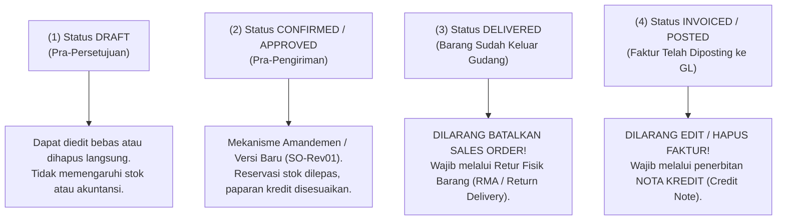

# Sales Cancellation and Amendment

## Definition

**Sales Cancellation and Amendment (Pembatalan dan Perubahan Transaksi Penjualan)** dalam sistem ERP adalah seperangkat tata kelola kontrol dan alur kerja sistematis yang mengatur bagaimana revisi data, perubahan kuantitas, penyesuaian harga, atau pembatalan total pesanan ditangani setelah transaksi penjualan disahkan.

Prinsip fundamental arsitektur ERP enterprise menetapkan:

> **Prinsip Kekekalan Dokumen (*Document Immutability*) dan Jejak Audit (*Audit Trail*):**
> Dokumen bisnis yang telah disahkan (*Confirmed/Approved*) atau diposting (*Posted*) **DILARANG DIHAPUS SECARA FISIK (*No Hard Delete*)** dan **DILARANG DIUBAH SECARA DIAM-DIAM (*No Silent Edit*)** dari basis data. Setiap perubahan wajib melalui mekanisme amandemen transparan atau dokumen pembalik resmi.

Konsep integritas pembukuan ini berakar langsung pada prinsip [[00-fundamentals/documents-transactions-events|Documents, Transactions, and Events]] dan [[02-accounting/journal-entry|Journal Entry Immutability]].

---

## Business Purpose

Penerapan tata kelola pembatalan dan amandemen bertujuan untuk:
1. **Perlindungan Integritas Laporan Keuangan (*Financial Auditability*)**: Memastikan auditor eksternal dan otoritas pajak dapat menelusuri riwayat perubahan data sejak pesanan dibuat hingga selesai tanpa ada transaksi yang hilang misterius.
2. **Sinkronisasi Rantai Pasok Pergudangan**: Mencegah staf penjualan membatalkan pesanan di sistem secara sepihak sementara staf gudang sudah terlanjur mengemas atau mengirimkan barang tersebut ke truk ekspedisi.
3. **Penyelarasan Plafon Kredit dan Reservasi Persediaan**: Mengembalikan alokasi stok komitmen ke stok bebas (*ATS*) dan memulihkan batas kredit pelanggan secara otomatis saat pembatalan disetujui.
4. **Analisis Penyebab Pembatalan (*Cancellation Reason Tracking*)**: Merekam alasan kegagalan transaksi (misal: harga terlalu mahal, waktu tunggu terlalu lama, atau kesalahan input staf) untuk evaluasi manajemen.

---

## 4 Tahapan Perubahan Transaksi & Aturan Sistem

Tindakan perubahan atau pembatalan yang diizinkan oleh sistem ERP bergantung sepenuhnya pada **tahapan siklus hidup dokumen (*Lifecycle Stage*)**:

---

### Tahap 1: Pembatalan pada Status Draft (Pra-Persetujuan)
* **Karakteristik**: Dokumen baru disimpan sementara oleh staf penjualan.
* **Tindakan Sistem**: Dokumen dapat diubah angka/barisnya secara bebas, atau dibatalkan langsung. Karena belum ada reservasi stok komitmen dan belum ada jurnal akuntansi, pembatalan pada tahap ini tidak meninggalkan dampak operasional.

---

### Tahap 2: Amandemen Pesanan Disahkan (Confirmed SO - Pre-Fulfillment)
* **Karakteristik**: Pesanan telah disetujui, namun barang fisik **belum diambil (*picking*)** dan belum dikirimkan dari gudang.
* **Mekanisme Amandemen (*Sales Order Amendment*)**:
  1. Staf penjualan menekan tombol *Amend / Revise*.
  2. Sistem membekukan dokumen lama dan menerbitkan nomor versi baru (misal: `SO-2026-09-0101-Rev01`).
  3. Pengguna mengubah kuantitas atau harga.
  4. Sistem otomatis menghitung ulang:
     * *Reservasi Stok*: Jika kuantitas diturunkan dari 10 menjadi 8 unit, maka 2 unit dilepaskan kembali menjadi stok bebas (*Available to Sell*).
     * *Paparan Kredit*: Total beban kredit pelanggan otomatis berkurang secara *real-time*.
* **Jika Dibatalkan Total (*Full Cancellation*)**: Status pesanan berubah menjadi `Cancelled`. Seluruh reservasi stok 10 unit dilepaskan seketika dan batas kredit dipulihkan.

---

### Tahap 3: Pembatalan Pasca-Pengiriman (Post-Delivery - Pre-Invoice)
* **Karakteristik**: Barang fisik telah keluar dari gudang melalui dokumen Surat Jalan (*Delivery Order / Goods Issue*), namun faktur penagihan belum dicetak.
* **Aturan Pengendalian ERP**:
  > **Sistem secara mutlak MENOLAK pembatalan langsung pada Sales Order!**
* **Solusi Bisnis**:
  Karena aset persediaan fisik telah berkurang di buku besar umum (COGS telah didebit), penyesuaian wajib dilakukan melalui alur logistik penerimaan retur fisik [[03-sales/sales-return-and-credit-note|Sales Return (RMA)]] untuk mengembalikan barang fisik ke rak gudang dan membalik jurnal persediaan.

---

### Tahap 4: Penyesuaian Pasca-Penagihan (Post-Invoicing / Billed)
* **Karakteristik**: Faktur penjualan resmi (*Customer Invoice*) telah diterbitkan dan diposting ke *General Ledger* serta *AR Subledger*.
* **Aturan Pengendalian ERP**:
  > **Faktur penjualan yang telah berstatus `Posted` bersifat IMMUTABLE (kekal). Tidak dapat diedit atau dihapus.**
* **Solusi Bisnis**:
  Setiap pembatalan transaksi, koreksi harga, atau potongan susulan wajib diselesaikan secara formal melalui dokumen **Nota Kredit (*Credit Note / Credit Memo*)** yang disetujui oleh Manajer Keuangan (lihat [[03-sales/sales-return-and-credit-note|Sales Return and Credit Note]]).

---

## Jejak Audit Perubahan Transaksi (Audit Trail Architecture)

Untuk memenuhi standar kepatuhan regulasi audit (seperti SOX, ISO 9001, dan standar perpajakan), modul Sales di ERP menyimpan catatan perubahan (*Audit Log / Version History*):

| Field Audit Log | Deskripsi Data yang Direkam Sistem |
|---|---|
| **Timestamp** | Waktu pencatatan presisi hingga detik dari server database (bukan jam komputer pengguna). |
| **User Identity** | ID pengguna yang mengeksekusi perubahan atau pembatalan (`modified_by`). |
| **Action Type** | Jenis tindakan: *Amended, Quantity Decreased, Line Added, Cancelled*. |
| **Field-Level Diff** | Rekaman nilai sebelum dan sesudah perubahan (misal: *Qty: 10 $\to$ 8*). |
| **Reason Code** | Kategori alasan resmi pembatalan yang dipilih dari daftar master (misal: *`CANC-01: Customer Budget Cut`*). |

---

## Related Concepts

* [[00-fundamentals/documents-transactions-events|Documents, Transactions, and Events]] — Aturan keabsahan dokumen bisnis.
* [[02-accounting/journal-entry|Journal Entry]] — Prinsip immutability dan pembatalan via jurnal pembalik (*reversal*).
* [[03-sales/customer-credit-management|Customer Credit Management]] — Penyesuaian paparan kredit saat pesanan dibatalkan.
* [[03-sales/sales-return-and-credit-note|Sales Return and Credit Note]] — Nota kredit sebagai instrumen penyesuaian purnajual.

---

## References

1. **Information Systems Audit and Control Association (ISACA)**: *Audit Trail and Change Management Controls in Enterprise ERP Systems*.
2. **Microsoft Learn**: *Order events, change tracking, and cancellation processing in Dynamics 365 Supply Chain Management*. URL: https://learn.microsoft.com/en-us/dynamics365/supply-chain/sales-marketing/sales-order-amendments
3. **Frappe / ERPNext Documentation**: *Document Cancellation, Amendment, and Version History*. URL: https://docs.frappe.io/erpnext/user/manual/en/using-erpnext/articles/amend-submitted-document
4. **Odoo Documentation**: *Cancelling Orders, Invoices, and Handling Credit Notes*. URL: https://www.odoo.com/documentation/17.0/applications/sales/sales.html
