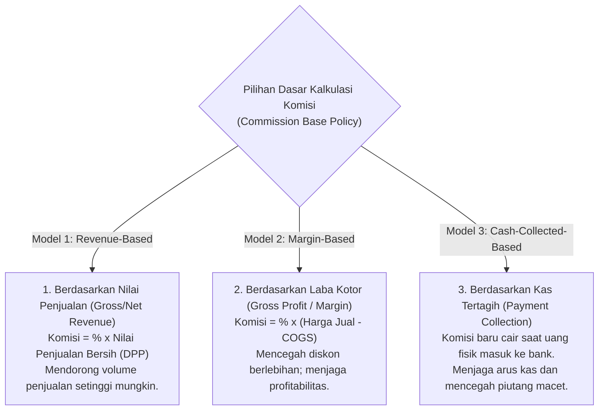
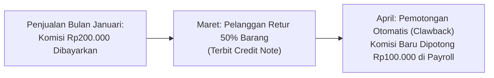

# Sales Commission

## Definition

**Sales Commission (Komisi Penjualan)** dalam sistem ERP adalah modul insentif komersial yang menghitung, melacak, dan mengalokasikan imbalan finansial bagi perwakilan penjualan (*sales representatives*), manajer akun (*account executives*), atau agen perantara berdasarkan pencapaian target volume transaksi, laba kotor, atau efektivitas penerimaan kas.

Dalam arsitektur ERP enterprise, komisi penjualan menghubungkan tiga pilar bisnis: **performa operasional komersial (Sales)**, **disiplin penagihan kas (Accounts Receivable)**, dan **penggajian beban operasional (Payroll & General Ledger)**.

---

## Business Purpose

Implementasi modul komisi penjualan di dalam ERP bertujuan untuk:
1. **Penyelarasan Insentif Penjual dengan Tujuan Perusahaan**: Mengarahkan tenaga penjual agar tidak hanya mengejar omzet (*top-line revenue*), melainkan juga memprioritaskan penjualan produk dengan marjin laba tinggi (*profit margin*) dan pelanggan yang disiplin membayar (*cash collection*).
2. **Otomatisasi dan Transparansi Perhitungan (*Dispute Elimination*)**: Menghilangkan perselisihan hitungan komisi antara bagian komersial dan keuangan melalui aturan matematis yang transparan dan dapat diaudit (*auditable logs*).
3. **Mitigasi Kerugian Pembayaran Komisi di Awal (*Clawback Protection*)**: Mencegah pembayaran komisi atas transaksi yang pada akhirnya dibatalkan, diretur, atau berakhir menjadi piutang macet (*bad debt*).

---

## Model Dasar Perhitungan Komisi (Commission Bases)

Sistem ERP mendukung beberapa formula dasar untuk menghitung nilai komisi:

### 1. Revenue-Based Commission (Berbasis Omzet Penjualan)
* Dihitung dari nilai penjualan bersih sebelum pajak (DPP).
* *Rumus*: $\text{Komisi} = \text{DPP} \times \text{Tarif Komisi}$.
* *Kelemahan*: Tenaga penjual cenderung memberikan diskon maksimal demi mencapai target omzet tanpa mempedulikan marjin laba perusahaan.

### 2. Margin-Based Commission (Berbasis Laba Kotor)
* Dihitung dari selisih antara harga jual dengan Beban Pokok Penjualan (COGS).
* *Rumus*: $\text{Komisi} = (\text{Nilai Penjualan} - \text{COGS}) \times \text{Tarif Komisi}$.
* *Keunggulan*: Mendorong tenaga penjual untuk mempertahankan harga jual tinggi dan menolak pemberian diskon berlebihan.

### 3. Cash-Collected-Based Commission (Berbasis Pelunasan Kas)
* Komisi dihitung berdasarkan faktur yang telah berstatus **Lunas (*Paid / Cleared*)** di modul Accounts Receivable.
* *Prinsip Praktik Terbaik ERP*: Jika pelanggan tidak melunasi tagihan, komisi tidak akan pernah dibayarkan ke staf penjualan. Hal ini memotivasi tim penjualan untuk membantu tim penagihan (*collection team*).

---

## Struktur Rencana Komisi Lanjutan (Advanced Commission Schemes)

1. **Tiered / Accelerated Commission (Komisi Bertingkat / Akselerator)**:
   Meningkatkan persentase komisi jika penjualan melampaui kuota target:
   * Pencapaian $0\% - 100\%$ kuota: Komisi 2%.
   * Pencapaian $101\% - 150\%$ kuota: Komisi 4% (akselerator).
   * Pencapaian $> 150\%$ kuota: Komisi 6%.
2. **Split Commission (Komisi Bagi Hasil Tim)**:
   Jika satu kesepakatan kontrak besar dikerjakan bersama oleh beberapa perwakilan (misal: satu staf teknis *Pre-Sales* dan satu staf komersial *Account Executive*), nilai komisi dapat dialokasikan dengan rasio persentase tertentu (misal: 60% : 40%).

---

## Mekanisme Penarikan Kembali (*Clawback & Adjustments*)

Apa yang terjadi jika komisi telah dibayarkan, namun 2 bulan kemudian pelanggan mengembalikan barangnya (*Sales Return*) atau dinyatakan pailit secara hukum?

> **Prinsip Clawback (Penarikan Kembali Komisi):**
> ERP enterprise secara otomatis memotong (*deduct*) saldo komisi staf penjualan pada periode penggajian berikutnya jika terjadi retur penjualan via [[03-sales/sales-return-and-credit-note|Credit Note]] atau penghapusan piutang tak tertagih (*Bad Debt Write-Off*).

---

## Dampak Akuntansi & Penggajian (Accounting Impact)

> [!important] Komisi adalah Beban Operasional, Bukan Pengurang Pendapatan Langsung
> Beban komisi diklasifikasikan sebagai **Beban Penjualan (*Operating / Selling Expense*)**, bukan pengurang langsung dari akun Pendapatan di Laba Rugi.

### Skenario Transaksi Acuan:
Staf penjualan "Budi" berhasil menjual 10 unit *Laptop Pro* seharga Rp10.000.000 (DPP) dengan COGS Rp7.000.000. Sesuai kebijakan perusahaan, komisi ditetapkan sebesar **2% dari penjualan bersih** (Rp200.000), yang dibayarkan setelah pelanggan melunasi tagihan.

#### 1. Saat Tagihan Dilunasi Pelanggan: Akrual Komisi Penjualan

| Akun | Kategori | Debit (Rp) | Kredit (Rp) |
|---|---|---:|---:|
| Beban Komisi Penjualan (*Commissions Expense*) | Expense (Laba Rugi) | 200.000 | - |
| Utang Komisi Penjualan (*Commissions Payable*) | Liability (Neraca) | - | 200.000 |

#### 2. Saat Penyetoran Komisi Melalui Siklus Penggajian (*Payroll Settlement*):

| Akun | Kategori | Debit (Rp) | Kredit (Rp) |
|---|---|---:|---:|
| Utang Komisi Penjualan (*Commissions Payable*) | Liability (Neraca) | 200.000 | - |
| Kas / Bank Operasional (Transfer Gaji) | Asset (Neraca) | - | 200.000 |

---

## Related Concepts

* [[03-sales/sales-order|Sales Order]] — Penugasan staf penjualan penanggung jawab pesanan.
* [[03-sales/accounts-receivable-integration|Accounts Receivable Integration]] — Pelunasan kas sebagai syarat pencairan komisi.
* [[03-sales/sales-return-and-credit-note|Sales Return and Credit Note]] — Pemicu pemotongan penarikan komisi (*clawback*).
* [[02-accounting/accrual-and-adjusting-entries|Accrual and Adjusting Entries]] — Pengakuan utang akrual komisi akhir periode.

---

## References

1. **Association for Supply Chain Management (ASCM)**: *APICS Operations Management - Incentive and Commission Plan Design*.
2. **Microsoft Learn**: *Sales commission calculation, groups, and posting in Dynamics 365 Supply Chain Management*. URL: https://learn.microsoft.com/en-us/dynamics365/supply-chain/sales-marketing/commissions
3. **Frappe / ERPNext Documentation**: *Sales Partners and Sales Persons Commission Management*. URL: https://docs.frappe.io/erpnext/user/manual/en/selling/sales-person
4. **Odoo Documentation**: *Managing Sales Teams, Targets, and Commission Integration*. URL: https://www.odoo.com/documentation/17.0/applications/sales/sales.html
