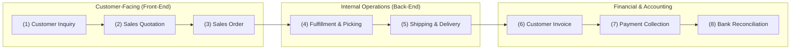
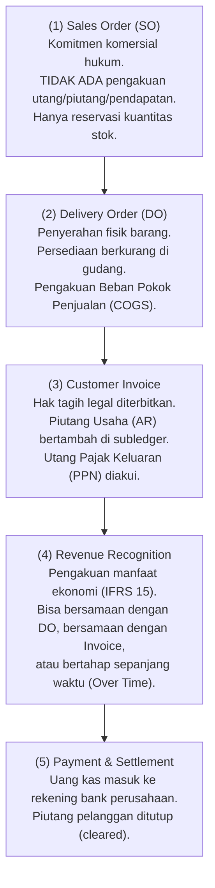

# Sales Fundamentals in ERP

## Definition

**Sales (Penjualan)** dalam konteks Enterprise Resource Planning (ERP) adalah fungsi bisnis dan modul operasional terintegrasi yang mengelola seluruh siklus hidup interaksi komersial dengan pelanggan—mulai dari penerimaan prospek (*lead/inquiry*), penawaran harga (*quotation*), kontrak dan pesanan resmi (*sales order*), koordinasi pemenuhan (*order fulfillment*), hingga penyerahan hak tagih (*billing*) dan penyelesaian pembayaran.

Dalam sistem ERP, penjualan harus dibedakan secara tegas antara dua dimensi:
1. **Sales sebagai Fungsi Bisnis (*Commercial Function*)**: Aktivitas pemasaran, negosiasi harga, penetapan diskon, pengelolaan hubungan pelanggan, dan penugasan perwakilan penjualan (*sales rep*).
2. **Sales sebagai Rangkaian Transaksi Finansial (*Transaction Stream*)**: Serangkaian peristiwa bisnis terstruktur (*business events*) yang mengubah status dokumen legal, mengikat komitmen persediaan fisik di gudang, menerbitkan tagihan piutang, dan bermuara pada pengakuan pendapatan serta kas di buku besar (*General Ledger*).

---

## Business Purpose

Implementasi modul Sales dalam arsitektur ERP bertujuan untuk:
1. **Mencegah Kebocoran Pendapatan (*Revenue Leakage*)**: Memastikan setiap barang yang keluar dari gudang tercatat dalam pesanan penjualan dan diterbitkan fakturnya dengan harga dan pajak yang valid.
2. **Pemberlakuan Kebijakan Komersial Terpusat**: Menerapkan aturan harga (*pricing rules*), matriks persetujuan diskon, dan kontrol batas kredit (*credit limit check*) secara otomatis tanpa intervensi manual yang rentan kecurangan.
3. **Visibilitas Pemenuhan Pesanan (*Order Visibility*)**: Memberikan transparansi status pesanan bagi pelanggan dan manajemen secara *real-time* (apakah pesanan sedang dipersiapkan di gudang, dalam pengiriman, atau tertahan masalah kredit).
4. **Integrasi Finansial Tanpa Rekonsiliasi Ganda**: Menghubungkan aktivitas pengiriman dan penagihan langsung ke modul persediaan dan piutang usaha (*Accounts Receivable*) tanpa perlu re-entry data manual.

---

## The Order-to-Cash (O2C) Context

Penjualan merupakan motor penggerak dari aliran nilai utama **Order to Cash (O2C)** (lihat [[01-business-processes/order-to-cash|Order to Cash]]). 

### Customer-Facing vs Internal Operations

Proses penjualan di ERP menjembatani dua dunia yang berbeda karakteristiknya:
* **Customer-Facing Processes**: Berfokus pada kecepatan respons, fleksibilitas negosiasi komersial, akurasi janji pengiriman (*Available-to-Promise*), dan kenyamanan pelanggan (Quotation, Sales Order, Konfirmasi Pengiriman).
* **Internal Back-Office Processes**: Berfokus pada kepatuhan aturan bisnis, verifikasi solvabilitas kredit, optimasi rute gudang, kontrol batas persediaan fisik, kalkulasi pajak, dan integritas pencatatan akuntansi (Picking, Packing, Goods Issue, Invoicing, General Ledger Posting).

---

## Cross-Module Integration Matrix

Modul Sales tidak dapat berdiri sendiri. Di dalam sistem ERP, modul ini memiliki keterkaitan langsung dengan hampir seluruh modul inti lainnya:

| Modul Terkait | Arah Aliran Data | Objek Data / Peristiwa Integrasi | Konsep Terkait |
|---|:---:|---|---|
| **CRM (Customer Relationship Mgmt)** | Masuk $\to$ | Konversi prospek (*Lead / Opportunity*) menjadi data Pelanggan resmi dan Penawaran (*Quotation*). | Master Data Pelanggan |
| **Inventory & Warehouse (WMS)** | Dua Arah $\leftrightarrow$ | Sales Order memicu reservasi stok (*stock reservation*); mutasi fisik pengeluaran barang (*Goods Issue*) mengurangi kartu stok gudang. | [[01-business-processes/inventory-process|Inventory Process]] |
| **Procurement & Manufacturing** | Keluar $\to$ | Kekurangan stok barang jadi memicu penerbitan Perintah Produksi (*Work Order* pada model *Make-to-Order*) atau Permintaan Pembelian (*Purchase Requisition* pada model *Back-to-Back*). | [[01-business-processes/manufacturing-process|Manufacturing Process]] |
| **Logistics & Shipping** | Keluar $\to$ | Penerbitan Surat Jalan (*Delivery Note*), penentuan rute ekspedisi, pelacakan nomor resi, dan ongkos kirim. | [[03-sales/delivery-and-shipping|Delivery and Shipping]] |
| **Tax Engine** | Masuk $\to$ | Penentuan kode pajak, pembebanan PPN Masukan/Keluaran, dan penomoran faktur pajak elektronik resmi. | [[02-accounting/tax-accounting|Tax Accounting]] |
| **Accounts Receivable (AR)** | Keluar $\to$ | Penerbitan Faktur Penjualan (*Customer Invoice*) mencatat penambahan saldo piutang di buku pembantu pelanggan. | [[02-accounting/accounts-receivable|Accounts Receivable]] |
| **General Ledger (Accounting)** | Keluar $\to$ | Pengakuan Beban Pokok Penjualan (COGS) saat penyerahan barang dan pengakuan Pendapatan (*Revenue*) saat penagihan. | [[02-accounting/journal-entry|Journal Entry]] |
| **Treasury & Banking** | Masuk $\to$ | Penerimaan transfer kas/bank dari pelanggan mengalokasikan pelunasan faktur (*open-item clearing*). | [[02-accounting/bank-reconciliation|Bank Reconciliation]] |

---

## Prinsip Kritis: Sales Order $\neq$ Invoice $\neq$ Revenue $\neq$ Cash

Salah satu kesalahpahaman paling umum dalam perancangan ERP adalah mencampuradukkan peristiwa pemesanan dengan peristiwa finansial. Di dalam sistem ERP yang benar:

$$\mathbf{Sales\ Order \neq Customer\ Invoice \neq Revenue\ Recognition \neq Cash\ Receipt}$$

1. **Sales Order Diterbitkan**: Pelanggan memesan 10 unit laptop seharga Rp10.000.000. Dokumen ini adalah **komitmen komersial**, bukan transaksi akuntansi. Tidak ada akun GL yang didebit atau dikredit.
2. **Barang Dikirim (Delivery)**: 10 unit laptop keluar dari gudang. Terjadi mutasi persediaan fisik. Dalam sistem persediaan perpetual, nilai aset persediaan berkurang Rp7.000.000 dan diakui sebagai COGS.
3. **Faktur Diterbitkan (Invoice)**: Perusahaan menerbitkan hak tagih legal kepada pelanggan sebesar Rp11.100.000 (termasuk PPN 11%). Piutang Usaha (*Accounts Receivable*) bertambah di subledger.
4. **Pendapatan Diakui (Revenue)**: Terjadi saat kendali (*control*) atas barang telah berpindah ke pelanggan sesuai kriteria **IFRS 15** (lihat [[03-sales/revenue-recognition|Revenue Recognition]]).
5. **Pembayaran Diterima (Cash)**: Pelanggan mentransfer uang melalui bank. Kas bertambah, piutang dihapus dari daftar tagihan terbuka (*open item*).

---

## ERP Implication

Secara arsitektur perangkat lunak, modul Sales biasanya dibangun di atas model data relasional:
* **Sales Order Header (`so_header`)**: Menyimpan atribut global seperti nomor pesanan, ID pelanggan, tanggal pesanan, status pesanan, mata uang, daftar harga (*price list*), termin pembayaran, dan alamat penagihan/pengiriman.
* **Sales Order Line Items (`so_lines`)**: Menyimpan baris-baris produk individual, kuantitas yang dipesan, harga satuan, persentase diskon, kode pajak, gudang pengeluaran, tanggal permintaan kirim, dan status pemenuhan baris tersebut.
* **Document Flow / Reference Links**: Menyimpan riwayat tautan polimorfik antar-dokumen (`Quotation` $\to$ `Sales Order` $\to$ `Delivery Order` $\to$ `Customer Invoice` $\to$ `Payment Entry`).

---

## Related Concepts

* [[00-fundamentals/documents-transactions-events|Documents, Transactions, and Business Events]] — Pemisahan dokumen bisnis dari transaksi database.
* [[00-fundamentals/cross-module-integration|Cross-Module Integration]] — Mekanisme integrasi data lintas departemen.
* [[01-business-processes/order-to-cash|Order to Cash (O2C)]] — Siklus bisnis penjualan hulu-ke-hilir.
* [[02-accounting/revenue-and-expense|Revenue and Expense Accounting]] — Prinsip pengakuan pendapatan akuntansi.

---

## References

1. **IFRS Foundation**: *IFRS 15 Revenue from Contracts with Customers - Transfer of Control and Performance Obligations*. URL: https://www.ifrs.org/issued-standards/list-of-standards/ifrs-15-revenue-from-contracts-with-customers/
2. **Association for Supply Chain Management (ASCM)**: *APICS Dictionary - Order-to-Cash and Available-to-Promise*.
3. **Microsoft Learn**: *Sales and marketing overview and order processing architecture in Dynamics 365 Supply Chain Management*. URL: https://learn.microsoft.com/en-us/dynamics365/supply-chain/sales-marketing/
4. **Frappe / ERPNext Documentation**: *Selling Module and Order-to-Cash Workflow Overview*. URL: https://docs.frappe.io/erpnext/user/manual/en/selling
