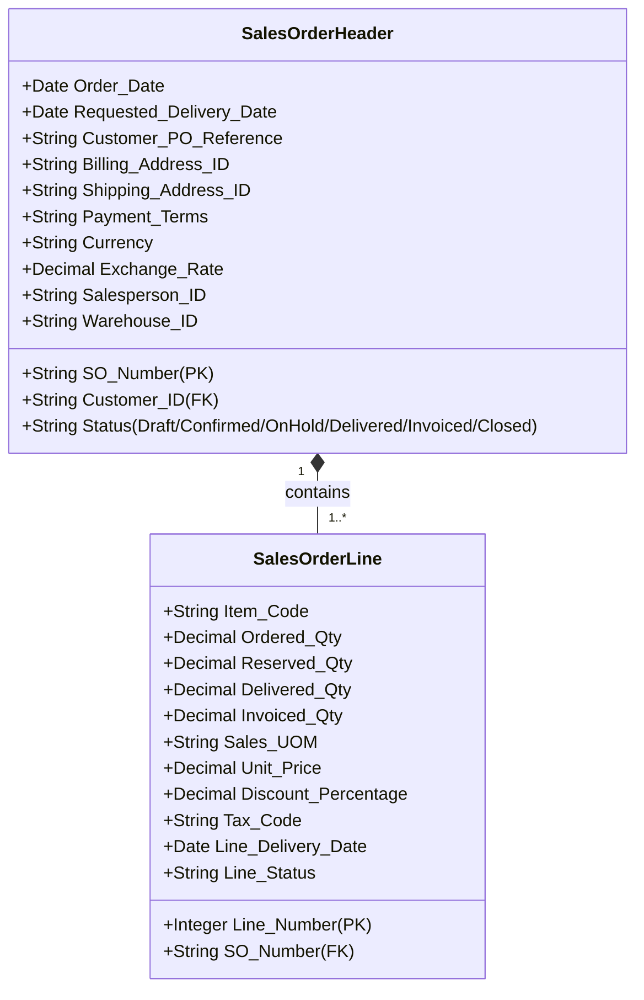
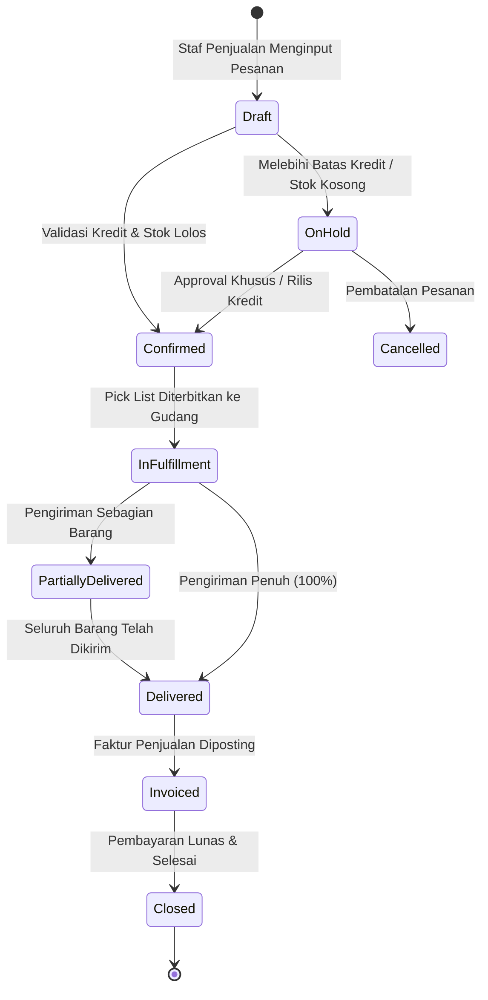

# Sales Order

## Definition

**Sales Order (Pesanan Penjualan / SO)** adalah dokumen transaksi legal dan komersial internal yang diterbitkan oleh penjual untuk mengonfirmasi persetujuan pemenuhan barang atau jasa kepada pembeli berdasarkan syarat harga, kuantitas, tanggal pengiriman, dan ketentuan pembayaran yang telah disepakati.

Berbeda dari penawaran harga (*Quotation*) yang bersifat proposal non-mengikat, *Sales Order* merupakan **kontrak komersial yang mengikat secara hukum (*legally binding contract*)**. Di dalam arsitektur ERP, Sales Order berfungsi sebagai **pusat komando operasional (*orchestration hub*)** yang menggerakkan rantai pasok internal: memicu reservasi stok di gudang, menerbitkan instruksi produksi pabrik, atau mengajukan pemesanan barang ke pemasok.

---

## Business Purpose

Implementasi Sales Order dalam sistem ERP bertujuan untuk:
1. **Pengikatan Komitmen Kontraktual**: Mengonversi permintaan pelanggan (sering kali berupa *Purchase Order* resmi dari pihak pelanggan) menjadi komitmen operasional internal yang terstruktur.
2. **Pemicu Alokasi Persediaan (*Stock Reservation Trigger*)**: Mengamankan kuantitas barang di gudang agar tidak dijual ke pelanggan lain oleh staf penjualan yang berbeda.
3. **Pemberlakuan Pengendalian Batas Kredit (*Credit Exposure Check*)**: Memvalidasi apakah pesanan baru ini aman diproses berdasarkan riwayat pembayaran pelanggan sebelum barang disiapkan.
4. **Koordinasi Waktu Pengiriman (*Delivery Scheduling*)**: Memberikan instruksi tanggal penyerahan barang (*Requested Delivery Date*) ke departemen logistik dan pergudangan.

---

## Anatomi Data: Header dan Line Items

Data dalam Sales Order diorganisasi dalam dua lapisan relasional:

### Elemen Kunci Header
* **SO Number & Order Date**: Nomor unik dokumen pesanan dan tanggal transaksi dibuat.
* **Customer Reference / Customer PO**: Nomor surat pesanan resmi dari pelanggan (misal: `CUST-PO-2026-881`). Menjadi kunci rujukan audit saat penagihan piutang.
* **Billing Address vs Shipping Address**: Lokasi pengiriman faktur penagihan vs lokasi fisik penurunan barang di gudang pelanggan.
* **Requested Delivery Date**: Tanggal barang diharapkan tiba di lokasi pelanggan.
* **Overall Status**: Status global pesanan yang mencerminkan progres hilir pemenuhan (*Order Status*).

### Elemen Kunci Line Items
* **Item Code & Description**: Identitas produk atau layanan yang dipesan.
* **Tracking Kuantitas Multi-Tahap**: ERP enterprise melacak empat kolom kuantitas secara simultan pada setiap baris:
  $$\text{Ordered Qty} \to \text{Reserved Qty} \to \text{Delivered Qty} \to \text{Invoiced Qty}$$
* **Unit Price & Discounts**: Harga satuan dan diskon per baris yang terkunci (*price snapshot*).
* **Shipping Warehouse**: Gudang asal pengeluaran barang untuk baris tersebut.

---

## Sales Order Lifecycle & State Transitions

Alur status Sales Order di dalam ERP memandu proses bisnis dari persetujuan hingga penutupan dokumen:

### Penjelasan Status Utama:

1. **Draft**: Pesanan sedang disusun, belum memengaruhi reservasi stok atau kredit.
2. **Confirmed / Approved**: Pesanan telah disetujui. Sistem otomatis melakukan **reservasi stok komitmen (*stock reservation*)** di gudang dan menambah beban paparan kredit (*credit exposure*).
3. **On Hold (Credit Hold / Operational Hold)**: Pesanan tertahan sistem karena pelanggan melebihi plafon kredit atau terdapat tagihan jatuh tempo yang belum dilunasi (lihat [[03-sales/customer-credit-management|Customer Credit Management]]).
4. **Partially Delivered**: Sebagian kuantitas barang telah dikirim via surat jalan pertama, sementara sisa kuantitas berstatus *Backorder* (lihat [[03-sales/backorder-and-partial-fulfillment|Backorder and Partial Fulfillment]]).
5. **Delivered (Fulfilled)**: Seluruh barang fisik telah diserahkan dan diverifikasi melalui bukti penerimaan (*Proof of Delivery*).
6. **Invoiced**: Faktur komersial dan faktur pajak telah diterbitkan kepada pelanggan.
7. **Closed**: Pesanan telah selesai secara tuntas, seluruh barang terkirim, tertagih, dan terlunasi.

---

## Dampak Akuntansi & Persediaan (Accounting & Inventory Impact)

### 1. Dampak Persediaan (Inventory Impact): Reservasi vs Mutasi Fisik
Saat status SO berubah menjadi `Confirmed`:
* **Kuantitas Fisik Gudang (*On-Hand Quantity*)**: **TIDAK BERKURANG**. Barang masih berada di rak fisik gudang.
* **Kuantitas Komitmen (*Reserved Quantity*)**: **BERTAMBAH**.
* **Kuantitas Tersedia untuk Dijual (*Available to Sell / ATS*)**: **BERKURANG**.
  $$\mathbf{Available\ to\ Sell\ (ATS) = On\text{-}Hand\ Quantity - Reserved\ Quantity}$$
Hal ini mencegah terjadinya *overselling* (menjual barang yang sama ke dua pembeli berbeda). Pengurangan fisik baru terjadi saat dokumen pengiriman [[03-sales/delivery-and-shipping|Delivery Order]] disahkan.

### 2. Dampak Akuntansi (Accounting Impact):
> [!important] Prinsip Nol Jurnal Standar
> **Pada penjualan kredit standar, pengesahan Sales Order TIDAK MENGHASILKAN JURNAL AKUNTANSI APAPUN.**
> Belum ada hak tagih legal yang diakui (*no AR*), pendapatan belum boleh diakui di bawah IFRS 15 (*no Revenue*), dan persediaan belum diserahkan (*no COGS*).

#### Pengecualian: Penjualan dengan Uang Muka (*Customer Advance / Down Payment*)
Jika pesanan mewajibkan uang muka sebelum barang disiapkan:
1. Sistem menerbitkan *Down Payment Request / Advance Invoice*.
2. Saat uang diterima di bank, diposting jurnal liabilitas:
   * **Debit**: Kas / Bank Operasional
   * **Kredit**: Uang Muka Penjualan (*Customer Advance / Deferred Revenue* - Liabilitas Neraca)

---

## Skenario Transaksi Acuan (Canonical Baseline Example)

Untuk menjaga kesinambungan angka di seluruh repository:
* **Nomor Pesanan**: `SO-2026-09-0101`
* **Pelanggan**: PT Maju Bersama
* **Komoditas**: 10 Unit *Laptop Pro*
* **Harga Satuan**: Rp1.000.000 / unit
* **Nilai Penjualan Kotor**: Rp10.000.000
* **PPN (11%)**: Rp1.100.000
* **Total Nilai Pesanan**: **Rp11.100.000**
* **Estimasi Beban Pokok Penjualan (COGS)**: Rp7.000.000 (@ Rp700.000/unit)
* **Tanggal Permintaan Kirim**: 20 September 2026

Saat Sales Order ini disahkan:
* Stok fisik di gudang: 50 unit (tidak berubah).
* Kuantitas reservasi: bertambah 10 unit.
* Stok tersedia untuk pesanan lain (ATS): turun dari 50 menjadi 40 unit.
* Jurnal Akuntansi: Rp0 (tidak ada posting GL).

---

## Variasi Model Bisnis Pesanan Penjualan

Sistem ERP enterprise mendukung beberapa variasi pemrosesan *Sales Order*:

1. **Make-to-Stock (MTS)**: Pesanan dipenuhi langsung dari barang jadi yang sudah tersedia di gudang.
2. **Make-to-Order (MTO)**: Konfirmasi SO otomatis menerbitkan Perintah Kerja (*Work Order*) ke lantai pabrik untuk memulai proses manufaktur (lihat [[01-business-processes/manufacturing-process|Manufacturing Process]]).
3. **Drop-Shipping**: Penjual tidak menyimpan barang fisik; konfirmasi SO otomatis menerbitkan *Purchase Order* ke prinsipal/vendor ketiga untuk mengirimkan barang langsung ke lokasi pelanggan akhir.
4. **Service Order**: Pesanan jasa konsultasi, implementasi, atau perbaikan tanpa pergerakan barang fisik gudang.

---

## Related Concepts

* [[00-fundamentals/documents-transactions-events|Documents, Transactions, and Events]] — Sales Order sebagai dokumen pengendali bisnis.
* [[01-business-processes/order-to-cash|Order to Cash (O2C)]] — Siklus bisnis pemenuhan pesanan.
* [[03-sales/order-fulfillment|Order Fulfillment]] — Logika ketersediaan dan pelepasan pesanan ke gudang.
* [[03-sales/customer-credit-management|Customer Credit Management]] — Pengendalian pagu kredit pelanggan.

---

## References

1. **Association for Supply Chain Management (ASCM)**: *APICS Dictionary - Sales Order Processing and Allocation Rules*.
2. **Microsoft Learn**: *Sales order processing and delivery schedules in Dynamics 365 Supply Chain Management*. URL: https://learn.microsoft.com/en-us/dynamics365/supply-chain/sales-marketing/sales-orders
3. **Frappe / ERPNext Documentation**: *Sales Order Lifecycle, Auto-Indenting, and Drop Shipping*. URL: https://docs.frappe.io/erpnext/user/manual/en/selling/sales-order
4. **Odoo Documentation**: *Sales Orders, Quotation Templates, and Delivery Orders Integration*. URL: https://www.odoo.com/documentation/17.0/applications/sales/sales.html
