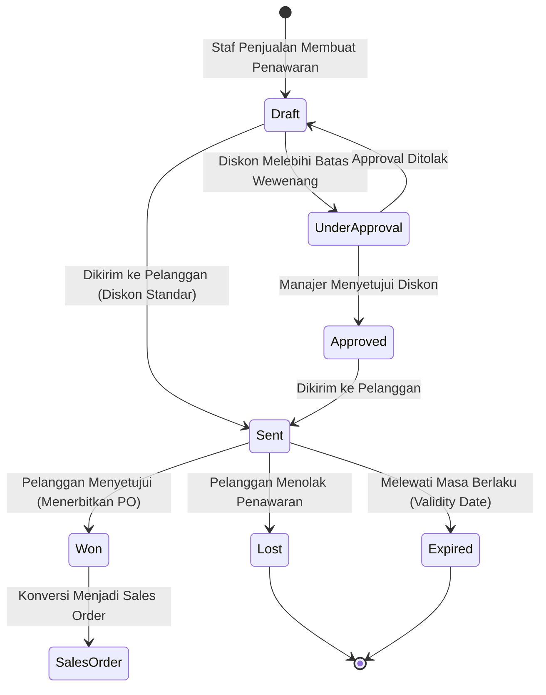

# Sales Quotation

## Definition

**Sales Quotation (Penawaran Harga / Sales Quote)** adalah dokumen komersial formal yang diterbitkan oleh penjual kepada calon pelanggan atau pelanggan terdaftar yang memuat komitmen penawaran harga, kuantitas, spesifikasi produk/jasa, diskon, serta syarat dan ketentuan pengiriman dan pembayaran yang berlaku selama periode waktu tertentu.

Dalam sistem ERP, penawaran harga berada pada gerbang awal siklus komersial yang menjembatani aktivitas *Customer Relationship Management (CRM)* dengan modul pemrosesan pesanan resmi (*Order Management*).

---

## Business Purpose

Penawaran harga memiliki fungsi strategis dalam operasi komersial perusahaan:
1. **Komitmen Komersial Berbatas Waktu (*Price Commitment*)**: Menjamin kepastian harga bagi pelanggan dalam rentang waktu tertentu (*Validity Period*) agar pembeli dapat merencanakan anggaran pengadaannya.
2. **Platform Negosiasi & Manajemen Versi**: Menyediakan sarana tawar-menawar harga dan spesifikasi teknis dengan mencatat setiap revisi penawaran secara transparan (*revision history*).
3. **Pemberlakuan Matriks Otorisasi Diskon (*Discount Approval Governance*)**: Mengontrol wewenang staf penjualan agar tidak memberikan diskon di luar batas toleransi marjin keuntungan perusahaan.
4. **Analisis Tingkat Keberhasilan Penjualan (*Win/Loss Ratio Analysis*)**: Mengukur efektivitas tim penjualan dengan melacak alasan penawaran yang ditolak atau kedaluwarsa.

---

## The Quotation Lifecycle & State Machine

Dokumen penawaran harga di ERP dikendalikan oleh mesin status (*state machine*) berikut:

### Penjelasan Status Utama:

1. **Draft**: Dokumen masih dalam tahap penyusunan oleh staf penjualan; data dapat diubah bebas.
2. **Under Approval**: Penawaran tertahan sistem karena mengandung parameter khusus (misal diskon > 10% atau termin pembayaran > 60 hari) yang mewajibkan tanda tangan digital manajer.
3. **Sent / Submitted**: Penawaran telah disahkan dan dikirimkan secara fisik atau via email/PDF ke pelanggan. Dokumen menjadi *read-only*.
4. **Accepted / Won**: Pelanggan menyetujui penawaran dan menerbitkan surat pesanan (*Purchase Order* dari pihak pelanggan). Dokumen siap dikonversi menjadi *Sales Order*.
5. **Rejected / Lost**: Pelanggan menolak penawaran (misal karena harga kalah saing atau waktu pengiriman terlalu lama). Sistem mewajibkan input alasan penolakan (*Lost Reason*) untuk analitik bisnis.
6. **Expired**: Tanggal kalender telah melewati batas tanggal masa berlaku (*Validity Expiration Date*). Sistem memblokir konversi otomatis kecuali dokumen diperpanjang atau direvisi.

---

## Data Structure: Header and Line Items

Dokumen penawaran harga dibangun dengan struktur dua tingkat:

### 1. Quotation Header
* **Quotation Number & Revision Code**: Nomor unik dokumen dan penanda revisi (misal: `SQ-2026-0089-Rev02`).
* **Customer Reference**: Identitas pelanggan atau data prospek (*Lead/Opportunity*).
* **Validity Period**: Tanggal terbit (*Quotation Date*) dan batas kedaluwarsa (*Valid Until Date*).
* **Payment Terms & Currency**: Kesepakatan syarat pembayaran (misal: *Net 30*) dan mata uang transaksi.
* **Incoterms & Delivery Terms**: Syarat penyerahan komersial (misal: *FOB Shipping Point*, *CIF Tanjung Priok*).

### 2. Quotation Lines
* **Item Code & Description**: Barang atau jasa yang ditawarkan.
* **Quantity & Sales UOM**: Jumlah unit yang ditawarkan.
* **Base Price & Discount**: Harga satuan katalog dan potongan harga yang diberikan.
* **Tax Code**: Kategori tarif pajak (misal: PPN 11%).
* **Expected Delivery Lead Time**: Estimasi waktu tunggu kesiapan barang.

---

## Business Rules & Validation Engine

1. **Aturan Masa Berlaku (*Validity Rule*)**:
   * Sistem wajib menolak pembuatan *Sales Order* dari penawaran yang statusnya telah `Expired`. Jika pelanggan ingin melanjutkan, staf harus membuat penawaran revisi baru (*New Revision*) dengan harga terkini.
2. **Matriks Persetujuan Diskon (*Discount Approval Matrix*)**:
   * Diskon $\le 5\%$: Cukup persetujuan staf penjualan (*Sales Representative*).
   * Diskon $5.1\% - 15\%$: Mewajibkan persetujuan Manajer Penjualan (*Sales Manager*).
   * Diskon $> 15\%$: Mewajibkan persetujuan Direktur Komersial (*VP Sales / Director*).
3. **Pemeriksaan Estimasi Ketersediaan (*Available-to-Promise / ATP Check*)**:
   * Pada saat menyusun penawaran, sistem memberikan visibilitas stok proyeksi untuk mencegah janji pengiriman yang mustahil dipenuhi (*unrealistic lead times*).

---

## Impact on Accounting and Inventory

> [!important] Aturan Nol Finansial & Operasional
> **Sales Quotation TIDAK MEMILIKI dampak akuntansi dan TIDAK MEMILIKI dampak mutasi persediaan fisik.**
> * **Accounting Impact**: **Nihil**. Tidak ada jurnal debit/kredit yang diposting ke General Ledger maupun Subledger AR karena belum ada transaksi pertukaran hak milik atau timbulnya hak tagih legal.
> * **Inventory Impact**: **Nihil**. Kuantitas persediaan fisik di gudang tidak berkurang dan tidak dilakukan reservasi stok komitmen (*hard reservation*), kecuali pada industri khusus yang mengonfigurasi fitur penahanan kuota penawaran (*soft quotation hold*).

---

## Concrete Business Example

Perusahaan komersial menerbitkan penawaran harga kepada calon pelanggan:
* **Nomor Penawaran**: `SQ-2026-09-0042`
* **Pelanggan**: PT Maju Bersama
* **Tanggal Terbit**: 10 September 2026
* **Masa Berlaku**: 14 Hari (Kedaluwarsa: 24 September 2026)
* **Rincian Komoditas**: 10 Unit *Laptop Pro* @ Rp1.000.000 = Rp10.000.000
* **PPN (11%)**: Rp1.100.000
* **Total Penawaran**: **Rp11.100.000**
* **Syarat Pembayaran**: Net 30 hari kalender sejak faktur diterbitkan.

Saat PT Maju Bersama menyetujui penawaran ini pada tanggal 15 September 2026, staf penjualan menekan tombol *Convert to Sales Order*, yang secara otomatis meneruskan seluruh rincian barang, harga, dan syarat pembayaran ke dalam dokumen pesanan resmi [[03-sales/sales-order|Sales Order]] tanpa risiko salah ketik.

---

## Variations & Caveats

1. **Quotation vs Proforma Invoice**:
   * *Quotation* adalah dokumen penawaran komersial murni.
   * *Proforma Invoice* adalah faktur proforma yang menyerupai faktur resmi untuk keperluan administrasi izin impor/ekspor, pembukaan *Letter of Credit (L/C)* di bank, atau permintaan pembayaran di muka (*prepayment*). Keduanya sama-sama bukan dokumen pembukuan akuntansi resmi.
2. **Partial Conversion (Konversi Sebagian)**:
   * Dalam negosiasi proyek besar, pelanggan dapat menyetujui sebagian baris barang dalam penawaran (misal menyetujui laptop, namun menolak penawaran jasa instalasi). ERP modern mendukung *Partial Sales Order Generation* dari satu dokumen penawaran.

---

## Related Concepts

* [[01-business-processes/order-to-cash|Order to Cash (O2C)]] — Penawaran harga sebagai tahap inisiasi komersial.
* [[03-sales/sales-order|Sales Order]] — Dokumen konversi hasil persetujuan penawaran.
* [[03-sales/pricing-and-discount|Pricing and Discount]] — Mesin perhitungan harga dan matriks diskon.

---

## References

1. **Association for Supply Chain Management (ASCM)**: *APICS Dictionary - Quotation Management and Available-to-Promise*.
2. **Microsoft Learn**: *Create and manage sales quotations in Dynamics 365 Supply Chain Management*. URL: https://learn.microsoft.com/en-us/dynamics365/supply-chain/sales-marketing/tasks/create-sales-quotation
3. **Frappe / ERPNext Documentation**: *Quotation Management, Revision Workflow, and Opportunity Conversion*. URL: https://docs.frappe.io/erpnext/user/manual/en/selling/quotation
4. **Odoo Documentation**: *Send Quotations and Online Signature Approvals*. URL: https://www.odoo.com/documentation/17.0/applications/sales/sales/send_quotations.html
