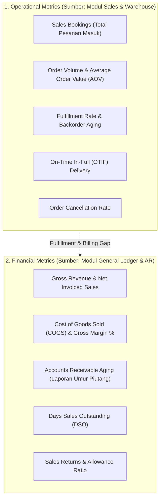
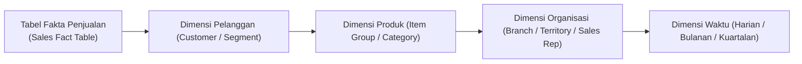

# Sales Reporting and Analytics

## Definition

**Sales Reporting and Analytics (Pelaporan dan Analitik Penjualan)** dalam sistem ERP adalah modul agregasi data, visualisasi, dan intelijen bisnis yang bertugas mengolah jutaan baris data transaksi komersial mentah menjadi metrik kinerja operasional (*operational KPIs*) dan metrik keuangan (*financial metrics*) untuk mendukung evaluasi kinerja, perencanaan rantai pasok, dan pengambilan keputusan strategis manajemen.

Dalam arsitektur ERP enterprise, analitik penjualan harus membedakan secara tegas **sumber kebenaran tunggal (*Single Source of Truth*)** antara metrik pesanan komersial dan metrik akuntansi keuangan.

---

## Business Purpose

Implementasi modul pelaporan penjualan bertujuan untuk:
1. **Pemantauan Kinerja Komersial Real-Time**: Mengukur pencapaian target penjualan per tim (*quota attainment*), memantau tren permintaan produk, dan mendeteksi penurunan order dari pelanggan utama.
2. **Optimalisasi Layanan Rantai Pasok (*Service Level Tracking*)**: Mengukur keandalan dan kecepatan pengiriman gudang melalui metrik *On-Time In-Full (OTIF)* dan tingkat pemenuhan (*Fill Rate*).
3. **Pengendalian Profitabilitas Produk dan Pelanggan**: Mengidentifikasi pelanggan atau lini produk mana yang menghasilkan marjin laba kotor tertinggi versus yang membebani biaya operasional.
4. **Peramalan Arus Kas (*Cash Flow Forecasting*)**: Memproyeksikan arus kas masuk masa depan berdasarkan jadwal jatuh tempo pesanan yang sedang berjalan.

---

## Operational Metrics vs Financial Metrics

Salah satu sumber perdebatan paling sengit antara Direktur Penjualan (*VP Sales*) dan Direktur Keuangan (*CFO*) adalah perbedaan angka laporan. ERP mengatasi hal ini dengan memisahkan dua lapisan metrik:

### Mengapa Angka "Sales Booking" Berbeda dari "Recognized Revenue"?
* **Sales Bookings (Pemesanan Masuk)**: Mencatat total komitmen nilai *Sales Order* yang disetujui bulan ini (misal: Rp150.000.000). Angka ini menunjukkan **efektivitas tim komersial** dalam mendapatkan kontrak.
* **Recognized Revenue (Pendapatan Buku Besar)**: Hanya mencatat nilai barang yang **telah benar-benar diserahkan dan difakturkan** sesuai standar IFRS 15 (misal: Rp100.000.000). Sisanya (Rp50.000.000) masih berada dalam antrean gudang atau berstatus *backorder*.

---

## Katalog Metrik Utama Penjualan ERP

### A. Metrik Operasional (Logistik & Komersial)

| Indikator Kinerja (KPI) | Formula / Definisi Matematis | Makna dan Tujuan Bisnis |
|---|---|---|
| **Order Volume** | Total jumlah dokumen *Sales Order* disahkan. | Mengukur tingkat aktivitas transaksi harian tim penjualan. |
| **Average Order Value (AOV)** | $\frac{\text{Total Nilai Penjualan}}{\text{Jumlah Transaksi Pesanan}}$ | Mengukur ukuran rata-rata transaksi; dasar strategi *cross-selling* dan *up-selling*. |
| **Order Fill Rate** | $\frac{\text{Kuantitas Terkirim Segera}}{\text{Total Kuantitas Dipesan}} \times 100\%$ | Mengukur kemampuan persediaan gudang memenuhi pesanan tanpa membuat *backorder*. |
| **On-Time In-Full (OTIF)** | $\frac{\text{Pesanan Tepat Waktu DAN Lengkap}}{\text{Total Pesanan}} \times 100\%$ | Standar emas logistik B2B; mengukur kepuasan pelanggan secara komprehensif. |
| **Cancellation Rate** | $\frac{\text{Nilai Pesanan Dibatalkan}}{\text{Total Nilai Pesanan Masuk}} \times 100\%$ | Mengidentifikasi masalah harga, ketersediaan stok, atau keterlambatan konfirmasi. |

---

### B. Metrik Finansial & Piutang (Akuntansi)

| Indikator Finansial | Formula / Definisi Matematis | Makna dan Tujuan Bisnis |
|---|---|---|
| **Gross Sales** | Total nilai faktur penjualan sebelum diskon dan retur. | Tolok ukur kapasitas bruto komersial entitas. |
| **Net Sales (Penjualan Bersih)** | $\text{Gross Sales} - \text{Trade Discounts} - \text{Returns}$ | Garis teratas (*top-line*) pada Laporan Laba Rugi resmi (lihat [[02-accounting/financial-statements|Financial Statements]]). |
| **Gross Margin %** | $\frac{\text{Net Sales} - \text{COGS}}{\text{Net Sales}} \times 100\%$ | Mengukur efisiensi marjin laba kotor sebelum beban operasional kantor. |
| **Days Sales Outstanding (DSO)** | $\frac{\text{Total Piutang Usaha (AR)}}{\text{Penjualan Kredit Tahunan}} \times 365\text{ hari}$ | Mengukur berapa hari rata-rata yang dibutuhkan perusahaan untuk mengonversi piutang menjadi uang kas nyata. |

---

## Dimensi Pemotongan Data Multidimensi (*Multi-Dimensional Slicing*)

Sistem ERP enterprise menyediakan mesin pelaporan dinamis yang memungkinkan data transaksi difilter berdasarkan dimensi manajerial (lihat [[00-fundamentals/organizational-structure|Organizational Structure]]):

1. **Analisis Berdasarkan Pelanggan (*Sales by Customer*)**:
   Mengidentifikasi prinsip Pareto (aturan 80/20): 20% pelanggan strategis yang menyumbang 80% total pendapatan perusahaan.
2. **Analisis Berdasarkan Produk (*Sales by Product / Profitability Matrix*)**:
   Memetakan produk berputar cepat dengan marjin tipis (*fast-moving, low margin*) vs produk berputar lambat dengan marjin tebal (*slow-moving, high margin*).
3. **Analisis Berdasarkan Wilayah & Perwakilan (*Sales by Territory & Rep*)**:
   Mengevaluasi efektivitas penetrasi pasar di setiap cabang geografis dan menilai pencapaian target kuota individu (*Quota Attainment*).

---

## Related Concepts

* [[01-business-processes/order-to-cash|Order to Cash (O2C)]] — Aliran data hulu-ke-hilir sumber pelaporan.
* [[03-sales/revenue-recognition|Revenue Recognition]] — Sumber kebenaran pengakuan pendapatan resmi.
* [[02-accounting/accounts-receivable|Accounts Receivable Accounting]] — Analisis umur piutang (*aging report*) dan DSO.
* [[02-accounting/financial-statements|Financial Statements]] — Penyajian pos penjualan bersih dan laba kotor.

---

## References

1. **Supply Chain Council (APICS/ASCM)**: *SCOR Model (Supply Chain Operations Reference) - Delivery Performance and OTIF Metrics*.
2. **Association for Financial Professionals (AFP)**: *Financial Planning and Analysis (FP&A) - Revenue Metrics and DSO Benchmarks*.
3. **Microsoft Learn**: *Sales analytics and Power BI reporting integration in Dynamics 365 Supply Chain Management*. URL: https://learn.microsoft.com/en-us/dynamics365/supply-chain/sales-marketing/sales-power-bi
4. **Frappe / ERPNext Documentation**: *Sales Analytics, Sales Funnel, and Item-Wise Sales Register*. URL: https://docs.frappe.io/erpnext/user/manual/en/accounts/sales-analytics
