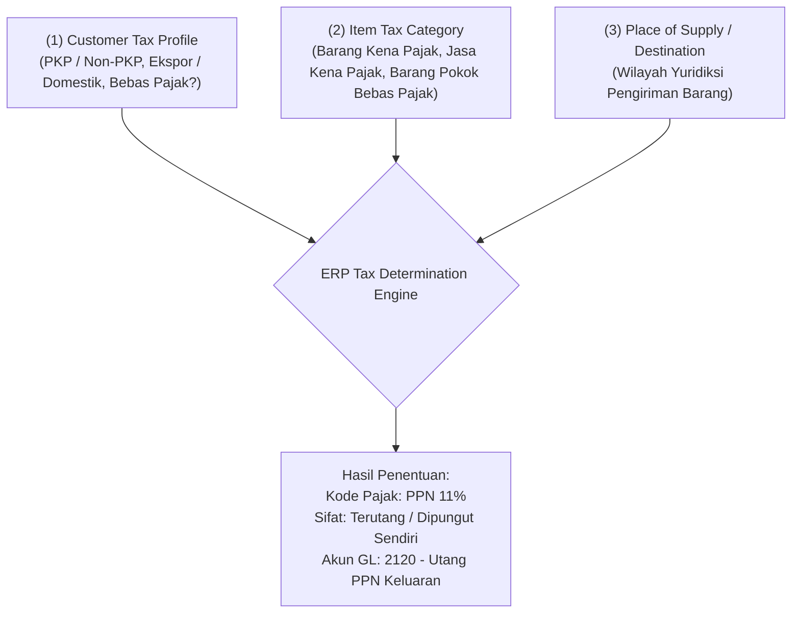

# Sales Tax in ERP

## Definition

**Sales Tax (Pajak Penjualan)** dalam sistem ERP adalah modul aturan perpajakan otomatis (*tax calculation engine*) yang bertugas menentukan apakah suatu transaksi penjualan terutang pajak, menghitung besaran nilai pajak berdasarkan hukum yurisdiksi yang berlaku, mencatat kewajiban utang pajak keluaran di buku besar umum, dan menghasilkan data faktur pajak elektronik resmi (*tax invoice compliance*).

Pajak yang dipungut dari pembeli pada saat penjualan secara universal diklasifikasikan sebagai **Pajak Tidak Langsung (*Indirect Tax*)** atau **Pajak Keluaran (*Output Tax / VAT Output*)**.

---

## Business Purpose

Integrasi mesin pajak (*Tax Engine*) dalam transaksi penjualan ERP bertujuan untuk:
1. **Otomatisasi Kepatuhan Hukum (*Statutory Compliance*)**: Memastikan kalkulasi pajak dilakukan secara presisi sesuai peraturan otoritas pajak tanpa bergantung pada perhitungan manual staf kasir atau penjualan.
2. **Mitigasi Sanksi dan Denda Fiskal**: Menghindari kesalahan tarif atau keterlambatan penerbitan faktur pajak yang dapat memicu sanksi bunga atau denda administratif dari dinas perpajakan negara.
3. **Penyelarasan Nilai Komersial dan Pajak**: Menghilangkan selisih (*reconciliation gap*) antara angka penjualan komersial pada modul *Sales* dengan Surat Pemberitahuan (SPT) Masa Pajak pada modul *Accounting*.

---

## Universal Tax Determination Engine

Sistem ERP enterprise menentukan jenis dan besaran tarif pajak secara dinamis melalui evaluasi tiga pilar data (*Tax Determination Matrix*):

### Kategori Tarif Pajak Standar:
1. **Standard Rate (Tarif Standar)**: Berlaku umum untuk sebagian besar barang dan jasa komersial (misal: 11% di Indonesia).
2. **Zero-Rated (Tarif 0%)**: Diberlakukan untuk transaksi ekspor barang ke luar negeri guna mendorong daya saing produk nasional. Penjual tidak memungut pajak keluaran, namun tetap berhak mengkreditkan pajak masukan produksinya.
3. **Exempt / Non-Taxable (Bebas / Bukan Objek Pajak)**: Komoditas kebutuhan pokok tertentu (misal: beras, daging mentah, jasa medis dasar) yang dibebaskan dari pungutan pajak.

---

## Tax-Inclusive vs Tax-Exclusive Pricing

ERP wajib mendukung dua metode penetapan harga terkait pajak:

### 1. Tax-Exclusive (Harga Belum Termasuk Pajak)
Biasa digunakan dalam perdagangan antar-bisnis (**B2B**). Harga penawaran katalog murni mencerminkan nilai barang, dan pajak ditambahkan di atasnya.
* *Rumus Dasar*:
  $$\text{Dasar Pengenaan Pajak (DPP)} = \text{Harga Barang}$$
  $$\text{Nilai Pajak (PPN)} = \text{DPP} \times \text{Tarif Pajak}$$
  $$\text{Total Tagihan} = \text{DPP} + \text{Nilai Pajak}$$
* *Contoh*: Harga Rp1.000.000, PPN 11% = Rp110.000 $\implies$ Total = **Rp1.110.000**.

### 2. Tax-Inclusive (Harga Sudah Termasuk Pajak)
Biasa digunakan dalam perdagangan ritel konsumen (**B2C**). Harga yang tertera pada label rak toko adalah harga final yang dibayar pembeli.
* *Rumus Pemisahan (Ekstraksi DPP)*:
  $$\mathbf{DPP = \frac{\text{Total Harga Label}}{1 + \text{Tarif Pajak}}}$$
  $$\mathbf{Nilai\ Pajak = \text{Total Harga Label} - DPP}$$
* *Contoh*: Harga label rak Rp1.000.000 (termasuk PPN 11%):
  $$\text{DPP} = \frac{\text{Rp1.000.000}}{1 + 0.11} = \mathbf{Rp900.901}$$
  $$\text{PPN} = \text{Rp1.000.000} - \text{Rp900.901} = \mathbf{Rp99.099}$$

---

## Aturan Pembulatan Pajak (Tax Rounding Rules)

Perbedaan selisih angka Rp1 sering kali timbul antara total faktur dan rekonsiliasi pajak jika metode pembulatan tidak diatur dengan jelas:
1. **Line-Level Rounding (Pembulatan per Baris)**: Sistem menghitung dan membulatkan pajak pada setiap baris produk secara individual, lalu menjumlahkan seluruh hasil pembulatan.
2. **Document-Level Rounding (Pembulatan per Faktur)**: Sistem menjumlahkan seluruh DPP baris terlebih dahulu, menghitung pajak dari total DPP tersebut, baru melakukan pembulatan satu kali di level akhir dokumen.

Regulasi otoritas perpajakan masing-masing negara umumnya mewajibkan penggunaan metode pembulatan spesifik untuk validitas faktur elektronik.

---

## Konteks Yurisdiksi Indonesia (UU HPP No. 7 Tahun 2021)

> [!important] Catatan Regulasi Lokal
> Penjelasan berikut merupakan contoh implementasi perpajakan yang berlaku di **Republik Indonesia** berdasarkan **UU Harmonisasi Peraturan Perpajakan (UU HPP No. 7 Tahun 2021)**:
> 1. **Tarif PPN Standar**: Ditetapkan sebesar **11%** (efektif sejak 1 April 2022).
> 2. **Faktur Pajak Elektronik (*e-Faktur*)**: Setiap faktur komersial kepada Pengusaha Kena Pajak (PKP) wajib menyertakan **Nomor Seri Faktur Pajak (NSFP)** resmi yang dialokasikan oleh Direktorat Jenderal Pajak (DJP) dan diunggah melalui API perpajakan.
> 3. **Mekanisme Wajib Pungut (WAPU)**:
>    * Jika bertransaksi dengan instansi pemerintah, BUMN, atau kontraktor migas tertentu (*Badan Pemungut WAPU*), pembeli **tidak membayar PPN ke penjual**, melainkan memotong PPN tersebut dan menyetorkannya langsung ke kas negara atas nama penjual.

---

## Jurnal Akuntansi Pajak Penjualan (Accounting Impact)

### Skenario Transaksi Baseline:
Penjualan 10 unit *Laptop Pro* @ Rp1.000.000 kepada pelanggan swasta (PT Maju Bersama):
* Dasar Pengenaan Pajak (DPP): Rp10.000.000
* PPN Keluaran (11%): Rp1.100.000
* Total Piutang: Rp11.100.000

#### 1. Jurnal Penjualan Standar (Dipungut Sendiri):
Perusahaan menagih penuh nilai barang dan pajak ke pembeli:

| Akun | Kategori | Debit (Rp) | Kredit (Rp) |
|---|---|---:|---:|
| Piutang Usaha (*Accounts Receivable*) | Asset | 11.100.000 | - |
| Pendapatan Penjualan (*Sales Revenue*) | Revenue | - | 10.000.000 |
| Utang PPN Keluaran (*VAT Output Payable*) | **Liability** | - | **1.100.000** |

*Utang PPN Keluaran dicatat di kelompok Liabilitas karena uang Rp1.100.000 tersebut adalah titipan negara yang wajib disetor ke kas negara pada akhir masa pajak (lihat [[02-accounting/tax-accounting|Tax Accounting]]).*

#### 2. Variasi Jurnal Penjualan ke Instansi Pemerintah (WAPU):
Jika pelanggan adalah Bendahara Pemerintah yang memotong PPN langsung:

| Akun | Kategori | Debit (Rp) | Kredit (Rp) |
|---|---|---:|---:|
| Piutang Usaha Bendahara (Hanya DPP) | Asset | 10.000.000 | - |
| Uang Muka / Tagihan PPN WAPU (Bukti Potong) | Asset / Tax Receiv. | 1.100.000 | - |
| Pendapatan Penjualan | Revenue | - | 10.000.000 |
| Utang PPN Keluaran | Liability | - | 1.100.000 |

---

## Related Concepts

* [[02-accounting/tax-accounting|Tax Accounting]] — Rekonsiliasi bulanan PPN Masukan vs PPN Keluaran (*VAT settlement*).
* [[03-sales/pricing-and-discount|Pricing and Discount]] — Penentuan Dasar Pengenaan Pajak (DPP) setelah diskon.
* [[02-accounting/financial-statements|Financial Statements]] — Penyajian liabilitas pajak lancar di neraca.

---

## References

1. **Direktorat Jenderal Pajak (DJP) RI**: *Undang-Undang No. 7 Tahun 2021 tentang Harmonisasi Peraturan Perpajakan (UU HPP)*. URL: https://pajak.go.id/
2. **OECD**: *International VAT/GST Guidelines - Destination Principle and Place of Supply*.
3. **Microsoft Learn**: *Sales tax calculation and tax engine integration in Dynamics 365 Supply Chain Management*. URL: https://learn.microsoft.com/en-us/dynamics365/finance/general-ledger/sales-tax-calculation-methods
4. **Frappe / ERPNext Documentation**: *Sales Taxes and Charges Template Configuration*. URL: https://docs.frappe.io/erpnext/user/manual/en/selling/sales-taxes-and-charges-template
