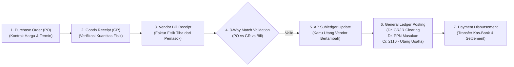
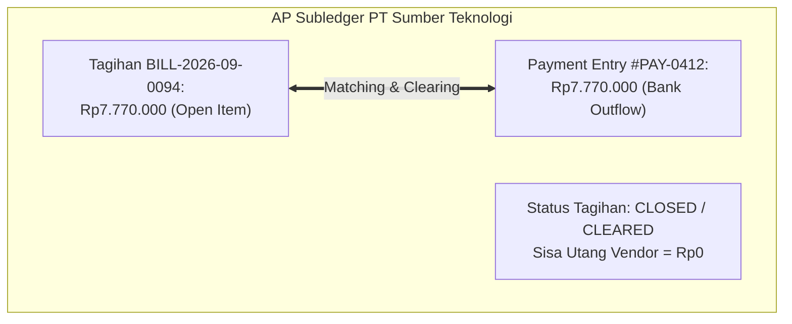

# Accounts Payable Integration

## Definition

**Accounts Payable Integration (Integrasi Utang Usaha)** dalam sistem ERP adalah mekanisme penyerahan data otomatis dari modul operasional Pengadaan (*Purchasing*) dan Pergudangan (*Warehouse*) ke modul Keuangan (*Accounts Payable / AP*) pada saat diterimanya dokumen **Faktur Tagihan Pemasok (*Vendor Bill / Supplier Invoice*)**.

Integrasi ini menandai transisi dari **penguasaan fisik barang/jasa** menjadi **pengakuan kewajiban hukum finansial resmi (*legal financial liability*)** yang memiliki konsekuensi tanggal jatuh tempo, pemotongan pajak, dan penyelesaian pembayaran kas perbankan.

Rincian perlakuan akuntansi buku pembantu utang dan standar IFRS 9 telah dibangun pada [[02-accounting/accounts-payable|Accounts Payable Accounting]] dan [[02-accounting/general-ledger-and-subledger|General Ledger and Subledger]].

---

## Business Purpose

Integrasi otomatis antara Purchasing dan Accounts Payable bertujuan untuk:
1. **Penutupan Akun Kliring Interim (*Interim Clearing Settlement*)**: Menutup saldo akun kewajiban akrual sementara (*GR/IR Clearing*) dan menggantikannya dengan utang usaha resmi di buku pembantu pemasok.
2. **Manajemen Saldo Terbuka (*Open-Item AP Management*)**: Memastikan setiap pengeluaran kas perusahaan di masa depan terikat (*matched*) dengan nomor faktur tagihan pemasok yang sah.
3. **Perencanaan Arus Kas Keluar (*Cash Outflow Scheduling*)**: Menghitung tanggal jatuh tempo (*Due Date*) secara otomatis berdasarkan syarat pembayaran untuk dimasukkan ke dalam proposal pembayaran mingguan (*Payment Proposal Run*).
4. **Pencegahan Pembayaran Ganda (*Duplicate Payment Prevention*)**: Memeriksa kombinasi nomor faktur pemasok (*Vendor Invoice Number*) dan ID vendor guna mendeteksi pengajuan tagihan berulang secara otomatis.

---

## The Purchasing-to-AP Data Pipeline

Aliran data dari pengadaan barang bermuara ke buku pembantu utang melalui alur berikut:

---

## Anatomi Faktur Tagihan Pemasok (Vendor Bill)

Dokumen Faktur Tagihan Pemasok di dalam ERP menyimpan atribut:
* **Nomor Dokumen Internal & Nomor Faktur Vendor**:
  * *Vendor Bill Number*: Nomor seri internal sistem ERP (misal: `BILL-2026-09-0094`).
  * *Supplier Invoice Reference*: Nomor faktur komersial asli yang tercetak pada lembar fisik tagihan dari pemasok (misal: `INV/ST/2026/0882`). Wajib dicatat untuk konfirmasi bukti bayar ke vendor.
* **Posting Date vs Document Date**:
  * *Document Date*: Tanggal faktur diterbitkan oleh pemasok (misal: 20 September 2026).
  * *Posting Date*: Tanggal transaksi memengaruhi buku besar dan masa pajak di modul akuntansi.
* **Kalkulasi Tanggal Jatuh Tempo (*Due Date Calculation*)**:
  $$\mathbf{Due\ Date = Bill\ Document\ Date + Payment\ Term\ Days}$$
  *Contoh*: Faktur tanggal 20 September dengan termin *Net 30* $\implies$ Jatuh tempo: **20 Oktober 2026**.
* **Identitas Faktur Pajak Elektronik**: Nomor Seri Faktur Pajak (NSFP) masukan dari pihak pemasok untuk keperluan rekonsiliasi SPT Masa PPN.

---

## Dampak Akuntansi: Penutupan GR/IR & Pengakuan Utang Usaha

Melanjutkan skenario acuan pembelian 10 unit komponen *Laptop Pro* dari PT Sumber Teknologi:
* Nilai Dasar Pengenaan Pajak (DPP): Rp7.000.000
* PPN Masukan (11%): Rp770.000
* Total Tagihan Utang: **Rp7.770.000**

### 1. Jurnal Saat Faktur Tagihan Disahkan (Vendor Bill Posting):
Setelah melalui verifikasi [[04-purchasing/three-way-match|Three-Way Match]] dan dinyatakan cocok:

| Akun | Kategori | Debit (Rp) | Kredit (Rp) |
|---|---|---:|---:|
| Utang Belum Difakturkan (*GR/IR Clearing*) | **Liability (Tutup Akun)** | **7.000.000** | - |
| PPN Masukan (*VAT Input Receivable*) | Asset (Neraca) | 770.000 | - |
| Utang Usaha (*Accounts Payable*) | **Liability (AP Subledger)** | - | **7.770.000** |

* **Dampak Buku Besar dan Subledger**:
  * Akun penampung sementara *GR/IR Clearing* yang sebelumnya dikredit Rp7.000.000 saat barang tiba di gudang (lihat [[04-purchasing/goods-receipt-and-service-receipt|Goods Receipt]]), kini didebit sebesar Rp7.000.000 sehingga saldonya kembali menjadi **Nol**.
  * Piutang pajak masukan diakui sebesar Rp770.000 di neraca.
  * Di **AP Subledger**, kartu utang PT Sumber Teknologi mencatat saldo kewajiban terbuka (*Open Item*) sebesar Rp7.770.000 dengan jatuh tempo tanggal 20 Oktober 2026.

---

## Pembayaran Kas & Kliring Saldo Terbuka (Payment & Settlement)

Pada tanggal 20 Oktober 2026, saat tagihan jatuh tempo dan dieksekusi transfer pembayarannya melalui bank:

### 2. Jurnal Pelunasan Utang Pemasok (Vendor Payment Disbursement):

| Akun | Kategori | Debit (Rp) | Kredit (Rp) |
|---|---|---:|---:|
| Utang Usaha (*Accounts Payable*) | Liability (AP Subledger) | 7.770.000 | - |
| Bank Operasional | Asset (Neraca) | - | 7.770.000 |

* **Dampak Sistem**:
  * Faktur tagihan ditandai sebagai *Paid/Cleared*.
  * Akun kontrol `2110 - Utang Usaha` di GL berkurang Rp7.770.000.
  * Mutasi kas keluar bank siap dicocokkan pada saat tutup buku rekonsiliasi perbankan bulanan (lihat [[02-accounting/bank-reconciliation|Bank Reconciliation]]).

---

## Variasi Penagihan: Pengadaan Non-Persediaan / Jasa

Bagaimana perlakuan akuntansi untuk pengadaan jasa (seperti sewa gedung atau jasa konsultan) yang tidak melalui penerimaan gudang fisik (*no physical goods receipt*)?
* Pada pembelian jasa langsung, sistem ERP tidak menggunakan akun perantara *GR/IR*.
* **Jurnal Pembukuan Tagihan Jasa**:
  * **Debit**: Beban Operasional / Aset Terkait (misal: *Beban Sewa Gedung*)
  * **Debit**: PPN Masukan (jika ada)
  * **Kredit**: Utang Pajak Pemotongan PPh 23 (jika objek potongan)
  * **Kredit**: Utang Usaha (*Accounts Payable*)

---

## Related Concepts

* [[02-accounting/accounts-payable|Accounts Payable Accounting]] — Standar akuntansi utang usaha dan analisis aging AP.
* [[02-accounting/general-ledger-and-subledger|General Ledger and Subledger]] — Akun kontrol GL dan buku pembantu pemasok.
* [[04-purchasing/three-way-match|Three-Way Match]] — Validasi kecocokan data sebelum utang disahkan.
* [[02-accounting/bank-reconciliation|Bank Reconciliation]] — Kliring mutasi transfer pembayaran utang di rekening koran.

---

## References

1. **IFRS Foundation**: *IFRS 9 Financial Instruments - Financial Liabilities at Amortised Cost (Trade Payables)*. URL: https://www.ifrs.org/issued-standards/list-of-standards/ifrs-9-financial-instruments/
2. **Microsoft Learn**: *Vendor invoices overview, matching, and payment processing in Dynamics 365 Finance*. URL: https://learn.microsoft.com/en-us/dynamics365/finance/accounts-payable/vendor-invoices-overview
3. **Frappe / ERPNext Documentation**: *Purchase Invoice, Accounts Payable, and Payment Reconciliation*. URL: https://docs.frappe.io/erpnext/user/manual/en/accounts/purchase-invoice
4. **Odoo Documentation**: *Vendor Bills and Payment Registration*. URL: https://www.odoo.com/documentation/17.0/applications/finance/accounting/vendor_bills.html
