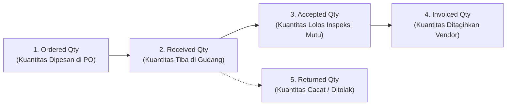

# Goods Receipt and Service Receipt

## Definition

Dalam sistem ERP, konfirmasi penyerahan barang atau penyelesaian pekerjaan dari pihak pemasok dikelola melalui dua instrumen operasional:

1. **Goods Receipt (Penerimaan Barang Fisik / Surat Penerimaan Barang)**: Dokumen pencatatan logistik pergudangan yang mengonfirmasi bahwa barang fisik telah dibongkar di dermaga gudang, dihitung kuantitasnya, diperiksa kualitasnya, dan disimpan ke lokasi rak (*bin location*).
2. **Service Receipt / Service Entry Sheet (Konfirmasi Penerimaan Jasa / Berita Acara)**: Dokumen persetujuan formal non-fisik yang ditandatangani oleh penanggung jawab proyek internal untuk mengonfirmasi bahwa penyedia jasa telah menuntaskan ruang lingkup pekerjaan (*Scope of Work*) atau mencapai tahapan proyek (*milestone*) yang disepakati.

Pengesahan dokumen penerimaan menandai **titik perpindahan penguasaan fisik dan pengakuan akrual kewajiban penerimaan (*receiving accrual*)** dalam sistem akuntansi perusahaan.

---

## Business Purpose

Penerapan proses penerimaan yang terstandarisasi dalam ERP bertujuan untuk:
1. **Verifikasi Kuantitas dan Integritas Mutu Masukan (*Quality Gatekeeper*)**: Memastikan kuantitas barang yang tiba sesuai dengan pesanan dan memisahkan barang yang cacat atau rusak ke area karantina (*Quarantine Area*).
2. **Pencatatan Persediaan Seketika (*Real-Time Stock Availability*)**: Memutakhirkan saldo kartu stok gudang secara instan agar bahan baku dapat segera diambil oleh lini perakitan pabrik atau dijual oleh staf komersial.
3. **Pilar Kedua dalam Pencocokan Tiga Arah (*The 2nd Pillar of 3-Way Match*)**: Menyediakan bukti kuantitas fisik yang sah (*Accepted Quantity*) sebagai batas tertinggi kuantitas yang boleh dibayar pada saat faktur tagihan pemasok tiba (lihat [[04-purchasing/three-way-match|Three-Way Match]]).
4. **Pencegahan Sengketa Pengiriman**: Merekam nomor surat jalan pemasok, nomor polisi kendaraan pengangkut, dan kondisi segel kontainer untuk keperluan audit sengketa klaim asuransi logistik.

---

## The 5 Vital Purchasing Quantities in ERP

Salah satu keunggulan kontrol sistem ERP enterprise adalah kemampuannya membedakan **lima status kuantitas pengadaan secara simultan** pada setiap baris pesanan:



| Parameter Kuantitas | Definisi & Titik Pencatatan | Dampak Fisik Pergudangan | Dampak Akuntansi |
|---|---|---|---|
| **1. Ordered Quantity** | Jumlah unit yang disepakati dalam kontrak *Purchase Order*. | Komitmen pengadaan masa depan (*On-Order Stock*). | Rp0 (tidak ada jurnal). |
| **2. Received Quantity** | Jumlah unit fisik yang diturunkan dari truk pemasok di dermaga bongkar. | Berada di area penerimaan sementara gudang. | Belum masuk stok aktif; menunggu inspeksi. |
| **3. Accepted Quantity** | Jumlah unit yang **dinyatakan lolos inspeksi mutu** oleh tim kendali mutu (*QC*). | **Masuk ke stok aktif gudang (*Available Stock*)** di rak penyimpanan. | **Memicu jurnal persediaan dan akrual penerimaan (GR/IR).** |
| **4. Invoiced Quantity** | Jumlah unit yang telah disahkan faktur tagihannya oleh bagian akuntansi. | Posisi hak tagih finansial pemasok. | Menutup akun interim menjadi Utang Usaha resmi. |
| **5. Returned / Rejected Qty** | Jumlah unit yang ditolak karena cacat, rusak, atau salah spesifikasi. | Berada di area karantina gudang untuk dikirim kembali ke vendor. | Tidak diakui sebagai aset persediaan perusahaan. |

---

## Alur Penerimaan Barang dan Inspeksi Kualitas (Quality Gate)

```mermaid
flowchart TD
    Truck["1. Truk Pemasok Tiba di Gudang\n(Membawa Surat Jalan Vendor / Delivery Note)"]
    --> MatchPO{"2. Verifikasi Nomor PO:\nApakah PO Valid & Masih Terbuka?"}
    
    MatchPO -->|PO Tidak Ditemukan / Sudah Ditutup| RejectTruck["Tolak Pembongkaran (Unauthorized Delivery)"]
    MatchPO -->|PO Valid| Unload["3. Pembongkaran Fisik Barang\n(Pencatatan Received Quantity)"]
    
    Unload --> Inspect{"4. Quality Inspection (Inspeksi Mutu)\nUji Sampel / Pengecekan Fisik"}
    
    Inspect -->|Lolos Uji Mutu (100%)| Accept["5a. Accepted: Pindahkan ke Lokasi Rak (Putaway)\nUpdate Kartu Stok & Posting Jurnal Persediaan"]
    Inspect -->|Sebagian Rusak / Cacat| Split["5b. Parsial: Terima yang Bagus (Accepted)\nKarantina yang Rusak (Rejected Quantity)"]
    
    Accept --> ThreeWay["6. Masuk ke Antrean Verifikasi 3-Way Match"]
    Split --> ThreeWay
    Split --> RetProc["7. Terbitkan Surat Pengembalian Barang (RTV / Return to Vendor)"]
```

---

## Penerimaan Barang Fisik vs Penerimaan Jasa (Service Receipt)

| Dimensi | Goods Receipt (Penerimaan Barang Fisik) | Service Receipt / Entry Sheet (Penerimaan Jasa) |
|---|---|---|
| **Wujud Objek** | Barang berwujud (*tangible inventory*): laptop, baut, semen, cairan kimia. | Jasa tidak berwujud (*intangible services*): jasa audit, kebersihan kantor, sewa server. |
| **Lokasi Eksekusi** | Dermaga gudang fisik oleh petugas logistik (*Warehouse Clerk*). | Kantor pemohon atau lokasi proyek oleh penanggung jawab teknis (*Project Manager*). |
| **Dampak Kartu Stok** | **Wajib mutasi kartu stok gudang** (menambah saldo fisik dan nomor lot/batch). | **Tidak ada mutasi kartu stok gudang** (bukan barang simpanan). |
| **Dokumen Bukti** | Surat Jalan vendor bertandatangan petugas gudang (*Receiving Slip*). | Berita Acara Serah Terima Pekerjaan (BAST) atau lembar jam kerja (*Timesheet Approval*). |
| **Dampak Akuntansi** | Mendebit akun **Aset Persediaan** di Neraca. | Mendebit akun **Beban Operasional** di Laba Rugi atau akun Proyek dalam Penyelesaian. |

---

## Dampak Akuntansi & Pola Akun Interim (Accounting Impact)

Dalam sistem persediaan perpetual (*Perpetual Inventory System*) yang menjadi standar pada ERP kelas enterprise:

> **Pengesahan Goods Receipt MENGHASILKAN JURNAL AKUNTANSI OTOMATIS ke General Ledger.**

### Skenario Transaksi Acuan:
Penerimaan 10 unit komponen *Laptop Pro* dari PT Sumber Teknologi (harga perolehan PO = Rp700.000/unit):
* Nilai Total Penerimaan Barang: $10 \times \text{Rp700.000} = \mathbf{Rp7.000.000}$.

### Jurnal Akuntansi Penerimaan Barang (Goods Receipt Posting):

| Akun | Kategori | Debit (Rp) | Kredit (Rp) |
|---|---|---:|---:|
| Persediaan Barang Dagang (*Inventory Asset*) | Asset (Neraca) | 7.000.000 | - |
| Utang Belum Difakturkan (*GR/IR / Interim Liability*) | **Liability (Neraca)** | - | **7.000.000** |

* **Dampak Finansial**:
  * Nilai aset persediaan bertambah di neraca sebesar Rp7.000.000 seketika saat barang masuk rak.
  * Di sisi penyeimbang, diakui kewajiban akrual sementara (*interim liability*) karena perusahaan telah menguasai aset namun pemasok belum menagihkan fakturnya secara resmi.

> [!important] Penjelasan Pola Arsitektur GR/IR (ERP-Agnostic Note)
> Penggunaan akun perantara seperti *GR/IR Clearing* (di SAP dan Microsoft Dynamics), *Stock Received But Not Billed* (di ERPNext), atau *Stock Interim Account* (di Odoo) adalah **pola implementasi arsitektur perangkat lunak enterprise yang sangat umum**, namun **BUKAN merupakan aturan baku akuntansi universal yang kaku**:
> * Pada sistem akuntansi non-perpetual (periodik) atau pembelian langsung habis pakai (*expense consumables*), beberapa software ERP mengonfigurasi sistem untuk **tidak menghasilkan jurnal apapun saat barang diterima**, melainkan langsung mendebit akun Beban dan mengkredit Utang Usaha saat faktur pemasok tiba di meja akuntansi.

---

## Skenario Acuan Transaksi di Gudang (Baseline Execution)

1. Pada tanggal 20 September 2026, truk logistik PT Sumber Teknologi tiba di Gudang Utama (*WH-01*).
2. Staf gudang memindai barcode dokumen `PO-2026-09-0081`:
   * Kuantitas Dipesan (*Ordered*): 10 unit.
   * Kuantitas Diterima Fisik (*Received*): 10 unit.
3. Tim *Quality Control* melakukan pengujian fungsi layar dan kelistrikan:
   * Hasil Uji: 10 unit lolos standar mutu (*Accepted Qty = 10*, *Rejected Qty = 0*).
4. Staf gudang mengesahkan dokumen penerimaan `GR-2026-09-0062`:
   * Kartu stok fisik bertambah 10 unit pada rak penyimpanan `BIN-EL-04`.
   * Saldo *On-Order* di PO ditutup menjadi 0 unit.
   * Jurnal akuntansi penerimaan otomatis diposting: Debit Persediaan Rp7.000.000, Kredit Utang Belum Difakturkan (*GR/IR*) Rp7.000.000.
   * Dokumen berstatus `Ready for Billing / Ready for 3-Way Match`.

---

## Related Concepts

* [[01-business-processes/inventory-process|Inventory Process]] — Prosedur pergudangan, kartu stok, dan mutasi barang masuk.
* [[02-accounting/inventory-accounting|Inventory Accounting]] — Standar penilaian persediaan di bawah IAS 2.
* [[04-purchasing/purchase-order|Purchase Order]] — Dokumen acuan kuantitas penerimaan gudang.
* [[04-purchasing/three-way-match|Three-Way Match]] — Validasi silang kuantitas penerimaan terhadap faktur pemasok.

---

## References

1. **Association for Supply Chain Management (ASCM)**: *APICS Dictionary - Receiving Operations, Quality Inspection, and Dock-to-Stock Time*.
2. **IFRS Foundation**: *IAS 2 Inventories - Recognition of Inventories and Control of Assets*. URL: https://www.ifrs.org/issued-standards/list-of-standards/ias-2-inventories/
3. **Microsoft Learn**: *Product receipts and receiving processing overview in Dynamics 365 Supply Chain Management*. URL: https://learn.microsoft.com/en-us/dynamics365/supply-chain/procurement/product-receipts
4. **Frappe / ERPNext Documentation**: *Purchase Receipt, Quality Inspection, and Stock Ledger Update*. URL: https://docs.frappe.io/erpnext/user/manual/en/stock/purchase-receipt
