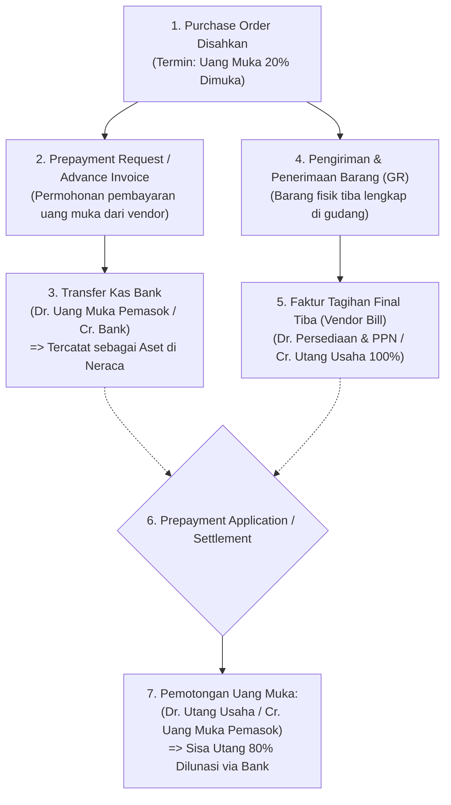

# Prepayment and Down Payment

## Definition

**Prepayment and Down Payment (Uang Muka Pembelian / Persekot Pemasok)** dalam sistem ERP adalah mekanisme keuangan yang mengatur pencatatan, penyetoran kas, dan penyelesaian saldo atas dana yang dibayarkan kepada pemasok sebelum barang fisik diserahkan atau sebelum jasa selesai dikerjakan.

Prinsip fundamental akuntansi berbasis akrual menetapkan:

> **Uang Keluar $\neq$ Beban Operasional (*Cash Outflow $\neq$ Expense Recognition*).**
> Penyerahan uang muka kepada pemasok **bukanlah pengakuan beban ataupun perolehan persediaan**, melainkan pertukaran aset kas menjadi **Aset Klaim Uang Muka (*Supplier Advance Asset*)** di neraca, karena hak milik atas barang belum berpindah dan kewajiban pemasok belum ditunaikan.

---

## Business Purpose

Implementasi alur uang muka pembelian di dalam ERP bertujuan untuk:
1. **Pengikatan Komitmen Pembelian Kustom (*Custom Order Commitment*)**: Memberikan jaminan finansial bagi pemasok sebelum mereka membeli bahan baku khusus untuk memproduksi barang pesanan perusahaan.
2. **Pembiayaan Proyek Bertahap (*Milestone Contract Financing*)**: Menyediakan modal kerja awal bagi kontraktor atau penyedia jasa pada proyek konstruksi jangka panjang.
3. **Pengendalian Saldo Klaim Kas (*Prepayment Aging & Tracking*)**: Memantau seluruh uang muka yang masih mengendap di pihak ketiga agar tidak terjadi uang muka yang terlupakan atau tidak diperhitungkan saat pelunasan tagihan akhir.
4. **Otomatisasi Pemotongan Tagihan Akhir (*Automatic Prepayment Settlement*)**: Memastikan sistem otomatis memotong saldo uang muka saat faktur tagihan final (*Final Vendor Bill*) disahkan.

---

## The Prepayment Lifecycle & Settlement Flow

---

## Dampak Akuntansi & Jurnal (Accounting Impact)

Melanjutkan skenario acuan pembelian 10 unit komponen *Laptop Pro* dari PT Sumber Teknologi:
* **Total Komitmen PO**: 10 unit @ Rp700.000 = Rp7.000.000 (+ PPN 11% Rp770.000 = **Rp7.770.000**).
* **Kebijakan Pembayaran**: Pemasok mewajibkan **Uang Muka 20%** sebelum pesanan mulai diproses.
* Nilai Uang Muka (20%): $20\% \times \text{Rp7.770.000} = \mathbf{Rp1.554.000}$.

---

### Tahap 1: Penyetoran Uang Muka via Bank (Advance Disbursement)
Pada tanggal 16 September 2026, perusahaan mentransfer uang muka sebesar Rp1.554.000 ke rekening resmi PT Sumber Teknologi:

| Akun | Kategori | Debit (Rp) | Kredit (Rp) |
|---|---|---:|---:|
| Uang Muka Pemasok (*Supplier Advance / Prepayment*) | **Asset (Neraca)** | **1.554.000** | - |
| Bank Operasional | Asset (Neraca) | - | 1.554.000 |

* **Dampak Finansial**: Komposisi aset berubah; saldo Kas Bank berkurang Rp1.554.000, digantikan oleh Aset Lancar berupa hak klaim uang muka sebesar Rp1.554.000. Belum ada utang atau beban yang diakui.

---

### Tahap 2: Penerimaan Barang & Pengakuan Faktur Final (Final Billing)
Pada tanggal 20 September 2026, seluruh 10 unit laptop tiba di gudang dan disahkan fakturnya sebesar 100%:

| Akun | Kategori | Debit (Rp) | Kredit (Rp) |
|---|---|---:|---:|
| Utang Belum Difakturkan (*GR/IR Clearing*) | Liability (Tutup Akun) | 7.000.000 | - |
| PPN Masukan (*VAT Input Receivable*) | Asset (Neraca) | 770.000 | - |
| Utang Usaha (*Accounts Payable*) | **Liability (AP Subledger)** | - | **7.770.000** |

*Di AP Subledger, total kewajiban utang kotor tercatat sebesar Rp7.770.000.*

---

### Tahap 3: Pemotongan Uang Muka Terhadap Tagihan Final (Prepayment Settlement)
Sistem ERP secara otomatis mencocokkan saldo uang muka yang pernah disetor terhadap faktur final tersebut:

| Akun | Kategori | Debit (Rp) | Kredit (Rp) |
|---|---|---:|---:|
| Utang Usaha (*Accounts Payable*) | Liability (AP Subledger) | 1.554.000 | - |
| Uang Muka Pemasok (*Supplier Advance*) | **Asset (Tutup Akun)** | - | **1.554.000** |

* **Dampak Sistem**:
  * Akun aset `Uang Muka Pemasok` ditutup dan saldonya kembali menjadi **Nol**.
  * Saldo utang terbuka yang tersisa (*Remaining Open Balance*) kepada PT Sumber Teknologi berkurang:
    $$\text{Sisa Utang Jatuh Tempo} = \text{Rp7.770.000} - \text{Rp1.554.000} = \mathbf{Rp6.216.000}$$

---

### Tahap 4: Pelunasan Sisa Utang Akhir (Final Residual Payment)
Pada saat jatuh tempo 30 hari, perusahaan cukup mentransfer sisa dana sebesar Rp6.216.000:

| Akun | Kategori | Debit (Rp) | Kredit (Rp) |
|---|---|---:|---:|
| Utang Usaha (*Accounts Payable*) | Liability (AP Subledger) | 6.216.000 | - |
| Bank Operasional | Asset (Neraca) | - | 6.216.000 |

*Status tagihan berubah menjadi `Closed / Cleared` secara sempurna.*

---

## Aspek Perpajakan Uang Muka (Tax Treatment of Advances)

Di banyak yurisdiksi perpajakan (termasuk regulasi PPN di Indonesia di bawah UU PPN):
* Jika uang muka diterima/dibayarkan **sebelum penyerahan barang**, saat terutangnya PPN adalah pada **tanggal pembayaran uang muka**.
* Pemasok wajib menerbitkan Faktur Pajak atas porsi uang muka tersebut (misal: PPN 11% dari DPP uang muka Rp1.400.000 = Rp154.000).
* ERP enterprise mengelola *Tax on Advance* ini melalui akun perantara pajak uang muka untuk mencegah terjadinya selisih pelaporan SPT Masa.

---

## Related Concepts

* [[04-purchasing/purchase-order|Purchase Order]] — Penetapan klausul pembayaran uang muka pada kontrak pemesanan.
* [[04-purchasing/accounts-payable-integration|Accounts Payable Integration]] — Penutupan utang usaha saat faktur final disahkan.
* [[02-accounting/accounting-fundamentals|Accounting Fundamentals]] — Pemisahan prinsip arus kas vs pengakuan beban akrual.
* [[03-sales/revenue-recognition|Revenue Recognition]] — Sisi cermin uang muka pelanggan (*Customer Advance / Deferred Revenue*).

---

## References

1. **IFRS Foundation**: *IAS 1 Presentation of Financial Statements - Classification of Current Assets (Prepayments)*. URL: https://www.ifrs.org/issued-standards/list-of-standards/ias-1-presentation-of-financial-statements/
2. **Microsoft Learn**: *Prepayments and prepayment invoices in Dynamics 365 Finance*. URL: https://learn.microsoft.com/en-us/dynamics365/finance/accounts-payable/prepayments-overview
3. **Frappe / ERPNext Documentation**: *Advance Payment Entry and Allocation to Purchase Invoice*. URL: https://docs.frappe.io/erpnext/user/manual/en/accounts/advance-payment-entry
4. **Odoo Documentation**: *Vendor Down Payments and Bill Matching*. URL: https://www.odoo.com/documentation/17.0/applications/finance/accounting/vendor_bills.html
