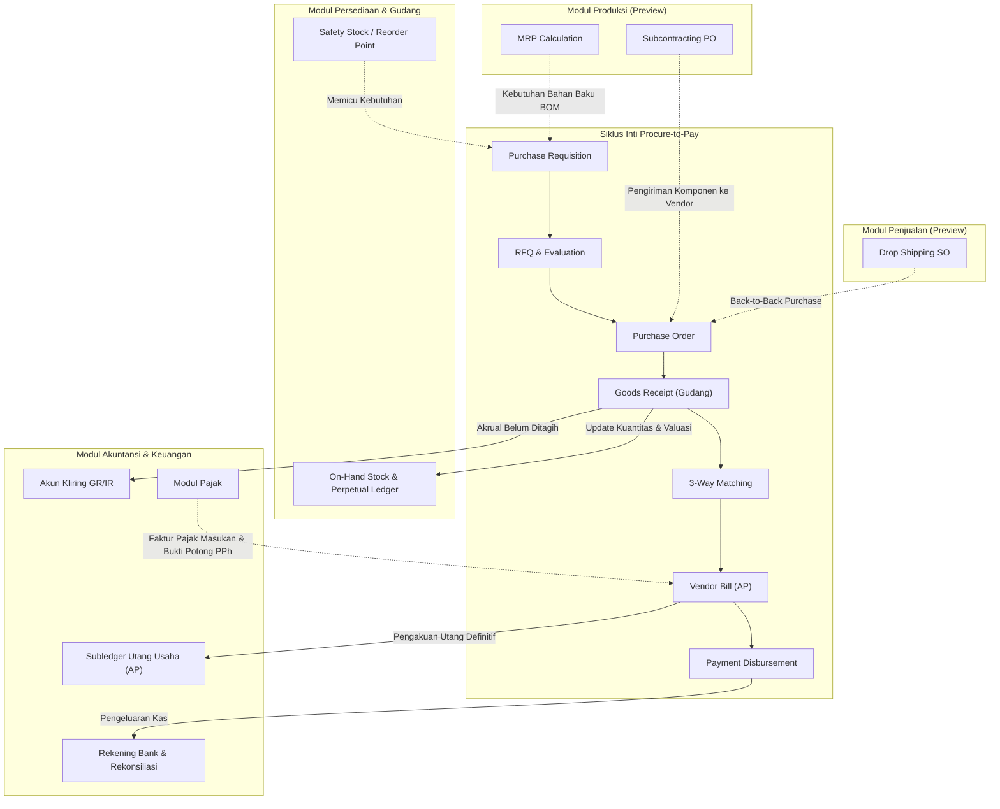

# Procure-to-Pay Integration

## Definition

**Procure-to-Pay (P2P) Integration** adalah sintesis arsitektural yang menghubungkan seluruh tahapan pengadaan barang dan jasa—mulai dari identifikasi kebutuhan internal, seleksi pemasok, penerbitan pesanan pembelian, penerimaan fisik atau jasa, verifikasi kesesuaian dokumen (*3-way match*), pengakuan kewajiban (*Accounts Payable*), hingga penyelesaian pembayaran perbankan—ke dalam satu ekosistem data yang terpadu (*seamless integrated data flow*).

P2P bukan sekadar alur kerja administratif di modul pembelian (*purchasing*), melainkan **urat nadi operasional dan finansial perusahaan** yang mengintegrasikan pengadaan dengan manajemen persediaan (*Inventory*), manajemen mutu (*Quality Control*), perpajakan (*Tax*), akuntansi buku besar (*General Ledger*), kas dan perbankan (*Treasury*), serta perencanaan produksi (*Manufacturing*) dan penjualan (*Sales*).

---

## Matriks Integrasi Lintas Modul (Cross-Module Matrix)

Diagram berikut mengilustrasikan bagaimana siklus P2P berinteraksi secara aktif dengan domain enterprise lainnya:

### Detail Titik Integrasi:

1. **Purchasing $\longleftrightarrow$ Inventory**:
   * *Automated Replenishment*: Saat saldo stok menyentuh titik pemesanan kembali (*Reorder Point* / ROP), ERP secara otomatis membangkitkan draft PR atau PO.
   * *Stock Valuation*: Penerimaan barang fisik ([[04-purchasing/goods-receipt-and-service-receipt|Goods Receipt]]) langsung menambah saldo kuantitas *On-Hand* dan mengalokasikan nilai persediaan ke akun aset.
   * *Landed Cost Allocation*: Biaya freight, bea masuk, dan asuransi didistribusikan secara proporsional ke nilai persediaan barang ([[04-purchasing/purchasing-pricing-and-terms|Purchasing Pricing and Terms]]).
2. **Purchasing $\longleftrightarrow$ Accounts Payable & General Ledger**:
   * *Accrual Accounting*: GR memicu pencatatan akrual kewajiban belum ditagih (*GR/IR Accrual*) untuk mematuhi prinsip penandingan (*matching principle*).
   * *Invoice Verification*: Dokumen tagihan vendor dicocokkan terhadap PO dan GR via [[04-purchasing/three-way-match|3-Way Match]] sebelum diakui sebagai utang usaha resmi (*AP Subledger*).
   * *Variance Treatment*: Selisih harga beli (*PPV*) atau selisih kurs valuta asing dialokasikan ke akun beban varian.
3. **Purchasing $\longleftrightarrow$ Cash & Treasury**:
   * *Cash Flow Forecasting*: Tanggal jatuh tempo PO dan Vendor Bill menjadi dasar bagi manajer keuangan untuk memproyeksikan kebutuhan likuiditas mingguan/bulanan.
   * *Payment Batching*: Pelunasan tagihan diproses secara kolektif (*payment run*) menghasilkan file instruksi transfer bank (*bank disbursement file*).
4. **Purchasing $\longleftrightarrow$ Tax Engine**:
   * *PPN Masukan*: Pencatatan Pajak Masukan (PPN 11%) yang dapat dikreditkan berdasarkan Faktur Pajak resmi dari vendor ([[04-purchasing/purchase-tax|Purchase Tax]]).
   * *Withholding Tax (PPh)*: Pemotongan PPh Pasal 23 atas jasa sewa/teknik atau PPh Pasal 22 atas impor barang, menghasilkan Bukti Pemotongan Pajak.
5. **Purchasing $\longleftrightarrow$ Quality Management (QM)**:
   * Penerimaan barang dialokasikan ke status *Quality Hold / Inspection*. Persediaan baru dapat digunakan setelah lolos uji laboratorium/QC. Jika cacat, memicu proses [[04-purchasing/purchase-return-and-debit-note|Return to Vendor (RTV)]].
6. **Purchasing $\longleftrightarrow$ Manufacturing & Sales (Preview)**:
   * *MRP*: Perhitungan kebutuhan bahan baku (*Bill of Materials*) memicu pengadaan komponen secara otomatis.
   * *Drop Shipping*: Pesanan penjualan (*Sales Order*) pelanggan secara langsung menciptakan PO ke vendor dengan alamat kirim langsung ke pelanggan akhir.

---

## Perbandingan Simetris: P2P (Purchasing) vs. O2C (Sales)

Siklus P2P dan [[01-business-processes/order-to-cash|O2C (Order to Cash)]] merupakan dua sisi cermin dari aktivitas rantai pasok perusahaan. Memahami kesetaraan struktural keduanya sangat penting untuk menguasai arsitektur data ERP:

| Dimensi Operasional & Finansial | Procure-to-Pay (P2P) | Order-to-Cash (O2C) |
| :--- | :--- | :--- |
| **Sumber Kebutuhan (Demand Source)** | Kebutuhan internal departemen, ROP persediaan, atau jadwal produksi MRP | Pesanan resmi dari pelanggan luar (*Customer Purchase Order*) |
| **Dokumen Permintaan Internal** | Purchase Requisition (PR) | Sales Quotation / Proforma Invoice |
| **Dokumen Komitmen Komersial** | Purchase Order (PO) ke Pemasok | Sales Order (SO) dari Pelanggan |
| **Aliran Dokumen Logistik** | Inbound: **Goods Receipt (GR)** / Receiving Slip | Outbound: **Delivery Order (DO)** / Packing Slip |
| **Aliran Fisik Barang** | Barang masuk ke gudang (debit persediaan fisik) | Barang keluar dari gudang (kredit persediaan fisik) |
| **Akun Akrual Perantara (Interim)** | **GR/IR Clearing** (Kewajiban Belum Ditagih) | **Unbilled Revenue** / Goods Shipped Not Invoiced |
| **Dokumen Finansial Utama** | **Vendor Bill** (Tagihan Pemasok) | **Customer Invoice** (Faktur Penjualan) |
| **Posisi Buku Besar Akhir** | **Accounts Payable (AP)** — Liabilitas Lancar | **Accounts Receivable (AR)** — Aset Lancar |
| **Penyelesaian Finansial** | **Payment Disbursement** (Kas/Bank Keluar / Kredit) | **Payment Receipt / Collection** (Kas/Bank Masuk / Debit) |
| **Dampak Perpajakan (Indonesia)** | Pajak Masukan (PPN Masukan) & PPh Potput (PPh 23/22) | Pajak Keluaran (PPN Keluaran) |
| **Dokumen Koreksi / Retur** | Return to Vendor (RTV) & **Debit Note** | Sales Return & **Credit Note** |
| **Kontrol Internal Kunci** | **3-Way Matching** (PO vs GR vs Bill) & *Separation of Duties* | **Credit Limit Check**, Pricing Approval, & SO-DO-Invoice Matching |

---

## Rekap Transaksi Kanonikal: Siklus Lengkap PT Sumber Teknologi

Untuk memastikan kontinuitas pemahaman yang utuh di seluruh modul *erp-notes*, berikut adalah penelusuran (*end-to-end trace*) skenario transaksi kanonikal:

### Parameter Skenario:
* **Entitas**: PT Maju Bersama (Pembeli) dan PT Sumber Teknologi (Pemasok Terdaftar, PKP).
* **Komoditas**: 10 unit Komponen Utama Laptop Pro @ Rp700.000.
* **Dasar Pengenaan Pajak (DPP)**: $10 \times \text{Rp}700.000 = \text{Rp}7.000.000$.
* **Pajak Pertambahan Nilai (PPN 11%)**: $\text{Rp}770.000$. Total komitmen PO: $\text{Rp}7.770.000$.
* **Term Pembayaran**: Net 30 hari. Valuasi persediaan: *Perpetual Moving Average*.

---

### Kronologi Transaksi dan Jurnal Akuntansi

#### 1. Permintaan dan Pesanan Pembelian (PR & PO)
* Tim Gudang/Produksi menerbitkan Purchase Requisition `PR-2026-00042` untuk 10 unit Laptop Pro.
* Setelah disetujui, Procurement menerbitkan Purchase Order `PO-2026-00042` kepada PT Sumber Teknologi senilai total Rp7.770.000 (inklusif PPN 11%).
* **Dampak Akuntansi**: **Tidak ada jurnal akuntansi keuangan**. ERP mencatat komitmen operasional (*open purchase commitment / encumbrance*).

#### 2. Penerimaan Fisik Tahap I — Parsial 6 Unit
* Vendor mengirimkan tahap pertama sebanyak 6 unit (nomor surat jalan vendor `SJ-ST-8810`).
* Gudang memverifikasi barang dan memposting Goods Receipt `GR-2026-0010` untuk 6 unit.
* Nilai persediaan: $6 \times \text{Rp}700.000 = \text{Rp}4.200.000$.
* **Jurnal Akuntansi (GR-1)**:
  * *(Dr)* Persediaan Barang Dagang: Rp4.200.000
  * *(Cr)* Utang Barang Belum Ditagih (GR/IR Accrual): Rp4.200.000

#### 3. Penerimaan Fisik Tahap II — Sisa 4 Unit
* Dua hari kemudian, vendor mengirimkan sisa 4 unit (surat jalan `SJ-ST-8815`).
* Gudang memverifikasi dan memposting Goods Receipt `GR-2026-0014` untuk 4 unit.
* Nilai persediaan: $4 \times \text{Rp}700.000 = \text{Rp}2.800.000$.
* **Jurnal Akuntansi (GR-2)**:
  * *(Dr)* Persediaan Barang Dagang: Rp2.800.000
  * *(Cr)* Utang Barang Belum Ditagih (GR/IR Accrual): Rp2.800.000
* *Status PO*: Seluruh 10 unit telah diterima lengkap (*Fully Received*). Saldo kredit akun GR/IR akumulatif: Rp7.000.000.

#### 4. Kapitalisasi Biaya Tambahan Pengadaan (Landed Cost Freight)
* Ekspedisi logistik pihak ketiga menagihkan ongkos angkut inbound sebesar Rp500.000 (lihat [[04-purchasing/purchasing-pricing-and-terms|Purchasing Pricing and Terms]]).
* Alokasi landed cost mendebit persediaan dan mengkredit utang ekspedisi:
  * *(Dr)* Persediaan Barang Dagang: Rp500.000
  * *(Cr)* Utang Usaha (Logistik Ekspedisi): Rp500.000
* *Hasil*: Nilai perolehan total 10 unit persediaan menjadi Rp7.500.000 (atau Rp750.000/unit), konsisten dengan catatan di modul [[02-accounting/inventory-accounting|Inventory Accounting]].

#### 5. Penagihan Vendor & 3-Way Matching (Vendor Bill)
* PT Sumber Teknologi mengirimkan faktur gabungan `INV-ST-9942` senilai Rp7.770.000 (DPP Rp7.000.000 + PPN Rp770.000) beserta Faktur Pajak Masukan elektronik.
* Sistem ERP menjalankan [[04-purchasing/three-way-match|3-Way Matching]] antara `PO-2026-00042` (10 unit @ Rp700.000), `GR-2026-0010` (6 unit), `GR-2026-0014` (4 unit), dan `INV-ST-9942`. Hasil: **Match Passed (Toleransi 0%)**.
* Bagian AP memposting Vendor Bill.
* **Jurnal Akuntansi (Vendor Bill)**:
  * *(Dr)* Utang Barang Belum Ditagih (GR/IR Accrual): Rp7.000.000
  * *(Dr)* Pajak Masukan (PPN Masukan 11%): Rp770.000
  * *(Cr)* Utang Usaha (Accounts Payable — PT Sumber Teknologi): Rp7.770.000
* *Hasil*: Akun GR/IR kembali bersaldo nol (nihil). Terbentuk kewajiban utang usaha resmi di subledger PT Sumber Teknologi sebesar Rp7.770.000.

#### 6. Retur Barang Cacat (1 Unit) & Penerbitan Debit Note
* Pada saat perakitan di lantai pabrik, terdeteksi 1 unit komponen mengalami cacat pabrikasi tersembunyi (*latent defect*).
* Diterbitkan Return to Vendor `RTV-2026-0003` dan dikirim kembali ke vendor.
* Bagian AP menerbitkan Debit Note `DN-2026-0001` (lihat [[04-purchasing/purchase-return-and-debit-note|Purchase Return and Debit Note]]) dengan nilai DPP Rp700.000 + PPN Rp77.000 = Rp777.000.
* **Jurnal Akuntansi (Debit Note)**:
  * *(Dr)* Utang Usaha (Accounts Payable — PT Sumber Teknologi): Rp777.000
  * *(Cr)* Persediaan Barang Dagang: Rp700.000
  * *(Cr)* Pajak Masukan (Koreksi PPN Masukan): Rp77.000
* *Hasil*: Saldo utang usaha bersih ke PT Sumber Teknologi berkurang menjadi $\text{Rp}7.770.000 - \text{Rp}777.000 = \text{Rp}6.993.000$.

#### 7. Penyelesaian Pembayaran Bank (Disbursement)
* Pada hari ke-30 (saat jatuh tempo), Finance memproses pembayaran via transfer bank Mandiri Operasional sebesar Rp6.993.000 untuk melunasi tagihan bersih.
* Pembayaran dialokasikan (*reconciled*) terhadap `INV-ST-9942` dan `DN-2026-0001`.
* **Jurnal Akuntansi (Payment Disbursement)**:
  * *(Dr)* Utang Usaha (Accounts Payable — PT Sumber Teknologi): Rp6.993.000
  * *(Cr)* Kas / Bank Mandiri Operasional: Rp6.993.000
* *Hasil Akhir*: Status PO beralih ke *Closed*, Vendor Bill berstatus *Paid*, subledger utang vendor bersaldo Rp0, dan siklus P2P tuntas secara paripurna.

---

## ERP Implementation Comparison

| Dimensi Arsitektur | Odoo Enterprise | ERPNext | Microsoft Dynamics 365 SCM |
| :--- | :--- | :--- | :--- |
| **Model Integrasi P2P** | Modular terintegrasi erat (Purchase $\to$ Stock Picking $\to$ Vendor Bill $\to$ Account Payment). | Monolitik berlapis DocType (Material Request $\to$ PO $\to$ Purchase Receipt $\to$ Purchase Invoice $\to$ Payment Entry). | Arsitektur enterprise modular terdistribusi (Procurement & Sourcing $\to$ Warehouse Management $\to$ Accounts Payable $\to$ Cash & Bank). |
| **Mekanisme Akrual Interim** | Menggunakan *Stock Interim Account (Received)* yang dikonfigurasi pada Product Category. | Menggunakan akun *Stock Received But Not Billed* pada level Company Default. | Menggunakan formal posting type *Product receipt* yang mengalokasikan ke *Purchase accrual*. |
| **Toleransi Matching** | Diatur pada Purchase Settings atau level Vendor Bill (toleransi selisih pembulatan). | Diatur via *Purchase Order Settings* (*Over/Under Delivery/Billing Allowance Percentage*). | Konfigurasi sangat komprehensif via *Invoice Matching Policy* (2-way, 3-way, line matching tolerance, total tolerance). |
| **Subledger to General Ledger** | Real-time posting otomatis ke tabel `account_move` dan `account_move_line`. | Real-time posting otomatis ke tabel `GL Entry` dengan relasi ke dokumen sumber. | Menggunakan arsitektur *Subledger Journal* dengan opsi posting langsung (*Immediate*) atau batch terjadwal. |

---

## Naventra Consideration

Untuk perancangan modul P2P pada sistem ERP enterprise seperti **Naventra**:

1. **Atomic Transaction Pipeline**: Pastikan mutasi transaksional P2P dieksekusi secara atomik dalam basis data. Sebagai contoh, saat memposting `GoodsReceipt`:
   * Mutasi tabel stok fisik (`stock_quants` / `inventory_ledgers`).
   * Pembentukan baris jurnal akrual GL (`gl_entries`).
   * Pembaruan kuantitas diterima pada baris PO (`po_lines.received_qty`).
   
   Ketiga mutasi ini harus berada dalam satu transaksi database (`BEGIN ... COMMIT`) guna mencegah anomali di mana kuantitas fisik bertambah namun jurnal akrual gagal terbentuk.
2. **Dedicated Document Flow Tracker**: Sediakan visualisasi antarmuka pengguna (*UI Flow Chart*) interaktif yang memperlihatkan silsilah dokumen secara grafis:
   $$\text{PR} \longrightarrow \text{PO} \longrightarrow [\text{GR-1}, \text{GR-2}] \longrightarrow \text{Bill} \longrightarrow [\text{Debit Note}] \longrightarrow \text{Payment}$$
   Pengguna dapat mengklik setiap node untuk langsung membuka detail dokumen terkait (*drill-down navigation*).
3. **Audit Immutability & Event Sourcing**: Terapkan catatan audit permanen (*append-only event log*) untuk setiap transisi status. Hindari pengubahan nilai finansial pada dokumen yang sudah disetujui; gunakan dokumen koreksi formal (RTV, Debit Note, PO Amendment) agar integritas pembukuan terjamin di mata auditor independen.
4. **Idempotent Payment Allocation**: Pastikan modul pembayaran perbankan menerapkan kunci idempotensi (*idempotency key*) untuk mencegah risiko *double payment* ke vendor saat terjadi kegagalan jaringan perbankan atau klik ganda oleh pengguna.

---

## References

- APQC (American Productivity & Quality Center). *Procure-to-Pay Blueprint and Process Framework*.
- IFRS Foundation. *IAS 2: Inventories (Measurement and Cost of Purchase)*.
- Microsoft Learn. *Procure-to-Pay End-to-End Business Process in Dynamics 365*.
- Frappe ERPNext Documentation. *Procure to Pay (P2P) Complete Workflow*.
- Odoo 17 Documentation. *Purchasing, Inventory Valuation, and Vendor Bills Integration*.
