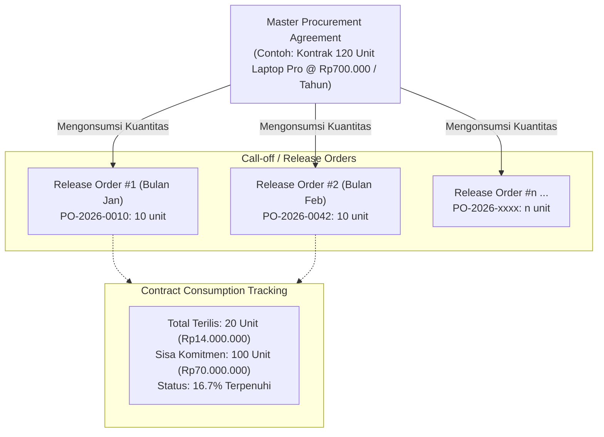

# Procurement Contract and Agreement

## Definition

**Procurement Contract and Agreement** (juga dikenal sebagai *Blanket Purchase Order*, *Framework Agreement*, atau *Purchase Agreement*) adalah perjanjian jangka panjang (*long-term agreement*) antara organisasi pembeli dan pemasok yang menetapkan harga, syarat pembayaran, dan kondisi komersial untuk pengadaan barang atau jasa yang dibutuhkan secara berulang dalam kurun waktu tertentu.

Berbeda dengan [[04-purchasing/purchase-order|Purchase Order standar]] yang bersifat transaksional untuk satu kali pemesanan dan satu tanggal pengiriman spesifik, Procurement Agreement berfungsi sebagai **perjanjian payung (master umbrella agreement)**. Eksekusi pengiriman fisik dan penagihan dilakukan melalui pesanan pelepasan bertahap yang disebut **Call-off Order** atau **Release Order**.

---

## Purpose

1. **Efisiensi Pengadaan Berulang (*Repetitive Purchasing*)**: Menghilangkan kebutuhan untuk melakukan negosiasi harga dan proses tender ([[04-purchasing/request-for-quotation|RFQ]]) berulang kali setiap kali timbul kebutuhan barang operasional.
2. **Kunci Harga (*Price Lock & Cost Predictability*)**: Melindungi organisasi dari fluktuasi harga pasar jangka pendek dan inflasi bahan baku selama masa berlaku kontrak.
3. **Skala Ekonomis (*Volume Discounts*)**: Mendapatkan diskon harga yang lebih kompetitif dari pemasok dengan menjanjikan komitmen total volume belanja (*spend commitment*) selama satu periode (misal: 1 tahun).
4. **Jaminan Pasokan (*Security of Supply*)**: Membantu pemasok merencanakan kapasitas produksi dan cadangan stok mereka (*safety stock reserved*), sehingga memperpendek *lead time* pengiriman.
5. **Mitigasi Risiko Legal dan Operasional**: Menyepakati *Service Level Agreement* (SLA), standar kualitas, penalti keterlambatan, dan term pembayaran di awal secara formal.

---

## Tipe-Tipe Perjanjian Pengadaan

Dalam sistem ERP, perjanjian pengadaan umumnya dikelompokkan ke dalam beberapa tipe komitmen utama:

| Tipe Perjanjian | Dasar Komitmen | Deskripsi | Contoh Kasus Bisnis |
| :--- | :--- | :--- | :--- |
| **Quantity Commitment** *(Blanket Order - Quantity)* | Total Kuantitas Fisik Barang | Pembeli berkomitmen membeli kuantitas minimum tertentu selama periode kontrak untuk item spesifik. | Kontrak pembelian 1.200 unit Laptop Pro selama 1 tahun, dikirim 100 unit setiap bulan. |
| **Value / Spend Commitment** *(Blanket Order - Value)* | Total Nilai Moneter Belanja | Pembeli berkomitmen menghabiskan anggaran belanja dengan nominal tertentu untuk kategori barang/jasa dari vendor tersebut. | Perjanjian pengadaan perlengkapan IT senilai Rp1.000.000.000 dalam setahun untuk berbagai macam varian periferal. |
| **Rate Contract / Price Agreement** | Harga Satuan Tetap (Tanpa Komitmen Volume Minimum) | Vendor menjamin harga satuan tetap untuk jangka waktu tertentu, namun pembeli tidak terikat kuantitas minimum pembelian. | Kontrak harga sparepart pemeliharaan gedung: harga per unit terkunci, pemesanan dilakukan hanya bila ada kerusakan. |
| **Volume Tier Agreement** *(Tiered Pricing)* | Tingkatan Kuantitas Kumulatif | Harga satuan barang turun secara bertahap saat total akumulasi kuantitas pesanan mencapai ambang batas tertentu sepanjang tahun. | Harga Laptop Rp700.000 untuk 100 unit pertama; Rp680.000 jika akumulasi pembelian melampaui 500 unit. |

---

## Mekanisme Call-off Order (Release Order)

Pelepasan pesanan terhadap perjanjian payung dilakukan melalui dokumen transaksional standar yang merujuk pada nomor kontrak master:



### Karakteristik Hubungan Kontrak dan Release Order:
1. **Pewarisan Syarat & Harga (*Inheritance*)**: Release Order secara otomatis mengambil harga satuan ternegosiasi, diskon, mata uang, dan term pembayaran dari Master Agreement tanpa perlu input manual.
2. **Konsumsi Komitmen (*Commitment Tracking*)**: Setiap kali Release Order disetujui, ERP menghitung kuantitas atau nilai yang telah dikonsumsi (*consumed / released amount*) dan memperbarui sisa komitmen (*remaining commitment*).
3. **Validasi Melebihi Batas (*Over-release Tolerance*)**: Sistem dapat dikonfigurasi untuk:
   * *Strict Hard Warning / Block*: Menolak pembuatan PO jika kuantitas melebihi batas perjanjian kontrak.
   * *Tolerated Release*: Mengizinkan kelebihan pemesanan dalam persentase tertentu (misal: toleransi +5%).
   * *Fallback to General Price*: Kuantitas di luar kontrak ditagih dengan harga katalog reguler.
4. **Validasi Masa Berlaku (*Validity Period*)**: ERP mencegah pembuatan Release Order jika tanggal transaksi berada di luar rentang tanggal efektif kontrak (*Effective Start Date* s.d. *Expiration Date*).

---

## Siklus Hidup dan Monitoring Kontrak

Pengelolaan perjanjian pengadaan dalam ERP mencakup siklus pemantauan berkesinambungan:

1. **Penyusunan dan Negosiasi (*Drafting & Negotiation*)**: Perumusan klausa, batas waktu, dan penentuan harga bersama vendor.
2. **Persetujuan Kontrak (*Contract Approval*)**: Persetujuan manajerial tingkat tinggi (Direktur Pengadaan / Komite Tender) dan penandatanganan legal. Dokumen beralih ke status *Active / Effective*.
3. **Pemantauan Eksekusi (*Execution & Consumption Monitoring*)**:
   * *Run-rate Monitoring*: Memantau apakah penyerapan komitmen berjalan sesuai proyeksi waktu (misal: jika kontrak berjalan 6 bulan tetapi serapan baru 10%, ada risiko penalti wanprestasi dari pemasok).
   * *Expiration Alert*: Peringatan dini otomatis (misal: 60 hari sebelum tanggal kedaluwarsa) kepada tim procurement untuk mempersiapkan tender ulang (*rebidding*) atau adendum perpanjangan kontrak.
4. **Penutupan atau Perpanjangan (*Closure or Renewal*)**:
   * *Contract Closure*: Ditutup secara normal saat periode habis atau kuantitas 100% terpenuhi.
   * *Contract Extension / Addendum*: Penambahan alokasi kuantitas atau perpanjangan waktu melalui revisi legal formal.

---

## ERP Implementation Comparison

| Aspek | Odoo Enterprise | ERPNext | Microsoft Dynamics 365 SCM |
| :--- | :--- | :--- | :--- |
| **Terminologi Dokumen** | **Blanket Order** / *Purchase Agreement* (bagian dari modul Purchase). | **Blanket Order** (terintegrasi dengan modul Buying). | **Purchase Agreement** (tersedia di modul Procurement and Sourcing). |
| **Tipe Komitmen** | *Blanket Order* (kuantitas dan harga satuan terkunci). | Fokus pada *Quantity Commitment* per item spesifik. | 4 Tipe formal: *Product quantity commitment*, *Product value commitment*, *Product category value commitment*, dan *Value commitment*. |
| **Mekanisme Pelepasan (Call-off)** | Tombol *New Quotation* dari dalam Blanket Order; sistem otomatis menautkan PO ke agreement. | Membuat Purchase Order baru dan memilih field `Blanket Order`; baris item dan rate terisi otomatis. | Fitur *Release Order*: pengguna menginput kuantitas dan tanggal kirim langsung dari formulir Purchase Agreement. |
| **Pelacakan Penyerapan** | Tab *Purchase Orders* menampilkan daftar PO yang terbentuk dan total kuantitas yang dipesan. | Dashboard menampilkan *Ordered Qty* dan *Ordered Amount* terhadap target blanket order. | Tab *Fulfillment* sangat detail: *Released amount*, *Invoiced amount*, *Remaining balance*, dan persentase penyerapan. |
| **Kontrol Melebihi Batas** | Fleksibel (peringatan opsional, default mengizinkan over-ordering). | Sistem memvalidasi kuantitas PO terhadap sisa saldo blanket order. | Opsi *Max is enforced* (hard stop jika pesanan melampaui sisa komitmen kontrak). |

---

## Naventra Consideration

Untuk perancangan modul Purchasing Agreement pada sistem ERP seperti **Naventra**:

1. **Struktur Data Master Agreement**:
   * Tabel header: `procurement_agreements` (`agreement_number`, `vendor_id`, `agreement_type`, `valid_from`, `valid_to`, `total_committed_value`, `status`).
   * Tabel baris: `procurement_agreement_lines` (`item_id`, `committed_qty`, `unit_price`, `released_qty`, `invoiced_qty`, `max_enforced`).
2. **Relasi ke Release Order**: Baris tabel PO (`purchase_order_lines`) wajib menyimpan relasi `agreement_line_id`. Saat PO disetujui, lakukan mutasi atomik pada kolom `released_qty` di tabel agreement.
3. **Over-fulfillment Enforcement Logic**:
   ```sql
   -- Validasi sebelum approve Release Order
   IF (line.released_qty + new_order_qty > line.committed_qty) AND line.max_enforced THEN
       RAISE EXCEPTION 'Release quantity exceeds committed blanket order quantity for item %', line.item_id;
   END IF;
   ```
4. **Dashboard Serapan Anggaran (*Commitment Burn-down Chart*)**: Sediakan visualisasi serapan kuantitas dan nilai kontrak terhadap garis waktu (*timeline progress*) untuk membantu tim procurement mengantisipasi kontrak yang *under-utilized* atau *over-utilized*.

---

## References

- APQC (American Productivity & Quality Center). *Procure-to-Pay Process Classification Framework: Manage Long-Term Supplier Contracts*.
- Microsoft Learn. *Purchase Agreements in Dynamics 365 Supply Chain Management*.
- Frappe ERPNext Documentation. *Blanket Order in Procurement*.
- Odoo 17 Documentation. *Purchase Agreements and Blanket Orders*.
- CIPS (Chartered Institute of Procurement & Supply). *Contract Management and Procurement Agreements Guide*.
