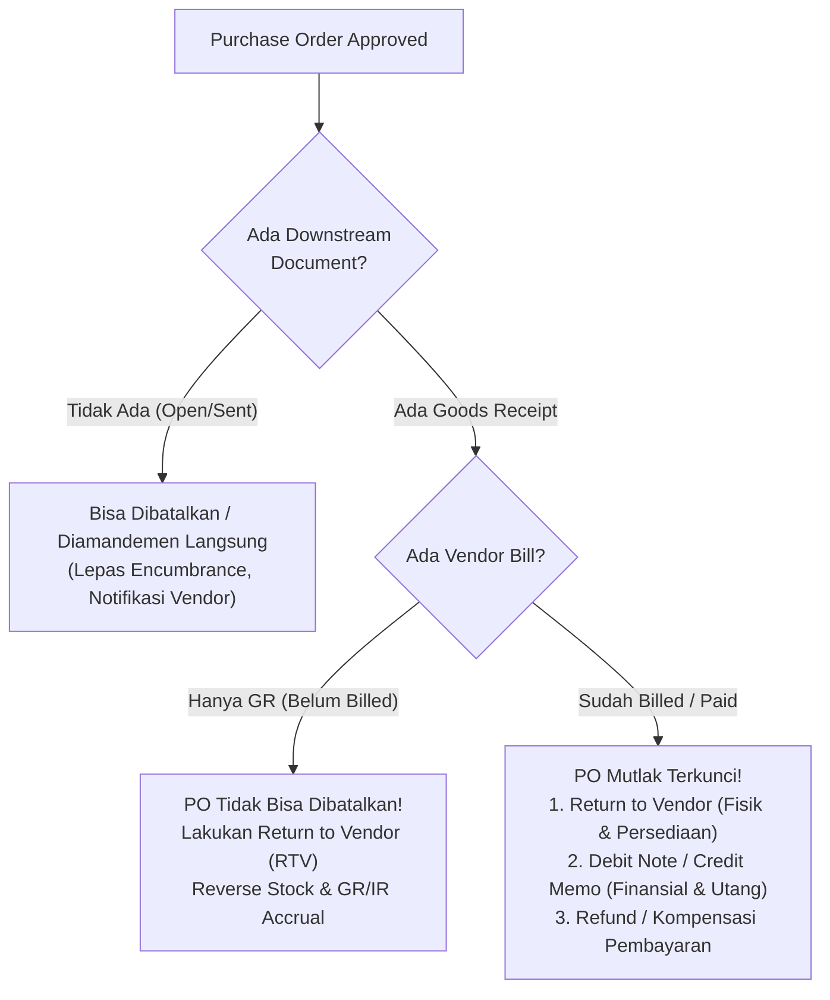

# Purchase Cancellation and Amendment

## Definition

**Purchase Cancellation and Amendment** adalah mekanisme tata kelola (*change management* dan *lifecycle control*) dalam ERP untuk membatalkan (*cancel*), merevisi (*amend* / *revise*), atau menutup (*close*) komitmen pengadaan barang/jasa setelah Purchase Order diterbitkan.

Dalam sistem enterprise, Purchase Order bukan sekadar formulir pesanan biasa, melainkan **dokumen hukum dan komitmen operasional** yang mengikat pembeli dan vendor, serta menjadi dasar komitmen alokasi anggaran (*encumbrance/commitment*). Oleh karena itu, pembatalan atau perubahan PO tidak dapat dilakukan sembarangan atau melalui penghapusan fisik (*hard delete*), melainkan harus melalui audit trail yang ketat dan prosedur status yang terstruktur sesuai siklus hidupnya (*lifecycle stages*).

---

## Purpose

1. **Menjaga Integritas Data Operasional dan Finansial**: Mencegah inkonsistensi antara komitmen pengadaan, alokasi anggaran, penerimaan gudang, dan pencatatan utang.
2. **Audit Trail dan Kepatuhan Tata Kelola**: Menyediakan riwayat lengkap (*revision history*) tentang siapa yang mengajukan perubahan, alasan perubahan (*reason code*), siapa yang menyetujui, dan apa perbedaan data sebelum dan sesudah perubahan.
3. **Mencegah Fraud dan Salah Kirim**: Memastikan vendor tidak mengirimkan barang berdasarkan pesanan yang sudah dibatalkan, serta mencegah staf internal memodifikasi harga/kuantitas secara sepihak setelah persetujuan manajerial.
4. **Sinkronisasi Downstream Transactions**: Mengatur tindakan koreksi yang tepat jika dokumen turunan (*Goods Receipt* atau *Vendor Bill*) telah terbentuk sebelum pembatalan dilakukan.

---

## Lifecycle Stages dan Batas Pembatalan

Kemampuan sistem ERP untuk membatalkan atau merevisi Purchase Order dibatasi secara ketat oleh status dokumen hilir (*downstream documents*). Tabel berikut merangkum matriks kelayakan pembatalan dan amandemen:

| Lifecycle Stage | Status Downstream | Dapat Dibatalkan Langsung? | Dapat Diamandemen Langsung? | Mekanisme Koreksi yang Wajib Dilakukan |
| :--- | :--- | :--- | :--- | :--- |
| **Draft / Pending Approval** | Belum ada | **Ya** (Batalkan / Hapus Draft) | **Ya** (Edit langsung field) | Tidak memerlukan alur koreksi khusus; approval belum terbentuk. |
| **Approved / Open (Belum Dikirim)** | Belum ada | **Ya** (Ubah status ke *Cancelled*) | **Ya** (Re-trigger approval jika ada perubahan material) | Notifikasi pembatalan internal; pelepasan komitmen anggaran (*budget encumbrance*). |
| **Sent to Vendor (Confirmed)** | Belum ada GR / Bill | **Ya** (dengan konfirmasi vendor) | **Ya** (via formal PO Amendment) | Wajib konfirmasi tertulis dari vendor agar vendor tidak memproses pengiriman; kirim revisi dokumen PO. |
| **Partially Received** | GR terbentuk sebagian | **Tidak** untuk baris/kuantitas yang sudah diterima | **Terbatas** (hanya sisa kuantitas belum diterima) | Untuk sisa kuantitas: dilakukan *Short-Close* / pembatalan sisa. Untuk kuantitas yang sudah diterima: wajib melalui [[04-purchasing/purchase-return-and-debit-note|Return to Vendor (RTV)]]. |
| **Fully Received (Belum Ditagih)** | GR 100%, Bill 0 | **Tidak dapat dibatalkan** | **Tidak dapat diamandemen** | Karena barang fisik sudah di gudang dan memengaruhi valuasi, koreksi harus via [[04-purchasing/purchase-return-and-debit-note|Return to Vendor (RTV)]]. |
| **Billed / Invoiced** | Bill / AP terbentuk | **Tidak dapat dibatalkan** | **Tidak dapat diamandemen** | Koreksi operasional via RTV dan koreksi finansial/utang via [[04-purchasing/purchase-return-and-debit-note|Debit Note / Vendor Credit Memo]]. |
| **Fully Paid** | Kas/Bank keluar | **Tidak dapat dibatalkan** | **Tidak dapat diamandemen** | Koreksi via RTV, penerbitan Debit Note, dan pengembalian uang (*supplier refund*) atau kompensasi pada tagihan berikutnya. |

---

## Prinsip Immutability Dokumen ERP

Salah satu prinsip arsitektur paling fundamental dalam sistem ERP enterprise adalah **Immutability (Ketidakbolehan Menghapus Dokumen Transaksional)**:

> [!important]
> **Data Immutability Principle**: Dokumen operasional yang telah disetujui (*Approved*), dikirim ke pihak ketiga, atau memiliki relasi ke modul lain **tidak boleh dihapus secara permanen (*hard delete*)** dari basis data. Setiap perubahan harus direkam sebagai revisi (*versioning*), dan pembatalan dilakukan dengan mengubah status transaksi disertai alasan pembatalan.

Alasan teknis dan audit:
1. **Audit Trail & Forensik Finansial**: Auditor eksternal dan internal memeriksa nomor urut dokumen (*sequential numbering*). Celah nomor (*gap in sequence*) akibat penghapusan dokumen mengindikasikan potensi fraud atau penghilangan bukti audit.
2. **Integritas Relasional Database**: Menghapus baris PO yang sudah dirujuk oleh tabel penerimaan (*goods_receipt_line*) atau tabel logistik akan merusak *foreign key constraint* atau menciptakan *orphaned records*.
3. **Rekam Jejak Evaluasi Vendor**: Rekam jejak pembatalan pesanan akibat ketidakmampuan vendor memasok barang (*vendor default*) sangat penting untuk skor performa vendor dalam [[04-purchasing/supplier-selection-and-evaluation|Supplier Evaluation]].

---

## Purchase Order Amendment & Version Control

Ketika Purchase Order yang telah berstatus *Approved* memerlukan perubahan (misalnya perubahan kuantitas, tanggal pengiriman, harga satuan, atau spesifikasi barang), sistem ERP menerapkan mekanisme **PO Amendment**:

### 1. Revision Numbering / Versioning
* Dokumen asli: `PO-2026-00042` (Version 1).
* Saat dibuka untuk revisi: Sistem mengunci versi 1 dan menciptakan draft versi kerja `PO-2026-00042-Rev1` (atau Version 2).
* Versi sebelumnya diarsipkan secara historis sehingga pengguna dapat melihat perbandingan (*diff view*) antara Versi 1 dan Versi 2.

### 2. Change Impact & Toleransi Perubahan
Perubahan pada PO dikategorikan berdasarkan dampaknya terhadap kontrol bisnis:
* **Perubahan Non-Material (Minor)**: Perubahan catatan instruksi pengiriman, kontak penerima lapangan, atau penundaan tanggal janji kirim (*promised date*) dalam batas toleransi. Biasanya tidak memerlukan persetujuan ulang (*no re-approval required*).
* **Perubahan Material (Major)**: 
  * Kenaikan harga satuan atau total nilai pesanan.
  * Perubahan term pembayaran (misal dari Net 60 menjadi Net 15 atau Advance).
  * Penambahan item barang baru.
  * Perubahan mata uang.
  
  Perubahan material secara otomatis **membatalkan persetujuan sebelumnya (*revokes approval*)** dan memicu kembali alur kerja persetujuan (*re-triggers approval workflow*) sesuai batas kewenangan ([[04-purchasing/purchasing-fundamentals#delegation-of-authority-doa-dan-approval-limits|Delegation of Authority]]).

### 3. Sinkronisasi dengan Open Receipts
Jika revisi disetujui:
* Batas kuantitas yang dapat diterima gudang (*open delivery quantity*) diperbarui secara otomatis.
* Jika kuantitas diturunkan dan vendor belum mengirim, komitmen dana (*encumbrance*) yang dicadangkan dilepaskan kembali ke anggaran departemen pemohon.

---

## Short-Closing dan Partial Cancellation

Dalam operasional bisnis, sering kali terjadi situasi di mana pesanan telah diterima sebagian, namun sisa pesanan tidak akan pernah dikirimkan:

* **Kasus**: PO diterbitkan untuk 10 unit Laptop Pro. Vendor hanya berhasil mengirim 6 unit karena keterbatasan pasokan komponen global, dan disepakati bahwa 4 unit sisanya dibatalkan.
* **Tindakan**: Pengguna tidak dapat membatalkan seluruh PO karena 6 unit telah diterima secara fisik dan dicatat dalam persediaan.
* **Mekanisme ERP**: Sistem melakukan **Short-Close** atau **Force Close** pada baris pesanan tersebut:
  * Status baris diubah menjadi *Closed* / *Completed with Remaining Cancelled*.
  * Kuantitas terbuka (*open quantity*) untuk 4 unit diubah menjadi 0.
  * Komitmen anggaran untuk 4 unit dilepaskan kembali (*budget encumbrance de-obligated*).
  * Sistem tidak lagi menunggu penerimaan gudang untuk 4 unit tersebut.
  * Proses [[04-purchasing/three-way-match|3-Way Matching]] disesuaikan hanya mencocokkan 6 unit antara PO, GR, dan Vendor Bill.

---

## ERP Implementation Comparison

| Aspek | Odoo Enterprise | ERPNext | Microsoft Dynamics 365 SCM |
| :--- | :--- | :--- | :--- |
| **Cancellation Flow** | Tombol *Cancel*. Dokumen berubah status ke *Cancelled*. Dapat diubah kembali via *Set to Draft* jika downstream belum ada. | Tombol *Cancel*. Dokumen diubah status ke *Cancelled*. Berlaku strict immutability (tidak bisa di-undone). | Fitur *Cancel* atau penutupan baris (*Update Line -> Deliver Remainder -> Cancel*). Menghapus sisa komitmen pengiriman. |
| **Amendment / Revisi** | Tidak memiliki modul revisi formal built-in default (edit langsung jika di-*unlock* atau reset ke draft; riwayat via Chatter log). | Mekanisme *Amend*: Membatalkan dokumen lama dan membuat dokumen baru bernomor `PO-00042-1` dengan link ke dokumen lama. | Fitur formal **PO Change Management / Versioning**: Draft revisi dibuat, perbandingan versi ditampilkan, re-approval dipicu otomatis. |
| **Audit Trail Perubahan** | Tercatat di Chatter (kolom kanan): pengguna, tanggal, field lama vs field baru. | Status log di timeline dan link dokumen relasional (`amended_from`). | Tabel log histori versi formal (`PurchTableHistory`) dengan tracking baris per baris. |
| **Penanganan Sisa (Short-Close)** | Mengunci PO (*Lock*) agar tidak dapat diedit dan penerimaan dihentikan. | Fitur *Close* / *Hold* pada status Purchase Order. | Tombol *Deliver Remainder* diset ke `0` untuk menutup baris tanpa membatalkan penerimaan yang sudah ada. |

---

## Naventra Consideration

Untuk perancangan modul Purchasing pada sistem ERP seperti **Naventra**:

1. **State Machine yang Ketat**: Terapkan *finite-state machine* (FSM) pada entitas Purchase Order (`DRAFT` $\to$ `SUBMITTED` $\to$ `APPROVED` $\to$ `SENT` $\to$ `PARTIAL` $\to$ `FULFILLED` $\to$ `CLOSED` $\to$ `CANCELLED`). Transisi ke `CANCELLED` hanya diizinkan jika `received_qty == 0` dan `billed_qty == 0`.
2. **PO Versioning Entity**: Pisahkan tabel header dan baris PO versi aktif (`purchase_orders`, `purchase_order_lines`) dengan tabel riwayat versi (`purchase_order_versions`, `purchase_order_version_lines`). Setiap revisi setelah status `APPROVED` harus menaikkan `revision_number` dan membekukan versi sebelumnya.
3. **Force Close / Deliver Remainder Logic**: Sediakan aksi `Short Close Line` yang menghitung `cancelled_qty = ordered_qty - received_qty` dan mengatur `open_qty = 0`, sehingga PO dapat beralih ke status `COMPLETED` tanpa menunggu sisa barang yang tidak akan pernah datang.
4. **Mandatory Cancellation Reason**: Mewajibkan pengguna memasukkan *Cancellation / Revision Reason Code* (misal: `VENDOR_OUT_OF_STOCK`, `PRICE_CORRECTION`, `INTERNAL_REQUEST_WITHDRAWN`) sebagai data terstruktur untuk kebutuhan analitik performa pengadaan.

---

## References

- Microsoft Learn. *Purchase Order Change Management in Dynamics 365 Supply Chain Management*.
- Frappe ERPNext Documentation. *Purchase Order Cancellation and Amendment Workflow*.
- Odoo 17 Documentation. *Purchase Order Lifecycle, Locking, and Modifications*.
- APQC (American Productivity & Quality Center). *Procure-to-Pay Process Classification Framework: Purchase Order Maintenance and Administration*.
